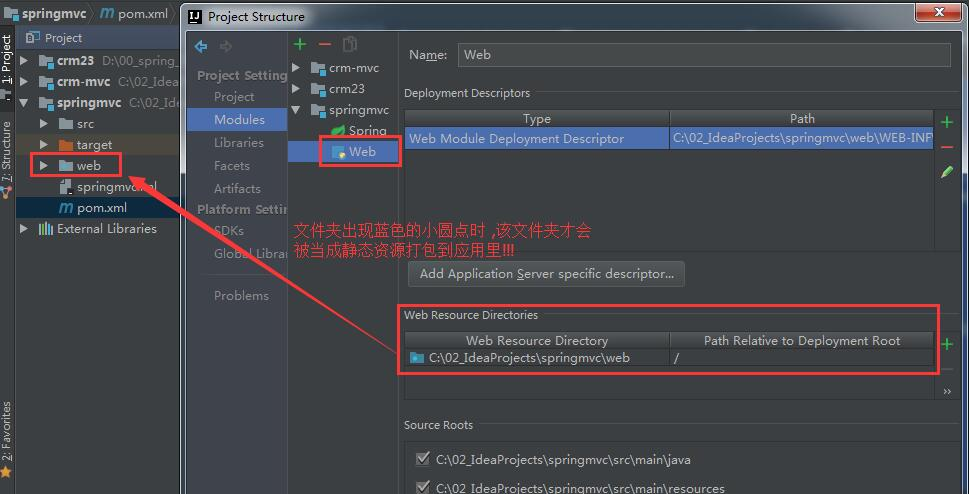

# Spring MVC 使用指南

​	环境 springMVC + spring 4.3.12 

​	使用idea搭建 maven 工程的坑 (两个坑卡了老子1个小时 , 万只草泥马啊...):

​	**1 web应用时 , pom.xml 文件中必须指定打包类型 `<packaging>war</packaging>`  否则会报spring的ContextLoaderListener类找不到 , 非常不好找错误在哪!!!**

​	**2 静态资源目录必须正确设置 , 否则会报文件找不到 , 设置方法如下图所示 , 该设置对所有的 web 项目有效 , 总之静态资源目录的图标出现蓝色小圆点才算是正确的,否则不会被打包!!!  :**



## 1 maven 坐标 pom.xml

```Xml
<?xml version="1.0" encoding="UTF-8"?>
<project xmlns="http://maven.apache.org/POM/4.0.0"
         xmlns:xsi="http://www.w3.org/2001/XMLSchema-instance"
         xsi:schemaLocation="http://maven.apache.org/POM/4.0.0 http://maven.apache.org/xsd/maven-4.0.0.xsd">
    <modelVersion>4.0.0</modelVersion>

    <groupId>groupId</groupId>
    <artifactId>springmvc</artifactId>
    <version>1.0-SNAPSHOT</version>
  
    <!-- 一定要添加打包类型 , 否则部署会报类 ContextLoaderListener not found !!! 坑死人!!!-->
    <packaging>war</packaging>

    <dependencies>
        <dependency>
            <groupId>org.springframework</groupId>
            <artifactId>spring-webmvc</artifactId>
            <version>4.3.12.RELEASE</version>
        </dependency>

        <dependency>
            <groupId>org.springframework</groupId>
            <artifactId>spring-orm</artifactId>
            <version>4.3.12.RELEASE</version>
        </dependency>

        <dependency>
            <groupId>org.springframework</groupId>
            <artifactId>spring-aspects</artifactId>
            <version>4.3.12.RELEASE</version>
        </dependency>

        <dependency>
            <groupId>org.springframework</groupId>
            <artifactId>spring-test</artifactId>
            <version>4.3.12.RELEASE</version>
        </dependency>

        <!--springMVC 实现文件上传需要的依赖-->
        <dependency>
            <groupId>commons-fileupload</groupId>
            <artifactId>commons-fileupload</artifactId>
            <version>1.3.1</version>
        </dependency>

        <!--springMVC 自动将对象转为 json 需要的依赖-->
        <dependency>
            <groupId>com.fasterxml.jackson.core</groupId>
            <artifactId>jackson-databind</artifactId>
            <version>2.9.0</version>
        </dependency>

        <!-- spring MVC 数据格式化 @DateTimeFormat @NumberFormat 需要的依赖 -->
        <dependency>
            <groupId>joda-time</groupId>
            <artifactId>joda-time</artifactId>
            <version>2.9.9</version>
        </dependency>


        <dependency>
            <groupId>org.slf4j</groupId>
            <artifactId>slf4j-log4j12</artifactId>
            <version>1.7.24</version>
        </dependency>

        <dependency>
            <groupId>log4j</groupId>
            <artifactId>log4j</artifactId>
            <version>1.2.17</version>
        </dependency>

        <dependency>
            <groupId>javax.servlet</groupId>
            <artifactId>servlet-api</artifactId>
            <version>2.4</version>
            <scope>provided</scope>
        </dependency>

        <dependency>
            <groupId>javax.servlet</groupId>
            <artifactId>jsp-api</artifactId>
            <version>2.0</version>
            <scope>provided</scope>
        </dependency>

        <dependency>
            <groupId>junit</groupId>
            <artifactId>junit</artifactId>
            <version>4.12</version>
            <scope>test</scope>
        </dependency>
    </dependencies>

    <build>
        <plugins>
            <plugin>
                <groupId>org.apache.maven.plugins</groupId>
                <artifactId>maven-compiler-plugin</artifactId>
                <version>3.5.1</version>
                <configuration>
                    <!-- 配置使用的 jdk 版本 -->
                    <target>1.8</target>
                    <source>1.8</source>
                </configuration>
            </plugin>
            <plugin>
                <groupId>org.apache.tomcat.maven</groupId>
                <artifactId>tomcat7-maven-plugin</artifactId>
                <version>2.2</version>
                <configuration>
                    <!-- 配置上下文路径和端口号 -->
                    <path>/</path>
                    <port>8083</port>
                </configuration>
            </plugin>
            <plugin>
                <groupId>org.apache.maven.plugins</groupId>
                <artifactId>maven-war-plugin</artifactId>
                <version>2.6</version>
                <configuration>
                    <!-- 配置后项目中没有web.xml文件时,项目不提示错误 -->
                    <failOnMissingWebXml>false</failOnMissingWebXml>
                </configuration>
            </plugin>

            <plugin>
                <!--打包时跳过单元测试-->
                <groupId>org.apache.maven.plugins</groupId>
                <artifactId>maven-surefire-plugin</artifactId>
                <configuration>
                    <skip>true</skip>
                </configuration>
            </plugin>

        </plugins>

    </build>
</project>
```

​	如果是直接创建web应用 , 则要导入的基础 jar 包 如下

```
-----------------spring MVC 基础包----------------------
spring-aop-4.3.12.RELEASE.jar
spring-beans-4.3.12.RELEASE.jar
spring-context-4.3.12.RELEASE.jar
spring-core-4.3.12.RELEASE.jar
spring-expression-4.3.12.RELEASE.jar
spring-test-4.3.12.RELEASE.jar
spring-web-4.3.12.RELEASE.jar
spring-webmvc-4.3.12.RELEASE.jar
commons-logging-1.2.jar

-----------------spring MVC 文件上传依赖-----------------
commons-fileupload-1.3.1.jar
commons-io-2.2.jar

-----------------spring MVC json转换依赖----------------
jackson-annotations-2.9.0.jar
jackson-core-2.9.0.jar
jackson-databind-2.9.0.jar

-----------------spring MVC Date数据绑定依赖-------------
joda-time-2.9.9.jar
```

## 2 web.xml

```Xml
<?xml version="1.0" encoding="UTF-8"?>
<web-app xmlns:xsi="http://www.w3.org/2001/XMLSchema-instance"
         xmlns="http://java.sun.com/xml/ns/javaee"
         xsi:schemaLocation="http://java.sun.com/xml/ns/javaee http://java.sun.com/xml/ns/javaee/web-app_2_5.xsd"
         id="WebApp_ID" version="2.5">
    <display-name>springmvc</display-name>
    <welcome-file-list>
        <welcome-file>index.html</welcome-file>
        <welcome-file>index.htm</welcome-file>
        <welcome-file>index.jsp</welcome-file>
    </welcome-file-list>

    <!--<listener>-->
        <!--<listener-class>org.springframework.web.context.ContextLoaderListener</listener-class>-->
    <!--</listener>-->
    <!--<context-param>-->
        <!--<param-name>contextConfigLocation</param-name>-->
        <!--<param-value>classpath*:applicationContext*.xml</param-value>-->
    <!--</context-param> -->
  
    <filter>
        <filter-name>characterEncodingFilter</filter-name>
        <filter-class>org.springframework.web.filter.CharacterEncodingFilter</filter-class>
        <init-param>
            <param-name>encoding</param-name>
            <param-value>UTF-8</param-value>
        </init-param>
    </filter>
    <filter-mapping>
        <filter-name>characterEncodingFilter</filter-name>
        <url-pattern>/*</url-pattern>
    </filter-mapping>

    <servlet>
        <servlet-name>dispatcher</servlet-name>
        <servlet-class>org.springframework.web.servlet.DispatcherServlet</servlet-class>
        <!--springmvc 配置文件 默认是 WEB-INF 目录下的 [servlet-name]-servlet.xml 文件-->
        <init-param>
           <param-name>contextConfigLocation</param-name>
           <param-value>classpath:springmvc-config.xml</param-value>
       </init-param>
        <load-on-startup>1</load-on-startup>
    </servlet>
    <servlet-mapping>
        <servlet-name>dispatcher</servlet-name>
        <url-pattern>/</url-pattern><!-- "/" 写法不会覆盖默认的servlet , "/*" 会导致静态资源无法访问 , 需要另外配置 -->
    </servlet-mapping>
</web-app>
```

​	DispatcherServlet 作为spring MVC 的入口 , 在解析配置文件时 , 会创建一个 WebApplicationContext  的上下文对象 , 有了这个工厂对象 , 就可以使用 spring 的 IOC , AOP 等功能了.

​	**注意 : servlet 是单实例 , 为了保证 applicationContext 对象优先创建 , 这里我们配置 DispatcherServlet 在程序启动时就创建 , 即配置 <load-on-startup>**

## 3 springMVC 配置文件 springmvc-config.xml

```xml
<?xml version="1.0" encoding="UTF-8"?>
<beans xmlns="http://www.springframework.org/schema/beans"
       xmlns:xsi="http://www.w3.org/2001/XMLSchema-instance"
       xmlns:mvc="http://www.springframework.org/schema/mvc"
       xmlns:context="http://www.springframework.org/schema/context"
       xmlns:aop="http://www.springframework.org/schema/aop"
       xmlns:tx="http://www.springframework.org/schema/tx"
       xsi:schemaLocation="http://www.springframework.org/schema/beans
                        http://www.springframework.org/schema/beans/spring-beans-4.0.xsd
                        http://www.springframework.org/schema/mvc
                        http://www.springframework.org/schema/mvc/spring-mvc-4.0.xsd
                        http://www.springframework.org/schema/context
                        http://www.springframework.org/schema/context/spring-context-4.0.xsd
                        http://www.springframework.org/schema/aop
                        http://www.springframework.org/schema/aop/spring-aop-4.0.xsd
                        http://www.springframework.org/schema/tx
                        http://www.springframework.org/schema/tx/spring-tx-4.0.xsd">
    <!-- 设置使用注解的类所在的jar包 -->
    <context:component-scan base-package="com.itheima" />
    <mvc:annotation-driven/>
    <!--静态资源交给 defaultServlet 处理,否则访问静态资源会 404-->
    <mvc:default-servlet-handler/>
</beans>
```

​	**`<mvc:annotation-driven/>` 会自动注册 `DefaultAnnotationHandlerMapping`  ,`AnnotationMethodHandlerAdapter`  两个bean，这两个bean是spring MVC为@Controllers分发请求所必须的。并提供了数据绑定支持，@NumberFormatannotation支持，@DateTimeFormat支持，@Valid支持，读写XML的支持（JAXB），读写JSON的支持（Jackson)**

​	spring 4.0 之前 , 在springMVC 的配置文件中需要手动配置 `处理映射器(如 BeanNameUrlHandlerMapping)` , `处理适配器(如 SimpleControllerHandlerAdapter)` , `视图解析器(如 InternalResourceViewResolver)`   

​	spring 4.0 之后 , 如果不配置 , springMVC 会使用默认的配置完成处理. 默认的配置放在 `org.springframework.web.servlet` 包下的 DispathcerServlet.properties 文件 :

```properties
# Default implementation classes for DispatcherServlet's strategy interfaces.
# Used as fallback when no matching beans are found in the DispatcherServlet context.
# Not meant to be customized by application developers.

# 处理国际化解析器 , 只允许一个实例
org.springframework.web.servlet.LocaleResolver=org.springframework.web.servlet.i18n.AcceptHeaderLocaleResolver

org.springframework.web.servlet.ThemeResolver=org.springframework.web.servlet.theme.FixedThemeResolver
# 处理映射 , 可以存在多个实例
org.springframework.web.servlet.HandlerMapping=org.springframework.web.servlet.handler.BeanNameUrlHandlerMapping,\
	org.springframework.web.servlet.mvc.annotation.DefaultAnnotationHandlerMapping

# 处理期适配器 , 允许多个实例
org.springframework.web.servlet.HandlerAdapter=org.springframework.web.servlet.mvc.HttpRequestHandlerAdapter,\
	org.springframework.web.servlet.mvc.SimpleControllerHandlerAdapter,\
	org.springframework.web.servlet.mvc.annotation.AnnotationMethodHandlerAdapter

# 允许多个实例
org.springframework.web.servlet.HandlerExceptionResolver=org.springframework.web.servlet.mvc.annotation.AnnotationMethodHandlerExceptionResolver,\
	org.springframework.web.servlet.mvc.annotation.ResponseStatusExceptionResolver,\
	org.springframework.web.servlet.mvc.support.DefaultHandlerExceptionResolver

# 视图名称解析器 , 只允许一个实例
org.springframework.web.servlet.RequestToViewNameTranslator=org.springframework.web.servlet.view.DefaultRequestToViewNameTranslator

# 视图解析器 , 允许多个实例
org.springframework.web.servlet.ViewResolver=org.springframework.web.servlet.view.InternalResourceViewResolver

org.springframework.web.servlet.FlashMapManager=org.springframework.web.servlet.support.SessionFlashMapManager
```

> 同一个类型允许多个实例时 , 其优先级顺序由其所实现的 org.springframework.core.Order 接口决定 , 值越小 , 优先级越高

## 4 springMVC 执行流程


(图片来自网络)


(图片来自网络)

## 5 常用注解

### 1 地址映射 @RequestMapping 

​	地址映射的注解 , 可以注解在**类或者方法**上 , 如下示例

```java
@Controller
public class HelloController {
    @RequestMapping("hello")
    public @ResponseBody
    String sayHello(){
        System.out.println("=============");
        return "Hello spring MVC";
    }
}
```

​	假如,应用的根路径设置为  `localhost:8080/springmvc`  , 则上述 sayHello 方法的请求地址为 : `localhost:8080/springmvc/hello` , **路径拼接规则自己体会!!!**

​	@RequestMapping 常用的属性如下:

| 属性       | 类型       | 说明                                       |
| -------- | -------- | ---------------------------------------- |
| value    | String[] | 映射实际访问路径                                 |
| method   | String[] | 可响应的请求类型 , 包括 GET  PUT POST 等            |
| consumes | String[] | 指定请求提交的内容类型 , 如 application/json , text/html ... |
| produces | String[] | 指定返回的内容类型 , 返回内容的类型必须是 request 请求头(Accept) 指定的内容 |
| params   | String[] | 指定 request 中必须包换某些参数时 , 才让改方法处理          |
| headers  | String[] | 指定请求头中必须包含指定值 , 才让改方法处理                  |

​	栗子(以下例子注解全部是注解在的方法上!!!):

1. 只响应get和post请求

```java
@RequestMapping(value = "hello",method = {RequestMethod.GET,RequestMethod.POST})
```

2. 仅处理request Content-Type为 application/json  类型的请求

```java
 @RequestMapping(value = "hello",consumes = "application/json")
```

3. 指定返回数据的 Content-Type 为 application/json

```java
@RequestMapping(value = "hello",produces = "application/json")
```

4. 指定 request 请求参数中必须包含 username=fmi110 , 才响应

```java
@RequestMapping(value = "hello",params = "username=fmi110")
```

5. 指定请求头中必须包含值 `Referer=http://www.fmi110.com/`

```java
@RequestMapping(value = "hello",headers="Referer=http://www.fmi110.com/")
```

### 2 处理请求

​	主要是跟 request 相关的注解 , 数据流向是 `前端 --> 后台` , 常用有四类

1. 处理 request body 部分的注解 : @RequestParam    @RequestBody
2. 处理 request uri 部分的注解 : @PathVariable
3. 处理 request header 部分的注解 : @RequestHeader   @CookieValue
4. 处理  attribute 类型的注解 : @SessionAtrributes   @ModelAttribute


#### 1 @ModelAttribute 

@ModelAttribute 一般拥有如下三个作用:

1. **绑定请求参数到命令对象**：放在功能处理方法的入参上时，用于将多个请求参数绑定到一个命令对象，从而简化绑定
   流程，而且自动暴露为模型数据用于视图页面展示时使用 
2. **暴露表单引用对象为模型数据**：放在处理器的一般方法（非功能处理方法）上时，是为表单准备要展示的表单引用对
   象，如注册时需要选择的所在城市等，而且在执行功能处理方法（@RequestMapping注解的方法）之前，自动添加到
   模型对象中，用于视图页面展示时使用 
3. **暴露@RequestMapping方法返回值为模型数据**：放在功能处理方法的返回值上时，是暴露功能处理方法的返回值为
   模型数据，用于视图页面展示时使用 

##### 1 绑定请求参数到命令对象

```java
public String test1(@RequestAttribute("user") UserModel user)
```

> 当请求地址为 ...?username=123&password=123 时 , 请求参数 username ,password 的值会被绑定到 user 对象中 ; 同时我们可以在视图页面中使用 ${user.username} 来获取绑定的命令对象的属性

> 绑定请求参数到命令对象**支持对象图导航式的绑定**，如请求参数包含`“?username=zhang&password=123&workInfo.city=bj”`自动绑定到user中的workInfo属性的city属性中.

```java
@RequestMapping(value="/model2/{username}")
public String test2(@ModelAttribute("model") DataBinderTestModel model) {}
```

> URI模板变量也能自动绑定到命令对象中，当你请求的URL中包含
> “bool=yes&schooInfo.specialty=computer&hobbyList[0]=program&hobbyList[1]=music&map[key1]=value1
> 会自动绑定到命令对象上 

​	**当URI模板变量和请求参数同名时，URI模板变量具有高优先权** 

##### 2 暴露表单引用对象为模型数据

```java
@ModelAttribute("cityList")
public List<String> cityList(){
   	return Arrays.asList("广西","广东");
}
```

> 如上代码会在执行功能处理方法之前执行，并将其自动添加到模型对象中，在功能处理方法中调用Model 入参的
> containsAttribute("cityList")将会返回true 

```java
@ModelAttribute("user") //①
public UserModel getUser(@RequestParam(value="username", defaultValue="") String username) {
      //TODO 去数据库根据用户名查找用户对象
      UserModel user = new UserModel();
      user.setRealname("zhang");
      return user;
}
```

> 如你要修改用户资料时一般需要根据用户的编号/用户名查找用户来进行编辑，此时可以通过如上代码查找要编辑的用户。
> 也可以进行一些默认值的处理 (执行数据准备操作)

```java
@RequestMapping(value="/model1") //②
public String test1(@ModelAttribute("user") UserModel user, Model model)
```

​	**此处我们看到①和②有同名的命令对象，那Spring Web MVC内部如何处理的呢 :** 

1. 首先执行@ModelAttribute注解的方法，准备视图展示时所需要的模型数据；@ModelAttribute注解方法形式参数规
   则和@RequestMapping规则一样，如可以有@RequestParam等； 
2. 执行@RequestMapping注解方法，进行模型绑定时首先查找模型数据中是否含有同名对象，如果有直接使用，如果没
   有通过反射创建一个，因此②处的user将使用①处返回的命令对象。即②处的user等于①处的user 

##### 3 暴露@RequestMapping方法返回值为模型数据

```java
public @ModelAttribute("user2") UserModel test3(@ModelAttribute("user2") UserModel user)
```

> @ModelAttribute注解的返回值会覆盖@RequestMapping注解方法中的@ModelAttribute注解的同名命令对象 

##### 4 匿名绑定命令参数

```java
public String test4(@ModelAttribute UserModel user, Model model)
或
public String test5(UserModel user, Model model)
```

> 此时我们没有为命令对象提供暴露到模型数据中的名字，此时的名字是什么呢？Spring Web MVC自动将简单类名（首
> 字母小写）作为名字暴露，如“cn.javass.chapter6.model.UserModel”暴露的名字为“userModel” 

```java
public @ModelAttribute List<String> test6()
或
public @ModelAttribute List<UserModel> test7()
```

> 对于集合类型（Collection接口的实现者们，包括数组），生成的模型对象属性名为“简单类名（首字母小
> 写）”+“List”，如List<String>生成的模型对象属性名为“stringList”，List<UserModel>生成的模型对象属性名
> 为“userModelList” 

> 其他情况一律都是使用简单类名（首字母小写）作为模型对象属性名，如Map<String, UserModel>类型的模型对象属
> 性名为“map 


​	该注解将请求参数绑定到 Model 对象 , 只支持一个属性 value , 类型为 String , 表示绑定的属性名.

​	以下示例,前端发送的请求为 : `http://localhost:8080/springmvc/hello?username=fmi110&password=123`

```java
@Controller
public class HelloController {
    Logger logger = LoggerFactory.getLogger(HelloController.class);

   /**
   * user 对象会自动接收表单提交过来的与其内部成员变量同名字段的值
   * 注解 ModelAttribute 会将 user 对象存放到 request 域中 , key 的名为 "xxx"
   * @param user
   * @return
   */
  @RequestMapping("t8")
  public String  testModelAttribute(@ModelAttribute("xxx") User user) {
      return "/index.jsp";
  }
}
```

​	index.jsp页面代码:

```jsp
<%--
  Created by IntelliJ IDEA.
  User: huangyunning
  Date: 2017/11/24
  Time: 上午10:27
  To change this template use File | Settings | File Templates.
--%>
<%@ page contentType="text/html;charset=UTF-8" language="java" %>
<html>
  <head>
    <title>$Title$</title>
  </head>
  <body>
      <br>
      用户名 : ${xxx.username}
      <br>
      密码   : ${xxx.password}

      <div>=================================</div>

      request 域 : ${requestScope.xxx}
      <br>
      session 域 : ${sessionScope.xxx}
  </body>
</html>
```

​	页面显示结果如下:

```
用户名 : fmi110 
密码 : 123
=================================
request 域 : User{username='fmi110', password='123', user=null} 
session 域 :
```

#### 2 ModelAndView 

​	ModelAndView 可用于传递数据和指定结果页面的路径 :

1. `setViewName(String resultPath)`  方法指定跳转哪个页面
2. `addObject(String key , Object value)`  方法用来添加数据 , 作用域是 request 范围!!!

```Java
    @RequestMapping(value = "hello",produces = "text/html;charset=utf-8")
    public ModelAndView  sayHello(){

        User user = new User();
        user.setUsername("itheima");
        user.setPassword("123");

        ModelAndView mv = new ModelAndView();
//      mv.setViewName("redirect:index.jsp"); // 重定向到指定页面
        mv.setViewName("index.jsp");  // 转发 , viewName 就是结果页面的路径 , 
        mv.addObject("user",user);
//      mv.addObject(user); // 此时的 key 根据类名确定 --> user(第一个字母小写)
        return mv;
    }
```

​	jsp页面代码

```html
<%@ page contentType="text/html;charset=UTF-8" language="java" %>
<html>
  <head>
    <title>$Title$</title>
  </head>
  <body>
      用户名 : ${user.username}
      <br>
      密码   : ${user.password}
  </body>
</html>
```

#### 3 @RequestParam

​	参数绑定注解 , 用于指定表单中的指定字段赋值给方法中对应的形参 , 如发送请求为 :`http://localhost:8080/springmvc/t2?username=fmi110&password=123` 

```Java
@RequestMapping("t2")
public @ResponseBody
String testRequestParam(@RequestParam("username") String xxx,
                        @RequestParam("password") String pwd) {
    return xxx + "   ,   " + pwd;
}
```

 	此时 , 形参 xxx 的值为 fmi110 , 形参 pwd 的值为 123

#### 4 @PathVariable (重要!!!)

​	该注解用于动态的获取 URL 路径中指定的参数

```Java
@RequestMapping("t3/{username}/{password}")
public @ResponseBody
String testPathVariable(@PathVariable("username") String name,
                        @PathVariable String password) {
    return name + "  ,   " + password;
}
```

​	URL为 : `http://localhost:8080/springmvc/t3/itheima/123`  , 此时 name 的值为 itheima , password 的值为 123  , @PathVariable 只有一个 value 属性 , 其作用自己参照示例总结!!!

#### 5 @RequestHeader

​	该注解用于将请求头信息映射到处理方法的形参上

```Java
@RequestMapping("t4/*")
public @ResponseBody
String testHeader(@RequestHeader("Cookie") String cookie,
                  @RequestHeader("Accept") String accept) {
    return cookie + "  ,  " + accept;
}
```

​	URL : `http://localhost:8080/springmvc/t4/xxx` , 此时请求头中的 Cookie 字段的值将赋值为 cookie 参数...

#### 6 @CookieValue

​	用于将 cookie 中的值映射到对应的形参 , defaultValue 属性用于指定当 cookie 中不存在对应的值时 , 使用的默认值 , 不提供该属性的话 , 当 cookie 中不存在对应的 key 将抛异常 , 所以建议给出默认值!!

```Java
 	@RequestMapping("t5")
    public @ResponseBody
    String testCookie(@CookieValue(value = "fmi110",defaultValue = "") String msg,
                      @CookieValue(value = "JSESSIONID",defaultValue = "") String sessionID) {
        return msg + "  ,  " + sessionID;
    }
```

#### 7 @SessionAttribute

​	该注解可以让我们指定 Model 对象中的哪些属性需要转存到 HttpSession 对象中 , **该注解只能注解在类上!!!**

测试 URL : `http://localhost:8080/springmvc/t7?username=333`

```Java
@Controller
@SessionAttributes(value = "xxx") // 将 Model 中名为 "xxx" 对象放入 session
public class HelloController {
    Logger logger = LoggerFactory.getLogger(HelloController.class);
   
      @RequestMapping("t7")
      public String  testSession(Model model) {
          User u1 = new User();
          u1.setUsername("fmi110");
          User u2 = new User();
          u2.setUsername("itheima");
          model.addAttribute("xxx", u1);
          model.addAttribute("user2", u2);
          return "/index.jsp";
      }
}
```

​	index.jsp 页面代码

```Html
<%@ page contentType="text/html;charset=UTF-8" language="java" %>
<html>
  <head>
    <title>$Title$</title>
  </head>
  <body>
      request 域 : ${requestScope.xxx}
      <br>
      session 域 : ${sessionScope.xxx}
      <br>
  </body>
</html>
```

 **@SessionAttributes绑定命令对象到session(未测试)**

```java
//1、在控制器类头上添加@SessionAttributes注解
@SessionAttributes(value = {"user"}) //①
public class SessionAttributeController
  
//2、@ModelAttribute注解的方法进行表单引用对象的创建
@ModelAttribute("user") //②
public UserModel initUser()
  
//3、@RequestMapping注解方法的@ModelAttribute注解的参数进行命令对象的绑定
@RequestMapping("/session1") //③
public String session1(@ModelAttribute("user") UserModel user)
  
//4、通过SessionStatus的setComplete()方法清除@SessionAttributes指定的会话数据
@RequestMapping("/session2") //③
public String session(@ModelAttribute("user") UserModel user, SessionStatus status) {
 	if(true) { //④
  		status.setComplete(); // 清楚session数据
	}
	return "success";
}
```

> @SessionAttributes(value = {"user"}) 标识将模型数据中的名字为“user” 的对象存储到会话中（默认HttpSession），
> 此处value指定将模型数据中的哪些数据（名字进行匹配）存储到会话中，此外还有一个types属性表示模型数据中的哪
> 些类型的对象存储到会话范围内，如果同时指定value和types属性则那些名字和类型都匹配的对象才能存储到会话范围
> 内 

#### 8 @RequestBody

​	用于接收请求参数json 格式的字符串,并转化为对象

```Java
@RequestMapping(value = "t9")
public String testRequestBody(@RequestBody List<User> list) {
    System.out.println("======username===="+list);
    return "/index.jsp";
```

​	前端发送请求的代码:

```js
$(function(){
    var data = "[{\"username\"": "\"fmi110\",\"password\":\"xxx\"},{\"username\":\"itheima\",\"password\":\"czbk\"}]";
  	// json 数据
  	data = [{"username":"fmi110","password":"xxx"},{"username":"itheima","password":"czbk"}];
        
    $.ajax({ 
         type:"POST", 
         url:"/springmvc/t9", 
         dataType:"json",      
         contentType:"application/json", // 必须指定内容格式            
         data:JSON.stringify(saveData), // 需要转换为字符串
         success:function(result){ 
               alert(result);                        
         } 
     });

</script>
```

### 3 处理响应

#### 1 返回网页资源

​	当处理方法直接返回一个字符串时 , springMVC 将该字符串当成 **url路径** 进行处理 , 默认使用**转发**的方式处理 , 如下

```Java
@RequestMapping("tt")
public  String testMultiParam(){
    return "/index.jsp";
}
```

​	要使用 **重定向** 方式,可使用如下写法:

```Java
@RequestMapping("tt")
public  String testMultiParam(){
    return "redirect:/index.jsp";
}
```

#### 2 返回 ModelAndView

​	ModelAndView 对象用于封装数据携带到 jsp 页面 , 其中 setViewName(String url) 方法用于指定要返回的资源的 url , 具体用法如下 :

```Java
@RequestMapping("tt")
public ModelAndView testMultiParam(){
    ModelAndView mv = new ModelAndView();
//   mv.setViewName("redirect:index.jsp"); // 转发到 index.jsp
    mv.setViewName("redirect:index.jsp"); // 重定向到 index.jsp
    return mv;
}
```

#### 3 @ResponeBody 返回普通字符串

​	当希望controller 的处理方法返回的字符串直接作为响应结果返回给请求者,则可以在请求方法上 或方法定义的返回类型前添加 @ResponseBody 注解即可	, 如:

```Java
@RequestMapping("tt")
@ReponseBody
public  String testMultiParam(){
    return "Hello fmi110!!!";
}
```

或者

```java
@RequestMapping("tt")
public @ReponseBody String testMultiParam(){
    return "Hello fmi110!!!";
}
```

#### 4 返回 json 字符串

​	springMVC 提供了将 java 对象转为 json 字符串的转换器 , 要使用该功能需要 :

​	1 在SpringMVC 中开启注解 `<mvc:annotation-driven/>` , 该注解提供了读写JSON的支持（Jackson) 等

​	2 添加 json 转换需要的依赖 , 如下:

```Xml
<!--springMVC 自动将对象转为 json 需要的依赖-->
<dependency>
    <groupId>com.fasterxml.jackson.core</groupId>
    <artifactId>jackson-databind</artifactId>
    <version>2.9.0</version>
</dependency>
```

> 该依赖会导入 `jackson-annotation` ,  `jackson-databind`  , `jackson-core` 三个 jar 包

​	3 处理方法返回值类型为 java 对象 , 并在方法上添加 @ResponseBody 注解 , 如下:

```Java
@RequestMapping("tt")
public @ReponseBody User testJSON(){
  	User user = new User();
  	user.setUsername("fmi110");
  	user.setPassword("666");
    return user;
}
```

> 则前端接收到的返回数据如下 :  {"username":"fmi110","password":"666"}
>
> @JsonIgnore注解用来忽略某些字段，可以用在Field或者Getter方法上，用在Setter方法时，和Filed效果一样。这个注解只能用在POJO存在的字段要忽略的情况，不能满足现在需要的情况。
>
> @JsonIgnoreProperties(ignoreUnknown = true)，将这个注解写在类上之后，就会忽略类中不存在的字段，可以满足当前的需要。这个注解还可以指定要忽略的字段。使用方法如下：
>
> @JsonIgnoreProperties({ "internalId", "secretKey" })
>
> 指定的字段不会被序列化和反序列化

​	当返回的对象中包含 Date 类型的数据 , 默认转换后对应字段的值是 long 类型的数据 , 如果希望返回日期格式的字符串 , 需要进行对应的处理 , 处理方法可参考这里 : [jackson 转换Date 类型](http://blog.csdn.net/z69183787/article/details/40375831)

#### 5 jackson 相关的注解

##### **@JsonIgnoreProperties** 

​	此注解是类注解，作用是json序列化时将java bean中的一些属性忽略掉，序列化和反序列化都受影响 , 如 @JsonIgnoreProperties({ "internalId", "secretKey" })

##### @JsonIgnore

​	此注解用于属性或者方法上，作用和上面的@JsonIgnoreProperties一样

##### @JsonFormat

​	此注解用于属性或者方法上（最好是属性上），可以方便的把Date类型直接转化为我们想要的模式，比如@JsonFormat(pattern = "yyyy-MM-dd HH:mm:ss",timezone = "GMT+8") , 其中 timezone 指定时区,否则时间会比北京时间早8个小时!!

##### @JsonSerialize

​	此注解用于属性或者getter方法上，用于在序列化时嵌入我们自定义的代码，比如序列化一个double时在其后面限制两位小数点。

##### @JsonDeserialize

​	此注解用于属性或者setter方法上，用于在反序列化时可以嵌入我们自定义的代码，类似于上面的@JsonSerialize

## 6 请求处理方法中可出现的参数类型

​	下面仅列出处理请求方法中可以出现的常用的对象类型 , 更多可出现对象查阅相关文档

| 类型                                       | 说明                                 |
| ---------------------------------------- | ---------------------------------- |
| HttpServletRequest                       |                                    |
| HttpServletResponse                      |                                    |
| HttpSession                              |                                    |
| java.util.Locale                         |                                    |
| java.io.InputStream 或 java.io.Reader     |                                    |
| java.io.OutputStream 或 java.io.Writer    |                                    |
| HttpEntity<?>                            |                                    |
| java.util.Map                            |                                    |
| org.springframwork.ui.Model              |                                    |
| org.springframwork.ui.ModelMap           |                                    |
| org.springframework.web.servlet.mvc.support.RedirectAttributes |                                    |
| org.springframework.validation.Errors    |                                    |
| org.springframework.validation.BindingResult |                                    |
| @PathVariable   ,  @@MatrixVariable  注解  |                                    |
| @RequestParam  ,  @RequestHeader  ,   @RequestBody  ,  @RequestPart 注解 |                                    |
| **javaBean 对象**                          | 可以直接接收表单数据,类似 struts2的 ModelDriver |

## 7 请求处理方法可返回的类型

| 类型                                       | 说明   |
| ---------------------------------------- | ---- |
| org.springframework.web.portlet.ModelAndView |      |
| org.springframework.ui.Model             |      |
| java.util.Map<k,v>                       |      |
| org.springframework.web.servlet.View     |      |
| java.lang.String                         |      |
| HttpEntity 或 ResponseEntity              |      |
| java.util.concurrent.Callable            |      |
| org.springframwork.web.context.request.async.DeferredResult |      |
| void                                     |      |

## 8 国际化

​	spring 的国际化实现大概有如下步骤:

1. 配置messageSource对象 , 即指定国际化资源文件的路径和名称
2. 配置区域解析器 **localeResolver**
3. 在页面中使用 spring 的  message 标签显示信息

### 1 MessageSource

​	在 springMVC 配置文件中声明对应的 bean , 这里我的 mvc 配置文件为 springmvc-config.xml , 添加如下声明

```Xml
<!--id 一定要是 messageSource !!-->
<!--id 一定要是 messageSource !!-->
<!--id 一定要是 messageSource !!-->
<bean id="messageSource" class="org.springframework.context.support.ResourceBundleMessageSource">
    <property name="basenames">
        <list>
          	<!--注意资源文件名是如何确定的!!-->
            <value>message</value>
        </list>
    </property>
</bean>
```

​	此时 , 需要在 src 目录下提供对应的国际化资源文件,如 `message_en_US.properties`  `message_zh_CN.properties`  , 资源文件名的确定自己总结!!!

### 2 localResolver

​	springMVC 提供了 LocalResolver 接口用于实现语言区域解析 , 常用的实现类如下:

​		`AcceptHeaderLocalReolver`

​		`SessionLocalResolver`

​		`CookieLocalReslver`

​	其中 AcceptHeaderLocalReolver 是默认的 ,不需要配置 . 它是通过读取请求头的 accept-language 字段来确定使用哪种语言 , 如果要使用另外的两种解析器就需要在 springMVC 的配置文件中进行配置

​	下面说明另外两个解析器的配置方式:

#### 1 基于 SessionLocalResolver

​	springMVC 从 httpSession 作用域中获取用户所设置的语言区域信息 , 具体实现通过如下方法 :

`request.getSession().setAttribute(SessionLocaleResolver.LOCALE_SESSION_ATTRIBUTE_NAME, LocaleContextHolder.getLocale())`

​	springmvc-config.xml 中添加如下 mvc 拦截器

```Xml
<mvc:interceptors>
    <!--国际化操作拦截器,如果基于 Session/Cookie 实现则必须配置!!!-->
    <bean class="org.springframework.web.servlet.i18n.LocaleChangeInterceptor"/>
</mvc:interceptors>

<!--id 一定要是 localeResolver !!-->
<!--id 一定要是 localeResolver !!-->
<!--id 一定要是 localeResolver !!-->
<bean id="localeResolver" class="org.springframework.web.servlet.i18n.SessionLocaleResolver"/>

<!--默认使用的语言区域解析器 ,如果是使用AcceptHeaderLocaleResolver, 不配置也可以-->
<!--<bean id="localeResolver" class="org.springframework.web.servlet.i18n.AcceptHeaderLocaleResolver"/>-->
```

Java 代码:

```Java
/**
 * 测试国际化
 *
 * @param request
 * @param request_local
 * @return
 */
@RequestMapping(value = "t18i")
public String testI18(HttpServletRequest request, @RequestParam(value = "request_local",
                                                                defaultValue = "zh_CN") String request_local) {
    if (request_local.equals("zh_CN")) { // 设置中文
        Locale locale = new Locale("zh", "CN");
        request.getSession()
               .setAttribute(SessionLocaleResolver.LOCALE_SESSION_ATTRIBUTE_NAME, locale);
    } else if (request_local.equals("en_US")) {  // 设置英文
        Locale locale = new Locale("en", "US");
        request.getSession()
               .setAttribute(SessionLocaleResolver.LOCALE_SESSION_ATTRIBUTE_NAME, locale);
    } else { // 使用之前的语言环境
        request.getSession()
               .setAttribute(SessionLocaleResolver.LOCALE_SESSION_ATTRIBUTE_NAME, LocaleContextHolder.getLocale());
    }
    //从后台代码获取国际化信息
      RequestContext requestContext = new RequestContext(request);
      String         loginname      = requestContext.getMessage("loginname");
      String         password       = requestContext.getMessage("password");
      System.out.println(loginname + "  ,   " + password);
    return "index.jsp";
```

前端页面:

```Jsp
<%@ page contentType="text/html;charset=UTF-8" language="java" %>
<%@taglib prefix="spring" uri="http://www.springframework.org/tags"%>
<%@taglib prefix="form" uri="http://www.springframework.org/tags/form"%>
<html>
  <head>
    <title>$Title$</title>
  </head>
  <body>
   
      <div>=================测试国际化================</div>

      <a href="${pageContext.request.contextPath}/t18i?request_local=zh_CN"> 中文</a>| <a href="${pageContext.request.contextPath}/t18i?request_local=en_US"> 英文</a>
      <br>
      <spring:message code="loginname"/> : <input>
      <br>
      <spring:message code="password"/> : <input>

  </body>
</html>

```

#### 2 基于CookieLocalReslver

​	springMVC 从 Cookie 域中获取用户设置的语言区域信息

springmvc-config.xml 中添加如下 mvc 拦截器

```Xml
 <mvc:interceptors>
     <!--国际化操作拦截器,如果基于 Session/Cookie 实现则必须配置!!!-->
     <bean class="org.springframework.web.servlet.i18n.LocaleChangeInterceptor"/>
 </mvc:interceptors>

 <bean id="localeResolver" class="org.springframework.web.servlet.i18n.CookieLocaleResolver"/>
```

….


### 3  国际化失败查错要点

​	**异常 No message found under code 'xxx' for locale 'zh_CN'….**

​	也是个坑 ,坑了我好久....在确认国际化资源文件存在的前提下 , 解决以下两个问题即可:

​	1 在 springmvc-config.xml 中 声明对象   `ResourceBundleMessageSource`  指定资源文件名时 , id 必须是 **messageSource** !!!  **messageSource** !!! ,  写成  messageResource 必挂!!

​	2 声明本地解析器对象  SessionLocaleResolver 或 CookieLocaleResolver 或 AcceptHeaderLocaleResolver 时 , id 必须为 **localeResolver !!!**

​	以上两点不能满足国际化将失败

## 9 数据转换,格式化和数据校验

### 0 题外

​	事实上 ,   `<mvc:annotation-driven/>`  注册的 FormattingConversionServiceFactoryBean 是可以实现 Date 类型的数据绑定 , 但是需要依赖第三方的 jar 包 : joda-time , maven 坐标如下　

```Xml
<!-- spring MVC 数据格式化 @DateTimeFormat @NumberFormat 需要的依赖 -->
<dependency>
    <groupId>joda-time</groupId>
    <artifactId>joda-time</artifactId>
    <version>2.9.9</version>
</dependency>
```

​	这里的数据转换使用日期转换类型做案例 , 所以下面部分的试验在项目中事先移除了 joda-time 的依赖

### 1 数据转换

> **我自己在测试日期转换时 , 当没有提供日期转换器时 , 发送请求直接返回 404 , 而不是报异常!!!这个就比较奇怪了…记录下,可能以后排错 404 时会用的上(检查接收数据类型是否能匹配!!!)**

#### 1 ConversionService 转换

​	springMVC 提供了        `Converter<S,T>`  ,  `ConverterFactory<S,R>`  ,  `GenericConverter` 三种类型的接口让我们实现数据类型的转换 , 我们需要实现对应的接口然后将实现类注册到 ConversionServiceFactoryBean 当中 . 比如在 springmvc-config.xml 中添加如下声明 :

```Xml
<mvc:annotation-driven conversion-service="conversionService"/>
<bean id="conversionService" class="org.springframework.context.support.ConversionServiceFactoryBean">
    <property name="converters">
        <list>
          	<!--注入自定义的转换器实现类-->
            <bean class="com.itheima.converter.StringToDateConverter">
              	<!--定义日期的格式-->
                <property name="pattern" value="yyyy-MM-dd"/>
            </bean>
        </list>
    </property>
</bean>
```

​	使用       `<mvc:annotation-driven/>` 标签后 , springMVC 会自动注入 `RequestMappingHandlerMapping` 和 `RequestMappingHandlerAdapter` 两个 bean , 这两个 bean 是 springMVC 实现 controller 分发请求必须的 . 此外还会注册一个默认的 ConversionService , 即 FormattingConversionServiceFactoryBean , 它可以满足大多数的类型转换需求(**项目中不导入 joda-time-xxx.jar时 , 不支持绑定 Date 类型数据** ) , 但是现在我们要实现字符到 date 的转换 , 所以需要显示的定义一个 ConversionService 覆盖默认的实现类 , 这一步通过设置 converters 属性来完成.

#### 2 @InitBinder 添加自定义编辑器转换数据

​	在 Java 中 , java.beans 包下提供了一个 PropertyEditor 接口专门用于字符串和 java 对象的转换 , springMVC  也支持添加这种类型的编辑器,大致步骤如下 :

​	1 提供一个 PropertyEditor 接口的实现类 , 例如 :

```Java
/**
 * 日期转换器
 */
public class DateEditor extends PropertyEditorSupport {
    /**
     * 将传入的字符串数据转换为 Date 类型
     * @param text
     * @throws IllegalArgumentException
     */
    @Override
    public void setAsText(String text) throws IllegalArgumentException {
        SimpleDateFormat formate = new SimpleDateFormat("yyyy-MM-dd");
        try {
            Date date = formate.parse(text);
            setValue(date);
        } catch (ParseException e) {
            e.printStackTrace();
        }
    }
}
```

​	2 在 Controller 中注册属性编辑器 , 如下 :

```Java
@Controller
public class DateController {
    /**
     * 注册一个自定义的日期编辑器 , 该方法在控制器初始化是调用
     * @param binder
     */
    @InitBinder
    public void initBinder(WebDataBinder binder){
        binder.registerCustomEditor(Date.class,new DateEditor());
    }
}
```

​	WebDataBinder 对象用于处理请求消息和处理方法的数据的绑定的工作 , `binder.registerCustomEditor(Date.class,new DateEditor())` 注入编辑器后 , 当需要绑定 Date 类型的数据时,就会使用我们注册的编辑器进行数据转换 

#### 3 使用 WebBindingInitializer 注册全局自定义编辑器转换

​	通过 @InitBinder 注解注册的属性编辑器只会对当前的 Controller 有效 , 如果希望全局范围内生效 , 则可以通过实现 WebBindingInitializer 接口 , 并在该实现类中注册自定义的编辑器完成 , 并且需要在配置文件中装配该对象 如下 :

1 实现接口 , 添加编辑器

```Java
public class DateBindingInitializer implements WebBindingInitializer {
    @Override
    public void initBinder(WebDataBinder binder, WebRequest request) {
        // 注册编辑器
        binder.registerCustomEditor(Date.class,new DateEditor());
    }
}
```

> DateEditor 是自定义的编辑器 , 具体实现参考前文

2 在 springmvc-config.xml 中声明初始化器

```Xml
<!--该 bean 需要声明在 mvc:annotation-driven 标签之前 ,否则失效 -->
<bean class="org.springframework.web.servlet.mvc.method.annotation.RequestMappingHandlerAdapter">
    <property name="webBindingInitializer">
        <bean class="com.itheima.converter.DateBindingInitializer"/>
    </property>
</bean>
<!--<mvc:annotation-driven/>-->

	<!--AnnotationMethodHandlerAdapter 已过期-->
    <!--<bean class="org.springframework.web.servlet.mvc.annotation.AnnotationMethodHandlerAdapter">-->
        <!--<property name="webBindingInitializer">-->
            <!--<bean class="com.itheima.converter.DateBindingInitializer"/>-->
        <!--</property>-->
    <!--</bean>-->
```

​	**这里需要注意的是, 因为 `<mvc:annotation-driven/>`  默认会注册一个 RequestMappingHandlerAdapter , 为了防止我们自己声明的 RequestMappingHandlerAdapter 失效 , 需要将 声明 放在  `<mvc:annotation-driven/>`  标签之前 !!!**

#### 4 三种转换方式的优先顺序

​	如果三种转换在应用中都进行了配置的话 , 其优先顺序如下:

1. @InitBinder 装配的自定义编辑器
2. ConversionService 装配的自定义转换器
3. WebBindingInitializer 接口装配的全局自定义编辑器


### 2 数据格式化

​	通过实现Formatter接口并在配置文件中注册的方式比较麻烦 , 大家自行查阅资料 . spring 实际上还提供了注解驱动的属性对象格式化功能:在Bean属性中设置 , SpringMVC 处理方法参数绑定数据 , 模型数据输出时自动通过注解应用格式化的功能.

​	格式化的注解类型主要有两个 : @DateTimeFormat      @NumberFormat

#### 1 @DateTimeFormat

​	可以对 java.util.Date , java.util.Calendat 等时间类型的属性进行标注 . 它支持以下几个**互斥**的属性 :

**iso : 标准的ISO时间格式**

| 可选值                          | 格式                        |
| ---------------------------- | ------------------------- |
| DateTimeFormat.ISO.DATE      | yyyy-MM-dd                |
| DateTimeFormat.ISO.DATE_TIME | yyyy-MM-dd hh:mm:ss .SSSZ |
| DateTimeFormat.ISO.TIME      | hh:mm:ss .SSSZ            |
| DateTimeFormat.ISO.NONE      | 不使用ISO格式的时间               |

**pattern : 类型为 String , 自定义日期格式字符串 , 比如 : "yyyy/MM/dd hh:mm:ss"**

**style : 类型为 String** 

​	通过样式指定日期时间格式 , 由两位字符组成 , 第1位表示日期的样式 , 第2位表示时间的格式 , 以下是几个常用的可选值

| 值    | 说明                                       |
| ---- | ---------------------------------------- |
| S    | 短日期/时间的样式         8/30/64 11:24 AM       |
| M    | 中日期/时间的样式         Aug 30, 1964 11:24:41 AM |
| L    | 长日期/时间的样式         August 30, 1964 11:24:41 AM CDT |
| F    | 完整日期/时间的样式     Sunday, August 30, 1964 11:24:41 AM CDT |
| -    | 忽略日期/时间的样式      Aug 30, 1964             |

#### 2 @NumberFormat

​	可对类似数字类型的属性进行标注 , 它拥有两个互斥的属性 :

**pattern** : 类型为 String , 使用自定义的数字格式化串 , 如 "##, ###.##"

**style** : 类型为 NumerberFormat.Style , 以下是几个常用的可选值 :

| 值                     | 说明     |
| --------------------- | ------ |
| NumberFormat.CURRENCY | 货币类型   |
| NumberFormat.NUMBER   | 正常数字类型 |
| NumberFormat.PERCENT  | 百分数类型  |


```
http://localhost:8080/springmvc/tt2?birthday=2017-11-28&total=10000&discount=0.88&money=8888
```


```Java
public class User {
    
    @DateTimeFormat(pattern = "yyyy-MM-dd") // 日期类型
    private Date birthday;
    @NumberFormat(style = NumberFormat.Style.NUMBER,pattern = "#,###") // 整数类型
    private int total;
    @NumberFormat(style = NumberFormat.Style.CURRENCY) // 货币类型
    private Double money;
    @NumberFormat(style = NumberFormat.Style.PERCENT) // 百分比类型
    private double discount;
  
  	... 省略 set  get 方法
}
```

前端页面:

```Jsp
<%--
  Created by IntelliJ IDEA.
  User: huangyunning
  Date: 2017/11/24
  Time: 上午10:27
  To change this template use File | Settings | File Templates.
--%>
<%@ page contentType="text/html;charset=UTF-8" language="java" %>
<%@taglib prefix="spring" uri="http://www.springframework.org/tags" %>
<%@taglib prefix="form" uri="http://www.springframework.org/tags/form" %>
<html>
<head>
    <title>$Title$</title>
</head>
    <body>
        <h3>测试表单数据格式化</h3>

        <form:form modelAttribute="user" method="post" action="${pageContext.request.contextPath}/form">
            <table>
                <tr>
                    <td>日期类型:</td>
                    <td><form:input path="birthday"/></td>
                </tr>
                <tr>
                    <td>货币类型:</td>
                    <td><form:input path="money"/></td>
                </tr>
                <tr>
                    <td>百分比类型:</td>
                    <td><form:input path="discount"/></td>
                </tr>
                <tr>
                    <td>数字类型:</td>
                    <td><form:input path="total"/></td>
                </tr>
                <tr>
                    <td></td>
                    <td><input type="submit"></td>
                </tr>
            </table>
        </form:form>
    </body>
</html>
```

控制器

```Java
@Controller
public class DateController {
    /**
     * 注册一个自定义的日期编辑器 , 该方法在控制器初始化是调用
     * @param binder
     */
    @InitBinder
    public void initBinder(WebDataBinder binder){
        binder.registerCustomEditor(Date.class,new DateEditor());
    }

    /**
     * 这里 @ModelAttribute("user") 注解后 , user 对象会被自动存入到 spring 的 Model 中
     * 这样可以直接在 jsp 页面通过 ${requestScope.user} 访问到
     * @param user 接收表单提交过来的数据
     * @return
     */
    @RequestMapping("form")
    public String testFromat(@ModelAttribute("user") User user){
        System.out.println(user+"=======");
        return "format.jsp";
    }
}
```

> **注意 : springMVC 默认无法绑定 Date 类型的数据,所以这里在 controller 里注册了一个日期转换器 , 具体实现查阅数据转换部分的内容**


## 10 文件上传

​	springMVC 的文件上传功能是基于 apache 的Common FileUpLoad组件实现的 , 所以要实现文件上传需要添加如下依赖:

```Xml
<dependency>
    <groupId>commons-fileupload</groupId>
    <artifactId>commons-fileupload</artifactId>
    <version>1.3.1</version>
</dependency>
```

​	表单上传文件时,表单必须满足如下条件 :

​		1 以 post 方式提交表单

​		2 表单的编码类型必须为 multipart/form-data

​	Spring 负责处理上传文件的类是 CommonsMutilpartResolver ; springMVC 将上传的文件封装到 MutilpartFile 对象中 , 该对象提供的常用的方法如下 : 

| 方法                            | 说明                                       |
| ----------------------------- | ---------------------------------------- |
| byte[] getBytes()             | 获取文件                                     |
| String getContentType()       | 获取文件的 MIME 类型,如 image/jpeg               |
| InputStream  getInputStream() | 获取文件流                                    |
| String  getName()             | 获取**表单中文件组件**的名字 , 即 <input> 标签的 name 属性值 |
| String getOriginalFilename    | 获取上传文件的名字                                |
| long  getSize()               | 获取文件的大小 , 单位为 byte                       |
| boolean isEmpty               | 判断是否有上传文件                                |
| void transferTo(File dest)    | 将上传的文件保存到指定的文件中                          |

​	默认情况下 , springMVC 没有装配 MutilpartResolver 组件 , 因为要实现文件上传功能必须在配置文件中配置,如添加如下声明 :

```Xml
<bean id="multipartResolver" class="org.springframework.web.multipart.commons.CommonsMultipartResolver">
    <!--限定单个文件的大小-->
    <property name="maxUploadSizePerFile">
        <value>1024000000</value>
    </property>
    <!--请求的编码格式 , 需要与页面的编码保持一致 , 以确保正确读取表单的内容-->
    <property name="defaultEncoding">
        <value>UTF-8</value>
    </property>
</bean>
```

​	示例代码如下:

```Java
@Controller
public class FileUploadController {
    @RequestMapping(value = "upload",method = RequestMethod.POST)
    @ResponseBody
    public String uploadFile(HttpServletRequest request,
                             @RequestParam("username")String name,
                             @RequestParam("file")MultipartFile file) throws IOException {
        System.out.println(name);

        if(!file.isEmpty()){ // 上传了文件
            // 将图片存到工程目录下的 images 目录
            String path = request.getRealPath("/images/");
            System.out.println("path : "+path);

            String fileName = file.getOriginalFilename();
            File desFile = new File(path, fileName);

            if(!desFile.getParentFile().exists()){
                desFile.getParentFile().mkdirs(); // 文件夹不存在时创建文件夹
            }

            file.transferTo(desFile);

        }

        return "success";
    }
}
```

## 11 文件下载

​	springMVC 提供 ResponseEntity 类型 , 使用它可以方便的定义返回的 HttpHeaders 和 HttpStatus . 

```Java
@RequestMapping("download")
public ResponseEntity<byte[]> download() throws Exception {
    // 这里把下载的文件写死了,仅作演示
    File file = new File("/Users/huangyunning/Downloads/Spring MVC 入门.md"); 
    // 解决下载中文文件名显示异常的问题
    String filename = new String("Spring MVC 入门.md".getBytes(),"iso-8859-1");
    // 设置响应头信息
    HttpHeaders headers = new HttpHeaders();
    // 通知浏览器以下载的方式打开文件
    headers.setContentDispositionFormData("attachement",filename);
    // 设置响应为二进制流(最常见的文件下载方式)
    headers.setContentType(MediaType.APPLICATION_OCTET_STREAM);  // application/octet-stream
  
    return new ResponseEntity<byte[]>(FileUtils.readFileToByteArray(file), headers, HttpStatus.CREATED);
}
```

## 12 拦截器

​	Interceptor 拦截器是通过实现  HandlerInterceptor  接口或者继承抽象类 HandlerInterceptorAdapter 实现的 . HandlerInterceptor  提供了三个方法

| 方法                                       | 说明   |
| ---------------------------------------- | ---- |
| public boolean preHandle(HttpServletRequest request, HttpServletResponse response, Object handler) |      |
| public void postHandle(HttpServletRequest request, HttpServletResponse response, Object handler,ModelAndView modelAndView) |      |
| public void afterCompletion(HttpServletRequest request, HttpServletResponse response, Object handler) |      |

```java
/**
 * Created by huangyunning on 2017/11/29.
 */
public class LoginInterceptor implements HandlerInterceptor {
    // 定义不拦截的
    private static final String[] IGNORE_URL = {"/login","/loginForm"};

    /**
     * 返回 false 时  表示拦截 , 返回 true 放行
     * @param request
     * @param response
     * @param handler
     * @return
     * @throws Exception
     */
    @Override
    public boolean preHandle(HttpServletRequest request, HttpServletResponse response, Object handler)
            throws Exception {

        boolean flag = false;

        String path = request.getServletPath(); // 获取请求路径

        for (String s : IGNORE_URL) {
            if(path.contains(s)){
                flag = true; // 要拦截
            }
        }

        if(!flag){ // 执行拦截
            User user= (User) request.getSession().getAttribute("user");
            if(user==null){
                request.setAttribute("msg","请先登录...");
                request.getRequestDispatcher("/loginForm").forward(request,response);

            }else{
               flag= true;
            }

        }
        return flag;
    }

    /**
     * 该方法在 controller 的方法被调用后执行 , 方法中可以对 ModelAndView 进行操作,
     * 该方法只有在 preHandler 方法返回 true 时 , 才能被执行!!!
     * @param request
     * @param response
     * @param handler
     * @param modelAndView
     * @throws Exception
     */
    @Override
    public void postHandle(HttpServletRequest request, HttpServletResponse response, Object handler,
                           ModelAndView modelAndView) throws Exception {

    }

    /**
     * 该方法在整个请求完成后执行 , 只要用于清理释放资源用
     * 该方法只有在 preHandler 方法返回 true 时 , 才能被执行!!!
     * @param request
     * @param response
     * @param handler
     * @param ex
     * @throws Exception
     */
    @Override
    public void afterCompletion(HttpServletRequest request, HttpServletResponse response, Object handler, Exception ex)
            throws Exception {

    }
}

```

​	在 springmvc-config.xml 中配置 拦截器

```xml
<mvc:interceptors>
    <mvc:interceptor>
        <!--拦截所有请求-->
        <mvc:mapping path="/*"/>
        <bean class="com.fmi110.interceptor.LoginInterceptor"
    </mvc:interceptor>
</mvc:interceptors>
```

## 13 疑难杂症

### 1 表单数据指定字段赋值给指定对象

​	类似 struts2 里边的 , `user1.name=123&user2.name=321` , 两个字段的值分别赋值给 user1 和 user2 两个对象 . 在 SpringMVC 中要达到这样的效果可以通过 @InitBinder 来实现 , 如下:

```Java
@Controller
public class HelloController {

    @InitBinder("user1")
    public void initBinder(WebDataBinder binder){
        System.out.println("=========initBinder========");
        binder.setFieldDefaultPrefix("user1."); //"."号不能省略,接受前缀为 "user1."的字段
    }
    @InitBinder("user2")
    public void initBinder2(WebDataBinder binder){
        System.out.println("=========initBinder2========");
        binder.setFieldDefaultPrefix("user2.");
    }

    @RequestMapping("test")
    @ResponseBody
    public User test(@ModelAttribute("user1") User user, @ModelAttribute("user2") User u2){
        System.out.println(user);
        System.out.println(u2);
//        System.out.println(u3);
        return user;
    }
}
```

> @InitBinder("user1")  和  @ModelAttribute("user1") 配对!!! 通过 name 属性对应

## 14 异常处理

## 15 献爱心~~

​	**两毛也是爱~~~来吧,扫一扫!!!**

