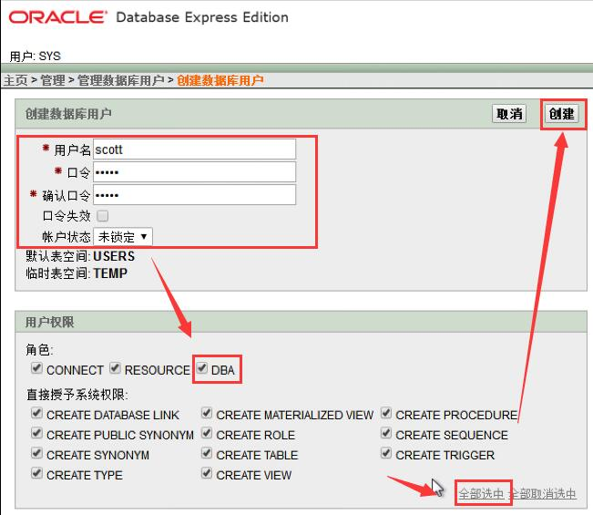

# oracle XE 安装和使用

​	Oracle XE 是 Oracle 数据库的免费版本，支持标准版的大部分功能，占用内存小，很不错。做为免费的 Oracle 数据库版本，XE 的限制是：

- 数据库的大小有限制  

- 可使用的最大内存是 1G

- 一台机器上只能安装一个 XE 实例

- XE 只能使用单 CPU，无法在多CPU上进行分布处理

  **免费版本的安装和卸载非常方便,并且卸载不会有残留文件,是作为练习用的绝佳工具!!!!**

## 1 安装和卸载

**安装 ：直接运行安装包 ， 根据提示安装即可**


**卸载 ：如果已经安装 ， 再次运行安装包 ， 选择删除即可**


## 2 修改 http 应用监听端口

​	oracle XE 提供了一个web应用用于管理数据库,该应用默认监听的http端口是8080 , 与 Tomcat 冲突,所以需要将其修改,这里我将它修改为 7000 , 修改方式有两种, 这里建议直接通过 web 应用修改,操作如下图:

默认的主页地址 :  http://127.0.0.1:8080/apex

### 1 通过web管理页面修改

1 打开主页,用管理员账户登录


2 打开sql命令输入页面


3 输入修改命令,并运行

​	命令如下:

```sql
begin
  dbms_xdb.sethttpport('7000');
  dbms_xdb.setftpport('0');
end;
```


​	注意,命令点击执行后端口就被修改了,所以在页面上没办法再进行其他操作 . 此时先重启浏览器,然后输入地址 :  http://127.0.0.1:7000/apex  以管理员 sys 账户登录 , 然后再进行后续添加账户的操作

### 2 通过登录服务器修改

1 以 dba 身份（使用 sys 帐号）登录

```sql
cmd 命令格式 ： 
sqlplus sys/<密码>@<ip地址>:1521/xe

sqlplus sys/orcl@127.0.0.1:1521/xe
```

2 执行下面语句，径端口改为 7000

```sql
begin
  dbms_xdb.sethttpport('7000');
  dbms_xdb.setftpport('0');
end;
```

​	这样就把默认的8080端口改成7000了，不用重启oracle服务，即时生效!

## 3  新建scott 和 itheima账户

​	xe 版本的默认只带了 HR 账户 , 这里我新建 scott 账户 和 itheima 账户 , scott 账户用于导入标准版的scott 账户数据 ,用于数据操作联系;而 itheima 账户用于 erp 项目开发.

​	这里建议直接通过web主页创建账户 , 一气呵成, 方便快捷!!! 如下图 :


​	

​	**创建scott 账户**


​	**创建 itheima 账户**


## 4 通过plsql development连接

​	运行plsql develoment ，在登录界面直接点 “取消” 按钮 ， 进入程序界面后 ， 按照下图设置 oci 库


​	以sys账户 ， 管理员身份登录


​	以scott账户 ， 普通角色登录 （需要先创建好scott账户!!!）


## 5 导入scott 账户数据

1. 创建 scott 账户（**前面的步骤已经创建，所以这一步可以跳过**）

   这一步需要 用 sys 账户，以管理员身份登录操作 ，然后执行下面的语句

```sql
-- Create the user 
create user scott
  identified by tiger
  default tablespace USERS
  temporary tablespace TEMP
  profile DEFAULT;
-- Grant/Revoke role privileges 
grant dba to scott with admin option;
-- Grant/Revoke system privileges 
grant select any table to scott with admin option;
grant update any table to scott with admin option;
grant unlimited tablespace to scott with admin option;
```

2. 创建表并导入数据

   **这一步以 scott 账户登录 ， 然后执行下面的语句**

```sql
create table BONUS
(
  ename VARCHAR2(10),
  job   VARCHAR2(9),
  sal   NUMBER,
  comm  NUMBER
)
tablespace USERS
  pctfree 10
  initrans 1
  maxtrans 255
  storage
  (
    initial 64K
    minextents 1
    maxextents unlimited
  );

create table DEPT
(
  deptno NUMBER(2) not null,
  dname  VARCHAR2(14),
  loc    VARCHAR2(13)
)
tablespace USERS
  pctfree 10
  initrans 1
  maxtrans 255
  storage
  (
    initial 64K
    minextents 1
    maxextents unlimited
  );
alter table DEPT
  add constraint PK_DEPT primary key (DEPTNO)
  using index 
  tablespace USERS
  pctfree 10
  initrans 2
  maxtrans 255
  storage
  (
    initial 64K
    minextents 1
    maxextents unlimited
  );

create table EMP
(
  empno    NUMBER(4) not null,
  ename    VARCHAR2(10),
  job      VARCHAR2(9),
  mgr      NUMBER(4),
  hiredate DATE,
  sal      NUMBER(7,2),
  comm     NUMBER(7,2),
  deptno   NUMBER(2)
)
tablespace USERS
  pctfree 10
  initrans 1
  maxtrans 255
  storage
  (
    initial 64K
    minextents 1
    maxextents unlimited
  );
alter table EMP
  add constraint PK_EMP primary key (EMPNO)
  using index 
  tablespace USERS
  pctfree 10
  initrans 2
  maxtrans 255
  storage
  (
    initial 64K
    minextents 1
    maxextents unlimited
  );
alter table EMP
  add constraint FK_DEPTNO foreign key (DEPTNO)
  references DEPT (DEPTNO);

create table SALGRADE
(
  grade NUMBER,
  losal NUMBER,
  hisal NUMBER
)
tablespace USERS
  pctfree 10
  initrans 1
  maxtrans 255
  storage
  (
    initial 64K
    minextents 1
    maxextents unlimited
  );

alter table BONUS disable all triggers;
alter table DEPT disable all triggers;
alter table EMP disable all triggers;
alter table SALGRADE disable all triggers;
alter table EMP disable constraint FK_DEPTNO;
insert into DEPT (deptno, dname, loc)
values (10, 'ACCOUNTING', 'NEW YORK');
insert into DEPT (deptno, dname, loc)
values (20, 'RESEARCH', 'DALLAS');
insert into DEPT (deptno, dname, loc)
values (30, 'SALES', 'CHICAGO');
insert into DEPT (deptno, dname, loc)
values (40, 'OPERATIONS', 'BOSTON');
commit;
insert into EMP (empno, ename, job, mgr, hiredate, sal, comm, deptno)
values (7369, 'SMITH', 'CLERK', 7902, to_date('17-12-1980', 'dd-mm-yyyy'), 800, null, 20);
insert into EMP (empno, ename, job, mgr, hiredate, sal, comm, deptno)
values (7499, 'ALLEN', 'SALESMAN', 7698, to_date('20-02-1981', 'dd-mm-yyyy'), 1600, 300, 30);
insert into EMP (empno, ename, job, mgr, hiredate, sal, comm, deptno)
values (7521, 'WARD', 'SALESMAN', 7698, to_date('22-02-1981', 'dd-mm-yyyy'), 1250, 500, 30);
insert into EMP (empno, ename, job, mgr, hiredate, sal, comm, deptno)
values (7566, 'JONES', 'MANAGER', 7839, to_date('02-04-1981', 'dd-mm-yyyy'), 2975, null, 20);
insert into EMP (empno, ename, job, mgr, hiredate, sal, comm, deptno)
values (7654, 'MARTIN', 'SALESMAN', 7698, to_date('28-09-1981', 'dd-mm-yyyy'), 1250, 1400, 30);
insert into EMP (empno, ename, job, mgr, hiredate, sal, comm, deptno)
values (7698, 'BLAKE', 'MANAGER', 7839, to_date('01-05-1981', 'dd-mm-yyyy'), 2850, null, 30);
insert into EMP (empno, ename, job, mgr, hiredate, sal, comm, deptno)
values (7782, 'CLARK', 'MANAGER', 7839, to_date('09-06-1981', 'dd-mm-yyyy'), 2450, null, 10);
insert into EMP (empno, ename, job, mgr, hiredate, sal, comm, deptno)
values (7788, 'SCOTT', 'ANALYST', 7566, to_date('19-04-1987', 'dd-mm-yyyy'), 3000, null, 20);
insert into EMP (empno, ename, job, mgr, hiredate, sal, comm, deptno)
values (7839, 'KING', 'PRESIDENT', null, to_date('17-11-1981', 'dd-mm-yyyy'), 5000, null, 10);
insert into EMP (empno, ename, job, mgr, hiredate, sal, comm, deptno)
values (7844, 'TURNER', 'SALESMAN', 7698, to_date('08-09-1981', 'dd-mm-yyyy'), 1500, 0, 30);
insert into EMP (empno, ename, job, mgr, hiredate, sal, comm, deptno)
values (7876, 'ADAMS', 'CLERK', 7788, to_date('23-05-1987', 'dd-mm-yyyy'), 1100, null, 20);
insert into EMP (empno, ename, job, mgr, hiredate, sal, comm, deptno)
values (7900, 'JAMES', 'CLERK', 7698, to_date('03-12-1981', 'dd-mm-yyyy'), 950, null, 30);
insert into EMP (empno, ename, job, mgr, hiredate, sal, comm, deptno)
values (7902, 'FORD', 'ANALYST', 7566, to_date('03-12-1981', 'dd-mm-yyyy'), 3000, null, 20);
insert into EMP (empno, ename, job, mgr, hiredate, sal, comm, deptno)
values (7934, 'MILLER', 'CLERK', 7782, to_date('23-01-1982', 'dd-mm-yyyy'), 1300, null, 10);
commit;
insert into SALGRADE (grade, losal, hisal)
values (1, 700, 1200);
insert into SALGRADE (grade, losal, hisal)
values (2, 1201, 1400);
insert into SALGRADE (grade, losal, hisal)
values (3, 1401, 2000);
insert into SALGRADE (grade, losal, hisal)
values (4, 2001, 3000);
insert into SALGRADE (grade, losal, hisal)
values (5, 3001, 9999);
insert into SALGRADE (grade, losal, hisal)
values (1, 700, 1200);
insert into SALGRADE (grade, losal, hisal)
values (2, 1201, 1400);
insert into SALGRADE (grade, losal, hisal)
values (3, 1401, 2000);
insert into SALGRADE (grade, losal, hisal)
values (4, 2001, 3000);
insert into SALGRADE (grade, losal, hisal)
values (5, 3001, 9999);
commit;


alter table EMP enable constraint FK_DEPTNO;
alter table BONUS enable all triggers;
alter table DEPT enable all triggers;
alter table EMP enable all triggers;
alter table SALGRADE enable all triggers;
```
## 6  idea 连接设置


文档整理 by  fmi110 ~~~~~~~献爱心的时刻到了...

