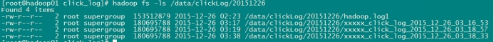

# 课程大纲（HDFS详解）

| Hadoop HDFS              | 分布式文件系统DFS简介 |
| ------------------------ | --------------------- |
| HDFS的系统组成介绍       |                       |
| HDFS的组成部分详解       |                       |
| 副本存放策略及路由规则   |                       |
| 命令行接口               |                       |
| Java接口                 |                       |
| 客户端与HDFS的数据流讲解 |                       |

**学习目标：**

​	掌握hdfs的shell操作

​	掌握hdfs的java api操作

​	理解hdfs的工作原理

# HDFS基本概念篇

# **1. HDFS前言**

l 设计思想

​	分而治之：将大文件、大批量文件，分布式存放在大量服务器上，**以便于采取分而治之的方式对海量数据进行运算分析；**

l 在大数据系统中作用：为各类分布式运算框架（如：mapreduce，spark，tez，……）提供数据存储服务

l 重点概念：文件切块，副本存放，元数据

# **2. HDFS的概念和特性**

**首先，它是一个文件系统**，用于存储文件，通过统一的命名空间——目录树来定位文件

**其次，它是分布式的**，由很多服务器联合起来实现其功能，集群中的服务器有各自的角色；

**重要特性如下：**

（1）HDFS中的文件在物理上是**分块存储（block）**，块的大小可以通过配置参数( dfs.blocksize)来规定，默认大小在hadoop2.x版本中是128M，老版本中是64M

（2）HDFS文件系统会给客户端提供一个**统一的抽象目录树**，客户端通过路径来访问文件，形如：`hdfs://namenode:port/dir-a/dir-b/dir-c/file.data`

（3）**目录结构及文件分块信息**(元数据)的管理由namenode节点承担

​	namenode是HDFS集群主节点，负责维护整个hdfs文件系统的目录树，以及每一个路径（文件）所对应的block块信息（block的id，及所在的datanode服务器

（4）文件的各个block的存储管理由datanode节点承担

​	datanode是HDFS集群从节点，每一个block都可以在多个datanode上存储多个副本（副本数量也可以通过参数设置dfs.replication）

（5）HDFS是设计成适应一次写入，多次读出的场景，且不支持文件的修改

*(注：适合用来做数据分析，并不适合用来做网盘应用，因为，不便修改，延迟大，网络开销大，成本太高)*

# HDFS基本操作篇

# **3. HDFS的shell(命令行客户端)操作**

## **3.1 HDFS命令行客户端使用**

HDFS提供shell命令行客户端，使用方法如下：

```shell
hadoop fs -ls /
```

 

## **3.2 命令行客户端支持的命令参数**

```shell
-help            # 功能：输出这个命令参数手册
-ls	#显示目录信息示例 : hadoop fs -ls hdfs://hadoop-server01:9000/ 备注：hdfs路径都可以简写 : hadoop fs -ls /   
-mkdir	# 创建目录示例：
	# hadoop fs  -mkdir  -p  /aaa/bbb/cc/dd
-moveFromLocal	# 从本地剪切粘贴到hdfs
	# hadoop  fs  - moveFromLocal  /home/hadoop/a.txt  /aaa/bbb/cc/dd
-moveToLocal    # 功能：从hdfs剪切粘贴到本地示例：
	# hadoop  fs  - moveToLocal   /aaa/bbb/cc/dd  /home/hadoop/a.txt
-appendToFile
-cat
-tail	# 功能：显示一个文件的末尾 示例：
	# hadoop  fs  -tail  /weblog/access_log.1
-text	# 功能：以字符形式打印一个文件的内容
	# hadoop  fs  -text  /weblog/access_log.1
-cp    	# 功能：从hdfs的一个路径拷贝hdfs的另一个路径示例
	# hadoop  fs  -cp  /aaa/jdk.tar.gz  /bbb/jdk.tar.gz.2
-mv    功能：在hdfs目录中移动文件 
	# hadoop  fs  -mv  /aaa/jdk.tar.gz  /
-get	# 功能：等同于copyToLocal，就是从hdfs下载文件到本地示例
	# hadoop fs -get  /aaa/jdk.tar.gz
-getmerge	#  功能：合并下载多个文件
	# hadoop fs -getmerge /aaa/log.* ./log.sum
-put	# 功能：等同于copyFromLocal
	# hadoop  fs  -put  /aaa/jdk.tar.gz  /bbb/jdk.tar.gz.2 
-rm	# 功能：删除文件或文件夹
	# hadoop fs -rm -r /aaa/bbb/
-rmdir	# 功能：删除空目录
	# hadoop  fs  -rmdir   /aaa/bbb/ccc
-df	#功能：统计文件系统的可用空间信息
	# hadoop  fs  -df  -h  / 
-du	# 功能：统计文件夹的大小信息
	# hadoop  fs  -du  -s -h /aaa/
-count	# 功能：统计一个指定目录下的文件节点数量
	# hadoop fs -count /aaa/ 
-setrep	# 功能：设置hdfs中文件的副本数量
	# hadoop fs -setrep 3 /aaa/jdk.tar.gz
	# <这里设置的副本数只是记录在namenode的元数据中，是否真的会有这么多副本，还得看datanode的数量> 
```

# HDFS原理篇

# **4. hdfs的工作机制**

*（工作机制的学习主要是为加深对分布式系统的理解，以及增强遇到各种问题时的分析解决能力，形成一定的集群运维能力）*

*注：很多不是真正理解hadoop技术体系的人会常常觉得HDFS可用于网盘类应用，但实际并非如此。要想将技术准确用在恰当的地方，必须对技术有深刻的理解*

## **4.1 概述**

1. HDFS 集群分为两大角色：NameNode、DataNode

2. NameNode 负责管理整个文件系统的元数据
3. DataNode 负责管理用户的文件数据块
4. 文件会按照固定的大小（blocksize）切成若干块后分布式存储在若干台datanode上
5. 每一个文件块可以有多个副本，并存放在不同的 datanode 上
6. Datanode 会定期向 Namenode 汇报自身所保存的文件 block 信息，而 namenode 则会负责保持文件的副本数量
7. HDFS 的内部工作机制对客户端保持透明，客户端请求访问 HDFS 都是通过向 namenode 申请来进行

## **4.2 HDFS写数据流程**

### **4.2.1 概述**

​	客户端要向HDFS写数据，首先要跟 namenode 通信以确认可以写文件并获得接收文件 block 的 datanode，然后，客户端按顺序将文件逐个 block 传递给相应 datanode ，并由接收到 block 的 datanode 

负责向其他datanode复制block的副本

### **4.2.2 详细步骤图**

 

### **4.2.3 详细步骤解析**

1. 根namenode通信请求上传文件，namenode检查目标文件是否已存在，父目录是否存在
2. namenode返回是否可以上传
3. client请求第一个 block该传输到哪些datanode服务器上
4. namenode返回3个datanode服务器ABC
5. client请求3台dn中的一台A上传数据（本质上是一个RPC调用，建立pipeline），A收到请求会继续调用B，然后B调用C，将真个pipeline建立完成，逐级返回客户端
6. client开始往A上传第一个block（先从磁盘读取数据放到一个本地内存缓存），以packet为单位，A收到一个packet就会传给B，B传给C；A每传一个packet会放入一个应答队列等待应答
7. 当一个block传输完成之后，client再次请求namenode上传第二个block的服务器。

## **4.3. HDFS读数据流程**

### **4.3.1 概述**

​	客户端将要读取的文件路径发送给namenode，namenode获取文件的元信息（主要是block的存放位置信息）返回给客户端，客户端根据返回的信息找到相应datanode逐个获取文件的block并在客户端本地进行数据追加合并从而获得整个文件

### **4.3.2 详细步骤图**

 

 

### **4.3.3 详细步骤解析**

1. 跟namenode通信查询元数据，找到文件块所在的datanode服务器
2. 挑选一台datanode（就近原则，然后随机）服务器，请求建立socket流
3. datanode开始发送数据（从磁盘里面读取数据放入流，以packet为单位来做校验）
4. 客户端以packet为单位接收，现在本地缓存，然后写入目标文件

# **5. NAMENODE工作机制**

​	**学习目标**：理解namenode的工作机制尤其是**元数据管理**机制，以增强对HDFS工作原理的理解，及培养hadoop集群运营中“性能调优”、“namenode”故障问题的分析解决能力

*问题场景：*

*1. 集群启动后，可以查看文件，但是上传文件时报错，打开web页面可看到namenode正处于safemode状态，怎么处理？*

*2. **Namenode服务器的磁盘故障导致namenode宕机**，**如何挽救集群及数据**？*

*3. **Namenode是否可以有多个**？namenode内存要配置多大？namenode跟集群数据存储能力有关系吗？*

*4. 文件的blocksize究竟调大好还是调小好？*

*……*

*诸如此类问题的回答，都需要基于对namenode自身的工作原理的深刻理解*

## **5.1** **NAMENODE** 职责

​	NAMENODE职责：负责客户端请求的响应 , 元数据的管理（查询，修改）

## **5.2 元数据管理**

namenode对数据的管理采用了三种存储形式：

1. 内存元数据(NameSystem)
2. 磁盘元数据镜像文件
3. 数据操作日志文件（可通过日志运算出元数据）

### **5.2.1 元数据存储机制**

1. 内存中有一份完整的元数据(**内存meta data**)
2. 磁盘有一个“准完整”的元数据镜像（**fsimage**）文件(在namenode的工作目录中)
3. 用于衔接内存metadata和持久化元数据镜像fsimage之间的操作日志（**edits文件**）*注：当客户端对hdfs中的文件进行新增或者修改操作，操作记录首先被记入edits日志文件中，当客户端操作成功后，相应的元数据会更新到内存meta.data中*

### **5.2.2 元数据手动查看**

可以通过hdfs的一个工具来查看edits中的信息

```shell
bin/hdfs oev -i edits -o edits.xml

bin/hdfs oiv -i fsimage_0000000000000000087 -p XML -o fsimage.xml
```

### **5.2.3 元数据的checkpoint**

​	每隔一段时间，会由secondary namenode将namenode上积累的所有edits和一个最新的fsimage下载到本地，并加载到内存进行merge（这个过程称为checkpoint）

​	**checkpoint的详细过程 :**

 

 

**checkpoint操作的触发条件配置参数**

**checkpoint的附带作用**

​	namenode 和 secondary namenode 的工作目录存储结构完全相同，所以，当 namenode 故障退出需要重新恢复时，可以从 secondary namenode 的工作目录中将 fsimage 拷贝到 namenode 的工作目录，以恢复namenode 的元数据

# **6. DATANODE的工作机制**

*问题场景：*

*1. 集群容量不够，怎么扩容？*

*2. 如果有一些datanode宕机，该怎么办？*

*3. datanode明明已启动，但是集群中的可用datanode列表中就是没有，怎么办？*

*以上这类问题的解答，有赖于对datanode工作机制的深刻理解*

## **6.1 概述**

1、Datanode工作职责：

存储管理用户的文件块数据

定期向namenode汇报自身所持有的block信息（通过心跳信息上报）

（这点很重要，因为，当集群中发生某些block副本失效时，集群如何恢复block初始副本数量的问题）


2、Datanode掉线判断时限参数

datanode 进程死亡或者网络故障造成datanode无法与namenode通信，namenode不会立即把该节点判定为死亡，要经过一段时间，这段时间暂称作超时时长。HDFS默认的超时时长为10分钟+30秒。如果定义超时时间为timeout，则超时时长的计算公式为：

```
timeout  = 2 * heartbeat.recheck.interval + 10 * dfs.heartbeat.interval
```

​	而默认的      `heartbeat.recheck.interval` 大小为5分钟，`dfs.heartbeat.interval` 默认为3秒。

​	需要注意的是hdfs-site.xml 配置文件中的    `heartbeat.recheck.interval` 的单位为毫秒，dfs.heartbeat.interval 的单位为秒。所以，举个例子，如果   `heartbeat.recheck.interval` 设置为5000（毫秒），`dfs.heartbeat.interval`  设置为3（秒，默认），则总的超时时间为40秒。

## **6.2 观察验证DATANODE功能**

​	上传一个文件，观察文件的block具体的物理存放情况：

​	在每一台datanode机器上的这个目录中能找到文件的切块：

```
/home/hadoop/app/hadoop-2.4.1/tmp/dfs/data/current/BP-193442119-192.168.2.120-1432457733977/current/finalized
```

# HDFS应用开发篇

# **7. HDFS的java操作**

*hdfs在生产应用中主要是客户端的开发，其核心步骤是从hdfs提供的api中构造一个HDFS的访问客户端对象，然后通过该客户端对象操作（增删改查）HDFS上的文件*

## **7.1 搭建开发环境**

**1、引入依赖**

*注：如需手动引入jar包，hdfs的 jar 包---- hadoop 的安装目录的 share下*

**2、window下开发的说明**

建议在linux下进行hadoop应用的开发，不会存在兼容性问题。如在window上做客户端应用开发，需要设置以下环境：

A、在windows的某个目录下解压一个hadoop的安装包

B、将安装包下的lib和bin目录用对应windows版本平台编译的本地库替换

C、在window系统中配置HADOOP_HOME指向你解压的安装包

D、在windows系统的path变量中加入hadoop的bin目录

## **7.2 获取api中的客户端对象**

在java中操作hdfs，首先要获得一个客户端实例

 

而我们的操作目标是 HDFS ，所以获取到的 fs 对象应该是 DistributedFileSystem 的实例；

get方法是从何处判断具体实例化那种客户端类呢？

**——从conf中的一个参数 fs.defaultFS的配置值判断；**


​	如果我们的代码中没有指定fs.defaultFS，并且工程classpath下也没有给定相应的配置，conf中的默认值就来自于hadoop的jar包中的core-default.xml，默认值为： file:///，则获取的将不是一个DistributedFileSystem的实例，而是一个本地文件系统的客户端对象

 

## 7.3 DistributedFileSystem实例对象所具备的方法

 

## 7.4 HDFS客户端操作数据代码示例

### **7.4.1 文件的增删改查**

 

 

 

### **7.4.2 通过流的方式访问hdfs**

 

 

### **7.4.3 场景编程**

在mapreduce 、spark等运算框架中，有一个核心思想就是将运算移往数据，或者说，就是要在并发计算中尽可能让运算本地化，这就需要获取数据所在位置的信息并进行相应范围读取

以下模拟实现：获取一个文件的所有block位置信息，然后读取指定block中的内容

 

 

# **8.** 案例1：开发shell采集脚本

## 8.1需求说明

​	点击流日志每天都10T，在业务应用服务器上，需要准实时上传至数据仓库（Hadoop HDFS）上

## **8.2需求分析**

​	一般上传文件都是在凌晨24点操作，由于很多种类的业务数据都要在晚上进行传输，为了减轻服务器的压力**，避开高峰期**。

​	如果需要伪实时的上传，则采用定时上传的方式

​	

## 8.3技术分析

​	 **HDFS SHELL**:  hadoop fs  –put   xxxx.tar  /data    还可以使用 Java Api

​	 		满足上传一个文件，不能满足定时、周期性传入。

​	 **定时调度器**：

​		Linux crontab

```shell
crontab  -e
```

```shell
*/5 * * * * $home/bin/command.sh   //五分钟执行一次
```

系统会自动执行脚本，每5分钟一次，执行时判断文件是否符合上传规则，符合则上传

## 8.4实现流程

### 8.4.1日志产生程序

日志产生程序将日志生成后，产生一个一个的文件，使用滚动模式创建文件名。

 

​	日志生成的逻辑由业务系统决定，比如在log4j配置文件中配置生成规则，如：当xxxx.log 等于10G时，滚动生成新日志

 

细节：

1、 如果日志文件后缀是1\2\3等数字，该文件满足需求可以上传的话。把该文件移动到准备上传的工作区间。

2、 工作区间有文件之后，可以使用hadoop put命令将文件上传。

阶段问题：

1、 待上传文件的工作区间的文件，在上传完成之后，是否需要删除掉。

### 8.4.2伪代码

​	使用ls命令读取指定路径下的所有文件信息，

```shell
ls  | while read  line
//判断line这个文件名称是否符合规则
if	 line=access.log.* (
		将文件移动到待上传的工作区间
)
//批量上传工作区间的文件
hadoop fs  –put   xxx
```

​	**脚本写完之后**，配置linux定时任务，每5分钟运行一次。

## 8.5代码实现

​	代码第一版本，实现基本的上传功能和定时调度功能

 

​	代码第二版本：增强版V2(基本能用，还是不够健全)

 

 

## 8.6效果展示及操作步骤

1、日志收集文件收集数据，并将数据保存起来，效果如下：

2、上传程序通过crontab定时调度

 

3、程序运行时产生的临时文件

 

4、Hadoo hdfs上的效果

 

 

# **9. 案例2：开发JAVA采集程序**

## **9.1 需求**

从外部购买数据，数据提供方会实时将数据推送到6台FTP服务器上，我方部署6台接口采集机来对接采集数据，并上传到HDFS中

提供商在FTP上生成数据的规则是以小时为单位建立文件夹(2016-03-11-10)，每分钟生成一个文件（00.dat,01.data,02.dat,........）.

提供方不提供数据备份，推送到FTP服务器的数据如果丢失，不再重新提供，且FTP服务器磁盘空间有限，最多存储最近10小时内的数据 .

由于每一个文件比较小，只有150M左右，因此，我方在上传到HDFS过程中，需要将15分钟时段的数据合并成一个文件上传到HDFS .

为了区分数据丢失的责任，我方在下载数据时最好进行校验

## **9.2 设计分析**

 

 

 

 