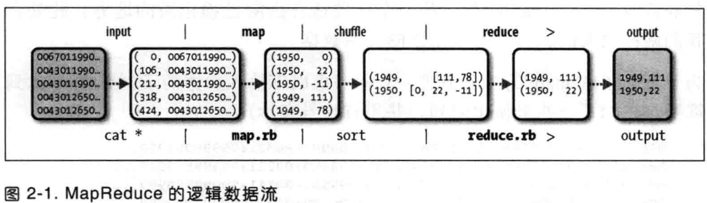
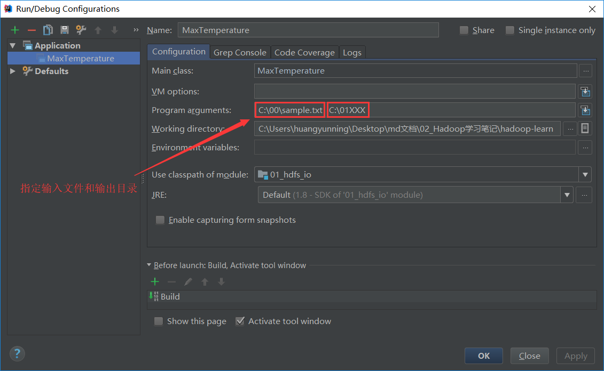
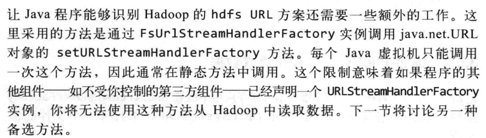
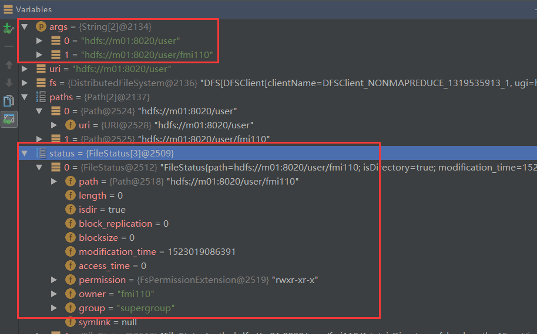
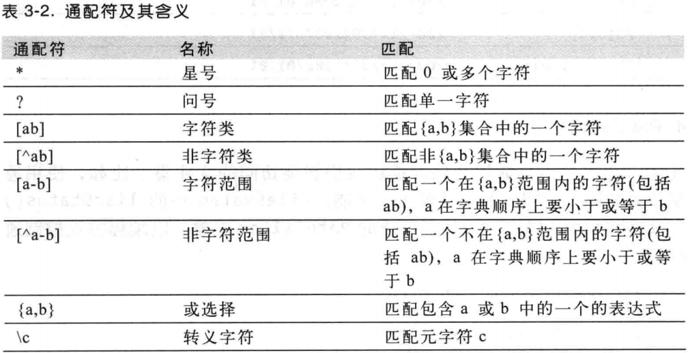
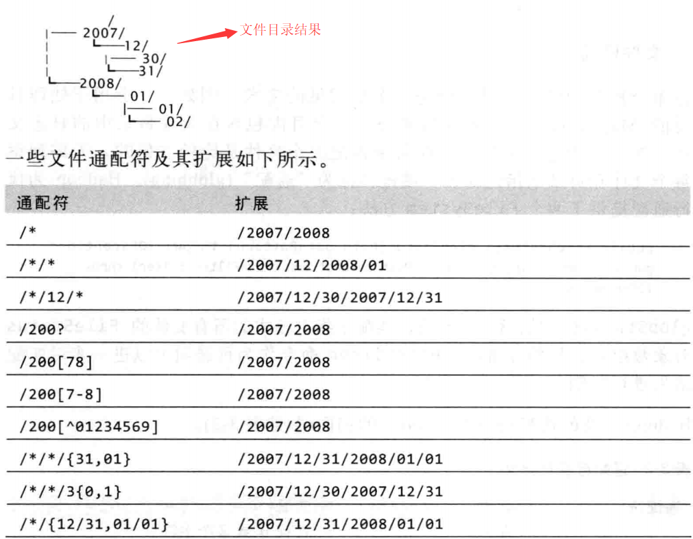

# Hadoop DEMO

## 1 mapreduce 入门

​	 [案例源代码地址](https://github.com/hyn110/hadoop-learn/tree/master/01_hdfs_io)

​	[windows环境运行map-reduce出现的问题](https://blog.csdn.net/darkdragonking/article/details/72636917)

**windows 环境下运行程序需要做的准备:**

1. 解压一个hadoop的二进制文件到本地磁盘,这里我是解压  `hadoop-2.7.2.tar.gz` 到 `C:\00_my_program\hadoop-2.7.2` 目录


2. 配置环境变量 `HADOOP_HOME` , 值为解压的路径 `C:\00_my_program\hadoop-2.7.2` , 并在 `PATH` 中追加 `%HADOOP_HOME%\bin`

3. 下载 https://download.csdn.net/download/fmi110/10329691 文件, 并将解压得到的文件复制到 `%HADOOP_HOME%\bin` 目录下 

   > 否则报错
   >
   >  `java.io.IOException: (null) entry in command string: null chmod 0700 C:\tmp\hadoop-huangyunning\mapred\staging\huangyunning1997364178\.staging`
   >
   > 或
   >
   > ` Exception in thread "main" java.lang.UnsatisfiedLinkError: org.apache.hadoop.io.nativeio.NativeIO$Windows.createDirectoryWithMode0(Ljava/lang/String;I)V`

4. 修改 hdfs 文件系统权限 ,允许任一用户进行读写文件(这里只是为了保证windows下能够运行hadoop程序,并未考虑生产环境下的安全问题!!!)  `hadoop fs -chmod 777 /`    **(如果不是远程访问Linux 的hadoop 这步可以不用)**

   >  否则报错`org.apache.hadoop.ipc.RemoteException(org.apache.hadoop.security.AccessControlException): Permission denied: user=huangyunning, access=WRITE, inode="/output":fmi110:supergroup:drwxr-xr-x`

   依赖:

```xml
<dependencies>
    <dependency>
        <groupId>org.apache.hadoop</groupId>
        <artifactId>hadoop-core</artifactId>
        <version>1.2.1</version>
    </dependency>
    <dependency>
        <groupId>org.apache.hadoop</groupId>
        <artifactId>hadoop-common</artifactId>
        <version>2.7.2</version>
    </dependency>
</dependencies>
```

​	天气数据如下

```js
0067011990999991950051507004+68750+023550FM-12+038299999V0203301N00671220001CN9999999N9+00001+99999999999
0043011990999991950051512004+68750+023550FM-12+038299999V0203201N00671220001CN9999999N9+00221+99999999999
0043011990999991950051518004+68750+023550FM-12+038299999V0203201N00261220001CN9999999N9-00111+99999999999
0043012650999991949032412004+62300+010750FM-12+048599999V0202701N00461220001CN0500001N9+01111+99999999999
0043012650999991949032418004+62300+010750FM-12+048599999V0202701N00461220001CN0500001N9+00781+99999999999
```

​	数据流 :




```java
import lombok.extern.slf4j.Slf4j;
import org.apache.hadoop.mapreduce.Job;
import org.apache.hadoop.mapreduce.lib.input.FileInputFormat;
import org.apache.hadoop.mapreduce.lib.input.TextInputFormat;
import org.apache.hadoop.mapreduce.lib.output.FileOutputFormat;

import java.io.IOException;

/**
 * @author fmi110
 * @Description:
 * @Date 2018/4/6 11:08
 */
@Slf4j
public class MaxTemperature {

    public static void main(String[] args) throws IOException, ClassNotFoundException, InterruptedException {

        if (args.length < 2) {
            log.error("必须指定输入文件和输出路径...");
            System.exit(-1);
        }
        //1 创建配置文件 conf
        //2 创建 job , 指定输入文件类型
        //3 设置 mapper , 并设置k-v类型
        //4 设置 reducer , 并设置k-v类型
        //5 设置应用的输入
        //6 设置应用的输出
        //7 运行

        Configuration conf = new Configuration();
        // conf.set("fs.defaultFS", "file:///");

        // 删除输出目录,这里只是为了方便程序运行,生产中不能这么干
        FileSystem.get(conf)
                  .delete(new Path(args[1]), true);

        Job job = Job.getInstance(conf);
        job.setInputFormatClass(TextInputFormat.class);
        job.setJobName("maxTemperature Job");
        job.setJarByClass(MaxTemperature.class);

        job.setMapperClass(MaxTemperatureMapper.class);
        job.setMapOutputKeyClass(Text.class);
        job.setMapOutputValueClass(IntWritable.class);

        job.setReducerClass(MaxTemperatureReducer.class);
        job.setOutputKeyClass(Text.class);
        job.setOutputValueClass(IntWritable.class);

        FileInputFormat.addInputPath(job, new Path(args[0]));
        FileOutputFormat.setOutputPath(job, new Path(args[1]));

        System.exit(job.waitForCompletion(true) ? 0 : -1);
    }
}

```
> 由于泛型擦除的原因,所以job需要显示的设置类型  `job.setXXXclass(...)`

```java
package com.fmi110.mapper;

import lombok.extern.slf4j.Slf4j;
import org.apache.hadoop.io.IntWritable;
import org.apache.hadoop.io.LongWritable;
import org.apache.hadoop.io.Text;
import org.apache.hadoop.mapreduce.Mapper;

import java.io.IOException;

/**
 * @author fmi110
 * @Description: 输入的行数据包含了年份和天气信息, 通过map提取出来
 * @Date 2018/4/6 11:13
 */
@Slf4j
public class MaxTemperatureMapper
        extends Mapper<LongWritable, Text, Text, IntWritable> {

    @Override
    protected void map(LongWritable key, Text value, Context context) throws IOException, InterruptedException {
        log.info("----------------- map ---------------");

        long   keyL = key.get();
        String line = value.toString();
        String year = line.substring(15, 19);
        log.info("输入 key = {},year = {}", keyL, year);

        int airTemperature;
        if (line.charAt(87) == '+') { // parseInt doesn't like leading plus signs
            airTemperature = Integer.parseInt(line.substring(88, 92));
        } else {
            airTemperature = Integer.parseInt(line.substring(87, 92));
        }
        String quality = line.substring(92, 93);
        if (quality.matches("[01459]")) {
            context.write(new Text(year), new IntWritable(airTemperature));
        }
    }
}
```

```java
package com.fmi110.reducer;

import lombok.extern.slf4j.Slf4j;
import org.apache.hadoop.io.IntWritable;
import org.apache.hadoop.io.Text;
import org.apache.hadoop.mapreduce.Reducer;

import java.io.IOException;

/**
 * @author fmi110
 * @Description: 获取最大的天气值
 * @Date 2018/4/6 11:39
 */
@Slf4j
public class MaxTemperatureReducer extends Reducer<Text, IntWritable, Text, IntWritable> {
    @Override
    protected void reduce(Text key, Iterable<IntWritable> values, Context context)
            throws IOException, InterruptedException {
        log.info("-------------- reduce ------------");
        log.info("key = {}",key.toString());

        int maxValue = Integer.MIN_VALUE;

        for (IntWritable v : values) {
            log.info("max = {},v = {}",maxValue,v.get());
            maxValue = Math.max(maxValue, v.get());
        }
        // 输出最后的结果
        context.write(key,new IntWritable(maxValue));
    }
}
```



​	输出文件结果如下:

```
1949	111
1950	22
```

## 2 文件系统的基础操作

### 1 shell命令

1. 本地文件复制到hdfs

```sh
hadoop fs -copyFromLocal input/test.txt hdfs://localhost:8020/user/fmi110/test.txt
或
hadoop fs -copyFromLocal input/test.txt /user/fmi110/test.txt
```

2. 从hdfs复制文件到本地

```sh
hadoop fs -copyToLocal /user/fmi110/test.txt test.copy.txt
md5sum /user/fmi110/test.txt test.copy.txt         # 查看两个文件的md5值,确认文件内容一致
```

3. 在hdfs新建目录并查看当前目录内容

```sh
hadoop fs -mkdir -p /user/fmi110
hadoop fs -ls .
```

4. 列出本地文件系统下的文件

```sh
hadoop fs -ls file:///
```

> 相当于是查看linux文件系统

### 2 api

#### 1 通过URLStreamHandler实例以标准输出方式显示hdfs上的文件

```java
import org.apache.hadoop.fs.FsUrlStreamHandlerFactory;
import org.apache.hadoop.io.IOUtils;

import java.io.InputStream;
import java.net.URL;

/**
 * @author fmi110
 * @Date 2018/4/6 20:02
 */
public class URLCat {
    static {
        // 必须设置,否则URL无法识别 hdfs 协议!!!每个jvm只能调用一次该方法,
        // 所以这个方式读取文件有局限!!!
        URL.setURLStreamHandlerFactory(new FsUrlStreamHandlerFactory());
    }
    public static void main(String[] args) throws Exception {
        InputStream in = null;
      try{
          // 连接linux服务器时
          // in = new URL("hdfs://m01:8020/user/fmi110/1.txt").openStream();
          
          // 读取windows本地文件时  args[0] = "file://C:/input/sample.txt"
          in = new URL(args[0]).openStream();
          IOUtils.copyBytes(in,System.out,1024*4,false);
      }finally {
        IOUtils.closeStream(in);
      }
    }
}

```



​	linux下运行打包出来的 jar 文件指令:

```sh
hadoop jar jar文件路径  类名  main方法参数...
```

#### 2 通过 FileSystem 对象读取 hdfs 文件

```java
import org.apache.hadoop.conf.Configuration;
import org.apache.hadoop.fs.FileSystem;
import org.apache.hadoop.fs.Path;
import org.apache.hadoop.io.IOUtils;

import java.io.IOException;
import java.io.InputStream;
import java.net.URI;

/**
 * @author fmi110
 * @Description:
 * @Date 2018/4/6 21:04
 */
public class FileSystemCat {
    public static void main(String[] args) throws IOException {
        String uri = args[0]; // hdfs://m01:8020/user/fmi110/1.txt
        Configuration conf = new Configuration();
        FileSystem fs = FileSystem.get(URI.create(uri), conf);
        InputStream in = null;
        try {
            in = fs.open(new Path(uri));
            IOUtils.copyBytes(in,System.out,1024*4,false);
        }finally {
            IOUtils.closeStream(in);
        }
    }
}
```

#### 3 通过 FileDataOutputStream 写入文件到 hdfs

```java
import org.apache.hadoop.conf.Configuration;
import org.apache.hadoop.fs.FSDataOutputStream;
import org.apache.hadoop.fs.FileSystem;
import org.apache.hadoop.fs.Path;
import org.apache.hadoop.io.IOUtils;
import org.apache.hadoop.util.Progressable;

/**
 * 写入文件,并带进度提示
 * @author fmi110
 * @Date 2018/4/6 21:23
 */
public class FileCopyWithProgress {
    public static void main(String[] args) throws IOException, InterruptedException {
        String localFile = args[0]; // C:/a.md 
        String dst = args[1]; // hdfs://m01:8020/user/fmi110/a.md

        InputStream in = new BufferedInputStream(new FileInputStream(localFile));
        FileSystem  fs = FileSystem.get(URI.create(dst), new Configuration(),"fmi110");
        // fs.create() 会自动创建父级目录!!!
        FSDataOutputStream out = fs.create(new Path(dst), new Progressable() {
            @Override
            public void progress() {
                System.out.print(".");
            }
        });
        IOUtils.copyBytes(in,out,4096,true);
    }
}
```

#### 4 FileStatus 获取文件元信息和文件路径信息

```java
import org.apache.hadoop.conf.Configuration;
import org.apache.hadoop.fs.FileStatus;
import org.apache.hadoop.fs.FileSystem;
import org.apache.hadoop.fs.FileUtil;
import org.apache.hadoop.fs.Path;

import java.io.IOException;
import java.net.URI;
import java.util.Arrays;

/**
 * 获取文件元信息和路径信息
 * @author fmi110
 * @Date 2018/4/6 21:43
 */
public class FileStatusDemo {
    public static void main(String[] args) throws IOException {
        // args = {"hdfs://m01:8020/user", "hdfs://m01:8020/user/fmi110"}
        String uri = args[0];
        FileSystem fs = FileSystem.get(URI.create(uri),new Configuration());

        Path[] paths = new Path[args.length];
        for(int i=0;i<paths.length;i++) {
            paths[i] = new Path(args[i]);
        }
        // 获取一组路径的 fileStauts
        FileStatus[] status = fs.listStatus(paths);
        // FileUtil 将元信息转换为路径信息
        Path[] filePaths = FileUtil.stat2Paths(status);
        Arrays.stream(filePaths).forEach(System.out::println);
    }
}
```

> 获取文件路径信息的关键是 FileUtil



#### 5 PathFilter 文件模式(多文件匹配)

​	FileSystem 提供了通配 (globbing) 方式 , 通过一个表达式来匹配多个文件 . hadoop 为执行通配提供了两个 FileSystem 方法 :

```java
public FileStatus[] globStatus(Path pathPattern);
public FileStatus[] globStatus(Path pathPattern,PathFilter filter);

fs.globStatus(new Path(BASE_PATH + pattern), pathFilter)
```





​	根据文件名,截取日期,筛选指定日期范围的文件. 通常在处理日志文件时会用到

```java
import java.text.DateFormat;
import java.text.ParseException;
import java.text.SimpleDateFormat;

import org.apache.hadoop.fs.Path;
import org.apache.hadoop.fs.PathFilter;

public class DateRangePathFilter implements PathFilter {
  
  private final Pattern PATTERN = Pattern.compile("^.*/(\\d\\d\\d\\d/\\d\\d/\\d\\d).*$");
  
  private final Date start, end;

  public DateRangePathFilter(Date start, Date end) {
    this.start = new Date(start.getTime());
    this.end = new Date(end.getTime());
  }
  
  public boolean accept(Path path) {
    Matcher matcher = PATTERN.matcher(path.toString());
    if (matcher.matches()) {
      DateFormat format = new SimpleDateFormat("yyyy/MM/dd");
      try {
        return inInterval(format.parse(matcher.group(1)));
      } catch (ParseException e) {
        return false;
      }
    }
    return false;
  }

  private boolean inInterval(Date date) {
    return !date.before(start) && !date.after(end);
  }
}
```

​	正则表达式 , 包含文件

```java
import org.apache.hadoop.fs.Path;
import org.apache.hadoop.fs.PathFilter;

public class RegexPathFilter implements PathFilter {
  
  private final String regex;
  private final boolean include;

  public RegexPathFilter(String regex) {
    this(regex, true);
  }
  
  public RegexPathFilter(String regex, boolean include) {
    this.regex = regex;
    this.include = include;
  }

  public boolean accept(Path path) {
    return (path.toString().matches(regex)) ? include : !include;
  }
}
```

​	正则表达式排除文件

```java
// cc RegexExcludePathFilter A PathFilter for excluding paths that match a regular expression
import org.apache.hadoop.fs.Path;
import org.apache.hadoop.fs.PathFilter;

public class RegexExcludePathFilter implements PathFilter {
  
  private final String regex;

  public RegexExcludePathFilter(String regex) {
    this.regex = regex;
  }

  public boolean accept(Path path) {
    return !path.toString().matches(regex);
  }
}
```


```java
import static org.hamcrest.CoreMatchers.*;
import static org.junit.Assert.*;

import java.io.IOException;
import java.text.ParseException;
import java.text.SimpleDateFormat;
import java.util.*;

import org.apache.hadoop.conf.Configuration;
import org.apache.hadoop.fs.FileSystem;
import org.apache.hadoop.fs.FileUtil;
import org.apache.hadoop.fs.Path;
import org.apache.hadoop.fs.PathFilter;
import org.junit.*;

public class FileSystemGlobTest {
  
  private static final String BASE_PATH = "/tmp/" +
    FileSystemGlobTest.class.getSimpleName();
  
  private FileSystem fs;
  
  @Before
  public void setUp() throws Exception {
    fs = FileSystem.get(new Configuration());
    fs.mkdirs(new Path(BASE_PATH, "2007/12/30"));
    fs.mkdirs(new Path(BASE_PATH, "2007/12/31"));
    fs.mkdirs(new Path(BASE_PATH, "2008/01/01"));
    fs.mkdirs(new Path(BASE_PATH, "2008/01/02"));
  }
  
  @After
  public void tearDown() throws Exception {
    fs.delete(new Path(BASE_PATH), true);
  }
  
  @Test
  public void glob() throws Exception {
    assertThat(glob("/*"), is(paths("/2007", "/2008")));
    assertThat(glob("/*/*"), is(paths("/2007/12", "/2008/01")));
    assertThat(glob("/*/12/*"), is(paths("/2007/12/30", "/2007/12/31")));
    assertThat(glob("/200?"), is(paths("/2007", "/2008")));
    assertThat(glob("/200[78]"), is(paths("/2007", "/2008")));
    assertThat(glob("/200[7-8]"), is(paths("/2007", "/2008")));
    assertThat(glob("/200[^01234569]"), is(paths("/2007", "/2008")));

    assertThat(glob("/*/*/{31,01}"), is(paths("/2007/12/31", "/2008/01/01")));
    assertThat(glob("/*/*/3{0,1}"), is(paths("/2007/12/30", "/2007/12/31")));

    assertThat(glob("/*/{12/31,01/01}"), is(paths("/2007/12/31", "/2008/01/01")));
  }
  
  @Test
  public void regexIncludes() throws Exception {
    assertThat(glob("/*", new RegexPathFilter("^.*/2007$")), is(paths("/2007")));
    assertThat(glob("/*/*/*", new RegexPathFilter("^.*/2007/12/31$")), is(paths("/2007/12/31")));
    assertThat(glob("/*/*/*", new RegexPathFilter("^.*/2007(/12(/31)?)?$")), is(paths("/2007/12/31")));
  }
  
  @Test
  public void regexExcludes() throws Exception {
    assertThat(glob("/*", new RegexPathFilter("^.*/2007$", false)), is(paths("/2008")));
    assertThat(glob("/2007/*/*", new RegexPathFilter("^.*/2007/12/31$", false)), is(paths("/2007/12/30")));
  }
  
  @Test
  public void regexExcludesWithRegexExcludePathFilter() throws Exception {
    assertThat(glob("/*", new RegexExcludePathFilter("^.*/2007$")), is(paths("/2008")));
    assertThat(glob("/2007/*/*", new RegexExcludePathFilter("^.*/2007/12/31$")), is(paths("/2007/12/30")));
  }

  @Test
  public void testDateRange() throws Exception {
    DateRangePathFilter filter = new DateRangePathFilter(date("2007/12/31"),
        date("2008/01/01"));
    assertThat(glob("/*/*/*", filter), is(paths("/2007/12/31", "/2008/01/01")));  
  } 
  
  private Set<Path> glob(String pattern) throws IOException {
    return new HashSet<Path>(Arrays.asList(
        FileUtil.stat2Paths(fs.globStatus(new Path(BASE_PATH + pattern)))));
  }
  
  private Set<Path> glob(String pattern, PathFilter pathFilter) throws IOException {
    return new HashSet<Path>(Arrays.asList(
        FileUtil.stat2Paths(fs.globStatus(new Path(BASE_PATH + pattern), pathFilter))));
  }
  
  private Set<Path> paths(String... pathStrings) {
    Path[] paths = new Path[pathStrings.length];
    for (int i = 0; i < paths.length; i++) {
      paths[i] = new Path("file:" + BASE_PATH + pathStrings[i]);
    }
    return new HashSet<Path>(Arrays.asList(paths));
  }
  
  private Date date(String date) throws ParseException {
    return new SimpleDateFormat("yyyy/MM/dd").parse(date);
  }
}
```

#### 6 删除文件

```java
public boolean delete(Path path,boolean recursive)
```

> recursive = true 时 非空目录才会被删除,否则抛异常

```java
FileSystem.get(conf)
                  .delete(new Path(args[1]), true);
```

