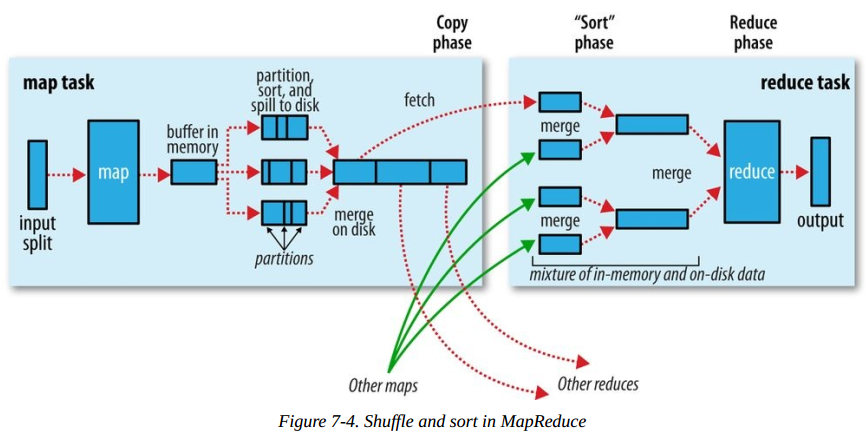
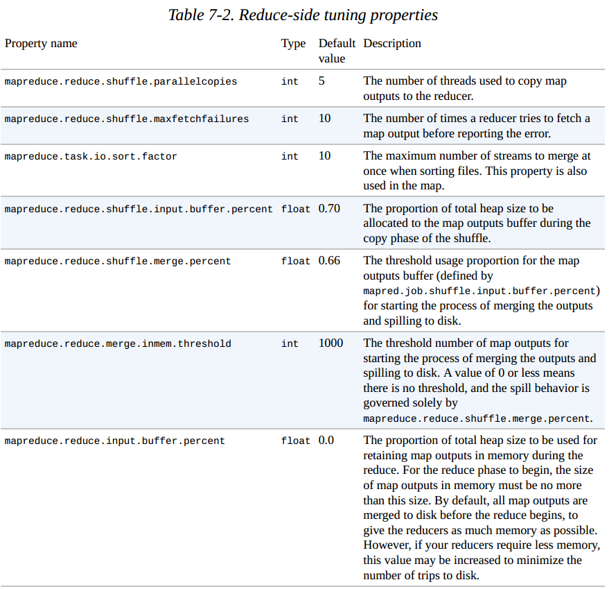
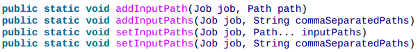

# Hadoop DEMO

## 1 mapreduce 入门

​	 [案例源代码地址](https://github.com/hyn110/hadoop-learn/tree/master/01_hdfs_io)

​	[windows环境运行map-reduce出现的问题](https://blog.csdn.net/darkdragonking/article/details/72636917)

**windows 环境下运行程序需要做的准备:**

1. 解压一个hadoop的二进制文件到本地磁盘,这里我是解压  `hadoop-2.7.2.tar.gz` 到 `C:\00_my_program\hadoop-2.7.2` 目录


2. 配置环境变量 `HADOOP_HOME` , 值为解压的路径 `C:\00_my_program\hadoop-2.7.2` , 并在 `PATH` 中追加 `%HADOOP_HOME%\bin`

3. 下载 https://download.csdn.net/download/fmi110/10329691 文件, 并将解压得到的文件复制到 `%HADOOP_HOME%\bin` 目录下 

   > 否则报错
   >
   >  `java.io.IOException: (null) entry in command string: null chmod 0700 C:\tmp\hadoop-huangyunning\mapred\staging\huangyunning1997364178\.staging`
   >
   > 或
   >
   > ` Exception in thread "main" java.lang.UnsatisfiedLinkError: org.apache.hadoop.io.nativeio.NativeIO$Windows.createDirectoryWithMode0(Ljava/lang/String;I)V`

4. 修改 hdfs 文件系统权限 ,允许任一用户进行读写文件(这里只是为了保证windows下能够运行hadoop程序,并未考虑生产环境下的安全问题!!!)  `hadoop fs -chmod 777 /`    **(如果不是远程访问Linux 的hadoop 这步可以不用)**

   >  否则报错`org.apache.hadoop.ipc.RemoteException(org.apache.hadoop.security.AccessControlException): Permission denied: user=huangyunning, access=WRITE, inode="/output":fmi110:supergroup:drwxr-xr-x`

   依赖:

```xml
<?xml version="1.0" encoding="UTF-8"?>
<project xmlns="http://maven.apache.org/POM/4.0.0"
         xmlns:xsi="http://www.w3.org/2001/XMLSchema-instance"
         xsi:schemaLocation="http://maven.apache.org/POM/4.0.0 http://maven.apache.org/xsd/maven-4.0.0.xsd">
    <modelVersion>4.0.0</modelVersion>

    <groupId>com.fmi110</groupId>
    <artifactId>hadoop</artifactId>
    <version>1.0-SNAPSHOT</version>
    <modules>
        <module>../01_hdfs_mr</module>
        <module>../02_hdfs_filesystem</module>
    </modules>
    <packaging>pom</packaging>

<dependencyManagement>
    <dependencies>

        <dependency>
            <groupId>org.slf4j</groupId>
            <artifactId>slf4j-log4j12</artifactId>
            <version>1.7.24</version>
        </dependency>
        <dependency>
            <groupId>log4j</groupId>
            <artifactId>log4j</artifactId>
            <version>1.2.17</version>
        </dependency>
    </dependencies>
</dependencyManagement>

    <dependencies>

        <dependency>
            <groupId>org.apache.hadoop</groupId>
            <artifactId>hadoop-hdfs</artifactId>
            <version>2.7.3</version>
            <!--<exclusions>-->
                <!--<exclusion>-->
                    <!--<artifactId>netty</artifactId>-->
                    <!--<groupId>io.netty</groupId>-->
                <!--</exclusion>-->
                <!--<exclusion>-->
                    <!--<artifactId>jsr305</artifactId>-->
                    <!--<groupId>com.google.code.findbugs</groupId>-->
                <!--</exclusion>-->
            <!--</exclusions>-->
        </dependency>

        <dependency>
            <groupId>org.apache.hadoop</groupId>
            <artifactId>hadoop-client</artifactId>
            <version>2.7.3</version>
            <!--<exclusions>-->
                <!--<exclusion>-->
                    <!--<artifactId>commons-logging</artifactId>-->
                    <!--<groupId>commons-logging</groupId>-->
                <!--</exclusion>-->
                <!--<exclusion>-->
                    <!--<artifactId>guava</artifactId>-->
                    <!--<groupId>com.google.guava</groupId>-->
                <!--</exclusion>-->
                <!--<exclusion>-->
                    <!--<artifactId>slf4j-api</artifactId>-->
                    <!--<groupId>org.slf4j</groupId>-->
                <!--</exclusion>-->
                <!--<exclusion>-->
                    <!--<artifactId>slf4j-log4j12</artifactId>-->
                    <!--<groupId>org.slf4j</groupId>-->
                <!--</exclusion>-->
                <!--<exclusion>-->
                    <!--<artifactId>jackson-core-asl</artifactId>-->
                    <!--<groupId>org.codehaus.jackson</groupId>-->
                <!--</exclusion>-->
                <!--<exclusion>-->
                    <!--<artifactId>log4j</artifactId>-->
                    <!--<groupId>log4j</groupId>-->
                <!--</exclusion>-->
                <!--<exclusion>-->
                    <!--<artifactId>jackson-mapper-asl</artifactId>-->
                    <!--<groupId>org.codehaus.jackson</groupId>-->
                <!--</exclusion>-->

                <!--<exclusion>-->
                    <!--<artifactId>commons-codec</artifactId>-->
                    <!--<groupId>commons-codec</groupId>-->
                <!--</exclusion>-->
                <!--<exclusion>-->
                    <!--<artifactId>commons-lang</artifactId>-->
                    <!--<groupId>commons-lang</groupId>-->
                <!--</exclusion>-->
            <!--</exclusions>-->
        </dependency>

        <dependency>
            <groupId>junit</groupId>
            <artifactId>junit</artifactId>
            <version>4.12</version>
            <scope>test</scope>
        </dependency>


        <!-- ZK -->
        <dependency>
            <groupId>org.apache.zookeeper</groupId>
            <artifactId>zookeeper</artifactId>
            <version>3.4.9</version>
            <exclusions>
                <exclusion>
                    <groupId>org.slf4j</groupId>
                    <artifactId>slf4j-log4j12</artifactId>
                </exclusion>
            </exclusions>
        </dependency>
        <dependency>
            <groupId>com.101tec</groupId>
            <artifactId>zkclient</artifactId>
            <version>0.2</version>
            <exclusions>
                <exclusion>
                    <artifactId>slf4j-api</artifactId>
                    <groupId>org.slf4j</groupId>
                </exclusion>
                <exclusion>
                    <artifactId>log4j</artifactId>
                    <groupId>log4j</groupId>
                </exclusion>
                <exclusion>
                    <artifactId>slf4j-log4j12</artifactId>
                    <groupId>org.slf4j</groupId>
                </exclusion>
            </exclusions>
        </dependency>

        <!-- https://mvnrepository.com/artifact/org.projectlombok/lombok -->
        <dependency>
            <groupId>org.projectlombok</groupId>
            <artifactId>lombok</artifactId>
            <version>1.16.18</version>
            <scope>provided</scope>
        </dependency>

        <dependency>
            <groupId>org.slf4j</groupId>
            <artifactId>slf4j-log4j12</artifactId>
            <!--<version>1.7.24</version>-->
        </dependency>
        <dependency>
            <groupId>log4j</groupId>
            <artifactId>log4j</artifactId>
            <!--<version>1.2.17</version>-->
        </dependency>

        <dependency>
            <groupId>mysql</groupId>
            <artifactId>mysql-connector-java</artifactId>
            <version>5.1.40</version>
        </dependency>
    </dependencies>

    <build>
        <plugins>
            <plugin>
                <groupId>org.apache.maven.plugins</groupId>
                <artifactId>maven-compiler-plugin</artifactId>
                <version>3.6.2</version>
                <configuration>
                    <!-- 配置使用的 jdk 版本 -->
                    <target>1.8</target>
                    <source>1.8</source>
                    <encoding>UTF-8</encoding>
                    <!--项目中在 lib 目录下放置 jar 时需声明,否则打包时jar丢失-->
                    <compilerArguments>
                        <extdirs>${project.basedir}/src/main/webapp/WEB-INF/lib</extdirs>
                    </compilerArguments>
                </configuration>
            </plugin>

            <plugin>
                <groupId>org.apache.tomcat.maven</groupId>
                <artifactId>tomcat7-maven-plugin</artifactId>
                <version>2.2</version>
                <configuration>
                    <!-- 配置上下文路径和端口号 -->
                    <path>/</path>
                    <port>8083</port>
                </configuration>
            </plugin>

            <plugin>
                <groupId>org.apache.maven.plugins</groupId>
                <artifactId>maven-war-plugin</artifactId>
                <version>2.6</version>
                <configuration>
                    <!-- 配置后项目中没有web.xml文件时,项目不提示错误 -->
                    <failOnMissingWebXml>false</failOnMissingWebXml>
                </configuration>
            </plugin>


        </plugins>
    </build>
</project>
```

​	天气数据如下

```js
0067011990999991950051507004+68750+023550FM-12+038299999V0203301N00671220001CN9999999N9+00001+99999999999
0043011990999991950051512004+68750+023550FM-12+038299999V0203201N00671220001CN9999999N9+00221+99999999999
0043011990999991950051518004+68750+023550FM-12+038299999V0203201N00261220001CN9999999N9-00111+99999999999
0043012650999991949032412004+62300+010750FM-12+048599999V0202701N00461220001CN0500001N9+01111+99999999999
0043012650999991949032418004+62300+010750FM-12+048599999V0202701N00461220001CN0500001N9+00781+99999999999
```

​	数据流 :


```java
import lombok.extern.slf4j.Slf4j;
import org.apache.hadoop.mapreduce.Job;
import org.apache.hadoop.mapreduce.lib.input.FileInputFormat;
import org.apache.hadoop.mapreduce.lib.input.TextInputFormat;
import org.apache.hadoop.mapreduce.lib.output.FileOutputFormat;

import java.io.IOException;

/**
 * @author fmi110
 * @Description:
 * @Date 2018/4/6 11:08
 */
@Slf4j
public class MaxTemperature {

    public static void main(String[] args) throws IOException, ClassNotFoundException, InterruptedException {

        if (args.length < 2) {
            log.error("必须指定输入文件和输出路径...");
            System.exit(-1);
        }
        //1 创建配置文件 conf
        //2 创建 job , 指定输入文件类型
        //3 设置 mapper , 并设置k-v类型
        //4 设置 reducer , 并设置k-v类型
        //5 设置应用的输入
        //6 设置应用的输出
        //7 运行

        Configuration conf = new Configuration();
        // conf.set("fs.defaultFS", "file:///");

        // 删除输出目录,这里只是为了方便程序运行,生产中不能这么干
        FileSystem.get(conf)
                  .delete(new Path(args[1]), true);

        Job job = Job.getInstance(conf);
        job.setInputFormatClass(TextInputFormat.class);
        job.setJobName("maxTemperature Job");
        job.setJarByClass(MaxTemperature.class);

        job.setMapperClass(MaxTemperatureMapper.class);
        job.setMapOutputKeyClass(Text.class);
        job.setMapOutputValueClass(IntWritable.class);

        job.setReducerClass(MaxTemperatureReducer.class);
        job.setOutputKeyClass(Text.class);
        job.setOutputValueClass(IntWritable.class);

        FileInputFormat.addInputPath(job, new Path(args[0]));
        FileOutputFormat.setOutputPath(job, new Path(args[1]));

        System.exit(job.waitForCompletion(true) ? 0 : -1);
    }
}

```
> 由于泛型擦除的原因,所以job需要显示的设置类型  `job.setXXXclass(...)`

```java
package com.fmi110.mapper;

import lombok.extern.slf4j.Slf4j;
import org.apache.hadoop.io.IntWritable;
import org.apache.hadoop.io.LongWritable;
import org.apache.hadoop.io.Text;
import org.apache.hadoop.mapreduce.Mapper;

import java.io.IOException;

/**
 * @author fmi110
 * @Description: 输入的行数据包含了年份和天气信息, 通过map提取出来
 * @Date 2018/4/6 11:13
 */
@Slf4j
public class MaxTemperatureMapper
        extends Mapper<LongWritable, Text, Text, IntWritable> {

    @Override
    protected void map(LongWritable key, Text value, Context context) throws IOException, InterruptedException {
        log.info("----------------- map ---------------");

        long   keyL = key.get();
        String line = value.toString();
        String year = line.substring(15, 19);
        log.info("输入 key = {},year = {}", keyL, year);

        int airTemperature;
        if (line.charAt(87) == '+') { // parseInt doesn't like leading plus signs
            airTemperature = Integer.parseInt(line.substring(88, 92));
        } else {
            airTemperature = Integer.parseInt(line.substring(87, 92));
        }
        String quality = line.substring(92, 93);
        if (quality.matches("[01459]")) {
            context.write(new Text(year), new IntWritable(airTemperature));
        }
    }
}
```

```java
package com.fmi110.reducer;

import lombok.extern.slf4j.Slf4j;
import org.apache.hadoop.io.IntWritable;
import org.apache.hadoop.io.Text;
import org.apache.hadoop.mapreduce.Reducer;

import java.io.IOException;

/**
 * @author fmi110
 * @Description: 获取最大的天气值
 * @Date 2018/4/6 11:39
 */
@Slf4j
public class MaxTemperatureReducer extends Reducer<Text, IntWritable, Text, IntWritable> {
    @Override
    protected void reduce(Text key, Iterable<IntWritable> values, Context context)
            throws IOException, InterruptedException {
        log.info("-------------- reduce ------------");
        log.info("key = {}",key.toString());

        int maxValue = Integer.MIN_VALUE;

        for (IntWritable v : values) {
            log.info("max = {},v = {}",maxValue,v.get());
            maxValue = Math.max(maxValue, v.get());
        }
        // 输出最后的结果
        context.write(key,new IntWritable(maxValue));
    }
}
```


​	输出文件结果如下:

```
1949	111
1950	22
```

## 2 文件系统的基础操作

### 1 shell命令

1. 本地文件复制到hdfs

```sh
hadoop fs -copyFromLocal input/test.txt hdfs://localhost:8020/user/fmi110/test.txt
或
hadoop fs -copyFromLocal input/test.txt /user/fmi110/test.txt
```

2. 从hdfs复制文件到本地

```sh
hadoop fs -copyToLocal /user/fmi110/test.txt test.copy.txt
md5sum /user/fmi110/test.txt test.copy.txt         # 查看两个文件的md5值,确认文件内容一致
```

3. 在hdfs新建目录并查看当前目录内容

```sh
hadoop fs -mkdir -p /user/fmi110
hadoop fs -ls .
```

4. 列出本地文件系统下的文件

```sh
hadoop fs -ls file:///
```

> 相当于是查看linux文件系统

### 2 api

#### 1 通过URLStreamHandler实例以标准输出方式显示hdfs上的文件

```java
import org.apache.hadoop.fs.FsUrlStreamHandlerFactory;
import org.apache.hadoop.io.IOUtils;

import java.io.InputStream;
import java.net.URL;

/**
 * @author fmi110
 * @Date 2018/4/6 20:02
 */
public class URLCat {
    static {
        // 必须设置,否则URL无法识别 hdfs 协议!!!每个jvm只能调用一次该方法,
        // 所以这个方式读取文件有局限!!!
        URL.setURLStreamHandlerFactory(new FsUrlStreamHandlerFactory());
    }
    public static void main(String[] args) throws Exception {
        InputStream in = null;
      try{
          // 连接linux服务器时
          // in = new URL("hdfs://m01:8020/user/fmi110/1.txt").openStream();
          
          // 读取windows本地文件时  args[0] = "file://C:/input/sample.txt"
          in = new URL(args[0]).openStream();
          IOUtils.copyBytes(in,System.out,1024*4,false);
      }finally {
        IOUtils.closeStream(in);
      }
    }
}

```


​	linux下运行打包出来的 jar 文件指令:

```sh
hadoop jar jar文件路径  类名  main方法参数...
```

#### 2 通过 FileSystem 对象读取 hdfs 文件

```java
import org.apache.hadoop.conf.Configuration;
import org.apache.hadoop.fs.FileSystem;
import org.apache.hadoop.fs.Path;
import org.apache.hadoop.io.IOUtils;

import java.io.IOException;
import java.io.InputStream;
import java.net.URI;

/**
 * @author fmi110
 * @Description:
 * @Date 2018/4/6 21:04
 */
public class FileSystemCat {
    public static void main(String[] args) throws IOException {
        String uri = args[0]; // hdfs://m01:8020/user/fmi110/1.txt
        Configuration conf = new Configuration();
        FileSystem fs = FileSystem.get(URI.create(uri), conf);
        InputStream in = null;
        try {
            in = fs.open(new Path(uri));
            IOUtils.copyBytes(in,System.out,1024*4,false);
        }finally {
            IOUtils.closeStream(in);
        }
    }
}
```


#### 3 通过 FileDataOutputStream 写入文件到 hdfs

```java
import org.apache.hadoop.conf.Configuration;
import org.apache.hadoop.fs.FSDataOutputStream;
import org.apache.hadoop.fs.FileSystem;
import org.apache.hadoop.fs.Path;
import org.apache.hadoop.io.IOUtils;
import org.apache.hadoop.util.Progressable;

/**
 * 写入文件,并带进度提示
 * @author fmi110
 * @Date 2018/4/6 21:23
 */
public class FileCopyWithProgress {
    public static void main(String[] args) throws IOException, InterruptedException {
        String localFile = args[0]; // C:/a.md 
        String dst = args[1]; // hdfs://m01:8020/user/fmi110/a.md

        InputStream in = new BufferedInputStream(new FileInputStream(localFile));
        FileSystem  fs = FileSystem.get(URI.create(dst), new Configuration(),"fmi110");
        // fs.create() 会自动创建父级目录!!!
        FSDataOutputStream out = fs.create(new Path(dst), new Progressable() {
            @Override
            public void progress() {
                System.out.print(".");
            }
        });
        IOUtils.copyBytes(in,out,4096,true);
    }
}
```


#### 4 FileStatus 获取文件元信息和文件路径信息

```java
import org.apache.hadoop.conf.Configuration;
import org.apache.hadoop.fs.FileStatus;
import org.apache.hadoop.fs.FileSystem;
import org.apache.hadoop.fs.FileUtil;
import org.apache.hadoop.fs.Path;

import java.io.IOException;
import java.net.URI;
import java.util.Arrays;

/**
 * 获取文件元信息和路径信息
 * @author fmi110
 * @Date 2018/4/6 21:43
 */
public class FileStatusDemo {
    public static void main(String[] args) throws IOException {
        // args = {"hdfs://m01:8020/user", "hdfs://m01:8020/user/fmi110"}
        String uri = args[0];
        FileSystem fs = FileSystem.get(URI.create(uri),new Configuration());

        Path[] paths = new Path[args.length];
        for(int i=0;i<paths.length;i++) {
            paths[i] = new Path(args[i]);
        }
        // 获取一组路径的 fileStauts
        FileStatus[] status = fs.listStatus(paths);
        // FileUtil 将元信息转换为路径信息
        Path[] filePaths = FileUtil.stat2Paths(status);
        Arrays.stream(filePaths).forEach(System.out::println);
    }
}
```

> 获取文件路径信息的关键是 FileUtil


#### 5 PathFilter 文件模式(多文件匹配)

​	FileSystem 提供了通配 (globbing) 方式 , 通过一个表达式来匹配多个文件 . hadoop 为执行通配提供了两个 FileSystem 方法 :

```java
public FileStatus[] globStatus(Path pathPattern);
public FileStatus[] globStatus(Path pathPattern,PathFilter filter);

fs.globStatus(new Path(BASE_PATH + pattern), pathFilter)
```


​	根据文件名,截取日期,筛选指定日期范围的文件. 通常在处理日志文件时会用到

```java
import java.text.DateFormat;
import java.text.ParseException;
import java.text.SimpleDateFormat;

import org.apache.hadoop.fs.Path;
import org.apache.hadoop.fs.PathFilter;

public class DateRangePathFilter implements PathFilter {
  
  private final Pattern PATTERN = Pattern.compile("^.*/(\\d\\d\\d\\d/\\d\\d/\\d\\d).*$");
  
  private final Date start, end;

  public DateRangePathFilter(Date start, Date end) {
    this.start = new Date(start.getTime());
    this.end = new Date(end.getTime());
  }
  
  public boolean accept(Path path) {
    Matcher matcher = PATTERN.matcher(path.toString());
    if (matcher.matches()) {
      DateFormat format = new SimpleDateFormat("yyyy/MM/dd");
      try {
        return inInterval(format.parse(matcher.group(1)));
      } catch (ParseException e) {
        return false;
      }
    }
    return false;
  }

  private boolean inInterval(Date date) {
    return !date.before(start) && !date.after(end);
  }
}
```

​	正则表达式 , 包含文件

```java
import org.apache.hadoop.fs.Path;
import org.apache.hadoop.fs.PathFilter;

public class RegexPathFilter implements PathFilter {
  
  private final String regex;
  private final boolean include;

  public RegexPathFilter(String regex) {
    this(regex, true);
  }
  
  public RegexPathFilter(String regex, boolean include) {
    this.regex = regex;
    this.include = include;
  }

  public boolean accept(Path path) {
    return (path.toString().matches(regex)) ? include : !include;
  }
}
```

​	正则表达式排除文件

```java
// cc RegexExcludePathFilter A PathFilter for excluding paths that match a regular expression
import org.apache.hadoop.fs.Path;
import org.apache.hadoop.fs.PathFilter;

public class RegexExcludePathFilter implements PathFilter {
  
  private final String regex;

  public RegexExcludePathFilter(String regex) {
    this.regex = regex;
  }

  public boolean accept(Path path) {
    return !path.toString().matches(regex);
  }
}
```


```java
import static org.hamcrest.CoreMatchers.*;
import static org.junit.Assert.*;

import java.io.IOException;
import java.text.ParseException;
import java.text.SimpleDateFormat;
import java.util.*;

import org.apache.hadoop.conf.Configuration;
import org.apache.hadoop.fs.FileSystem;
import org.apache.hadoop.fs.FileUtil;
import org.apache.hadoop.fs.Path;
import org.apache.hadoop.fs.PathFilter;
import org.junit.*;

public class FileSystemGlobTest {
  
  private static final String BASE_PATH = "/tmp/" +
    FileSystemGlobTest.class.getSimpleName();
  
  private FileSystem fs;
  
  @Before
  public void setUp() throws Exception {
    fs = FileSystem.get(new Configuration());
    fs.mkdirs(new Path(BASE_PATH, "2007/12/30"));
    fs.mkdirs(new Path(BASE_PATH, "2007/12/31"));
    fs.mkdirs(new Path(BASE_PATH, "2008/01/01"));
    fs.mkdirs(new Path(BASE_PATH, "2008/01/02"));
  }
  
  @After
  public void tearDown() throws Exception {
    fs.delete(new Path(BASE_PATH), true);
  }
  
  @Test
  public void glob() throws Exception {
    assertThat(glob("/*"), is(paths("/2007", "/2008")));
    assertThat(glob("/*/*"), is(paths("/2007/12", "/2008/01")));
    assertThat(glob("/*/12/*"), is(paths("/2007/12/30", "/2007/12/31")));
    assertThat(glob("/200?"), is(paths("/2007", "/2008")));
    assertThat(glob("/200[78]"), is(paths("/2007", "/2008")));
    assertThat(glob("/200[7-8]"), is(paths("/2007", "/2008")));
    assertThat(glob("/200[^01234569]"), is(paths("/2007", "/2008")));

    assertThat(glob("/*/*/{31,01}"), is(paths("/2007/12/31", "/2008/01/01")));
    assertThat(glob("/*/*/3{0,1}"), is(paths("/2007/12/30", "/2007/12/31")));

    assertThat(glob("/*/{12/31,01/01}"), is(paths("/2007/12/31", "/2008/01/01")));
  }
  
  @Test
  public void regexIncludes() throws Exception {
    assertThat(glob("/*", new RegexPathFilter("^.*/2007$")), is(paths("/2007")));
    assertThat(glob("/*/*/*", new RegexPathFilter("^.*/2007/12/31$")), is(paths("/2007/12/31")));
    assertThat(glob("/*/*/*", new RegexPathFilter("^.*/2007(/12(/31)?)?$")), is(paths("/2007/12/31")));
  }
  
  @Test
  public void regexExcludes() throws Exception {
    assertThat(glob("/*", new RegexPathFilter("^.*/2007$", false)), is(paths("/2008")));
    assertThat(glob("/2007/*/*", new RegexPathFilter("^.*/2007/12/31$", false)), is(paths("/2007/12/30")));
  }
  
  @Test
  public void regexExcludesWithRegexExcludePathFilter() throws Exception {
    assertThat(glob("/*", new RegexExcludePathFilter("^.*/2007$")), is(paths("/2008")));
    assertThat(glob("/2007/*/*", new RegexExcludePathFilter("^.*/2007/12/31$")), is(paths("/2007/12/30")));
  }

  @Test
  public void testDateRange() throws Exception {
    DateRangePathFilter filter = new DateRangePathFilter(date("2007/12/31"),
        date("2008/01/01"));
    assertThat(glob("/*/*/*", filter), is(paths("/2007/12/31", "/2008/01/01")));  
  } 
  
  private Set<Path> glob(String pattern) throws IOException {
    return new HashSet<Path>(Arrays.asList(
        FileUtil.stat2Paths(fs.globStatus(new Path(BASE_PATH + pattern)))));
  }
  
  private Set<Path> glob(String pattern, PathFilter pathFilter) throws IOException {
    return new HashSet<Path>(Arrays.asList(
        FileUtil.stat2Paths(fs.globStatus(new Path(BASE_PATH + pattern), pathFilter))));
  }
  
  private Set<Path> paths(String... pathStrings) {
    Path[] paths = new Path[pathStrings.length];
    for (int i = 0; i < paths.length; i++) {
      paths[i] = new Path("file:" + BASE_PATH + pathStrings[i]);
    }
    return new HashSet<Path>(Arrays.asList(paths));
  }
  
  private Date date(String date) throws ParseException {
    return new SimpleDateFormat("yyyy/MM/dd").parse(date);
  }
}
```

#### 6 删除文件

```java
public boolean delete(Path path,boolean recursive)
```

> recursive = true 时 非空目录才会被删除,否则抛异常

```java
FileSystem.get(conf)
                  .delete(new Path(args[1]), true);
```

#### 7 文件系统一致模型(coherency model)

```java
import org.apache.hadoop.conf.Configuration;
import org.apache.hadoop.fs.FSDataOutputStream;
import org.apache.hadoop.fs.FileSystem;
import org.apache.hadoop.fs.Path;
import org.apache.hadoop.hdfs.MiniDFSCluster;

import static org.hamcrest.CoreMatchers.is;
import static org.junit.Assert.assertThat;

public class CoherencyModelTest {
    private MiniDFSCluster cluster; // use an in-process HDFS cluster for testing
    private FileSystem     fs;

    @Before
    public void setUp() throws IOException {
        Configuration conf = new Configuration();
        if (System.getProperty("test.build.data") == null) {
            System.setProperty("test.build.data", "/tmp");
        }
        cluster = new MiniDFSCluster.Builder(conf).build();
        fs = cluster.getFileSystem();
    }

    @After
    public void tearDown() throws IOException {
        fs.close();
        cluster.shutdown();
    }

    /**
     * 文件create后在 namenode 节点立即可见
     */
    @Test
    public void fileExistsImmediatelyAfterCreation() throws IOException {
        Path p = new Path("p");
        fs.create(p);
        assertThat(fs.exists(p), is(true));
        assertThat(fs.delete(p, true), is(true));
    }

    /**
     * 文件内容即使调用了 flush 也不能保证立即可见(当前正在写入的块对其他 reader 不可见)
     */
    @Test
    public void fileContentIsNotVisibleAfterFlush() throws IOException {
        Path         p   = new Path("p");
        OutputStream out = fs.create(p);
        out.write("content".getBytes("UTF-8"));
        out.flush();

        assertThat(fs.getFileStatus(p)
                     .getLen(), is(0L)); // flush后文件内容长度仍为0

        out.close();
        assertThat(fs.delete(p, true), is(true));
    }

    /**
     * 调用 hflush() 方法强行同步所有缓存和数据节点 , 这样能保证写入的文件均到达所有
     * datanode 的写入管道并且对所有新的 reader 可见 . 这种方法有许多额外的开销,所以
     * 应用中需要权衡好鲁棒性和吞吐量 , 确定合适的调用频率
     */
    @Test
    public void fileContentIsVisibleAfterHFlush() throws IOException {
        Path               p   = new Path("p");
        FSDataOutputStream out = fs.create(p);
        out.write("content".getBytes("UTF-8"));
        out.hflush();

        assertThat(fs.getFileStatus(p)
                     .getLen(), is(((long) "content".length())));
//                     .getLen(), is(0L));

        out.close();
        assertThat(fs.delete(p, true), is(true));
    }

    /**
     * 调用 hsync() 强行同步
     */
    @Test
    public void fileContentIsVisibleAfterHSync() throws IOException {
        Path               p   = new Path("p");
        FSDataOutputStream out = fs.create(p);
        out.write("content".getBytes("UTF-8"));
        out.hsync(); // 强行同步

        assertThat(fs.getFileStatus(p)
                     .getLen(), is(((long) "content".length())));
        out.close();
        assertThat(fs.delete(p, true), is(true));
    }

    /**
     * 调用 sync() 方法进行同步, 该api据说要被遗弃???
     */
    @Test
    public void localFileContentIsVisibleAfterFlushAndSync() throws IOException {
        File localFile = File.createTempFile("tmp", "");
        assertThat(localFile.exists(), is(true));

        FileOutputStream out = new FileOutputStream(localFile);
        out.write("content".getBytes("UTF-8"));
        out.flush(); // flush to operating system
        out.getFD()
           .sync(); // sync to disk
        assertThat(localFile.length(), is(((long) "content".length())));

        out.close();
        assertThat(localFile.delete(), is(true));
    }

    @Test
    public void fileContentIsVisibleAfterClose() throws IOException {
        Path         p   = new Path("p");
        OutputStream out = fs.create(p);
        out.write("content".getBytes("UTF-8"));

        out.close();
        assertThat(fs.getFileStatus(p)
                     .getLen(), is(((long) "content".length())));

        assertThat(fs.delete(p, true), is(true));
    }

}
```

## 3 Hadoop 的IO操作

### 1 数据完整性

1. hdfs 客户端在写入或读取文件时,都会计算(写入)和验证(读取时)校验和(CRC-32校验) . 默认情况下检验单位是 512 字节,生成的校验和为 4 个字节,所以存储校验和的开销小于 1% , 是可以接受的

   > `io.bytes.per.checksum`   指定的校验数据块的大小

2. 每个 datanode 节点会在后台运行一个 DataBlockScanner , 定期验证存储在当前节点的数据块 , 并尝试处理损坏的数据块(通过数据副本复制新的块,然后删除损坏的块,保证数据副本因子(replication factor)在期望水平)

### 2 压缩

​	压缩的好处:

	1. 减少存储文件所需要的磁盘空间
	2. 加速数据在网络和磁盘上的传输


> 压缩工具都提供了 9 个不同的选项  , 例如 : `gzip -1 file`
>
> `1 --> 速度最优`
>
> `9 --> 体积最优`

​	Codec 实现了压缩-解压缩算法 , Hadoop 实现的 codec 例举如下 :

| 压缩格式 | HadoopCompressionCodec                     | 是否可切分 |
| -------- | ------------------------------------------ | ---------- |
| DEFLATE  | org.apache.hadoop.io.compress.DefaultCodec |            |
| gzip     | org.apache.hadoop.io.compress.GzipCodec    |            |
| bzip2    | org.apache.hadoop.io.compress.BZip2Codec   | 是         |
| LZO      | com.hadoop.compression.lzo.LzopCodec       |            |
| LZ4      | org.apache.hadoop.io.compress.Lz4Codec     |            |
| Snappy   | org.apache.hadoop.io.compress.SnappyCodec  |            |

​	使用方式 : 使用 codec对象对输入/输出流进行包裹即可:

```java
InputStream in   = codec.createInputStream(fs.open(inPath));   // 创建一个带压缩算法的输入流
OutputStream out = codec.createOutputStream(System.out);	   // 带压缩算法的输出流	
```

1. 1. 根据文件拓展名推断 CompressionCodec 并解压文件

```java
import lombok.extern.slf4j.Slf4j;
import org.apache.hadoop.conf.Configuration;
import org.apache.hadoop.fs.FileSystem;
import org.apache.hadoop.fs.Path;
import org.apache.hadoop.io.IOUtils;
import org.apache.hadoop.io.compress.CompressionCodec;
import org.apache.hadoop.io.compress.CompressionCodecFactory;

import java.io.IOException;
import java.io.InputStream;
import java.net.URI;

/**
 * 根据输入文件名的拓展名推断codec 并解压文件,输出到控制台
 *
 * @author fmi110
 * @Date 2018/4/8 20:52
 */
@Slf4j
public class FileDecompressor {
    public static void main(String[] args) throws IOException {
        String        uri  = args[0];
        Configuration conf = new Configuration();
        FileSystem    fs   = FileSystem.get(URI.create(uri), conf);

        Path                    inputPath = new Path(uri);
        CompressionCodecFactory factory   = new CompressionCodecFactory(conf);
        CompressionCodec        codec     = factory.getCodec(inputPath);

        if (null == codec) {
            log.error("输入的文件后缀名有错...path = {}", uri);
            System.exit(-1);
        }

        // 获取输出文件名
        String outputUri = CompressionCodecFactory.removeSuffix(uri, codec.getDefaultExtension());

        InputStream  in  = null;
//        OutputStream out = null;
        try {
            in = codec.createInputStream(fs.open(inputPath));
//            out = fs.create(new Path(outputUri));
            IOUtils.copyBytes(in,System.out,4096,false);
        }finally {
            IOUtils.closeStream(in);
//            IOUtils.closeStream(out);
        }
    }
}
```

> 核心 api :
>
> `InputStream in = FileSystem.get(URI.create(uri),conf).open(new Path(uri));`
>
> `CompressionCodec = new CompressionCodecFactory(conf).getCodec(new Path(uri));`

2. 对查找气温作业所产生的输出进行压缩

```java
import com.fmi110.mapper.MaxTemperatureMapper;
import com.fmi110.reducer.MaxTemperatureReducer;
import lombok.extern.slf4j.Slf4j;
import org.apache.hadoop.conf.Configuration;
import org.apache.hadoop.fs.Path;
import org.apache.hadoop.io.IntWritable;
import org.apache.hadoop.io.Text;
import org.apache.hadoop.io.compress.GzipCodec;
import org.apache.hadoop.mapreduce.Job;
import org.apache.hadoop.mapreduce.lib.input.FileInputFormat;
import org.apache.hadoop.mapreduce.lib.output.FileOutputFormat;


/**
 * @author fmi110
 * @Date 2018/4/8 21:31
 */
@Slf4j
public class MaxTemperatureWithCompression {
    public static void main(String[] args) throws Exception {
        if (args.length < 2) {
            log.error("输出参数少于2...");
            System.exit(-1);
        }

        Configuration conf = new Configuration() ;
        Job           job = Job.getInstance(conf);
        job.setJarByClass(MaxTemperatureWithCompression.class);

        FileInputFormat.addInputPath(job,new Path(args[0]));
        FileOutputFormat.setOutputPath(job,new Path(args[1]));

        // 设置输出使用的压缩算法
        FileOutputFormat.setOutputCompressorClass(job, GzipCodec.class);

        job.setMapperClass(MaxTemperatureMapper.class);
        job.setMapOutputKeyClass(Text.class);
        job.setMapOutputValueClass(IntWritable.class);

        job.setReducerClass(MaxTemperatureReducer.class);
        job.setCombinerClass(MaxTemperatureReducer.class);

        System.exit(job.waitForCompletion(true)?0:1);
    }
}
```

> `FileOutputFormat.setOutputCompressor(job,XXXCodec.class);`


### 3 java数据类型的 writable 类


```java
public class WritableTestBase {
  
  // 序列化一个 Writable 对象 --> byte[]
  public static byte[] serialize(Writable writable) throws IOException {
    ByteArrayOutputStream out = new ByteArrayOutputStream();
    DataOutputStream dataOut = new DataOutputStream(out);
    writable.write(dataOut);
    dataOut.close();
    return out.toByteArray();
  }
  // ^^ WritableTestBase
  
  // 反序列化 byte[] --> Writable 对象 
  public static byte[] deserialize(Writable writable, byte[] bytes)
      throws IOException {
    ByteArrayInputStream in = new ByteArrayInputStream(bytes);
    DataInputStream dataIn = new DataInputStream(in);
    writable.readFields(dataIn);
    dataIn.close();
    return bytes;
  }

  // Writable --> byte[] --> String
  public static String serializeToString(Writable src) throws IOException {
    return StringUtils.byteToHexString(serialize(src));
  }
  // dest对象 (序列化)--> byte[] (反序列化)--> src 对象
  public static String writeTo(Writable src, Writable dest) throws IOException {
    byte[] data = deserialize(dest, serialize(src));
    return StringUtils.byteToHexString(data);
  }

}
```


#### 1 ArrayWritable

```java
    ArrayWritable writable = new ArrayWritable(Text.class);
    
    writable.set(new Text[] { new Text("cat"), new Text("dog") });
    
    TextArrayWritable dest = new TextArrayWritable();
    WritableUtils.cloneInto(dest, writable);

    assertThat(dest.get().length, is(2));
    // TODO: fix cast, also use single assert
    assertThat((Text) dest.get()[0], is(new Text("cat")));
    assertThat((Text) dest.get()[1], is(new Text("dog")));
    
    Text[] copy = (Text[]) dest.toArray();
    assertThat(copy[0], is(new Text("cat")));
    assertThat(copy[1], is(new Text("dog")));
```

#### 2 BooleanWritable

```java
    BooleanWritable src = new BooleanWritable(true);
    BooleanWritable dest = new BooleanWritable();

    assertThat(writeTo(src, dest), is("01"));
    assertThat(dest.get(), is(src.get()));
```

#### 3 MapWritable

```java
// == MapWritableTest
import static org.hamcrest.CoreMatchers.is;
import static org.junit.Assert.assertThat;

import java.io.IOException;
import org.apache.hadoop.io.*;
import org.junit.Test;

public class MapWritableTest extends WritableTestBase {
  
  @Test
  public void mapWritable() throws IOException {
    // vv MapWritableTest
    MapWritable src = new MapWritable();
    src.put(new IntWritable(1), new Text("cat"));
    src.put(new VIntWritable(2), new LongWritable(163));
    
    MapWritable dest = new MapWritable();
    WritableUtils.cloneInto(dest, src);
    assertThat((Text) dest.get(new IntWritable(1)), is(new Text("cat")));
    assertThat((LongWritable) dest.get(new VIntWritable(2)),
        is(new LongWritable(163)));
    // ^^ MapWritableTest
  }

  @Test
  public void setWritableEmulation() throws IOException {
    MapWritable src = new MapWritable();
    src.put(new IntWritable(1), NullWritable.get());
    src.put(new IntWritable(2), NullWritable.get());
    
    MapWritable dest = new MapWritable();
    WritableUtils.cloneInto(dest, src);
    assertThat(dest.containsKey(new IntWritable(1)), is(true));
  }
}
```

### 4 基于文件的数据结构(二进制文件)

​	对于基于mapreduce 的数据处理 , 将每个二进制数据大对象(blob)单独放在各自的文件中不能实现可拓展性 , 所以 Hadoop 为次开发了很多更高层次的容器 , 比如 SequenceFile  , MapFile 等


#### 1 SequenceFile

​	SequenceFile(顺序文件)是以键值形式存储数据的 , 可以作为小文件的容器 .

```
hadoop fd -text 顺序文件

hadoop fs -text sorted/part-00000 | head
```

> 该命令能以文本的形式显示顺序文件, 如果顺序文件包含自定义的 键或值的类,需要保证这些类位于 Hadoop 类路径下	

1. 写操作

   > `SequenceFile.Writer writer = SequenceFile.createWriter();`
   >
   > `writer.appen(key,value);`

```java
import org.apache.hadoop.conf.Configuration;
import org.apache.hadoop.fs.FileSystem;
import org.apache.hadoop.fs.Path;
import org.apache.hadoop.io.IOUtils;
import org.apache.hadoop.io.IntWritable;
import org.apache.hadoop.io.SequenceFile;
import org.apache.hadoop.io.Text;

import java.io.IOException;
import java.net.URI;


/**
 * 顺序文件的写操作
 *
 * @author fmi110
 * @Date 2018/4/8 22:28
 */
public class SequenceFileWriterDemo {
    public static final String[] DATA = {
            "窗前明月光",
            "疑是地上霜",
            "举头望明月",
            "低头思故乡"
    };

    public static void main(String[] args) throws IOException {
        String outPath = "00TT/squencefile.seq";

        Configuration conf = new Configuration();
        FileSystem    fs   = FileSystem.get(URI.create(outPath), conf);
        Path          path = new Path(outPath);

        IntWritable key   = new IntWritable(); // 顺序文件的key
        Text        value = new Text();        // 顺序文件的value

        SequenceFile.Writer writer = null;
        try {
            writer = SequenceFile.createWriter(fs, conf, path, key.getClass(), value.getClass());
            for (int i = 0; i < 100; i++) {
                key.set(i);
                value.set(DATA[i % DATA.length]);
                System.out.printf("[%s]\t%s\t%s\n", writer.getLength(), key.get(), value.toString());

                writer.append(key, value); // 内容写入顺序文件
            }
        } finally {
            IOUtils.closeStream(writer);
        }

    }
}
```

2. 读操作

   > SequenceFile.Reader.next() 进行迭代 , 非空时循环

```java
import org.apache.hadoop.conf.Configuration;
import org.apache.hadoop.fs.FileSystem;
import org.apache.hadoop.fs.Path;
import org.apache.hadoop.io.IOUtils;
import org.apache.hadoop.io.SequenceFile;
import org.apache.hadoop.io.Writable;
import org.apache.hadoop.util.ReflectionUtils;

import java.io.IOException;
import java.net.URI;


/**
 * 顺序文件的读操作
 *
 * @author fmi110
 * @Date 2018/4/8 22:28
 */
public class SequenceFileReaderDemo {


    public static void main(String[] args) throws IOException {
        String inPath = "00TT/squencefile.seq";

        Configuration conf = new Configuration();
        FileSystem    fs   = FileSystem.get(URI.create(inPath), conf);
        Path          path = new Path(inPath);

        SequenceFile.Reader reader = null;
        try {
            reader = new SequenceFile.Reader(fs, path, conf);
            Writable key   = (Writable) ReflectionUtils.newInstance(reader.getKeyClass(), conf);
            Writable value = (Writable) ReflectionUtils.newInstance(reader.getValueClass(), conf);

            long position = reader.getPosition();
            while (reader.next(key, value)) {
                String syncSeen = reader.syncSeen() ? "*" : ""; // 是否是同步点

                System.out.printf("[%s%s]\t%s\t%s\n", position, syncSeen, key, value);
                
                position = reader.getPosition(); // 获取下一次起始的位置
            }
        } finally {
            IOUtils.closeStream(reader);
        }

    }
}
```

​	输出如下:

```properties
[1793]	45	疑是地上霜
[1830]	46	举头望明月
[1867]	47	低头思故乡
[1904]	48	窗前明月光
[1941]	49	疑是地上霜
[1978]	50	举头望明月
[2015*]	51	低头思故乡
[2072]	52	窗前明月光
[2109]	53	疑是地上霜
[2146]	54	举头望明月
[2183]	55	低头思故乡
```

> 可以看到 2015 处是一个同步点
>
> 同步点 : 指数据读取迷路(lost)后能够再一次与记录边界同步的数据流的某个位置 , 同步点由SequenceFile.Writer 记录 , 其在顺序文件写入过程中插入一个特殊项以便每隔几个记录便有一个同步标识.这样的特殊项存储开销很小,不到1%

​	在文件中查找记录边界的方法

```
SequenceFile.Reader.sync(long position);
```

> 该方法将读取位置定位到下一个同步点 , 如果 position 之后没有同步点 , 则读取位置将指向文件末尾

​	手动插入同步点的方法

```
SequenceFile.Writer.sync();
```

> 在当前位置插入同步点

#### 2 MapFile

​	MapFile 是已经经过排序的 SequenceFile , 它有索引 , 所以可以按键查找.

```java
public class MapFileWriteDemo {
  
  private static final String[] DATA = {
    "One, two, buckle my shoe",
    "Three, four, shut the door",
    "Five, six, pick up sticks",
    "Seven, eight, lay them straight",
    "Nine, ten, a big fat hen"
  };
  
  public static void main(String[] args) throws IOException {
    String uri = args[0];
    Configuration conf = new Configuration();
    FileSystem fs = FileSystem.get(URI.create(uri), conf);

    IntWritable key = new IntWritable();
    Text value = new Text();
    MapFile.Writer writer = null;
    try {
      writer = new MapFile.Writer(conf, fs, uri,
          key.getClass(), value.getClass());
      
      for (int i = 0; i < 1024; i++) {
        key.set(i + 1);
        value.set(DATA[i % DATA.length]);
        writer.append(key, value);
      }
    } finally {
      IOUtils.closeStream(writer);
    }
  }
}
```

## 4 MapReduce 应用开发

### 1 用于配置的API

​	Configuration 类用于加载配置文件 , 多个配置文件的合并如下:

```java
Configration conf = new Configuration();
conf.addResource("configuration-1.xml");
conf.addResource("configuration-2.xml");
```

​	如果配置文件中声明了相同的配置项,则后添加的生效!!!

### 2 MRUnit 测试

​	MRUnit 与 junit 一起使用 , 可以在正常的开发环境中运行 MapReduce 作业的测试 ,非常方便

```xml
        <dependency>
            <groupId>org.apache.mrunit</groupId>
            <artifactId>mrunit</artifactId>
            <classifier>hadoop2</classifier>
            <version>1.1.0</version>
            <scope>test</scope>
        </dependency>
```

#### 1 Mapper 测试

```java
import com.fmi110.mapper.MaxTemperatureMapper;
import org.apache.hadoop.io.IntWritable;
import org.apache.hadoop.io.LongWritable;
import org.apache.hadoop.io.Text;
import org.apache.hadoop.mrunit.mapreduce.MapDriver;
import org.junit.Test;

import java.io.IOException;


/**
 * MRUnit 的 mapper 测试
 * @author fmi110
 * @Date 2018/4/10 22:45
 */
public class MapperTest {
    @Test
    public void testMapper() throws IOException {
        Text value = new Text("0043012650999991949032418004+62300+010750FM-12+048599999V0202701N00461220001CN0500001N9+00781+99999999999") ;
        new MapDriver<LongWritable,Text,Text,IntWritable>()
                .withMapper(new MaxTemperatureMapper())
                .withInput(new LongWritable(0),value)
                .withOutput(new Text("1949"),new IntWritable(78))
                .runTest();
    }
}
```

> MaxTemperatureMapper 是第一章的类

#### 2 Reducer 测试

```java
import com.fmi110.reducer.MaxTemperatureReducer;
import org.apache.hadoop.io.IntWritable;
import org.apache.hadoop.io.Text;
import org.apache.hadoop.mrunit.mapreduce.ReduceDriver;
import org.junit.Test;

import java.io.IOException;
import java.util.Arrays;

/**
 * @author fmi110
 * @Date 2018/4/14 9:13
 */
public class ReducerTest {
    @Test
    public void testReducer() throws IOException {
        new ReduceDriver<Text, IntWritable,Text,IntWritable>()
                .withReducer(new MaxTemperatureReducer())
                .withInput(new Text("1988"), 
                           Arrays.asList(new IntWritable(10),new IntWritable(5)))
                .withOutput(new Text("1988"),new IntWritable(10))
                .runTest();
    }
}
```

### 3 辅助类 Tool,ToolRunner 和 GenericOptionsParser

​	为了简化命令行方式运行作业, Hadoop 自带了一些辅助类 , 通常我们先实现 Tool 接口,然后通过 ToolRunner 来运行应用程序 . ToolRunner 内部会调用 GenericOptionsParser .

​	GenericOptionsParser 支持的选项如下 :

```sh
Generic options supported are
-conf <configuration file>     specify an application configuration file
-D <property=value>            use value for given property
-fs <local|namenode:port>      specify a namenode
-jt <local|resourcemanager:port>    specify a ResourceManager
-files <comma separated list of files>    specify comma separated files to be copied to the map reduce cluster
-libjars <comma separated list of jars>    specify comma separated jar files to include in the classpath.
-archives <comma separated list of archives>    specify comma separated archives to be unarchived on the compute machines.

The general command line syntax is
# 语法

bin/hadoop command [genericOptions] [commandOptions]
```

| 选项                                   | 描述                                   |
| -------------------------------------- | -------------------------------------- |
| -conf <configuration file>             | 指定配置文件.                          |
| -D <property=value>                    | 设置属性,可用于覆盖默认属性值          |
| -fs <local\|namenode:port>             | 用指定的uri设置默认的文件系统          |
| -files <comma separated list of files> | 使用 `,` 分隔文件,文件被复制到集群环境 |

```java
/**
 * 通过 ToolRunner 来运行程序
 *
 * @author fmi110
 * @Date 2018/4/14 9:28
 */
public class MaxTempuratureDriver extends Configured implements Tool {
    /**
     * Execute the command with the given arguments.
     *
     * @param args command specific arguments.
     * @return exit code.
     * @throws Exception
     */
    @Override
    public int run(String[] args) throws Exception {

        if (args.length < 2) {
            System.err.printf("使用语法 : %s [可选命令选项] <input> <output>\n", this.getClass()
                                                                           .getSimpleName());
            ToolRunner.printGenericCommandUsage(System.out);
            return -1;
        }

        Job job = Job.getInstance(this.getConf());
        job.setJobName("MaxTempraturaDriver Job");
        job.setJarByClass(MaxTempuratureDriver.class);

        FileInputFormat.addInputPath(job, new Path(args[0]));
        FileOutputFormat.setOutputPath(job, new Path(args[1]));

        job.setMapperClass(MaxTemperatureMapper.class);
        job.setCombinerClass(MaxTemperatureReducer.class);
        job.setReducerClass(MaxTemperatureReducer.class);

        job.setOutputKeyClass(Text.class);
        job.setOutputValueClass(IntWritable.class);

        return job.waitForCompletion(true) ? 0 : 1;
    }

    public static void main(String[] args) throws Exception {
        int exitCode = ToolRunner.run(new MaxTempuratureDriver(), args);
        System.exit(exitCode);
    }
}
```

### 4 MapReduce 的 Web 界面

​	Hadoop 提供了 Web 界面用来浏览作业信息 , 对于跟踪作业运行进度 , 查看作业完成后的统计信息和日志非常有用 . 可以在 `http://resource-manager-host:8088/`  找到用户的界面信息 , 如下图所示

> `resource-manager-host`  是资源管理器节点的域名

#### 1 资源管理器界面


#### 2 MapReduce 作业界面

​	在资源管理界面的 `Tracking UI`  链接进入 `application master` 的 web 界面 , 在页面可以看到 job 作业对应的信息

#### 3 获取结果

​	作业完成时有很多方法获取结果 . 每个 reducer 产生一个输出文件 , 因此在 max-temp 目录会有多个部分文件(part file) , 命名为 part-0000 , part-0001...

​	此时可以使用 hadoop fs 命令 的 -getmerge 选项将其合并为本地文件爱你系统 的一个文件:

```sh
hadoop fs -getmerge max-temp max-temp-local
sort max-temp-local | tail       # 排序并输出文件内容
```

> `-getmerge`  会访问源模式指定目录下的所有文件

#### 4 Hadoop 日志

​	针对不同的用户 , Hadoop 在不同的地方生成日志 .

​	YARN 有日志聚合 (log  aggregation) 服务 , 可以取到已完成的应用的任务日志 , 并把其搬移到 HDFS 中 , 在那里任务日志被存储在一个容器文件中用于存档 . 如果服务已被启用(通过在集群上将 `yarn.log-aggregation-enable`  设置为 true ) , 可以通过点击任务尝试 web 界面中 , 或使用 mapred job -logs 命令查看任务日志.

​	默认情况下 , 日志聚合服务处于关闭状态 . 此时 , 可以通过访问节点管理界面( `http://node-manager-host:8042/logs/userlogs` )  查看任务日志 . 

| 日志               | 主要对象 | 描述                                                         |
| ------------------ | -------- | ------------------------------------------------------------ |
| 系统守护进程日志   | 管理员   | 每个 Hadoop 守护进程产生一个日志和另一个(文件合并标准输出和错误).这些文件分别写入 `HADOOP_LOG_DIR` 环境变量定义的目录 |
| HDFS审计日志       | 管理员   | 日志记录所有 HDFS 请求 , 默认是关闭状态,虽然该日志存放位置可以配置, 但一般写入 namenode 的日志 |
| MapReduce 作业历史 | 用户     | 记录作业运行期间发生的事件.集中保存在 HDFS                   |
| MapReduce          | 用户     | 每个任务子进程都用 log4j 产生一个日志文件(称作 syslog ) , 一个保存发到标准输出(stdout)数据的文件 , 一个保存标准错误(stderr)的文件.这些文件写入到 YARN_LOG_DIR 环境定义的目录的userlogs 的子目录中 |

##5 MapReduce 工作机制


### 1 作业的提交

​	`Job.submit()`  `-->`  `submitJobInternal()` 方法提交 . 而 `job.waitForCompletion()`  方法每秒轮训作业进度 , 如果作业成功就显示作业计数器. 提交作业过程如下:

1. client 向 RM 请求一个新应用ID(MapReduce 作业ID)

2. 检查作业输出 . 如果输出目录已存在则抛异常

3. 计算作业的输入分片

4. 将运行作业所需要的资源(作业依赖的 jar 文件 , 配置文件 , 计算所得到的输入分片)复制到一个以作业 ID 命名的目录下的共享文件系统中

   > 作业 jar 复本较多 (由 `mapreduce.client.submit.file.replication` 属性控制 , 默认是 10 ),因此在运行作业时,集群有很多个复本可供节点管理器访问

5. 调用 RM 的 submitApplication() 方法提交作业 ,见上图步骤4

### 2 作业的初始化

​	1. 接下来 RM 将请求传递给 Yarn 的调度器(scheduler) . 调度器分配一个容器 , 然后资源管理器在节点管理器的管理下在容器中启动 application master 进程(步骤 5,6)

​	2. application master 是一个java 进程,它的 main class 是 MRAppMaster , 它 创建多个 `bookingkeeper object`  来跟踪作业进度 , 然后接收来自共享文件系统的 , 在客户端计算的输入分片(步骤7) ; 接下来对没一个分片创建一个 map 任务对象和一定数量的 reduce 任务对象 . 任务的 ID 在此时分配

> reduce 任务的对象由 `mapreduce.job.reduces` 属性或者通过 `job.setNumReduceTasks()` 确定
>
> ​	这里还有一个 uberized 作业的概念 ,即默认情况下作业少于10个mappper且只有一个 reducer且输入小于一个HDFS块的作业 , **uberized 作业会与 application master 运行在同一个 JVM 上!!!**

	3. 最后在作业运行前, application master 调用 setupJob() 方法设置 OutputCommitter (默认为 FileOutputCommitter) , 确定作业的最终输出目录和任务输出的临时工作空间.

### 3 任务的分配

​	如果任务不适合作为 uber 任务运行 , application master 会向 RM 请求容器以运行所有的 map 和 reduce 任务(步骤8) 

> 1. map 任务发出的请求优先级高于 reduce 任务的请求 , 因为所有的map任务必须在 reduce 排序阶段能够启动前完成
> 2. 5%的map任务完成时 , 为 reduce 任务的请求才会发出

​	reduce 任务能够在集群中的任意位置运行 , 但是 map 任务处于网络开销考虑会优先考虑数据本地化(data local) 或者 机架本地化(rack local)

​	请求也为任务指定了内存需求和cpu数 , 默认情况下 , 每个 map 任务和 reduce 任务都分配到 1024 MB 的内存和一个虚拟内核 . 默认值可以在 mapred-default.xml 中找到:

```xml
<property>
  <name>mapreduce.map.memory.mb</name>
  <value>1024</value>
  <description>
      调度器(schedule)为每个 map 任务申请的内存大小
  </description>
</property>

<property>
  <name>mapreduce.map.cpu.vcores</name>
  <value>1</value>
  <description>The number of virtual cores to request from the scheduler for
  each map task.
  </description>
</property>

<property>
  <name>mapreduce.reduce.memory.mb</name>
  <value>1024</value>
  <description>
      reduce 任务内存的大小
  </description>
</property>

<property>
  <name>mapreduce.reduce.cpu.vcores</name>
  <value>1</value>
  <description>The number of virtual cores to request from the scheduler for
  each reduce task.
  </description>
</property>
```

### 4 任务的执行

​	一旦 RM 的调度器为任务分配了一个特定节点上的容器 , application master 与对应节点管理器( `NM` )进行通信并启动容器(步骤8和步骤9) , 该任务由主类( main class ) 为 YarnChild 的一个 Java 应用程序执行 .

> YarnChild 在指定的 JVM 中运行 , 因此用户定义的 map 或 reduce 出现异常不会导致节点管理器的异常

​	**Streaming**

​	Streaming 进程运行特殊的 map 任务和 reduce 任务 , 目的是运行用户提供的可执行程序 , 并与之通信


​	streaming 任务使用标准的输入输出流与进程进行通信 . 在任务执行过程中, java 进程都会把输入 键-值对 传给外部的进程 , 或者通过用户自定义的 map 函数和 reduce 函数来执行它并把输出键值对回传给 Java 进程 . 从节点管理器的角度看 , 就像其子进程自己在运行 map或 reduce 代码一样

### 5 进度和状态的更新

​	

​	一个作业和它的每个任务都有一个状态( status ) , 包括 : 作业或任务的状态 , map 和 reduce 的进度 , 作业计数器的值 , 状态消息和描述 .

​	在作业期间 , 客户端 client 每秒轮训一次 application master 以接收最新的状态 . 客户端也可以通过 job.getStatus() 方法得到一个 JobStatus 实例, 后者包含作用的所有状态信息.

> 轮训间隔由属性 `mapreduce.client.progressmonitor.pollinterval` 设置

### 6 作业的完成

​	当 application master 收到作业最后一个任务完成的通知后 , 会把作业的状态设置为 "成功" . 当 Job 下一次轮训时 , 将结果从 job.waitForCompletion() 返回 , job 的统计信息和计数值也输出到控制台.

> 通过 `mapreduce.job.end-notification.url` 属性设置一个url , 则作业完成时 , application master 会往该url 发送一个 HTTP 作业通知

### 7 失败

#### 1 任务运行失败

 1.   map 任务和 reduce 任务中的用户代码抛出运行异常 . 此时任务 JVM 会在退出前向其父 application master 发送错误报告 , 错误报告会被计入错误日志 , 此次任务尝试被标记为失败( fail ) , 并释放容器

	2.  streaming 进程以非0退出代码,则被标记为失败

	3.  任务JVM由于某种原因突然退出 , 这种情况下 , 节点管理器会注意到进程已经退出 , 并通知 application master 将此次任务尝试标记为失败

	4.  任务挂起 . 当任务超过10分钟没有向 application master 报告任务进度时 , 将被标记为失败 , 之后任务JVM将被自动杀死

     > 超时时间由属性  `mapreduce.task.timeout` 设置

     ​

     任务失败后, application master 会试图在其他的节点管理器上重新调度该任务 , 如果一个任务失败过 4 次 , 将不会再重试 , 在默认情况下 , 如果某个任务最终失败 , 整个作业都会失败

     > map 重试次数由 `mapreduce.map.maxattemps` 设置
     >
     > reduce 由 `mapreduce.reduce.maxattemps` 设置

     ​

#### 2 application master 失败

​	application master 默认由 2 次重试机会 , 由 `mapreduce.am.max-attempts` 控制

​	YARN 对集群上运行的YARN application master 的最大尝试默认限制为 2 , 由 `yarn.resourcemanager.am.max-attempts` 设置 , 想增加 application master 的尝试次数 , 以上两个属性都得设置

​	application master 恢复过程如下 : application master 会周期性的向 RM 发送心跳 , 当失败时 , RM 会在一个新的容器(NM管理)开起一个新的  master 实例 , 新实例使用作业历史来恢复失败的应用程序所运行的状态 , 使其不用重新开始.

> 恢复功能默认开启 , 开关为 : `yarn.app.mapreduce.am.job.recovery.enable`

​	application master 失败后,会导致 mapreduce 客户端在轮询状态更新时超时 , 此时 client 将折回 RM 重新定位新的 master 实例地址 , 并缓存

#### 3 节点管理器失败

​	如果 NM 失败(RM 10 分钟没收到心跳通知) , RM 将会将其从自己的节点池中移除 . 并调度启用新的容器 , 在失败的 NM 上运行的所有任务或 application master 将按照前面说的机制重新恢复 . 对于已经完成度 map任务,但map所属的作业未完成的 , master 会安排重新运行 , 因为map输出的中间结果驻留在失败的节点管理器的本地文件系统中 , 可能无法访问

#### 4 资源管理器运行失败

​	资源管理器(RM) 失败是非常严重的问题 , 没有RM ,作业和任务容器将无法启动 . 因此必须配额制 高可用(HA) - 双击热备配置.

​	资源管理器从备机切换到主机是由故障转移控制器(failover controller) 处理的.默认的故障转义控制器是自动工作的 , 使用 ZooKeeper 的leader选举机制以确保同一时刻只有一台主管理器.

​	为了应对 RM 的故障转移 , 必须对客户端和 NM 进行配置 , 因为它们可能同时和两个 RM打交道 , 它们以轮询的方式试图连接每一个 RM , 直到找到主RM

### 8 shuffle 和排序

​	MapReduce 确保每个 reducer 的输入都是按键排序的 . **系统执行排序 , 将map输出作为输入传给reducer的过程称为 shuffle.**

#### 1 map 端

​	map 函数在输出时并不是简单的写到磁盘 , 而是利用缓冲的方式写到内存并进行预排序.



默认情况下,缓冲区为100mb , 超过阈值(0.8),一个后台线程便开始把内容溢出到磁盘 . 因此map任务写完最后一个输出记录后,会有几个溢出文件 , 在任务完成之前, 溢出文件将被合并为一个已分区且已排序的输出文件.

map输出到磁盘可通过 `mapreduce.map.output.compress` 设为 true 开启压缩功能 , 压缩库由 `mapreduce.map.output.compress.codec` 指定

#### 2 reduce 端

​	reduce 任务的输入很可能是来自多个map任务的输出 . 因此每个 map 任务完成时 , reduce 就开始复制其输出.复制线程默认为 5 , 由 `mapreduce.reduce.shuffle.parallelcopies` 设置

> map 任务完成后会向 application master 使用心跳通知 , master 知道 map 和主机位置之间的映射关系

复制完所有的map输出后,reduce任务进入排序阶段(更恰当的说法是合并阶段,因为排序在map端进行) , 这个阶段将合并map输出,维持其顺序排序 

最后阶段,即reduce阶段 , 直接把数据输入 reduce 函数, 在此阶段对已排序输出中的每个键调用 reduce 函数 . 并将输出直接写到输出文件系统 , 一般为 hdfs . 如果使用 hdfs , 由于节点管理器(NM)也运行数据节点 , 所以第一个块复本将被写入到本地磁盘

#### 3 配置调优

1. map端

| 属性名称                            | 类型      | 默认值              | 说明                                                         |
| ----------------------------------- | --------- | ------------------- | ------------------------------------------------------------ |
| mapreduce.task.io.sort.mb           | int       | 100                 | map输出进行排序的缓冲区的大小,单位 mb                        |
| mapreduce.map.sort.spill.percent    | float     | 0.8                 | map输出缓冲区内容溢出到磁盘的阈值                            |
| mapreduce.task.io.sort.factor       | int       | 10                  | 排序文件时,一次最多合并的流数.这个属性也在reduce中使用 , 该值设置为100是很常见的 |
| mapreduce.map.combine.minspills     | int       | 3                   | 运行combine所需的最好溢出文件数(如果指定了combine)           |
| mapreduce.map.output.compress       | boolean   | true                |                                                              |
| mapreduce.map.output.compress.codec | ClassName | org.xx.DefaultCodec |                                                              |
| mapreduce.shuffle.max.thread        | int       | 0                   | 每个节点管理器的工作线程数,用于将map输出到reducer.这是几圈范围的设置.0代表2倍于可用的处理器数 |

2. reduce端



### 9 任务的执行

#### 1 任务环境


#### 2 推测执行

​	Hadoop 不会尝试诊断或修复执行慢的任务,相反,它会启动一个相同的任务作为备份 , 当其中有一个任务先完成时,就结束另外的任务 , 这就是"推测执行"( speculative execution ) . 注意 : reduce 任务不建议开启推测执行 , 因为网络带宽资源消耗会大量增加


#### 3 关于 OutputCommitters

​	Hadoop 使用一个提交协议来确保作业和任务都完全成功或失败.这个行为通过对作业使用 OutputCommitter 实现


> 1. setupJob() 用于初始化操作 . 如果是 FileOutputCommitter , 该方法创建最终输出目录 `${mapreduce.output.fileoutputformat.outputdir}`  , 并创建一个子目录 _temporary 作为任务输出的临时工作空间
> 2. 作业成功则调用 commitJob() 方法 , 其会删除临时工作空间并在输出目录创建 _SUCCESS 的隐藏的标识文件,以标识作业成功 ; 失败则调用 abortJob
> 3. 任务级别的成功和失败类似

## 6 MapReduce 的类型和格式

### 1 MapReduce 类型

​	map函数 , combiner 函数 , reduce 函数通常遵循如下格式 :

```
map :		(k1,v1) 			-->    list(k2,v2)
combiner :   (k2,list(v2)) 		 --> 	(k2,list(v2))
reduce :  	 (k2,list(v2)) 		 --> 	(k3,v3)
```

​	partition 函数对中间结果的 键值对(k2 和 v2) 进行处理 , 并返回一个分区索引(partition index)

```
partition : (k2,v2) --> integer
```

```
public abstract class Patitioner<KEY,VALUE>{
    public abstract int getPartition(KEY key,VALUE value,int numPartitions);
}
```

​	由于java泛型机制存在运行时类型擦除的原因 , 所以必须手动指定输入输出的类型 , 设置的api 如下 :


​	默认的分区函数是 HashPartitioner , 其实现如下 :

```java
public class HashPartitioner<K,V> extends Partitioner<K,V>{
    public int getPartition(K key , V value ,int numPartitions){
        return key.hashCode() & Integet.MAX_VALUE % numPartitions;
    }
}
```

​	**选择 reducer 的个数 :**(经验法则) 目标reducer 保持在每个运行5分钟左右 , 且输出的大小至少为一个 HDFS 比较合适.

### 2 输入格式

​	Hadoop 可以处理不同类型的数据 , 从一般文本到数据库数据 . 对于不同的输入 , 输入的数据类型也不同

#### 1 输入分片和记录

​	通常来说 , 一个map处理一个输入分片(split) ; 对于数据库场景 , 一个输入分片可以对应一个表上的若干行 , 而一条记录对应一行.输入分片在 Java 中表示为 InputSplit 接口.

```java
public abstract class InputSplit{
    // 字节为单位,分片文件的大小
    public abstract long getLength() throws IOException, InterruptedException;
    // 一组存储位置 , 即一组主机名(文件位置)
    public abstract String[] getLocations() throws IOException, InterruptedException;
}
```

> 存储位置 --> 将map 任务放在分片数据附近
>
> 分片大小 --> 用于排序分片 , 以便优先处理最大的分片(贪婪近似算法...)

​	MapReduce 开发人员并不直接处理 InputSplit , 因为它由 InputFormat 创建(InputFormat 负责创建输入分片并将它们分割成记录)

```java
public abstract class InputFormat<K,V>{
    public abstract List<InputSplit> getSplits(JobContext context) ;
    public abstract RecordReader<K,V> createRecordReader(InputSplit split ,
    													TaskAttemptContext context);
}
```

​	作业客户端通过 getSplits() 计算分片并发给 application master , master 使用其存储位置信息来调度 map 任务从而在集群上处理这些分片数据 . map 任务把输入分片传给 InputFormat 的 createRecordReader() 方法来获取这个分片的 RecordReader . RecordReader 就像是一个记录上的迭代器 , 生成记录的键值对 , 并传递给 map 函数 . Mapper 的 run() 方法如下 :

```java
public void run(Context context){
    setup(context);
    while(context.nextKeyValue()){
        map(context.getCurrentKey(),context.getCurrentValue(),context);
        cleanup(context);
    }
}
```

> 如上 , context.nextKeyValue() 实际上委托给 RecordReader 来产生键值对 , 并传递给 map 函数

> 注意 , 多次调用 context.getCurrentKey() 和 context.getCurrentValue() 方法返回的是同一个对象 , 也就是说如果在 map 函数之外引用 context.getCurrentXXX() 对象 , 要考虑线程安全问题 !!!!

#### 2 FileInputFormat 类




​	注意 : 一个被指定为输入路径的目录不会被递归 , 如果包含子目录 , 程序运行会报错(目录被当成文件) . 要解决这个问题有如下两种方法 : 1. 使用一个文件 glob 或一个过滤器根据命名模式(name pattern) 限定目录中的文件 ; 2. 将 `mapreduce.input.fileinputformat.intput.dir.recursive` 设置为 true , 从而强制递归目录

​	此外 , FileIntput 默认使用一个过滤器来过滤隐藏文件(以 `.`  `_` 开头的文件) . 如果通过调用 setInputPathFilter() 设置过滤器 , 也是在默认过滤器的基础上工作 , 换句话说 , 自定义的过滤器只能看到非隐藏文件.

​	Streaming 接口使用 `-input` 选项来设置路径 .


​	控制分片大小的属性如下 :


> 分片大小的计算公示 :  `max(minsize,min(maxsize,blockSize))`

#### 3 避免切分

​	有些程序希望只用一个map完整处理每一个输入文件 , 此时文件不能被切分 . 要实现这个目的可以用一下两种方式 :

1. 增加最小分片大小 , 将其设置为 Long.MAX_VALUE
2. 使用 FileInputFormat 的子类 , 并且重写 `isSplitable()`  方法 , 返回 `false` ,如下 :

```java
public class NonSplittableTextInputFormat extends TextInputFormat{
    @override
    public boolean isSplitable(JobContext context,Path file){
        return false;
    }
}
```

#### 4 把整个文件作为一条记录处理

​	有时 , mapper 需要访问一个文件的全部内容.即使不分割文件 , 仍然需要一个 RecordReader 来读取文件内容作为 record 的值 . 以下的 WholeFileInputFormat 展示了实现方法 :

```java
package com.fmi110.recordreader;
import org.apache.hadoop.conf.Configuration;
import org.apache.hadoop.mapreduce.InputSplit;
import org.apache.hadoop.mapreduce.RecordReader;
import org.apache.hadoop.mapreduce.TaskAttemptContext;

import java.io.IOException;

/**
 * 单个 mapper 访问一个文件中的全部内容
 *
 * @author fmi110
 * @Date 2018/4/22 16:53
 */
public class WholeFileReader extends RecordReader<NullWritable, BytesWritable> {

    private FileSplit     fileSplit;
    private Configuration conf;
    // byte[] 数组对应的 Writable
    private BytesWritable value       = new BytesWritable();
    private boolean       isProcessed = false;

    /**
     * Called once at initialization.
     *
     * @param split   the split that defines the range of records to read
     * @param context the information about the task
     * @throws IOException
     * @throws InterruptedException
     */
    @Override
    public void initialize(InputSplit split, TaskAttemptContext context) throws IOException, InterruptedException {
        this.fileSplit = (FileSplit) split;
        this.conf = context.getConfiguration();
    }

    /**
     * Read the next key, value pair.
     *
     * @return true if a key/value pair was read
     * @throws IOException
     * @throws InterruptedException
     */
    @Override
    public boolean nextKeyValue() throws IOException, InterruptedException {
        if (!isProcessed) {
            // 缓冲区
            byte[] contents = new byte[(int) fileSplit.getLength()];
            // 打开文件流
            Path              path       = fileSplit.getPath();
            FileSystem        fileSystem = path.getFileSystem(conf);
            FSDataInputStream in         = null;
            try {
                in = fileSystem.open(path);
                IOUtils.readFully(in, contents, 0, contents.length);
                value.set(contents, 0, contents.length);
            } finally {
                IOUtils.closeStream(in);
            }
            isProcessed = true;
            return true;
        }
        return false;
    }

    /**
     * Get the current key
     *
     * @return the current key or null if there is no current key
     * @throws IOException
     * @throws InterruptedException
     */
    @Override
    public NullWritable getCurrentKey() throws IOException, InterruptedException {
        return NullWritable.get();
    }

    /**
     * Get the current value.
     *
     * @return the object that was read
     * @throws IOException
     * @throws InterruptedException
     */
    @Override
    public BytesWritable getCurrentValue() throws IOException, InterruptedException {
        return value;
    }

    /**
     * The current progress of the record reader through its data.
     *
     * @return a number between 0.0 and 1.0 that is the fraction of the data read
     * @throws IOException
     * @throws InterruptedException
     */
    @Override
    public float getProgress() throws IOException, InterruptedException {
        return isProcessed ? 1.0f : 0;
    }

    /**
     * Close the record reader.
     */
    @Override
    public void close() throws IOException {
        // do nothing
    }
}
```

> 该类将 FileSplit 转换成一条记录 , 故使用 ` IOUtils.readFully(in, contents, 0, contents.length);`  一次性读取全部内容放到字节数组中 , 并设置给 value .

```java
import com.fmi110.recordreader.WholeRecordReader;
import org.apache.hadoop.fs.Path;
import org.apache.hadoop.io.BytesWritable;
import org.apache.hadoop.io.NullWritable;
import org.apache.hadoop.mapreduce.InputSplit;
import org.apache.hadoop.mapreduce.JobContext;
import org.apache.hadoop.mapreduce.RecordReader;
import org.apache.hadoop.mapreduce.TaskAttemptContext;
import org.apache.hadoop.mapreduce.lib.input.FileInputFormat;

import java.io.IOException;

/**
 * mapper 访问文件的全部内容
 * @author fmi110
 * @Date 2018/4/22 17:22
 */
public class WholeFileInputFormat extends FileInputFormat<NullWritable,BytesWritable>{
    /**
     * Create a record reader for a given split. The framework will call
     * {@link RecordReader#initialize(InputSplit, TaskAttemptContext)} before
     * the split is used.
     *
     * @param split   the split to be read
     * @param context the information about the task
     * @return a new record reader
     * @throws IOException
     * @throws InterruptedException
     */
    @Override
    public RecordReader<NullWritable, BytesWritable> createRecordReader(InputSplit split, TaskAttemptContext context)
            throws IOException, InterruptedException {
        // 使用自定义的 RecordReader 实现
        WholeRecordReader reader = new WholeRecordReader();
        reader.initialize(split,context);
        return reader;
    }

    @Override
    protected boolean isSplitable(JobContext context, Path filename) {
        return false;
    }
}
```

### 3 多个输入

​	存在这种需求 : 一个 mapreduce 作业输入的数据源提供的数据相同,但是数据格式不同 . 此时就需要使用 MultipleInputs 类来妥善处理 , 它允许为每条输入路径指定 InputFormat 和 Mapper , 如下 :

```java
public class MaxTempratureWithMultipleInput extends Configured implements Tool{
    @override
    public int run(String[] args){
		if (args.length != 3) { // 多输入
      		JobBuilder.printUsage(this, "<ncdc input> <metoffice input> <output>");
      		return -1;
    	}
        Job job = Job.getInstant(this.getConf());
        job.setJarByClass(this.getclass());
        
        Path ncdcInputPath 		 = new Path(arg[0]);
        Path metOfficeInputPath  = new Path(arg[1]);
        Path output 			= new Path(arg[2]);
        
        //==========多输入部分=========//
        MultipleInputs.addInputPath(job,ncdcInputPath,
                                    TextInputFormat.class,MaxTemperatureMapper.class);
        MultipleInputs.addInputPath(job,metOfficeInputPath,
                                 TextInputFormat.class,MetOfficeMaxTemperatureMapper.class);
        //===========================//      
        FileOutputFormat.setOutputPath(job,output);
        
        job.setOutputKeyClass(Text.class);
        job.setOutputValueClass(IntWritable.class);
        
        job.setReducerClass(MaxTemperatureReducer.class);
        return job.waitForCompletion(true) ? 0 : 1;
    }
    
    public static void main(string[] args){
        int exitCode = ToolRunner.run(new MaxTempratureWithMultipleInput(),args);
        System.exit(exitCode);
    }
}
```

> 关键代码 :
>
> `MultipleInputs.addInputPath()`  方法指定了输入的文件路径以及使用的对应的 mapper 类!!!

### 4 多输出

​	FileOutputFormat 及其子类产生的文件放在输出目录下 . 每个reducer 一个文件,并且文件由分区号命名 : part-r-0000 , part-r-0001 等. 有时可能需要对输出的文件名进行控制或让每个 reducer 输出多个文件 . MapReduce 为此提供了 MultipleOutputFormat 类.

​	MultipleOutputFormat 类可以将数据写到多个文件 , 这些文件的名称源于输出的键和值或者任意字符串 . 这允许每个reducer(或者只有map作业的mapper)创建多个文件 . 采用 `name-m-nnnnn` 形式的文件名用于 map 输出 , `name-r-nnnnn` 形式的文件名用于 reduce 输出 , 其中 `name` 是由程序设定的任意字符串 , `nnnnn` 是一个指明块号的整数(从 00000 开始). 块号保证从不同分区写的输出在相同名字情况下不会冲突.

​	下面的 reducer 将数据根据气象站和年份进行划分 , 这样每年的数据就会被包含到一个名为气象站ID的目录 , 如 `029070-99999/1901/part-r-0000`

```java
public class MultipleOutputReducer extends 
						Reducer<Text,Text,NullWritable,Text>{
	private MultipleOutputs<NullWritable,Text> multipleOutputs;
    private DataParser parser = new DataParser(); // 数据解析器
    
    @Override
    protext void setup(Context context){
        // 对上下文 context 进行了包装!!!
        this.multipleOutputs = new MultipleOutputs<NullWritable,Text>(context);
    }
    
    @Override
    protect void reduce(Text key,Iterable<Text> values,Context text){
        for(Text value : values){
            parser.parse(value);
            String basePath = String.format("%s/%s/part",
                                           parser.getStationId(),parser.getYear());
            multipleOutputs.write(NullWritable.get(),value,basePath);
        }
    }
    
    @Override
    protect void cleanup(Context context){
        if(multipleOutputs != null){
            multipleOutputs.close();
        }
    }
}
```


### 5  数据库输入(输出)

​	对于关系型数据库作为输入源的情况 , HDFS 提供了 DBInputFormat 类使用 JDBC 来读取 . 注意 : 在数据库中运行太多的 mapper 读数据可能导致数据库受不了 . 正是因为这个原因, DBImputFormat 最好用于加载小量的数据集 . 大数据集最好使用 MultipleInputs , 与之对应的输出格式是 DBOutputFormat .

​	在关系型数据库和 HDFS 之间移动数据的另一个方法是 : 使用 Sqoop

​	TableInputFormat 的HBase 用来让 MapReduce 程序操作存放在 HBase 表中的数据 , 而 TableOutputFormat 则是把 MapReduce 的输出写到 HBase 表

## 7 MapReduce 的特性

### 1 计数器

​	计数器是用来收集作业统计信息的有效手段之一,用于质量控制或应用级统计.

#### 1 内置计数器


1. 任务计数器

   任务计数器是由其关联任务维护,并定期发送给 application master . 因此,计数器能够被全局的聚集 . 任务计数器的值每次都是完整的传输 , 而非传输自上次传输后的计数值 , 从而避免由于消息丢失而引发的错误 . 另外,如果一个任务在作业执行期间失败 , 则相关计数器的值会减小 .


2. 作业计数器

   作业计数器由 application master 维护 , 因此无需在网络间传输数据 , 这一点与包括 "用户定义的计数器" 在内的其他计数器不同 . 这些计数器是作业级别的统计量 , 其值不会随着任务运行而改变 .


#### 2 用户自定义的java计数器

```java
// cc MaxTemperatureWithCounters Application to run the maximum temperature job, including counting missing and malformed fields and quality codes
import java.io.IOException;

import org.apache.hadoop.conf.Configured;
import org.apache.hadoop.io.IntWritable;
import org.apache.hadoop.io.LongWritable;
import org.apache.hadoop.io.Text;
import org.apache.hadoop.mapreduce.Job;
import org.apache.hadoop.mapreduce.Mapper;
import org.apache.hadoop.util.Tool;
import org.apache.hadoop.util.ToolRunner;

// vv MaxTemperatureWithCounters
public class MaxTemperatureWithCounters extends Configured implements Tool {
  
  enum Temperature {
    MISSING,
    MALFORMED
  }
  
  static class MaxTemperatureMapperWithCounters
    extends Mapper<LongWritable, Text, Text, IntWritable> {
    
    private NcdcRecordParser parser = new NcdcRecordParser();
  
    @Override
    protected void map(LongWritable key, Text value, Context context)
        throws IOException, InterruptedException {
      
      parser.parse(value);
      if (parser.isValidTemperature()) {
        int airTemperature = parser.getAirTemperature();
        context.write(new Text(parser.getYear()),
            new IntWritable(airTemperature));
      } else if (parser.isMalformedTemperature()) {
        System.err.println("Ignoring possibly corrupt input: " + value);
        context.getCounter(Temperature.MALFORMED).increment(1);
      } else if (parser.isMissingTemperature()) {
        context.getCounter(Temperature.MISSING).increment(1);
      }
      
      // dynamic counter
      context.getCounter("TemperatureQuality", parser.getQuality()).increment(1);
    }
  }
  
  @Override
  public int run(String[] args) throws Exception {
    Job job = JobBuilder.parseInputAndOutput(this, getConf(), args);
    if (job == null) {
      return -1;
    }
    
    job.setOutputKeyClass(Text.class);
    job.setOutputValueClass(IntWritable.class);

    job.setMapperClass(MaxTemperatureMapperWithCounters.class);
    job.setCombinerClass(MaxTemperatureReducer.class);
    job.setReducerClass(MaxTemperatureReducer.class);

    return job.waitForCompletion(true) ? 0 : 1;
  }
  
  public static void main(String[] args) throws Exception {
    int exitCode = ToolRunner.run(new MaxTemperatureWithCounters(), args);
    System.exit(exitCode);
  }
}
// ^^ MaxTemperatureWithCounters
```


### 2 排序

#### 1 部分排序

​	默认情况下 , mapper 输出结果时会执行 shuffle 和排序 , 也就是根据输入记录的键对数据集进行排序 . 也就是说输入给每个 reduce 的数据是有序的 . 这就是部分排序. 

> 控制排序顺序 , 键的排序由 RawComparator 控制 , 规则如下 :
>
> 1. 若设置 `mapreduce.job.output.key.comparator.class` 已经显示设置 , 或者通过 Job.setSortComparatorClass() 方法进行设置 , 则使用该类的实例
> 2. 否则 , 键必须是 WritableComparable 的子类 , 并使用针对改键类已登记的 comparator
> 3. 如果还没有已登记的 comparator , 则使用 RawComparator . RawComparator 将字节流反序列化为一个对象 , 再由 WritableComparable 的 compareTo() 方法进行操作

#### 2 全排序

​	如果才能产生一个全局排序的文件 ? 最简单的方法是使用一个 分区 . 但是该方法处理大型文件时效率极低 , 完全丧失了 MapReduce 所提供的并行架构的优势.

> 当然使用 Pig , Hive , Crunch , Spark 也可以实现

​	一个可行的方案 : 首先创建一系列排好的文件 ; 其次 , 串联这些文件 ; 最后生成一个全排序的文件. 主要思路是使用一个 partitioner 来描述输出的全局排序 . 这里有一个地方要注意 , 理想情况下 , 各个分区所包含的记录应该大致相等 , 使作业的总体执行时间不会受限于某个 reducer .

​	这个时候就需要进行采样 , 进而均匀的划分数据集 . 采样的核心思想是只查看一小部分键 , 获得键的近似分布 , 并由此构建分区 . 幸运的是 , Hadoop 已经内置若干采样器 , 不需要用户自己写 :

1. RandomSampler
2. SplitSampler
3. IntervalSample  
4. ....

### 3 辅助排序(二次排序)

​	MapReduce 框架在记录到达 reducer 之前按键对记录进行排序 , 但键对应的值并没有排序 . 但有时也需要通过对特定的方法对键进行排序和分组,进而实现对值的排序 . 这种情况成为辅助排序 .

 	例如 , 考虑如何设计一个 MapReduce 程序以计算每年的最高气温 . 如果全部记录均按照气温降序排列 , 则无需遍历整个数据集即可获得查询结果, 如下 :

```
1900 35
1900 34
1900 34
....
1901 36
1901 35
```

