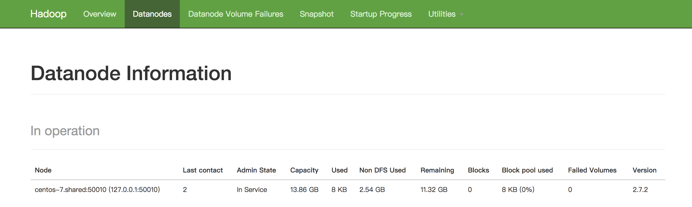
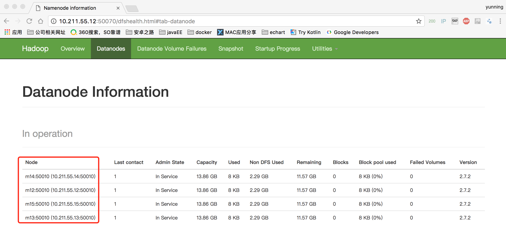
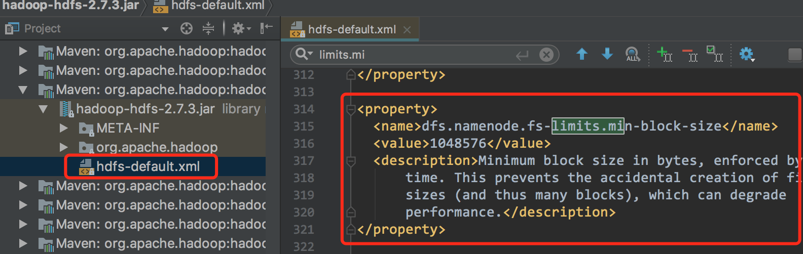

# Hadoop 安装和配置

​	环境 :          `centOS 7.0`  + `jdk-8u65-linux-x64.tar.gz` + `hadoop-2.7.2.tar.gz`

​	centOS 安装时 选择的安装环境是    `虚拟化主机`

## 0 准备

​	添加用户     `fmi110` , 并授予 sudo 权限

```
# 添加用户并设置密码
useradd fmi110 
passwd fmi110		

# 编辑 /etc/sudoers 文件 ,授予 sudo 权限
chmod u+w /etc/sudoers && vim /etc/sudoers
```

​	在行 `root    ALL=(ALL)       ALL`  后面添加下面内容,然后保存退出

```properties
fmi110    ALL=(ALL)       ALL
```

## 1 安装

​	这里 以 `fmi110` 身份运行 , 安装包上传到 用户目录 `/home/fmi110` 下 , 如下所示 , 软件

```Sh
[fmi110@centos-7 ~]# tree
.
├
├── hadoop-2.7.2.tar.gz
└── jdk-8u65-linux-x64.tar.gz
0 directories, 3 files
```

### 1 安装 jdk

主要步骤 :

1. 创建 /soft 目录 , 解压 jdk 安装包到 /soft 目录

2. 创建软连接 /soft/jdk , 指向解压出来的 jdk 文件夹

3. 配置 JAVA_HOME 环境变量

   输入的命令如下 , 依次执行完成即可

```Sh
sudo mkdir /soft && sudo chown fmi110: /soft  # 创建 /soft 目录,修改文件夹所有者为 fmi110
cd /home/fmi110 && su fmi110     # 切换到 fmi110 目录 , 软件包放在该目录下

tar -xzf jdk-8u65-linux-x64.tar.gz -C /soft

ln -s /soft/jdk1.8.0_65  /soft/jdk   # 建立软连接

######## 配置环境变量 start ######
echo 'export JAVA_HOME=/soft/jdk' >> /etc/profile
echo 'export PATH=$PATH:$JAVA_HOME/bin' >> /etc/profile
source /etc/profile
######## 配置环境变量 end  ######

java -version  
source /etc/profile
```

> 1. `jdk1.8.0_65`	 是 `jdk-8u65-linux-x64.tar.gz` 解压得到的文件夹的名字!!!注意根据自己的实际情况作修改
> 2. 一定要将 `/soft` 目录的拥有者修改为 `fmi110` , 否则做完全分布模式部署时,会出现权限拒绝!!!

### 2 安装 hadoop

主要步骤:

1. 解压文件到 /soft 目录

2. 配置环境变量

   输入的命令如下 : 

```Sh
cd /home/fmi110 && su fmi110
tar -xzf hadoop-2.7.2.tar.gz -C /soft
ln -s  /soft/hadoop-2.7.2    /soft/hadoop

echo 'export HADOOP_HOME=/soft/hadoop' >> /etc/profile
echo 'export PATH=$PATH:$JAVA_HOME/bin:$HADOOP_HOME/bin:$HADOOP_HOME/sbin' >> /etc/profile
source /etc/profile

hadoop version  # 查看 hadoop 版本信息
```

## 2 配置 hadoop

### 1 hadoop 运行模式

1. 单机模式(Local mode)

   单机模式是Hadoop的默认模式。当首次解压Hadoop的源码包时，Hadoop无法了解硬件安装环境，便保守地选择了最小配置。在这种默认模式下所有3个XML文件均为空。当配置文件为空时，Hadoop会完全运行在本地。因为不需要与其他节点交互，单机模式就不使用HDFS，也不加载任何Hadoop的守护进程。该模式主要用于开发调试MapReduce程序的应用逻辑

2. 伪分布模式 (Pseudo-distributed mode)

   伪分布模式在单节点上同时启动 `namenode`、`datanode`、`jobtracker`、`tasktracker`、`secondary namenode`等5个进程，模拟分布式运行的各个节点

3. 完全分布模式(Full distributed)

   正常的Hadoop集群，由多个各司其职的节点构成

### 2 伪分布模式 

​	需要配置几个 xml 文件的内容 , xml 文件均位于 hadoop 安装目录下的    `${HADOOP_HOME}/etc/hadoop` 目录

##### 1 编辑 core-site.xml

文件位于 `${HADOOP_HOME}/etc/hadoop`  目录下 , 打开文件 , 将文件内容修改为下面的内容

> `${HADOOP_HOME}`  为配置好的环境变量 , 指向了 hadoop 的安装目录 , 所以要编辑文件可以直接输入如下命令 `vim ${HADOOP_HOME}/etc/hadoop/core-site.xml`

```sh
vim ${HADOOP_HOME}/etc/hadoop/core-site.xml
```

```Xml
<?xml version="1.0" encoding="UTF-8"?>
<configuration>
	<property>
		<name>fs.defaultFS</name>
		<value>hdfs://localhost/</value>
	</property>
</configuration>
```

##### 2 编辑 hdfs-site.xml

```Sh
vim ${HADOOP_HOME}/etc/hadoop/hdfs-site.xml  	# sh 命令
```

​	文件内容修改为下:

```Xml
<?xml version="1.0"?>
<!-- hdfs-site.xml -->
<configuration>
  <property>
    <name>dfs.replication</name>
    <value>1</value>
  </property>
</configuration>
```

##### 3 编辑 mapred-site.xml

​	注意 : mapred-site.xml 一开始是不存在 , 安装包中为我们提供了一个模板文件 `mapred-site.xml.template` ,所以我们复制一份并重命名为 `mapred-site.xml`

```Sh
cd $HADOOP_HOME/etc/hadoop && cp mapred-site.xml.template mapred-site.xml  	# sh 命令
vim mapred-site.xml													# 编辑文件
```

​	将文件内容修改为如下:

```Xml
<?xml version="1.0"?>
<!-- mapred-site.xml -->
<configuration>
  <property>
    <name>mapreduce.framework.name</name>
    <value>yarn</value>
  </property>
</configuration>
```

##### 4 编辑 yarn-site.xml

​	输入命令:

```Sh
vim $HADOOP_HOME/etc/hadoop/yarn-site.xml    	# sh 命令
```

​	将文件内容修改为如下:

```Xml
<?xml version="1.0"?>
<!-- yarn-site.xml -->
<configuration>
  <property>
    <name>yarn.resourcemanager.hostname</name>
    <value>localhost</value>
  </property>
  <property>
    <name>yarn.nodemanager.aux-services</name>
    <value>mapreduce_shuffle</value>
  </property>
</configuration>
```

##### 5 启动 hadoop

1. 对 hdfs 进行格式化

```Sh
hadoop namenode -format
```

2. 修改 hadoop 配置文件 , 指定 `JAVA_HOME` 路径

   配置文件路径 `${HADOOP_HOME}/etc/hadoop/hadoop-env.sh`  ,  配置项位于配置文件的第 25 行左右 , 修改为如下内容

   ```sh
   vim ${HADOOP_HOME}/etc/hadoop/hadoop-env.sh
   ```

```Sh
export JAVA_HOME=/soft/jdk       /usr/local/src/java
```

> 1. `/soft/jdk` 为本地主机的 `JDK` 路径
> 2. `vim` 在非编辑模式下 , 输入 `:set nu`  可以让编辑器显示行号

3. 启动 hadoop 所有进程

```Sh
${HADOOP_HOME}/sbin/start-all.sh
```

4. 查看进程运行状态

```Sh
[fmi110@centos-7 hadoop]$ jps
10740 ResourceManager
11557 SecondaryNameNode
11399 DataNode
11881 Jps
11274 NameNode
11771 NodeManager
```

> 1. `jps`  为查看 java 进程的命令
> 2. 看到上述 6 个进程则说明 hadoop 启动成功

5. 在 hdfs 中创建一个目录

```Sh
hdfd dfs -mkdir -p /user/fmi110/hadoop
```

6. 关闭防火墙

```Sh
sudo systemctl enable firewalld.service	     #"开机启动"启用
sudo systemctl disable firewalld.service	 #"开机自启"禁用
sudo systemctl start firewalld.service		 #启动防火墙
sudo systemctl stop firewalld.service		 #停止防火墙
sudo systemctl status firewalld.service	  	 #查看防火墙状态

# 如果不想关闭防火墙 , 则通过下面的命令放行指定端口
sudo firewall-cmd --zone=public --add-port=50070/tcp --permanent
sudo firewall-cmd --reload
```

> `--zone`  	 		#作用域
>
> `--add-port=50070/tcp`  	#添加端口，格式为：端口/通讯协议
>
> `--permanent`  		#永久生效，没有此参数重启后失效

7. 通过 webui 访问查看 hadoop 的文件系统

   放行端口后 , 在浏览器中输入 : `http://10.211.55.11:50070`  , 效果如下 : 



##### 6 hadoop 进程的端口号

```properties
	 端口		    进程名称	 端口类型
	50070		 namenode    http port
	50075		 datanode    http port
	50090		 2namenode	 http port

	8020		 namenode    rpc port
	50010		 datanode    rpc port
```


## 3 配置 ssh 无密登录

​	在集群环境中 , 经常会遇到一台主机远程登录到另外一台主机的情况 , 为了避免每次登录都要输入密码认证的过程 , 我们可以通过rsa认证方式省去输入密码 . 下面配置 ssh 无密登录

​	**这里的配置过程是以 `fmi110` 用户来进行操作 , 没有使用 `root` 用户 !!!**

​	**这里演示的是本机登录本机的配置 !!!**

1. 检查 ssh 相关的软件是否安装

```Sh
[fmi110@centos-7 hadoop]$ yum list installed | grep ssh
openssh.x86_64                         6.6.1p1-23.el7_2                @anaconda
openssh-clients.x86_64                 6.6.1p1-23.el7_2                @anaconda
openssh-server.x86_64                  6.6.1p1-23.el7_2                @anaconda

[fmi110@centos-7 hadoop]$ ps -ef | grep sshd
root      1333     1  0 09:35 ?        00:00:00 /usr/sbin/sshd -D
root      7336  1333  0 18:13 ?        00:00:00 sshd: root@pts/0
fmi110    8556  7407  0 19:52 pts/0    00:00:00 grep --color=auto sshd
```

> 1. `ssh` 包括了 `openssh`   `openssh-clients`   `openssh-server`  三个包 , 如果没有安装可以通过 `yum install` 命令来在线安装
> 2. `ps -ef`  看到 `/usr/sbin/sshd -D` , 说明 open-server 已经在运行

2. 主机 A(客户端)生成公私密钥对

```Sh
ssh-keygen -t rsa -P '' -f ~/.ssh/id_rsa
```

> 1. 该命令会在当前用户的用户目录下创建 `.ssh/id_rsa` 文件夹 , 并在文件夹中生成 `id_rsa` ` id_rsa.pub` 两个文件
> 2. `id_rsa` 是私钥 , `id_rsa.pub` 是公钥
> 3. `-t`  指定密钥类型  ,  `-P`  指定密码  ,   `-f`  指定生成的文件路径

3. 追加公钥到 `~/.ssh/authorized_keys` 文件中 , 并修改文件权限

``` Sh
cd ~/.ssh && cat id_rsa.pub >> authorized_keys  
chmod 644 authorized_keys			# 修改文件的权限
```

4. 测试

   输入命令 `ssh localhost` 登录 ,  第一次会提示输入密码 , 输入密码登录成功后 , 输入 `exit` 退出 , 然后再次输入 `ssh localhost`  登录 , 此时如果不需要输入密码 , 则说明配置成功.

-------------------------------------------------

​	如果是两台主机 , 想要让 主机 A 能无密登录主机 B , 则配置的过程如下 : 

1. 分别在两台主机上使用 ssh-keygen 生成密钥对

2. 将主机 A的公钥(id_rsa.pub)的内容复制追加到 主机 B 的 `~/.ssh/authorized_keys` 文件中(没有就创建,并修改权限)

3. 在主机 A 上通过 ssh 密令登录主机 B

   > 1. ssh 远程登录的密令格式 :  `ssh  用户名@远端主机 ip 地址` , 比如 `ssh fmi110@10.211.55.12`
   > 2. `fmi110` 是主机 B 中的用户 , `10.211.55.12` 是远程主机 B 的 ip 地址

-------------

## 4 hadoop 相关知识

##### 1 进程端口

| 端口    | 进程名称              | 端口类型      |
| ----- | ----------------- | --------- |
| 50070 | NameNode          | http port |
| 50075 | DataNode          | http port |
| 50090 | SecondaryNameNode | http port |
| 8020  | NameNode          | rpc port  |
| 50010 | DataNode          | rpc port  |

##### 2 四大模块

```Js
common
hdfs		//namenode + datanode + secondarynamenode

mapred
yarn		//resourcemanager + nodemanager
```

##### 3 启动命令

``` Sh
start-all.sh		//启动所有进程
stop-all.sh		//停止所有进程

start-dfs.sh		//
start-yarn.sh

[hdfs]  start-dfs.sh stop-dfs.sh
	NN
	DN
	2NN

[yarn] start-yarn.sh stop-yarn.sh
	RM
	NM
```

## 5 hadoop 完全分布模式部署

​	准备 : 克隆 4 台虚拟机 `m12`  `m13` `m14` `m15`  , 分别配置机器名和 ip 地址映射 , 为了防止 ip 地址不断变化,需要将机器设为静态 ip 地址 . 注意 : 虚拟上已经安装好 jdk 和 单机版的 hadoop , 并设置好环境变量 `JAVA_HOME=/soft/jdk`  `HADOOP_HOME=/soft/hadoop`  

​	这里  `m12 `  主机将配置为名称节点 `namemode`  ,   `m13` `m14` `m15`  配置为数据节点 `datanode`

> `PS:`  克隆主机 , 当出现没有网络设备信息 , 无法连接网络的情况时 , 解决办法如下 : 
>
> 1. 删除 `/etc/udev/rules.d/70-persistent-net.rules` 文件
> 2. 修改 `/etc/sysconfig/network-scripts/ifcfg-eth0` , 注释掉硬件地址那一行,然后重启系统

​	**下面以 `m12` 的配置过程说明 , 其他主机上配置过程类似**

##### 1 添加用户 fmi110 , 并授予用户 sudo 权限

```Sh
# 添加用户并设置密码
useradd fmi110 
passwd fmi110		

# 编辑 /etc/sudoers 文件 ,授予 sudo 权限
chmod u+w /etc/sudoers && vim /etc/sudoers
```

​	在行     `root    ALL=(ALL)       ALL`  后面添加下面内容,然后保存退出

```properties
fmi110    ALL=(ALL)       ALL
```

```Sh
chmod u-w /etc/sudoers
```

##### 2 修改 ip 地址

命令:

```Sh
vim /etc/sysconfig/network-scripts/ifcfg-eth0
```

​	文件内容修改为如下 :

```properties
TYPE=Ethernet
BOOTPROTO=static
IPV6INIT=no
NAME=eth0
DEVICE=eth0
ONBOOT=yes
IPADDR=10.211.55.12
NETMASK=255.255.255.0
GATEWAY=10.211.55.1
```

> `IPADDR` 为设置主机的ip地址 , 四台主机的 ip 地址我设置如下:
>
> `m12`	`-->`	`10.211.55.12`
>
> `m13	` 	`-->`	`10.211.55.13`
>
> `m14`	`-->`	`10.211.55.14`
>
> `m15`	`-->`	`10.211.55.15`

##### 3 修改主机名

```Sh
echo 'm12' > /etc/hostname
```

> `m12` 为主机的名字 , 不同的主机名字不同!!!

##### 4 关闭防火墙并设置为开机不启动

```Sh
sudo systemctl disable firewalld.service && sudo systemctl stop firewalld.service	
```

> sudo systemctl enable firewalld.service	     #"开机启动"启用
> sudo systemctl disable firewalld.service	 	#"开机自启"禁用
> sudo systemctl start firewalld.service		 #启动防火墙
> sudo systemctl stop firewalld.service		 #停止防火墙
> sudo systemctl status firewalld.service	  	 #查看防火墙状态

##### 5 配置 ssh 无密登录

1. 删除所有主机的上的 `/home/fmi110/.ssh/*` 

```Sh
rm -rf /home/fmi110/.ssh/*
```

> `fmi110` 是前面添加的用户 , `.ssh` 目录不一定存在 

2. 在 `m12` 主机上生成密钥对

后面的操作 , 我们通过在 `m12` 主机上远程登录其他主机进行配置 , 所以在 `m12` 生成密钥对 , 并将公钥添加到其他主机的认证密钥库中 ,  以实现无密登录其他主机 , 方便操作 . 注意 : 下面的操作应该以用户 `fmi110` 进行操作

```Sh
su fmi110			# 切换为 fmi110 用户
ssh-keygen -t rsa -P '' -f ~/.ssh/id_rsa
```

3. 将 `m12` 主机的公钥文件 `id_rsa.pub` 远程复制到 `m13` ~  `m15` 主机上

```Sh
ssh-copy-id -i ~/.ssh/id_rsa.pub m12
ssh-copy-id -i ~/.ssh/id_rsa.pub m13
ssh-copy-id -i ~/.ssh/id_rsa.pub m14
ssh-copy-id -i ~/.ssh/id_rsa.pub m15
```

> 执行命令时会要求输入 用户 `fmi110` 的密码 , 输入成功后 , 可以直接通过 `ssh m13` 登录到 `m13` 主机

##### 6 修改配置文件 `core-site.xml`

```sh
sudo vim  ${HADOOP_HOME}/etc/hadoop/core-site.xml
```

 修改内容为:

```Xml
<?xml version="1.0" encoding="UTF-8"?>
<?xml-stylesheet type="text/xsl" href="configuration.xsl"?>
<configuration>
	<property>
		<name>fs.defaultFS</name>
		<value>hdfs://m12/</value>
	</property>
  	<property>
         <name>hadoop.tmp.dir</name>
		<value>/home/fmi110/hadoop</value>
     </property>
</configuration>
```

> 核心配置 , 对 HDFS , MapReduce , Yarn 生效

##### 7 修改配置文件 `hdfs-site.xml`

```sh
sudo vim  ${HADOOP_HOME}/etc/hadoop/hdfs-site.xml
```

 修改内容为:

```Xml
<?xml version="1.0"?>
<!-- hdfs-site.xml -->
<configuration>
	<property>
		<name>dfs.namenode.name.dir</name>
		<value>file:///home/fmi110/local/var/hadoop/hdfs/namenode</value>
	</property>
	<property>
		<name>dfs.datanode.data.dir</name>
		<value>file:///home/fmi110/local/var/hadoop/hdfs/datanode</value>
	</property>
	<property>
		<name>dfs.namenode.checkpoint.dir</name>
		<value>file:///home/fmi110/local/var/hadoop/hdfs/namesecondary</value>
	</property>
	<property>
		<name>dfs.replication</name>
		<value>3</value>
	</property>
</configuration>
```

> 该文件是 HDFS daemons 的配置
>
> `dfs.datanode.data.dir`   指定hdfs 文件存储路径为 : `/home/fmi110/local/var/hadoop/hdfs/datanode`
>
> 目录必须预先创建好!!! 否则hadoop 无法启动

#####  8 修改配置文件 `yarn-site.xml`

```sh
 sudo vim  ${HADOOP_HOME}/etc/hadoop/yarn-site.xml
```

  修改内容为:

```Xml
<?xml version="1.0"?>
<!-- yarn-site.xml -->
<configuration>
	<property>
		<name>yarn.resourcemanager.hostname</name>
		<value>m12</value>
	</property>
	<property>
		<name>yarn.nodemanager.aux-services</name>
		<value>mapreduce_shuffle</value>
	</property>
	
</configuration>
```

##### 9 修改配置文件 `mapred-site.xml`

```sh
sudo vim  ${HADOOP_HOME}/etc/hadoop/mapred-site.xml
```

修改内容为:

```Xml
<?xml version="1.0"?>
<?xml-stylesheet type="text/xsl" href="configuration.xsl"?>
<configuration>
        <property>
                <name>mapreduce.framework.name</name>
                <value>yarn</value>
        </property>
</configuration>
```

##### 10 修改配置文件 slaves

```sh
sudo vim  ${HADOOP_HOME}/etc/hadoop/slaves
```

修改内容为:

```Sh
m13
m14
m15
```

> `slaves` 文件列出的主机只是指定了 , 管理节点(即名称节点)会向哪些主机发送启动 hdfs 的命令!!!

##### 11 修改 hadoop 配置文件 , 指定 `JAVA_HOME` 路径

```sh
sudo vim ${HADOOP_HOME}/etc/hadoop/hadoop-env.sh
```

配置项位于配置文件的第 25 行左右 , 修改为如下内容

```properties
export JAVA_HOME=/soft/jdk
```

> 1. `/soft/jdk` 为本地主机的 `JDK` 路径
> 2. `vim` 在非编辑模式下 , 输入 `:set nu`  可以让编辑器显示行号

##### 12 分发配置文件到其他主机

```Sh
cd /soft/hadoop/etc/
scp -r hadoop fmi110@m13:/soft/hadoop/etc/
scp -r hadoop fmi110@m14:/soft/hadoop/etc/
scp -r hadoop fmi110@m15:/soft/hadoop/etc/
```

##### 13 删除临时目录文件和 hadoop 日志

```sh
cd /tmp && rm -rf hadoop-fmi110
ssh s202 rm -rf /tmp/hadoop-fmi110
ssh s203 rm -rf /tmp/hadoop-fmi110
ssh s204 rm -rf /tmp/hadoop-fmi110


cd /soft/hadoop/logs && rm -rf *
ssh s202 rm -rf /soft/hadoop/logs/*
ssh s203 rm -rf /soft/hadoop/logs/*
ssh s204 rm -rf /soft/hadoop/logs/*
```
##### 14 格式化文件系统

```Sh
hadoop namenode -format
```

##### 15 启动 hadoop 集群

1. 启动 HDFS

```Sh
start-dfs.sh
```

2. 启动 Yarn

```Sh
start-yarn.sh
```

##### 16 确认安装是否成功

​	在四台主机上分别使用 `jps` 查看运行的进程是否如下 , 如果是就说明成功了

```Sh
[fmi110@m12 etc]$ jps
2514 NameNode
2644 DataNode
3146 NodeManager
4858 Jps
2813 SecondaryNameNode
2973 ResourceManager

[fmi110@m13 ~]$ jps
2704 SecondaryNameNode
2545 DataNode
3841 NodeManager
4054 Jps

[fmi110@m14 ~]$ jps
2882 NodeManager
3045 Jps
2779 DataNode

[fmi110@m15 ~]$ jps
2755 DataNode
3029 Jps
2858 NodeManager
```

​	通过 webui 查看如下:



## 6 hadoop 常用的操作

##### 1 配置 hdfs 存储文件的最小 blocksize

​	配置的大小必须为 512 的整数倍!!! 在  `hdfs-site.xml` 中添加如下属性:

```Xml
<property>
  <name>dfs.namenode.fs-limits.min-block-size</name>
  <value>1048576</value>
  <description>Minimum block size in bytes, enforced by the Namenode at create
      time. This prevents the accidental creation of files with tiny block
      sizes (and thus many blocks), which can degrade
      performance.</description>
</property>
```

​	默认配置可以从 java 依赖包中查看 :



##### 2 配置辅助名称节点

​	在 `hdfs-site.xml` 中添加属性

```Xml
<property>
  <name>dfs.namenode.secondary.http-address</name>
  <value>0.0.0.0:50090</value>
  <description>
    The secondary namenode http server address and port.
  </description>
</property>
```

##### 3 使用 oiv 命令查看 hadoop 镜像文件

```Sh
hdfs oiv -i fsimge_name -o outFileName -p XML
```

> `fsimge_name`  是镜像的名字
>
> `outFileName`  是输出文件的名字
>
> `-p`  指定输出的文件格式是 XML
>
> 可以直接输入 hdfs oiv 查看命令的帮助信息

##### 4 管理命令

```Sh
hdfs dfsadmin					# 查看命令帮助
hdfs dfsadmin -help rollEdits	# 查看指定命令的帮助
hdfs dfsadmin -rollEdits 		# 滚动编辑日志(记录了对 hdfs 的增删改操作)

### 安全模式相关
hdfs dfsadmin -safemode enter		# 进入安全模式
hdfs dfsadmin -safemode get			# 查看安全模式状态
hdfs dfsadmin -safemode leave		# 退出安全模式
hdfs dfsadmin -safemode wait		# 阻塞等待安全模式退出(shell 脚本中可以用 , 避免脚本出异常退出)
```

> 1 hdfs 启动时会自动进入安全模式 , 加载数据块 , 融合日志 等 , 当初始化行为结束后 , 会自动退出安全模式
>
> 2 安全模式下 , 不允许对 hdfs 进行增删改操作!!!

##### 5 配额管理(quota)

​	1 目录配额

​		目录配额是指允许目录下总共存在几个文件或文件夹(递归统计) , 如果是1 , 则目录为空目录

``` Sh
	hdfs dfsadmin -setQuota 1 dir1		# 设置 dir1 目录的配额为1
	hdfs dfsadmin -clrQuota 1 dir1		# 清楚配配额
```

​	2 空间配额

​		允许目录下所有文件的总大小

```Sh
	hdfs dfsadmin -setSpaceQuota 3 data		# 设置 data 目录的磁盘配额为 3 字节
	hdfs dfsadmin -clrSpaceQuota data		# 清除配额
```

##### 6 快照管理

​	是指对文件(夹)进行备份 , 使用差额存储 . 默认是禁用快照的 , 需要手动开启

```Sh
hdfs dfsadmin -allowSnapshot dir1		# 对目录 dir1 启用快照
hdfs dfsadmin -disallowSnapshot dir1	# 对目录 dir1 停用快照
hdfs dfs -createSnapshot dir1 ss1		# 对 dir1 创建快照 , 快照名称为 ss1
hdfs dfs -renameSnapshot dir1 ss1 ss2	# 重命名快照 为 ss2
hdfs dfs -deleteSnapshot dir1 ss1 		# 删除快照 ss1
```

##### 7 节点黑白名单的设置

​	`${HADOOP_HOME}/etc/hadoop/slaves`  文件指定的主机只是指定了哪些主机会接收到名称节点发送的启动指令 , 如果需要指定哪些主机能够连接(或禁止)名称节点 , 则可以通过设置黑白名单来实现 , 黑(白)名单在一个文件中罗列出来 , 然后在 hdfs-site.xml 中添加下列属性 , 指向对应的文件即可

```Xml
<property>
  <name>dfs.hosts</name>
  <value></value>
  <description>Names a file that contains a list of hosts that are
  permitted to connect to the namenode. The full pathname of the file
  must be specified.  If the value is empty, all hosts are
  permitted.</description>
</property>

<property>
  <name>dfs.hosts.exclude</name>
  <value></value>
  <description>Names a file that contains a list of hosts that are
  not permitted to connect to the namenode.  The full pathname of the
  file must be specified.  If the value is empty, no hosts are
  excluded.</description>
</property> 
```

> `dfs.hosts` 指定的是允许假如名称节点的主机
>
> `dfs.hosts.exclude`  指定禁止连接的主机

​	黑白名单联合作用的结果如下表所示:

| 白名单  | 黑名单  |         是否允许连接         |
| :--: | :--: | :--------------------: |
|  no  |  no  |           no           |
|  no  | yes  |           no           |
| yes  |  no  |          yes           |
| yes  | yes  | 可以连接 , 但是节点会在以后被移除(退役) |

## 7  hdfs 添加和删除节点

#### 1 添加新节点

1. 在白名单中添加新节点的名称

   白名单的设置在 hdfs-site.xml 中添加属性

   ```Xml
   <property>
     <name>dfs.hosts</name>
     <value>/soft/hadoop/etc/dfs.include.txt</value>
   </property>
   ```

   > 文件 `/soft/hadoop/etc/dfs.include.txt` 声明了白名单的主机

2. 创建白名单文件

   属性 `dfs.hosts` 指定了白名单文件的路径 , 文件内容如下 :

   ```
   m13
   m14
   m15
   m16
   ```

   > `m13` 指的是主机名
   >
   > 白名单文件应该保存在作为名称节点的主机上!!!

3. 在名称节点(namenode) 上刷新节点

   ```Sh
   hfds dfsadmin -refreshNodes
   ```

4. 在 slaves 文件中添加新节点的 ip(主机名)

5. 单独启动新节点中的 datanode

   这一步应该在 新节点的主机上执行 , 也可以使用 ssh 远程连接执行

   ```Sh
   hadoop-daemon.sh start datanode
   ```

#### 2 移除节点

1. 在 hdfs-site.xml 中配置黑名单属性

   添加下列属性

   ```Xml
   <property>
     <name>dfs.hosts.exclude</name>
     <value>/soft/hadoop/etc/dfs.hosts.exclude.txt</value>
   </property> 
   ```

   > `/soft/hadoop/etc/dfs.hosts.exclude.txt`  为黑名单文件路径

2. 添加退役节点的 ip(主机名) 到黑名单 , **不要更新白名单!!!**

3. 刷新名称节点(namenode)

   ```Sh
   hdfs dfsadmin -refreshNodes
   ```

4. 查看 webui , 此时节点的状态应该是 `decommisstion in progress`

5. 查看 webui , 当要退役的节点状态为 `Decommissioned` , 则数据转移工作完成

6. 从白名单中删除已经退役的节点的 ip(主机名) , 并刷新节点

   ```Sh
   hdfs dfsadmin -refreshNodes
   ```

7. 从 slaves 文件中删除退役节点

## 8 yarn 添加和移除节点

#### 1 添加节点

1. 在 yarn-site.xml 文件中添加属性 , 即设置白名单

   ```Xml
   <property>
   		<name>yarn.resourcemanager.nodes.include-path</name>
   		<value>/soft/hadoop/etc/dfs.include.txt</value>
   </property>
   ```

   > `/soft/hadoop/etc/dfs.include.txt`  为白名单文件路径

2. 在白名单文件中添加要添加节点的 ip(主机)

3. 在名字节点的主机上刷新节点

   ```Sh
   yarn rmadmin -refreshNodes
   ```

4. 在 slaves 文件中添加新节点的 ip(主机名)

   这里应该修改的是名称节点的主机上的 slaves 文件

5. 单独启动新节点中的 nodemanager

   在新节点的主机上执行命令

   ```Sh
   yarn-daemon.sh start nodemanager
   ```

#### 2 退役节点

1. 添加退役节点的 ip(主机)到黑名单 , 不要更新白名单!!

2. 在 yarn-site.xml 中配置黑名单属性

   ```Xml
   <property>
   		<name>yarn.resourcemanager.nodes.exclude-path</name>
   		<value>/soft/hadoop/etc/dfs.hosts.exclude.txt</value>
   </property>
   ```

3. 刷新 resourcemanager 节点

   ```Sh
   yarn rmadmin -refreshNodes
   ```

4. 查看 webui , 此时节点的状态应该是 `decommisstion in progress`

5. 查看 webui , 当要退役的节点状态为 `Decommissioned` , 则数据转移工作完成

6. 从白名单中删除退役节点 , 并刷新

   ```Sh
   yarn rmadmin -refreshNodes
   ```

7. 从 slaves 文件中删除退役节点


## 9 常识东西

​	1 数据块 chunk : hdfs 的数据块一般设置为128M , 其目的是最小化寻址开销 . 此外 , 当单个文件小于块文件时 , 不会占满整个块 !!! 下面的指令可查看 hdfs 的块信息 : `hadoop fsck / -files -blocks`

​	2 文件系统的基本操作

```Sh
hadoop fs -copyFromLocal <localPath>  <hdfsPath>  # 上传本地文件到 hdfs
hadoop fs -copyToLocal <hdfsPath> <localPath>	  # 下载文件到本地
hadoop fs -mkdir	aaa			# 新建目录 aaa
hadoop fs -ls .			# 查看当前目录
hadoop fs -ls file:///		# 查看本地系统根目录下的文件
```


## 10 java 代码

#### 1 通过 FileSystem API 读取文件

```Java
public void static main(String[] args) throw exception{
 	String uri = arg[0];
  	Configuration con = new Configuration();
  	// 返回的实际类型 FSDataInputStream
  	FileSystem fs = FileSystem.get(URI.create(uri),conf);
  	InputStream in = null;
    try{
	    in = fs.open(new Path(uri));
      	IOUtils.copyBytes(in,System.out,4096,false); // 输出内容到控制台
    }finally{
      IOUtils.closeStream(in);
    }
}
```

> arg[0] 是运行 main 函数时 , 传递给 main 的文件路径参数 hdfs://localhost/user/fmi110/test.txt  (伪分布模式下的路径)

#### 2 显示 hdfs文件系统中一组路径的信息

```Java
public void static main(String[] args) throw exception{
 	String uri = arg[0];
  	Configuration con = new Configuration();
  	FileSystem fs = FileSystem.get(URI.create(uri),conf);
  	
  	Path[] paths = new Path[args.length];
  	for(int i=0;i<paths.length;i++){
    	paths[i] = new Path(arg[i]);
  	}
  	
  	FileStatus[] status =  fs.listStatus(paths);
  	Path[] listedPaths = FileUtils.stat2Paths(status);
  	
    for(Path p : listedPaths){
		System.out.println(p);
    }
}
```

> FileStatus 类是文件元数据的类 , 封装了有关文件的各种信息 , 比如 路径 , 大小 , 权限等

### 3 PathFilter 对象

​	用于过滤文件路径的接口 , 下面是参考实现

```Java
public class RegexExcludePathFilter implement PathFilter{
  private final String regex;
  public RegexExcludePathFilter(String regex){
    this.regex = regex;
  }
  @Override
  public boolean accept(Path path){
    return !path.toString().mathes(regex);
  }
}
```

​	使用 : 下面的案例将匹配路径 /2017/12/31

```Java
fileSystem.globStatus(new Path("/2017/*/*"),new RegexExcludePathFilter("^.*/2017/12/31$"));
```

### 4 删除文件

```Java
public boolean FileSystem.delete(Path p , boolean recursive) throw Exception;
```

## 11 Hadoop的 IO 操作

### 1 数据完整性

​	hdfs 使用 CRC-32 对写入的数据计算校验和,并在读取时进行校验和. Datanode 节点负责存储数据及其校验和 , 同时还记录了文件的校验日志 . 每个Datanode 后台运行DataBlockScanner 定期对文件进行校验.

​	客户端在读取文件时也会进行校验 , 并在验证成功后通知 datanode 节点更新校验日志.

 **LocalFileSystem**

​	该对象用于执行客户端的验证和校验.如果想对一些读操作禁用校验和 , 可使用 RawLocalFileSystem 对象实现 , 如下:

```Java
Configuration conf = new ...;
FileSystem fs = new RawLocalFileSystem();
fs.initialize(null,conf);
```

### 2 压缩

​	**codec**  实现了压缩-解压缩算法 . Hadoop 中的压缩解压缩实现如下:

| 压缩格式              | 是否可切割 | 实现                                       |
| ----------------- | ----- | ---------------------------------------- |
| Deflate(.deflate) | 否     | org.apache.hadoop.io.compress.DefaultCodec |
| Gzip(.gz)         | 否     | org.apache.hadoop.io.compress.GzipCodec  |
| bzip2(.bz2)       | 是     | org.apache.hadoop.io.compress.BZip2Codec |
| LZO(.lzo)         | 否     | com.hadoop.compress.lzo.LzopCodec        |
| LZ4(.lz4)         | 否     | org.apache.hadoop.io.compress.Lz4Codec   |
| Snappy(.snappy)   | 否     | org.apache.hadoop.io.compress.SnappyCodec |

> 有些算法实现提供了对应的工具类(命令行执行)

**1 简单的压缩代码**

```Java
String codecClassName = "xxxxCodec" ;// 指定压缩解压缩算法实现类
Class<?> codecClass = Class.forName(codecClassName);
Configuration conf = new Configuration();
CompressionCodec codec = ReflectionUtils.newInstance(codecClass,conf);

CompressionOutputStream out = codec.createOutputStream(System.out); // 创建压缩的输出流
IOUtils.copyBytes(System.in,out,4096,false);
out.finish();
```

> 该程序压缩从标准输入流读取的数据,然后将其写到标准输出中

**2 通过 CompressCodecFactory 推断 CompressCodec**

```Java
public class FileDecompress(){
  public static void main(String[] args){
        String uri = arg[0];
        Configuration conf = new Configuration();
        FileSystem fs = FileSystem.get(URI.create(uri),conf);

        Path inoutPath = new Path(uri);
        CompressCodecFactory factory = new CompressCodecFactory(conf);

        CompressCodec codec = factory.getCodec(inputPath); // 通过文件拓展名获取 Codec

        if(codec==null){
            // 没有
            System.exit(1);
        }
        // 构建输出文件路径 , 这里移除了文件的拓展名部分
        String outputUri = CompressCodecFactory.removeSuffix(uri,codec.getDefaultExtension());
        InputStream in = null;
        OutputStream out = null;
        try{
            in = codec.createInputStream(fs.open(inputPath)); // 输入流
            out = fs.create(new Path(outputUri));  // 输出流
            IOUtils.copyBytes(in,out,conf);
        }finally{
            IOUtils.closeStream(in);
            IOUtils.closeStream(out);
        }
  }
}
```

> 执行命令 : `hadoop FileDecompressor file.gz`

**3 CodecPool**

​	使用压缩/解压缩池

```Java
public class PoolStreamCompressor(){
  public static void main(String[] args){
        String codecClassName = arg[0];
    	Class<?> codecClass = Class.forName(codecClassName);
    	Configuration conf = new Configuration();
    	CompressionCodec codec = ReflectionUtils.newInstance(codecClass,conf);
    	
    	Compressor compressor = null;
    
        try{
			compressor = CodecPool.getCompressor(codec);
          	 CompressionOutputStream out = codec.createOutputStream(System.out,compressor);
        	 IOUtils.copyBytes(System.in,out,4096,false);
        }finally{
			CodecPool.returnCompressor(compressor);
        }          
   }     
}       
```

> 出处 : Hadoop 权威指南 第三版 p98


来点鼓励吧, O(∩_∩)O~

