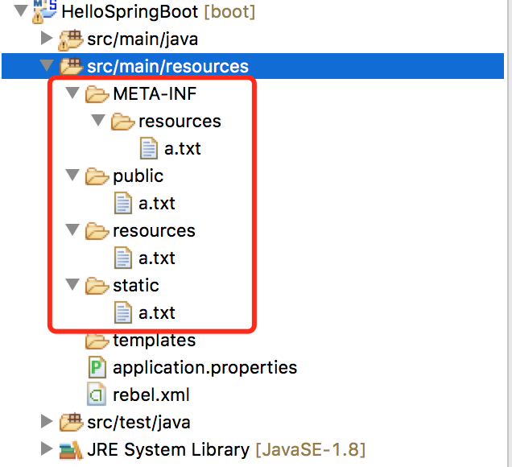
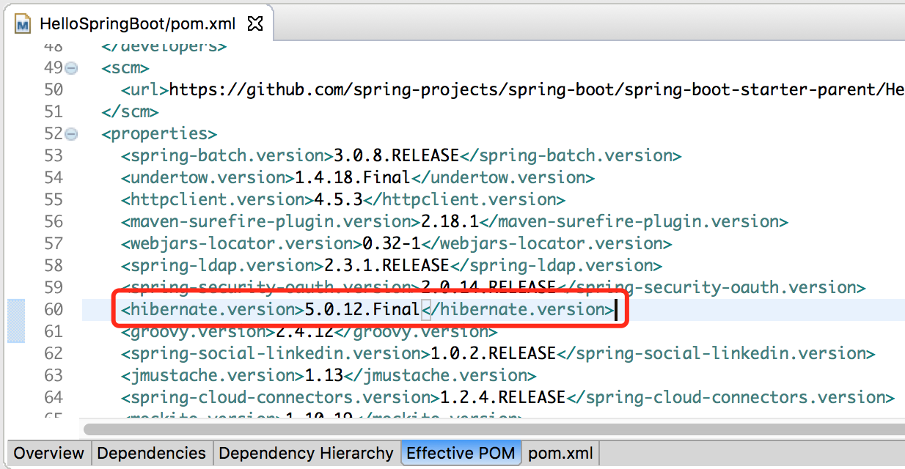
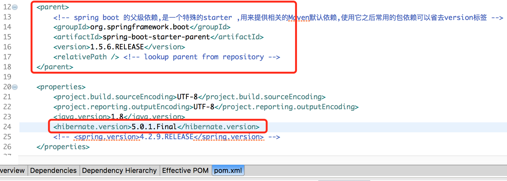
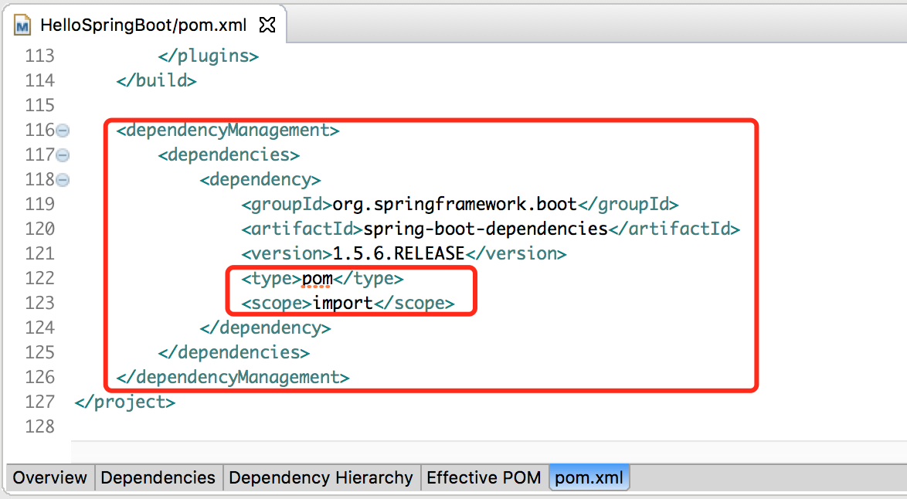

# Spring Boot学习笔记

## 1 Hello World 工程

1. 构建Maven工程

   ```xml
   <?xml version="1.0" encoding="UTF-8"?>
   <project xmlns="http://maven.apache.org/POM/4.0.0" xmlns:xsi="http://www.w3.org/2001/XMLSchema-instance"
   	xsi:schemaLocation="http://maven.apache.org/POM/4.0.0 http://maven.apache.org/xsd/maven-4.0.0.xsd">
   	<modelVersion>4.0.0</modelVersion>

   	<groupId>com.example</groupId>
   	<artifactId>HelloSpringBoot</artifactId>
   	<version>0.0.1-SNAPSHOT</version>
   	<packaging>jar</packaging>

   	<name>HelloSpringBoot</name>
   	<description>Demo project for Spring Boot</description>

   	<parent>
   		<!-- spring boot 的父级依赖,是一个特殊的starter ,用来提供相关的Maven默认依赖,使用它之后常用的包依赖可以省去version标签 -->
   		<groupId>org.springframework.boot</groupId>
   		<artifactId>spring-boot-starter-parent</artifactId>
   		<version>1.5.6.RELEASE</version>
   		<relativePath/> <!-- lookup parent from repository -->
   	</parent>

   	<properties>
   		<project.build.sourceEncoding>UTF-8</project.build.sourceEncoding>
   		<project.reporting.outputEncoding>UTF-8</project.reporting.outputEncoding>
   		<java.version>1.8</java.version>
   	</properties>

   	<dependencies>
   		<!-- 对Web项目开发的支持,包含Tomcat和 spring-webmvc -->
   		<dependency>
   			<groupId>org.springframework.boot</groupId>
   			<artifactId>spring-boot-starter-web</artifactId>
   		</dependency>

   		<dependency>
   			<groupId>org.springframework.boot</groupId>
   			<artifactId>spring-boot-starter-test</artifactId>
   			<scope>test</scope>
   		</dependency>
   	</dependencies>

   	<build>
   		<plugins>
   			<plugin>
   				<groupId>org.springframework.boot</groupId>
   				<artifactId>spring-boot-maven-plugin</artifactId>
   			</plugin>
   		</plugins>
   	</build>
   </project>
   ```

2. 添加程序入口类


   ```java

   package com.example;

   import org.springframework.boot.SpringApplication;
   import org.springframework.boot.autoconfigure.SpringBootApplication;
   /**
    * 程序的启动类,入口!!
    * @author huangyunning
    * SpringBoot 会自动扫描 @SpringBootApplication 所在的类的同级包以及下级包里的Bean !!!
    * 因此建议入口类放在在 groupID + arctifactID 组合下
    */
   @SpringBootApplication  // 开启自动配置
   public class App {

   	public static void main(String[] args) {
   		SpringApplication.run(App.class, args);
   	}
   }
   ```

   > 该类有一个主函数,并且被注解 @SpringBootApplication

3. 添加控制器类

   ```Java
   package com.example.web;

   import org.springframework.web.bind.annotation.RequestMapping;
   import org.springframework.web.bind.annotation.RestController;

   /**
    * @author huangyunning
    * @RestController  
    */
   @RestController
   public class HelloController {

   	@RequestMapping("/")
   	public String hello() {
   		return "hello fmi110";
   	}
   }
   ```

   > 控制器类使用 @RestController 注解 , 当返回对象时,框架会将对象转换为json格式输出

   ​	至此,就搭建好了一个Spring Boot工程,在程序入口类 app.java 中 , `右键 —> run as Java Application`	

   然后再浏览器访问 :`http://localhost:8080/` 即可访问

## 2 引入 fastjson 来实现Json转换

​	首先,引入依赖

```Html
		<dependency>
			<groupId>com.alibaba</groupId>
			<artifactId>fastjson</artifactId>
			<version>1.2.15</version>
		</dependency>
```

​	然后进行配置,配置的方式有两种

- 方法1 : 启动类集成 `WebMvcConfigureAdapter` , 并复写 `configureMessageConverters()` 方法

```Java
@SpringBootApplication
public class FastJsonApp1 extends WebMvcConfigurerAdapter {
	@Override
	public void configureMessageConverters(List<HttpMessageConverter<?>> converters) {
		super.configureMessageConverters(converters);

		// 配置fastJson 转换器
		FastJsonHttpMessageConverter4 fastJson = new FastJsonHttpMessageConverter4();
		FastJsonConfig config = new FastJsonConfig();
      	config.setDateFormat("yyyy-MM-dd HH:mm:ss"); // 设置日期的转换类型
		config.setSerializerFeatures(SerializerFeature.PrettyFormat);
		fastJson.setFastJsonConfig(config);

		converters.add(fastJson);
	}
	
	public static void main(String[] args) {
		SpringApplication.run(App.class, args);
	}

}
```

- 方法2 : 在启动类中 通过 @Bean 注解,注入 HttpMessageConverters

```Java
/**
 * 程序的启动类,入口!!
 * 
 * @author huangyunning SpringBoot 会自动扫描 @SpringBootApplication
 *         所在的类的同级包以及下级包里的Bean !!! 因此建议入口类放在在 groupID + arctifactID 组合下
 */
@SpringBootApplication // 开启自动配置
public class App {
	@Bean
	public HttpMessageConverters addHttpMessageConverters() {
		FastJsonHttpMessageConverter converter = new FastJsonHttpMessageConverter();
		FastJsonConfig config = new FastJsonConfig();
		config.setSerializerFeatures(SerializerFeature.PrettyFormat);
		converter.setFastJsonConfig(config);
		return new HttpMessageConverters(converter);
	}

	public static void main(String[] args) {
		SpringApplication.run(App.class, args);
	}
}
```

>  那么这时候在实体类中使用`@JSONField(serialize=false)`，是不是此字段就不返回了，如果是的话，那么恭喜你配置成功了

## 3 全局异常捕获

​	新建一个 `GlobalDefaultExceptionHandler` 类 , 在类上使用注解 `@ControllerHandler` , 在方法上使用注解 `@ExceptionHandler(value=Exception.class)` , 指定要处理的异常

```Java
@ControllerAdvice
public class GlobalDefaultExceptionHandler {
	@ExceptionHandler(value = Exception.class)
	public @ResponseBody String defaultExceptionHandler(HttpServletRequest request, Exception e) {
		e.printStackTrace();
		System.out.println("==========defaultExceptionHandler============");
		return " === defaultExceptionHandler : " + e;
	}
}
```

> `@ResponseBody`  : 将方法的返回值作为响应输出到浏览器

## 4 添加mysql

​	步骤:

1. 在 /src/main/resources/application.properties中加入 datasource的配置

```Js
### 数据库连接池配置
spring.datasource.driverClassName=com.mysql.jdbc.Driver
spring.datasource.url=jdbc:mysql://localhost:3306/test?useSSL=false
spring.datasource.username=root
spring.datasource.password=


### JPA 配置 -- Java Persistence Api
spring.jpa.database = MYSQL
spring.jpa.properties.hibernate.dialect = org.hibernate.dialect.MySQL5Dialect
spring.jpa.hibernate.ddl-auto = update
spring.jpa.show-sql = true

#spring.jpa.hibernate.naming.physical-strategy=org.hibernate.boot.model.naming.PhysicalNamingStrategy
# hibernate 5.0 以前支持该属性
#spring.jpa.hibernate.naming-strategy = org.hibernate.cfg.ImprovedNamingStrategy 
```

2. 在 pom.xml 中添加 mysql-connector-java 依赖

```Html
		<dependency>
			<groupId>mysql</groupId>
			<artifactId>mysql-connector-java</artifactId>
			<version>6.0.6</version>
		</dependency>
```

## 5 使用JdbcTemplate

​	整体步骤:

1. 在pom.xml中添加依赖

```Html
	<dependency>
			<groupId>org.springframework.boot</groupId>
			<artifactId>spring-boot-starter-data-jpa</artifactId>
	</dependency>
```

2. 声明dao类,并注解 @Resposity 
3. 在dao类内声明并注入 JdbcTemplate

```Java
@Repository
public class UserDaoImpl implements UserDao {
	@Autowired
	private JdbcTemplate jdbcTemplate;
	@Override
	public List<User> findAll() {

		String sql = "select * from user";
		RowMapper<User> rowMapper = new BeanPropertyRowMapper<User>(User.class);

		List<User> list = jdbcTemplate.query(sql, rowMapper);
		return list;
	}

}
```

## 6 静态资源映射

### 1 默认静态资源映射

​	

​	如上图,工程的rootContextPath 为 `/` , 则当使用 `/a.txt` 访问静态资源时,系统默认的寻找资源的顺序为 `META-INF/resources/a.txt --> resources/a.txt --> static/a.txt --> public/a.txt` ; 通常我们的静态资源应该放置在这些目录下  `classpath:META-INF/resource , classpath:resources , classpath:static , classpath:public`

### 2 自定义静态资源映射

​	项目静态资源时,默认都是项目目录下寻找,但是有时我们的资源并不跟项目放置在一起,这时就需要进行自定义资源映射,步骤如下:

​	**创建类继承 `WebMvcConfigurerAdapter`,并重写 `addResourceHandlers()` 方法 , 如下**

```Java
/**
 * @author huangyunning
 * 静态资源配置 : 在进行虚拟目录映射时可以使用
 */
@Configuration
public class MyWebAppConfigurer extends WebMvcConfigurerAdapter{

	@Override
	public void addResourceHandlers(ResourceHandlerRegistry registry) {
		/**
		 * 浏览器中访问地址为 : localhost:8080/myres/** 时 访问的是 D:myres/ 目录下的资源
		 */		  			 
      	 registry.addResourceHandler("/myres/**").addResourceLocations("file:///D:myres/");
		super.addResourceHandlers(registry);
	}
}
```

> 1 `addResourceLocations()` 可以添加多个路径比如 `addResourceLocations("file:///D:myres1/","file:///D:myres2/")` 
>
> 2 `file` 前缀说明使用的是项目外的路径资源 , 如果想使用项目内的资源可以使用 `classpath` , 比如 `"classpath:com/fmi110/"`

5.3.2. Query creation

Generally the query creation mechanism for JPA works as described in [Query methods](https://docs.spring.io/spring-data/jpa/docs/1.11.6.RELEASE/reference/html/#repositories.query-methods). Here’s a short example of what a JPA query method translates into:

Example 44. Query creation from method names

```
public interface UserRepository extends Repository<User, Long> {

  List<User> findByEmailAddressAndLastname(String emailAddress, String lastname);
}
```

We will create a query using the JPA criteria API from this but essentially this translates into the following query:`select u from User u where u.emailAddress = ?1 and u.lastname = ?2`. Spring Data JPA will do a property check and traverse nested properties as described in [Property expressions](https://docs.spring.io/spring-data/jpa/docs/1.11.6.RELEASE/reference/html/#repositories.query-methods.query-property-expressions). Here’s an overview of the keywords supported for JPA and what a method containing that keyword essentially translates to.

| Keyword             | Sample                                   | JPQL snippet                             |
| ------------------- | ---------------------------------------- | ---------------------------------------- |
| `And`               | `findByLastnameAndFirstname`             | `… where x.lastname = ?1 and x.firstname = ?2` |
| `Or`                | `findByLastnameOrFirstname`              | `… where x.lastname = ?1 or x.firstname = ?2` |
| `Is,Equals`         | `findByFirstname`,`findByFirstnameIs`,`findByFirstnameEquals` | `… where x.firstname = ?1`               |
| `Between`           | `findByStartDateBetween`                 | `… where x.startDate between ?1 and ?2`  |
| `LessThan`          | `findByAgeLessThan`                      | `… where x.age < ?1`                     |
| `LessThanEqual`     | `findByAgeLessThanEqual`                 | `… where x.age <= ?1`                    |
| `GreaterThan`       | `findByAgeGreaterThan`                   | `… where x.age > ?1`                     |
| `GreaterThanEqual`  | `findByAgeGreaterThanEqual`              | `… where x.age >= ?1`                    |
| `After`             | `findByStartDateAfter`                   | `… where x.startDate > ?1`               |
| `Before`            | `findByStartDateBefore`                  | `… where x.startDate < ?1`               |
| `IsNull`            | `findByAgeIsNull`                        | `… where x.age is null`                  |
| `IsNotNull,NotNull` | `findByAge(Is)NotNull`                   | `… where x.age not null`                 |
| `Like`              | `findByFirstnameLike`                    | `… where x.firstname like ?1`            |
| `NotLike`           | `findByFirstnameNotLike`                 | `… where x.firstname not like ?1`        |
| `StartingWith`      | `findByFirstnameStartingWith`            | `… where x.firstname like ?1` (parameter bound with appended `%`) |
| `EndingWith`        | `findByFirstnameEndingWith`              | `… where x.firstname like ?1` (parameter bound with prepended `%`) |
| `Containing`        | `findByFirstnameContaining`              | `… where x.firstname like ?1` (parameter bound wrapped in `%`) |
| `OrderBy`           | `findByAgeOrderByLastnameDesc`           | `… where x.age = ?1 order by x.lastname desc` |
| `Not`               | `findByLastnameNot`                      | `… where x.lastname <> ?1`               |
| `In`                | `findByAgeIn(Collection<Age> ages)`      | `… where x.age in ?1`                    |
| `NotIn`             | `findByAgeNotIn(Collection<Age> age)`    | `… where x.age not in ?1`                |
| `True`              | `findByActiveTrue()`                     | `… where x.active = true`                |
| `False`             | `findByActiveFalse()`                    | `… where x.active = false`               |
| `IgnoreCase`        | `findByFirstnameIgnoreCase`              | `… where UPPER(x.firstame) = UPPER(?1)`  |

## 7 定时任务

### 1 cron 表达式介绍

1）Cron表达式的格式：`秒 分 时 日 月 周 年(可选)`

| 字段名   | 允许的值              | 允许的特殊字符         |
| ----- | ----------------- | --------------- |
| 秒     | 0-59              | , - * /         |
| 分     | 0-59              | , - * /         |
| 小时    | 0-23              | , - * /         |
| 日     | 1-31              | , - * ? / L W C |
| 月     | 1-12 或 JAN - DEC  | , - * /         |
| 周几    | 1-7 或 SUN - SAT   | , - * ? / L C # |
| 年(可选) | Empty , 1970-2099 | , - * /         |

> `*` 字符: 		表示匹配该域的任意值，假如在Minutes域使用*, 即表示每分钟都会触发事件
>
> `?`  字符：	只能用在`Day of Month`和`Day of Week`两个域。它也匹配域的任意值，但实际不会。因为`DayofMonth`和`DayofWeek`会相互影响。例如想在每月的20日触发调度，不管20日到底是星期几，则只能使用如下写法： `13 13 15 20 * ?`, 其中最后一位只能用 `？`，而不能使用`*`，如果使用 `*` 表示不管星期几都会触发，实际上并不是这样 (`可认为是占位符?? 当 DayofMonth 和 DayofWeek 同时出现 * 时,要让一个字段生效,则另一个字段用 ? 替换掉 * ,表示这个字段的值为任意(失效)`)
>
> `,`  字符：	表示列出枚举值值。例如：在Minutes域使用5,20，则意味着在5和20分每分钟触发一次
>
> `-`  字符：	表示范围，例如在Minutes域使用5-20，表示从5分到20分钟每分钟触发一次
>
> `/`  字符：	指定一个值的增加幅度。n/m表示从n开始，每次增加m
>
> `L`  字符：	表示最后，只能出现在DayofWeek和DayofMonth域，如果在DayofWeek域使用5L,意味着在最后的一个星期四触发`(西方一个星期的最后一天是 星期6)`
>
> `W`  字符：	表示有效工作日(周一到周五),只能出现在DayofMonth域，系统将在离指定日期的最近的有效工作日触发事件。例如：在 DayofMonth使用5W，如果5日是星期六，则将在最近的工作日：星期五，即4日触发。如果5日是星期天，则在6日(周一)触发；如果5日在星期一到星期五中的一天，则就在5日触发。另外一点，W的最近寻找不会跨过月份
>
> `LW` 字符 :	这两个字符可以连用，表示在某个月最后一个工作日，即最后一个星期五。
>
> `#`  字符：	表示该月第几个周X。6#3表示该月第3个周五 

 2）Cron表达式范例：

`0 0 10,14,16 * * ?` 				每天上午10点，下午2点，4点 
`0 0/30 9-17 * * ?` 				朝九晚五工作时间内每半小时 
`0 0 12 ? * WED` 					表示每个星期三中午12点 
`0 0 12 * * ?` 					每天中午12点触发 
`0 15 10 ? * *` 					每天上午10:15触发 
`0 15 10 * * ?` 					每天上午10:15触发 
`0 15 10 * * ? *` 					每天上午10:15触发 
`0 15 10 * * ? 2005` 				2005年的每天上午10:15触发 
`0 * 14 * * ?` 					在每天下午2点到下午2:59期间的每1分钟触发 
`0 0/5 14 * * ?` 					在每天下午2点到下午2:55期间的每5分钟触发 
`0 0/5 14,18 * * ?` 				在每天下午2点到2:55期间和下午6点到6:55期间的每5分钟触发 
`0 0-5 14 * * ?` 					在每天下午2点到下午2:05期间的每1分钟触发 
`0 10,44 14 ? 3 WED` 				每年三月的星期三的下午2:10和2:44触发 
`0 15 10 ? * MON-FRI` 				周一至周五的上午10:15触发 
`0 15 10 15 * ?` 					每月15日上午10:15触发 
`0 15 10 L * ?` 					每月最后一日的上午10:15触发 
`0 15 10 ? * 6L` 					每月的最后一个**星期五**上午10:15触发 
`0 15 10 ? * 6L 2002-2005` 		2002年至2005年的每月的最后一个星期五上午10:15触发 
`0 15 10 ? * 6#3` 					每月的第三个星期五上午10:15触发`

### 2 使用定时任务

​	步骤 : 

1. 定义一个类 , 使用注解 `@Component` `@EnableScheduling` 

2. 添加方法 , 在方法上使用注解 `@Scheduled(cron="0/20 * * * * ?")`

   如下:

```Java
@Component
@EnableScheduling
public class SchedulJob {
	private int count=0;
	@Scheduled(cron="0/20 * * * * ?") // 每20秒执行一次
	public void scheduler(){
		System.out.println("====== scheduler is running : " +count++);
	}
}
```

## 8 普通类调用容器内的bean

​	我们知道如果我们要在一个类使用spring提供的bean对象，我们需要把这个类注入到spring容器中，交给spring容器进行管理，但是在实际当中，我们往往会碰到在一个普通的Java类中，想直接使用spring提供的其他对象或者说有一些不需要交给spring管理，但是需要用到spring里的一些对象。如果这是spring框架的独立应用程序，我们通过

```Java
// 获取ApplicationContext的方法:
		// 1 采用spring框架的独立的应用程序
		ApplicationContext ac = new FileSystemXmlApplicationContext("applicationContext.xml");
		ac = new ClassPathXmlApplicationContext("applicationContext.xml");

		// 2 web 应用中
		WebApplicationContext webAc = WebApplicationContextUtils.getWebApplicationContext(servletContext);
		/**
		 * spring创建出来的上下文是直接存储在 ServletContext 对象中的,所以可以直接从中取出来
		 */
		webAc = (WebApplicationContext) servletContext
				.getAttribute(WebApplicationContext.ROOT_WEB_APPLICATION_CONTEXT_ATTRIBUTE);
```

但是往往我们所做的都是Web Application，这时我们启动spring容器是通过在web.xml文件中配置，这样就不适合使用上面的方式在普通类去获取对象了，因为这样做就相当于加载了两次spring容器，而我们想是否可以通过在启动web服务器的时候，就把Application放在某一个类中，我们通过这个类在获取，这样就可以通过该普通类获取spring bean对象.

​	**方式1: 步骤**

1. 创建一个类实现 ApplicationContextAware , 并复写 setApplicationContext() 方法

```java
/**
 * @author huangyunning 用于在普通类中获取spring的上下文对象 {@link ApplicationContext}
 * 
 *         此类需要放到App.java(启动类)同包或者子包下才能被扫描，否则失效
 */
@Component
public class SpringUtils implements ApplicationContextAware {

	private static ApplicationContext ac;

	@Override
	public void setApplicationContext(ApplicationContext applicationContext) throws BeansException {
		if (ac == null) {
			ac = applicationContext;
		}
		System.out.println("==== 获取上下文 applicationContext : " + ac);
	}

	public ApplicationContext getApplicationContext() {
		return ac;
	}

}
```

2. 在启动类中注入 SpringUtils

```Java
/**
 * 程序的启动类,入口!!
 * 
 * @author huangyunning SpringBoot 会自动扫描 @SpringBootApplication
 *         所在的类的同级包以及下级包里的Bean !!! 因此建议入口类放在在 groupID + arctifactID 组合下
 */
@SpringBootApplication // 开启自动配置
public class App {
	@Bean
	public HttpMessageConverters addHttpMessageConverters() {
		FastJsonHttpMessageConverter converter = new FastJsonHttpMessageConverter();
		FastJsonConfig config = new FastJsonConfig();
		config.setDateFormat("yyyy-MM-dd HH:mm:ss");
		config.setSerializerFeatures(SerializerFeature.PrettyFormat);
		converter.setFastJsonConfig(config);
		return new HttpMessageConverters(converter);
	}
    //@Bean(name="springUtils")
	@Bean
	public SpringUtils springUtils(){
		return new SpringUtils();
	}

	public static void main(String[] args) {
		SpringApplication.run(App.class, args);
	}
}
```

> @Bean 注解在方法上声明对象时,如果不指定name属性,则生成的bean对象名称默认为 方法名

3. 使用

```Java
@RequestMapping("/findall")
	public String findUser() {
		/**
		 * 通过工具类获取bean
		 */
		ApplicationContext ac = SpringUtils.getApplicationContext();
		UserService us = ac.getBean(UserServiceImpl.class);
		return us.findAll().toString();
	}
```

​	**方式2 :**

​	在启动类上通过注解 @Import 注入SpringUtils , 此时 SpringUtils 类上不需要再注解 @Component

```Java
@SpringBootApplication
@Import(value={SpringUtils.class})  
public class FastJsonApp1 extends WebMvcConfigurerAdapter {
	
	public static void main(String[] args) {
		SpringApplication.run(App.class, args);
	}

}
```

> - @Import注解在4.2之前只支持导入配置类
> - 4.2起,@Import注解支持导入普通的java类,并将其声明成一个bean
> - @ImportResource("classpath:xxx.xml")    //导入xml配置项

## 9 Spring boot 添加Servlet

​	Web开发使用 Controller 基本上可以完成大部分需求，但是我们还可能会用到 Servlet、Filter、Listener、Interceptor 等等。当使用Spring-Boot时，嵌入式Servlet容器通过扫描注解的方式注册Servlet、Filter和Servlet规范的所有监听器（如HttpSessionListener监听器）。 

​	Spring boot 的主 Servlet 为 DispatcherServlet，其默认的url-pattern为“/”。也许我们在应用中还需要定义更多的Servlet，该如何使用SpringBoot来完成呢？

​	在spring boot中添加自己的Servlet有两种方法 : 代码注册Servlet和注解自动注册（Filter和Listener也是如此）

​	如下 MyServlet.java

```Java
// 使用第一种方式注入时,不需要该注解
@WebServlet(urlPatterns={"/myservlet","/servlet"},description="测试添加servlet")
public class MyServlet extends HttpServlet {
	private static final long serialVersionUID = 1L;
       

	protected void doGet(HttpServletRequest request, HttpServletResponse response) throws ServletException, IOException {
		response.getWriter().append("<h1>Hello Spring Boot ~~~</h1>").append(request.getContextPath());
	}

	protected void doPost(HttpServletRequest request, HttpServletResponse response) throws ServletException, IOException {
		doGet(request, response);
	}

}
```

**注入方式 1 :**

​	在启动类中注入 ServletRegistraionBean 来实现

```Java
/**
 * 程序的启动类,入口!!
 * 
 * @author huangyunning SpringBoot 会自动扫描 @SpringBootApplication
 *         所在的类的同级包以及下级包里的Bean !!! 因此建议入口类放在在 groupID + arctifactID 组合下
 */
@SpringBootApplication // 开启自动配置,是个组合注解,等价于下面三个注解
//@Configuration
//@EnableAutoConfiguration
//@ComponentScan
public class ServletApp {
	
	
	public FilterRegistrationBean filterRegistrationBean(){
		return null;
	}
	
	public ServletListenerRegistrationBean<java.util.EventListener> servletListenerRegistrationBean(){
		return null;
	}
	/**
	 * 注入自定义的Servlet
	 * @return
	 */
	@Bean
	public ServletRegistrationBean servletRegistrationBean(){
		return new ServletRegistrationBean(new MyServlet(),"/myservlet");
	}

	public static void main(String[] args) {
		SpringApplication.run(ServletApp.class, args);
	}
}
```

> http://localhost:8080/myservlet 可以访问到servlet

**注入方式2 :** 

​	在自定义的servlet 类上添加 @WebServlet 注解 , 在启动类上添加 @ServletComponentScan 注解

```Java
/**
 * 程序的启动类,入口!!
 * 
 * @author huangyunning SpringBoot 会自动扫描 @SpringBootApplication
 *         所在的类的同级包以及下级包里的Bean !!! 因此建议入口类放在在 groupID + arctifactID 组合下
 */
@SpringBootApplication // 开启自动配置,是个组合注解,等价于下面三个注解
//@Configuration
//@EnableAutoConfiguration
//@ComponentScan
@ServletComponentScan  // 开启 servlet  listener  filter 扫描
public class ServletApp2 {

	public static void main(String[] args) {
		SpringApplication.run(ServletApp2.class, args);
	}
}
```

> 使用该方式真心方便多了...

​	添加filter和listener的方式一样,只需要在 filter类上添加注解 @WebFilter , listener 类上添加注解 @WebListener

```Java
@WebFilter(filterName="myFilter",urlPatterns="/*")
```

## 10 使用spring拦截器HandlerInterceptor

​	Web开发中，我们除了使用 Filter 来过滤请web求外，还可以使用Spring提供的HandlerInterceptor（拦截器）。

​	HandlerInterceptor 的功能跟过滤器类似，但是提供更精细的的控制能力：在request被响应之前、request被响应之后、视图渲染之前以及request全部结束之后。我们不能通过拦截器修改request内容，但是可以通过抛出异常（或者返回false）来暂停request的执行

​	配置拦截器也很简单，Spring 为什么提供了基础类`WebMvcConfigurerAdapter` ，我们只需要重写 `addInterceptors` 方法添加注册拦截器。

​	**实现自定义拦截器只需要3步：** 

1. 创建我们自己的拦截器类并实现 HandlerInterceptor 接口
2. 创建一个Java类继承WebMvcConfigurerAdapter，并重写 addInterceptors 方法
3. 实例化我们自定义的拦截器，然后将对像手动添加到拦截器链中(在addInterceptors方法中添加)

 如下:

```Java
public class MyIntercepter implements HandlerInterceptor{

	@Override
	public void afterCompletion(HttpServletRequest request, HttpServletResponse response, Object handler, Exception e)
			throws Exception {
		System.out.println("======== MyIntercepter afterCompletion======== "+handler);

	}

	@Override
	public void postHandle(HttpServletRequest request, HttpServletResponse response, Object handler, ModelAndView modelAndView)
			throws Exception {
		System.out.println("======== MyIntercepter postHandle======== "+handler);
	}
	/**
	 * @param handler 被拦截的方法,即请求将会调用的方法
	 * 		public java.lang.String com.example.web.HelloController.findUser()
	 */
	@Override
	public boolean preHandle(HttpServletRequest request, HttpServletResponse response, Object handler) throws Exception {
		System.out.println("======== MyIntercepter preHandle======== "+handler);
		return true;  // 只有返回true,程序才会继续执行,返回false , 本次请求取消
	}

}
```

```Java
@Configuration
public class HandlerIncepterConfig extends WebMvcConfigurerAdapter{
	/**
	 * 静态资源映射处理
	 */
	@Override
	public void addResourceHandlers(ResourceHandlerRegistry registry) {
		/**
		 * 浏览器中访问地址为 : rootContextPath/myres/** 时 访问的是 classpath 目录下的资源
		 */
		registry.addResourceHandler("/myres/**").addResourceLocations("file:///Users/huangyunning/Desktop/","classpath:templates/");
		super.addResourceHandlers(registry);
	}
	/**
	 * 添加spring 拦截器
	 */
	@Override
	public void addInterceptors(InterceptorRegistry registry) {
		registry.addInterceptor(new MyIntercepter())
				.addPathPatterns("/**")				// 添加拦截的路径
				.excludePathPatterns("/exclude");   // 添加不拦截的路径
		
		registry.addInterceptor(new MyIntercepter2())
				.addPathPatterns("/**")				// 添加拦截的路径
				.excludePathPatterns("/exclude");   // 添加不拦截的路径
		
		super.addInterceptors(registry);
	}
}
```

> **注意 :** 只有经过DispatcherServlet 的请求，才会走拦截器链，我们自定义的Servlet 请求是不会被拦截的，比如我们自定义的Servlet地址 `http://localhost:8080/myServlet`是不会被拦截器拦截的。并且不管是属于哪个Servlet 只要符合过滤器的过滤规则，过滤器都会拦截。
>
> 最后说明下，我们上面用到的 WebMvcConfigurerAdapter 并非只是注册添加拦截器使用，其顾名思义是做Web配置用的，它还可以有很多其他作用 , 具体可以查看该类提供的方法

## 11 初始化接口CommandLineRuner和ApplicatoinRunner

​	实际应用中，我们会有在项目服务启动的时候就去加载一些数据或做一些事情这样的需求,为了解决这样的问题, Spring Boot 为我们提供了一个方法，通过实现接口 CommandLineRunner 或 ApplicatoinRunner来实现。很简单，只需要一个类就可以，无需其他配置。

```Java
/**
 * @author huangyunning
 * 服务启动时会调用该组建
 */
@Component
public class CommandLineRunnerDemo implements CommandLineRunner{

	/**
	 * @param args 
	 * 	启动类,启动服务时传递的参数 SpringApplication.run(App.class, args);
	 */
	@Override
	public void run(String... args) throws Exception {
		System.out.println("====== init CommandLineRunnerDemo ====== args = "+Arrays.asList(args));
	}

}
```

```Java
/**
 * @author huangyunning 服务启动时会调用该组建
 */
@Component
public class ApplicationRunnerDemo implements ApplicationRunner {

	@Override
	public void run(ApplicationArguments args) throws Exception {
		System.out.println("====== init ApplicationRunnerDemo ====== args = " + Arrays.asList(args.getSourceArgs()) );
	}
}
```

启动类 : 

```Java
@SpringBootApplication // 开启自动配置,是个组合注解,等价于下面三个注解
//@Configuration
//@EnableAutoConfiguration
//@ComponentScan
@ServletComponentScan  // 开启 servlet  listener  filter 扫描
public class ServletApp2 {

	public static void main(String[] args) {
		SpringApplication.run(ServletApp2.class, "hello fmi110 ~~");
	}
}
```

启动后输出如下 :

```Js
2017-08-16 22:11:16.077  INFO 1788 --- [           main] s.a.ScheduledAnnotationBeanPostProcessor : No TaskScheduler/ScheduledExecutorService bean found for scheduled processing
2017-08-16 22:11:16.186  INFO 1788 --- [           main] s.b.c.e.t.TomcatEmbeddedServletContainer : Tomcat started on port(s): 8080 (http)
====== init ApplicationRunnerDemo ====== args = [hello fmi110 ~~]
====== init CommandLineRunnerDemo ====== args = [hello fmi110 ~~]
2017-08-16 22:11:16.196  INFO 1788 --- [           main] com.example.ServletApp2                  : Started ServletApp2 in 17.686 seconds (JVM running for 19.522)
```

## 12 部署到JavaEE 容器(未验证)

1. 修改启动类,继承 **SpringBootServletInitializer** ,并重写 configure() 方法

```Java
@SpringBootApplication
public class AppOnTomcat extends SpringBootServletInitializer {
	private static final Logger logger = LoggerFactory.getLogger(AppOnTomcat.class);

	@Override
	protected SpringApplicationBuilder configure(SpringApplicationBuilder builder) {
		logger.debug("====== AppOnTomcat   configure ====== : " + this.getClass());
		// return super.configure(builder);
		return builder.sources(this.getClass());
	}

	public static void main(String[] args) {
		SpringApplication.run(AppOnTomcat.class, args);
	}
}
```

       	2. 修改pom.xml打包类型为 war

```Html
	<packaging>war</packaging>
```

3. 修改pom.xml,在依赖 spring-boot-starter-web 中排除tomcat插件,添加打包servlet需要的依赖

```Html
		<!-- 对Web项目开发的支持,包含Tomcat和 spring-webmvc -->
		<dependency>
			<groupId>org.springframework.boot</groupId>
			<artifactId>spring-boot-starter-web</artifactId>
		</dependency>
		<dependency>
			<groupId>org.springframework.boot</groupId>
			<artifactId>spring-boot-starter-tomcat</artifactId>
			<scope>provided</scope>
		</dependency>

		<dependency>
			<groupId>javax.servlet</groupId>
			<artifactId>jsp-api</artifactId>
			<version>2.0</version>
			<scope>provided</scope>
		</dependency>
		<dependency>
			<groupId>jstl</groupId>
			<artifactId>jstl</artifactId>
			<version>1.2</version>
		</dependency>
		<dependency>
			<groupId>javax.servlet</groupId>
			<artifactId>servlet-api</artifactId>
			<version>2.5</version>
			<scope>provided</scope>
         </dependency>
```

4. 使用命令 mvn clean package 打包后，同一般J2EE项目一样部署到web容器

   或者参考此博客 : [部署到tomcat](http://www.cnblogs.com/linux-wangkun/p/5709074.html)

   ​				[war部署](http://www.cnblogs.com/GoodHelper/p/6262512.html)

## 13 @ConfigurationProperties加载配置文件

1. 在 application.properties 中添加些自定义的变量,如下

```Js
##### 添加些自定义的变量 ######
author.name = fmi110
author.org = itheima 
##### 添加些自定义的变量 ######
```

2. 创建配置类,并使用注解 @ConfigurationProperties

```Java
/**
 * @author huangyunning
 * 配置类
 */
@ConfigurationProperties(prefix = "author")
public class MyConfig {
	private String name;
	private String org;

	public String getName() {
		return name;
	}

	public void setName(String name) {
		this.name = name;
	}

	public String getOrg() {
		return org;
	}

	public void setOrg(String org) {
		this.org = org;
	}

}
```

> 1. @ConfigurationProperties 默认读取的是 src/main/resources/application.properties 中定义的变量
> 2. prefix 指定读取的是以 `author` 开头的变量
> 3. 对象中的字段名必须跟配置中的变量名一致!!!

3. 使用 : 通过注入对象的方式使用,需要注解 @EnableConfigurationProperties , 如下

```Java
@RestController
@EnableConfigurationProperties(MyConfig.class)
public class HelloController {
	@Autowired  // 注入对象
	MyConfig myConfig;
	
	@Autowired
	private UserService userService;

	@RequestMapping("/")
	public String hello() {
		return myConfig.getName() +" at "+myConfig.getOrg();
	}
}
```

> 1. @EnableConfigurationProperties(MyConfig.class)  表明要引入配置类
> 2. 配置通过对象的形式使用,使用 @Autowired 注入即可
> 3. 要导入多个配置类时,以 `,` 分隔,如 `@EnableConfigurationProperties(MyConfig.class,MyConfig2.class)`
> 4. **@EnableConfigurationProperties(MyConfig.class) 也可以直接注解在启动类上!!!**

​	*此外,有时我们不希望将配置信息写在 application.properties 中 , 此时我们可以写在其他配置文件中,在使用注解时,指定配置文件的路径即可 , 比如 `@ConfigurationProperties(locations="classpath:/myInfo.properties",prefix = "my")`* 

*(1.4版本之后的已经移除locations属性了,可以使用@PropertySource 注解 ,并通过@Value注入对应的变量..)*

```
 @Configuration
 @PropertySource("classpath:/com/${my.placeholder:default/path}/app.properties")
 public class AppConfig {
     @Autowired
     Environment env;

     @Bean
     public TestBean testBean() {
         TestBean testBean = new TestBean();
         testBean.setName(env.getProperty("testbean.name"));
         return testBean;
     }
 }
```

> 这时spring mvc4 里边的用法  但是在 spring boot 没运行成功…求解???

## 14 修改自动扫描的包

​	@SpringBootApplication 是 `@Configuration`  `@EnableAutoConfiguration` `@ComponentScan` 三个的组合注解,默认是扫描启动类所在包及其子包中的类,当需要指定扫描的包时,可以通过添加 `@ComponentScan(basePackage="{"com.example","com.hah"}")` ,这样就只会扫描 `com.example` `com.hah` 包下及其子包中的类了	

## 15 定制启动时的Banner

### 1 定制自己的banner

​	在 src/mian/resources/ 下新建 banner.txt , 在文件中加入如下内容 :

```
 
   ___                                                 
 /'___\                                          __    
/\ \__/    __     ___       __         ___ ___  /\_\   
\ \ ,__\ /'__`\ /' _ `\   /'_ `\     /' __` __`\\/\ \  
 \ \ \_//\  __/ /\ \/\ \ /\ \L\ \    /\ \/\ \/\ \\ \ \ 
  \ \_\ \ \____\\ \_\ \_\\ \____ \   \ \_\ \_\ \_\\ \_\
   \/_/  \/____/ \/_/\/_/ \/___L\ \   \/_/\/_/\/_/ \/_/
                            /\____/                    
                            \_/__/                     
SpringBoot 版本 : ${spring-boot.formatted-version}
```

> 文字定制的网址 : [文字图案](http://patorjk.com/software/taag/)

则启动是输出的图案如下:

```
14:26:17.106 [main] DEBUG org.springframework.boot.devtools.restart.ChangeableUrls - Matching URLs for reloading : [file:/Users/huangyunning/Documents/eclipse_workspace_temp/HelloSpringBoot/target/classes/]
 
   ___                                                 
 /'___\                                          __    
/\ \__/    __     ___       __         ___ ___  /\_\   
\ \ ,__\ /'__`\ /' _ `\   /'_ `\     /' __` __`\\/\ \  
 \ \ \_//\  __/ /\ \/\ \ /\ \L\ \    /\ \/\ \/\ \\ \ \ 
  \ \_\ \ \____\\ \_\ \_\\ \____ \   \ \_\ \_\ \_\\ \_\
   \/_/  \/____/ \/_/\/_/ \/___L\ \   \/_/\/_/\/_/ \/_/
                            /\____/                    
                            \_/__/                     
SpringBoot 版本 :  (v1.5.6.RELEASE)

2017-08-17 14:26:18.053  INFO 1020 --- [           main] com.example.App                          : Start
```

### 2 关闭banner显示

​	在 main 函数里修改

```Java
@SpringBootApplication // 开启自动配置
@ComponentScan(basePackages = { "com.example.base" })
@EnableConfigurationProperties(MyConfig.class)
public class App {

	public static void main(String[] args) {
		SpringApplication app = new SpringApplication(App.class);
		app.setBannerMode(Banner.Mode.OFF); // 关闭banner
		app.run(args);
	}
}
```

## 16 文件上传

### 1 单文件或多文件上传

步骤:

1. 新建maven工程 或 Spring Starter Project


2. 编辑pom.xml , 添加依赖

```Html
<?xml version="1.0" encoding="UTF-8"?>
<project xmlns="http://maven.apache.org/POM/4.0.0" xmlns:xsi="http://www.w3.org/2001/XMLSchema-instance"
	xsi:schemaLocation="http://maven.apache.org/POM/4.0.0 http://maven.apache.org/xsd/maven-4.0.0.xsd">
	<modelVersion>4.0.0</modelVersion>

	<groupId>com.fmi110</groupId>
	<artifactId>fileupload</artifactId>
	<version>0.0.1-SNAPSHOT</version>
	<packaging>jar</packaging>

	<name>fileupload</name>
	<description>Demo project for Spring Boot</description>

	<parent>
		<groupId>org.springframework.boot</groupId>
		<artifactId>spring-boot-starter-parent</artifactId>
		<version>1.5.6.RELEASE</version>
		<relativePath/> <!-- lookup parent from repository -->
	</parent>

	<properties>
		<project.build.sourceEncoding>UTF-8</project.build.sourceEncoding>
		<project.reporting.outputEncoding>UTF-8</project.reporting.outputEncoding>
		<java.version>1.8</java.version>
	</properties>

	<dependencies>
		<dependency>
			<groupId>org.springframework.boot</groupId>
			<artifactId>spring-boot-starter-web</artifactId>
		</dependency>

		<dependency>
			<groupId>org.springframework.boot</groupId>
			<artifactId>spring-boot-starter-test</artifactId>
			<scope>test</scope>
		</dependency>
		<!-- 复制文件用的 -->
		<dependency>
			<groupId>commons-fileupload</groupId>
			<artifactId>commons-fileupload</artifactId>
			<version>1.3.1</version>
		</dependency>
	</dependencies>

	<build>
		<plugins>
			<plugin>
				<groupId>org.springframework.boot</groupId>
				<artifactId>spring-boot-maven-plugin</artifactId>
			</plugin>
		</plugins>
	</build>
</project>
```

3. 编写前端页面 index.html

```Html
<!DOCTYPE html>
<html>
<head>

<meta charset="UTF-8">
<title>Insert title here</title>
</head>
<body>
	<form method="POST" enctype="multipart/form-data" action="/uploads">
		<p>
			文件1：<input type="file" name="file" />
		</p>
		<p>
			文件2：<input type="file" name="file" />
		</p>
		<p>
			文件3：<input type="file" name="file" />
		</p>
		<p>
			<input type="submit" value="上传文件" />
		</p>
	</form>

</body>
</html>
```

> 1. 这个页面是上传多个文件的页面,如果要上传单个文件,自行修改即可
> 2. 页面直接放在 src/main/resources/static 目录下即可,通过 `localhost:8080/index.html` 访问

4. 编写控制器 controller

```java
package com.fmi110.controller;

import javax.servlet.http.HttpServletRequest;

import org.apache.tomcat.util.http.fileupload.IOUtils;
import org.springframework.stereotype.Controller;
import org.springframework.web.bind.annotation.RequestMapping;
import org.springframework.web.bind.annotation.RequestMethod;
import org.springframework.web.bind.annotation.RequestParam;
import org.springframework.web.bind.annotation.ResponseBody;
import org.springframework.web.multipart.MultipartFile;
import org.springframework.web.multipart.MultipartHttpServletRequest;

@Controller
public class FileUploadController {
	/**
	 * 处理单个文件上传的情况,如果表单提交多个同名的<input>便签,只有第一个被处理
	 * 
	 * @param file
	 * @return
	 */
	@RequestMapping("/upload")
	@ResponseBody
	public String handlerFileUpload_single(@RequestParam("file") MultipartFile file) {
		String filename = file.getOriginalFilename(); // 上传的文件的名字
		String name = file.getName(); // input 标签的name属性的值
		System.out.println("name = " + name + " , filename = " + filename);

		OutputStream output;
		try {
			if (file != null) {
				output = new FileOutputStream(new File("/Users/huangyunning/Desktop", filename));
				IOUtils.copy(file.getInputStream(), output); // 复制文件
			}
		} catch (Exception e) {
			e.printStackTrace();
			return e.toString();
		}
		return "文件保存成功...";
	}

	/**
	 * 处理上传多个文件的情况
	 * 
	 * @param request
	 * @return
	 */
	@RequestMapping(value = "/uploads", method = RequestMethod.POST) // 只处理post的请求
	@ResponseBody
	public String handlerFileUpload_mutil(HttpServletRequest request) {

		MultipartHttpServletRequest req = (MultipartHttpServletRequest) request;
		List<MultipartFile> files = req.getFiles("file");
		OutputStream output = null;
		for (MultipartFile file : files) {
			try {
				String filename = file.getOriginalFilename();
				if (null != file && null != filename && !"".equals(filename)) {
					System.out.println("==== 处理文件 : " + filename);
					output = new FileOutputStream(new File("/Users/huangyunning/Desktop", filename));
					IOUtils.copy(file.getInputStream(), output); // 复制文件
				}
			} catch (Exception e) {
				e.printStackTrace();
			}
		}
		return "文件保存成功...";
	}
}

```

> 这样通过浏览器访问页面并上传文件即可

### 2 对文件上传进行配置	

​	有时希望对上传的文件进行一些限制,这个时候可以在启动类中注入 MutilpartConfigElement 对象来实现,如下

```Java
@SpringBootApplication
public class FileuploadApplication {

	@Bean
	public MultipartConfigElement multipartConfigElement() {
		MultipartConfigFactory factory = new MultipartConfigFactory();
		// 当上传的文件超过限制后,系统抛出异常FileUploadBase$FileSizeLimitExceededException
		factory.setMaxFileSize("10KB"); // 单位可以是 KB , MB
		factory.setFileSizeThreshold(0); // 设置接受到的文件多大后开始写入磁盘
		// config.setLocation("c:/"); // 设置文件存储的目录
		return factory.createMultipartConfig();
	}

	public static void main(String[] args) {
		SpringApplication.run(FileuploadApplication.class, args);
	}
}
```

> 1. spring4 默认使用的是 Servlet 3.0 的特性实现文件上传的
> 2. **配置 MultipartConfigElement 可以在启动类中执行注入,也可以在 controller 中进行注入!!!**

## 17 定制spring-boot依赖项的版本



​	如图,通过pom.xml 的 Effective POM 试图可以看到当前工程依赖的版本信息,比如 hibernate 的版本是 5.0.12.Final , 此时如果想要替换版本为 5.0.1.Final , 只需要在 pom.xml 中复写该便签声明即可,如下:



​	**但是此方式只是对通过<parent>继承的方式有效,如果是<import>方式导入的无效.**

​	<import> 方式的导入依赖,示例如下:



```Html
	<dependencyManagement>
		<dependencies>
			<dependency>
				<groupId>org.springframework.boot</groupId>
				<artifactId>spring-boot-dependencies</artifactId>
				<version>1.5.6.RELEASE</version>
				<type>pom</type>
				<scope>import</scope>
			</dependency>
		</dependencies>
	</dependencyManagement>
```

> 1. `<scope>import</scope>`  import的值实在 maven2.0.9 后增加的,它表示从其他的pom中导入依赖
> 2. **因为 import 方式导入依赖时,原pom文件中定义的 properties 属性变量,都会被替换成真实的值,所以如果直接通过复写变量标签的方式无法实现对依赖版本的定制!!!**

​	解决方案 : 引入一个过渡工程A , 即先建一个工程A , 通过继承的方式添加依赖 , 然后定制依赖版本 , 然后在自己的工程中通过 <import> 方式导入工程A 的pom !!! 可参考此博客 : [定制依赖版本](http://www.cnblogs.com/yang-wu/p/4593194.html?utm_source=tuicool&utm_medium=referral)

## 18 导入xml配置文件

​	spring boot通常建议使用注解来实现配置,实现零xml配置.但是有时我们还是希望使用xml的配置文件,则可以按照如下步骤指定 : 

1. 编写配置文件 applicationContext.xml , 放置在 src/main/resources/ 下

```Xml
<?xml version="1.0" encoding="UTF-8"?>
<beans xmlns="http://www.springframework.org/schema/beans"
	xmlns:xsi="http://www.w3.org/2001/XMLSchema-instance"
	xsi:schemaLocation="http://www.springframework.org/schema/beans http://www.springframework.org/schema/beans/spring-beans.xsd">
	
	<bean id="fileUploadController" class="com.fmi110.controller.FileUploadController"></bean>

</beans>
```

> 1.  放在src 在通过类加载路径加载 classpath:applicationContext.xml
> 2.  放在磁盘,比如 d 盘下,通过  file:d:/applicationContext.xml 或者 file://d:/applicationContext.xml

2. 编写配置类,使用注解 @Configuration 和 @ImportResource , 并将类防止在启动类能扫描到的包下

```Java
@Configuration
@ImportResource(locations= {"classpath:applicationContext.xml"}) // 导入项目目录下的配置文件
//@ImportResource(locations= {"file:///Users/huangyunning/Desktop/applicationContext.xml"}) // 导入 磁盘上的配置文件
//@ImportResource(locations= {"file:/Users/huangyunning/Desktop/applicationContext.xml"})
public class XmlConfigure {
	
}
```

> 配置类可以没有任何属性和方法,只要保证能被启动类扫描到即可

3. 这样就算导入成功了,可以在其他类中通过 @Autowired 注入xml中声明的bean对象了

## 19 应用监控

​	spring-boot-actuator模块提供了一个监控和管理生产环境的模块，可以使用http、jmx、ssh、telnet等协议管理和监控应用。审计（Auditing）、健康（health）、数据采集（metrics gathering）会自动加入到应用里面.

​	这里只介绍使用http协议方式来实现监控.

1. 新建spring boot 工程,在pom.xml中添加下面的依赖

```Html
		<!-- 准生产特性,用来监控和管理应用 -->
		<dependency>
			<groupId>org.springframework.boot</groupId>
			<artifactId>spring-boot-starter-actuator</artifactId>
		</dependency>
		<!-- 对基于hateoas 的 REST 形式的网络服务的支持 -->
		<dependency>
			<groupId>org.springframework.boot</groupId>
			<artifactId>spring-boot-starter-hateoas</artifactId>
		</dependency>
		<!-- 对Web项目的支持,包含Tomcat 和 spring-webmvc -->
		<dependency>
			<groupId>org.springframework.boot</groupId>
			<artifactId>spring-boot-starter-web</artifactId>
		</dependency>
```

2. 启动应用,在浏览器输入对应的url , 即可查看到应用对应的信息,比如输入 `localhost:8080/actuator` ,返回值如下

```Json
{"links":[{"rel":"self","href":"http://localhost:8080/actuator"},{"rel":"beans","href":"http://localhost:8080/beans"},{"rel":"info","href":"http://localhost:8080/info"},{"rel":"mappings","href":"http://localhost:8080/mappings"},{"rel":"dump","href":"http://localhost:8080/dump"},{"rel":"loggers","href":"http://localhost:8080/loggers"},{"rel":"trace","href":"http://localhost:8080/trace"},{"rel":"metrics","href":"http://localhost:8080/metrics"},{"rel":"env","href":"http://localhost:8080/env"},{"rel":"heapdump","href":"http://localhost:8080/heapdump"},{"rel":"auditevents","href":"http://localhost:8080/auditevents"},{"rel":"health","href":"http://localhost:8080/health"},{"rel":"configprops","href":"http://localhost:8080/configprops"},{"rel":"autoconfig","href":"http://localhost:8080/autoconfig"}]}
```

​	Spring Boot 提供的监控和管理端点如下表:

| 访问url        | 描述                                       | 请求方式 |
| ------------ | ---------------------------------------- | ---- |
| /actuator    | 所有端点(EndPoint)的列表,需加入spring HATEOS依赖     | GET  |
| /beans       | 显示当前应用中所有的bean的信息                        | GET  |
| /info        | 显示应用的信息                                  | GET  |
| /mappings    | 显示所有 @RequestMapping 映射的路径               | GET  |
| /dump        | 显示当前应用线程信息                               | GET  |
| /trace       | 查看基本追踪信息                                 | POST |
| /metrics     | 显示各项指标信息                                 | GET  |
| /env         | 显示当前应用的环境变量                              | GET  |
| /health      | 查看应用健康指标                                 | GET  |
| /autoconfig  | 查看自动配置的使用情况，该报告展示所有auto-configuration候选者及它们被应用或未被应用的原因 | GET  |
| /configprops | 显示一个所有@ConfigurationProperties的整理列表      | GET  |
| /shutdown    | 允许应用以优雅的方式关闭（默认情况下不启用）                   | GET  |

​	此外,还可以自己定制端点,具体请查阅相关文档...