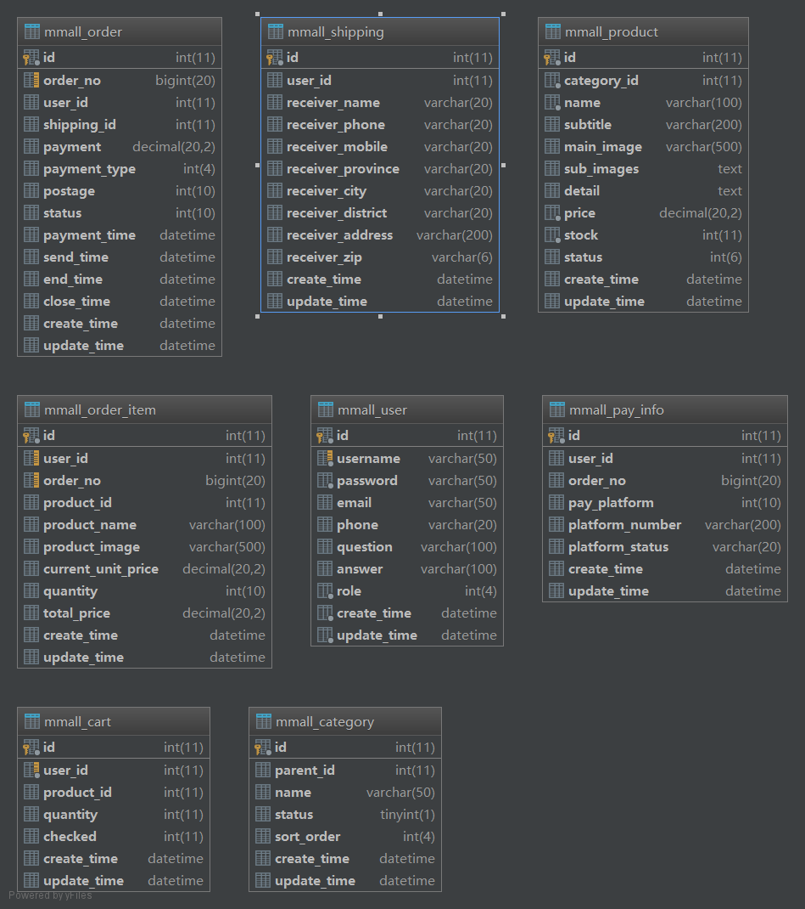

# mmall 笔记

​	linux 环境为 centos7 64 位

## 1 更新yum源

​	准备 : 更新 yum 源,使用阿里云提供的源 . [源教程](https://mirrors.aliyun.com/help/centos)

```sh
#1 备份
mv /etc/yum.repos.d/CentOS-Base.repo /etc/yum.repos.d/CentOS-Base.repo.backup
#2 下载源配置
wget -O /etc/yum.repos.d/CentOS-Base.repo http://mirrors.aliyun.com/repo/Centos-7.repo
#3 生成缓存
yum makecache
```

## 2 maven 常用命令

centos版本下载地址 : https://mirrors.aliyun.com/apache/maven/maven-3/3.5.2/binaries/apache-maven-3.5.2-bin.tar.gz

```sh
mvn clean		
mvn compile
mvn package
mvn package -Dmaven.test.skip=true		# 跳过单元测试
```
## 3 搭建ftp服务器 -- vsftpd

​	vsftpd : 开 源的ftp文件服务器

**1 安装**

```sh
yum -y install vsftpd
```

**2 centos 添加新用户并设置密码**

```sh
useradd ftpuser
passwd ftpuser
# 密码设置为 : ftp135246
```

**3 防火墙放行 21 端口**

​	 centos 6.5 下的操作

```sh
/sbin/iptables -I INPUT -p tcp --dport 21 -j ACCEPT 
/etc/rc.d/init.d/iptables save 
/etc/rc.d/init.d/iptables restart 
```

​	centos 7 下的操作

```sh
# 开放端口
firewall-cmd --zone=public --add-port=21/tcp --permanent
# 重启防火墙
systemctl restart firewalld.service
```

**4 设置访问权限**

```sh
setsebool -P allow_ftpd_full_access on
setsebool -P ftp_home_dir on

# 查看设置结果
[root@localhost apache-maven-3.5.2]# getsebool -a | grep ftp
ftp_home_dir --> on
ftpd_anon_write --> off
ftpd_connect_all_unreserved --> off
ftpd_connect_db --> off
ftpd_full_access --> on
ftpd_use_cifs --> off
ftpd_use_fusefs --> off
ftpd_use_nfs --> off
ftpd_use_passive_mode --> off
httpd_can_connect_ftp --> off
httpd_enable_ftp_server --> off
```

**5 配置ftp**

```sh
vim /etc/vsftpd/vsftpd.conf
```

```properties
本项目要用到的配置项：
#(当本地用户登入时，将被更换到定义的目录下，默认值为各用户的家目录) 
local_root=/ftpfile
#(使用匿名登入时，所登入的目录) 
anon_root=/ftpfile

#(默认是GMT时间，改成使用本机系统时间)
use_localtime=YES

#(不允许匿名用户登录)
anonymous_enable=NO

#(允许本地用户登录)
local_enable=YES

#(本地用户可以在自己家目录中进行读写操作)
write_enable=YES

#(本地用户新增档案时的umask值)
local_umask=022

#(如果启动这个选项，那么使用者第一次进入一个目录时，会检查该目录下是否有.message这个档案，如果有，则会出现此档案的内容，通常这个档案会放置欢迎话语，或是对该目录的说明。默认值为开启)
dirmessage_enable=YES

#(是否启用上传/下载日志记录。如果启用，则上传与下载的信息将被完整纪录在xferlog_file 所定义的档案中。预设为开启。)
xferlog_enable=YES

#(指定FTP使用20端口进行数据传输，默认值为YES)
connect_from_port_20=YES

#(如果启用，则日志文件将会写成xferlog的标准格式)
xferlog_std_format=YES

#(这里用来定义欢迎话语的字符串)
ftpd_banner=Welcome to mmall FTP Server

#(用于指定用户列表文件中的用户是否允许切换到上级目录)
chroot_local_user=NO

#(设置是否启用chroot_list_file配置项指定的用户列表文件)
chroot_list_enable=YES

#(用于指定用户列表文件)
chroot_list_file=/etc/vsftpd/chroot_list

#(设置vsftpd服务器是否以standalone模式运行，以standalone模式运行是一种较好的方式，此时listen必须设置为YES，此为默认值。建议不要更改，有很多与服务器运行相关的配置命令，需要在此模式下才有效，若设置为NO，则vsftpd不是以独立的服务运行，要受到xinetd服务的管控，功能上会受到限制)
listen=YES

#(虚拟用户使用PAM认证方式，这里是设置PAM使用的名称，默认即可，与/etc/pam.d/vsftpd对应) 
pam_service_name=vsftpd

#(是否启用vsftpd.user_list文件，黑名单,白名单都可以)
userlist_enable=YES

#(被动模式使用端口范围最小值)
pasv_min_port=61001
#(被动模式使用端口范围最大值)
pasv_max_port=62000

pasv_enable=YES
```

​	FTP协议有两种工作方式：PORT方式和PASV方式，中文意思为主动式和被动式。

1. PORT（主动）方式的连接过程是：客户端向服务器的FTP端口（默认是21）发送连接请求，服务器接受连接，建立一条命令链路。 

   当需要传送数据时，客户端在命令链路上用 PORT命令告诉服务器：“我打开了端口，你过来连接我”。于是服务器从20端口向客户端的端口发送连接请求，建立一条数据链路来传送数据。


1. PASV（被动）方式的连接过程是：客户端向服务器的FTP端口（默认是21）发送连接请求，服务器接受连接，建立一条命令链路。 

   当需要传送数据时，服务器在命令链路上用 PASV命令告诉客户端：“我打开了端口，你过来连接我”。于是客户端向服务器的端口发送连接请求，建立一条数据链路来传送数据。

   **两种方式的命令链路连接方法是一样的，而数据链路的建立方法就完全不同**


​	**批量放行端口 :**

```sh
firewall-cmd --zone=public --add-port=61001-62000/tcp --permanent
```

**6 设置 ftp 开机启动**

```sh
systemctl enable vsftpd.service
# 或
chkconfig vsftpd on

# 创建文件夹
mkdir -p /etc/vsftpd/chroot_list
```

​	常用linux命令 :

```sh
systemctl stop firewalld.service 		#停止
systemctl disable firewalld.service 	#禁止开机启动
systemctl restart iptables.service 		#开启
systemctl enable iptables.service 		#开机启动

firewall-cmd --state		 		##查看防火墙状态，是否是running
firewall-cmd --reload 				##重新载入配置，比如添加规则之后，需要执行此命令
firewall-cmd --get-zones 			##列出支持的zone
firewall-cmd --get-services 		##列出支持的服务，在列表中的服务是放行的
firewall-cmd --query-service ftp 				##查看ftp服务是否支持，返回yes或者no
firewall-cmd --add-service=ftp 					##临时开放ftp服务
firewall-cmd --add-service=ftp --permanent 		##永久开放ftp服务
firewall-cmd --remove-service=ftp --permanent 	##永久移除ftp服务
firewall-cmd --add-port=80/tcp --permanent 		##永久添加80端口
iptables -L -n 									##查看规则，这个命令是和iptables的相同的
man firewall-cmd 								##查看帮助
```

## 4 nginx

### 1 安装

1 安装依赖

```
yum -y install gcc-c++ pcre-devel openssl openssl-devel 
```

2 下载 nginx 

```
http://nginx.org/download/nginx-1.10.3.tar.gz
```

3 解压并安装

```sh
tar -zxf nginx-1.10.3.tar.gz
# 进入解压目录
./configure
make && make install
```

>1. 从日志 `nginx path prefix: "/usr/local/nginx"` 可看出 nginx 默认会被安装到 /usr/local/nginx 目录下
>2. 如果要指定安装路径 , 则要使用如下命令 : `./configure --prefix=/usr/local/src/nginx` ,则会安装在 /usr/local/src/nginx 目录下
>3. `/usr/local/nginx/sbin/nginx -V`   命令可查看添加的哪些第三方模块

4 nginx 常用命令

​	注意一下命令需要切换到安装目录的sbin目录 , 即 `/usr/local/nginx/sbin`

```sh
nginx -t			# 测试配置文件是否正确
nginx -s reload 	# 重启命令

ps -ef | grep nginx  # 查看 nginx 运行
```

5 放行80端口

```sh
# 开放端口
firewall-cmd --zone=public --add-port=80/tcp --permanent
# 重启防火墙
systemctl restart firewalld.service
```

### 2 配置nginx

```sh
[root@localhost local]# mkdir -p /usr/local/nginx/conf/vhost
[root@localhost local]# vim /usr/local/nginx/conf/nginx.conf
```

> /usr/local/nginx/conf/vhost  目录用于存放自定义配置的文件

​	在 nginx.conf 的文件中, server 节点后添加如下内容

```sh
include vhost/*.conf
```

​	配置后的文件结构大致如下:

```sh
http
{
 server{}
 include vhost/*.conf   # 增加的内容
}
```

​	vhost 的目录结构如下:

```sh
[root@localhost vhost]# tree
.
├── admin.happymmall.com.conf
├── happymmall.com.conf
├── img.happymmall.com.conf
├── learning.happymmall.com.conf
└── s.happymmall.com.conf
```

**admin.happymmall.com.conf**

```json
server {
	listen 80;
	autoindex on;
	server_name admin.happymmall.com;
	access_log /usr/local/nginx/logs/access.log combined;
	index index.html index.htm index.jsp index.php;
	#root /devsoft/apache-tomcat-7.0.73/webapps/mmall;
	#error_page 404 /404.html;
    
  	if ( $query_string ~* ".*[\;'\<\>].*" ){
      	return 404;
    }

    location = / {
        root /product/front/mmall_admin_fe/dist/view;
        index index.html;
    }

    location ~ .*\.(html|htm)$ {
        root /product/front/mmall_admin_fe/dist/view;
        index index.html;
    }

    location / {
        proxy_pass http://127.0.0.1:8080/;
        add_header Access-Control-Allow-Origin '*';
    }
}
```

**happymmall.com.conf**

```js
server {
    listen 80;
    autoindex on;
    server_name happymmall.com www.happymmall.com;
    access_log /usr/local/nginx/logs/access.log combined;
    index index.html index.htm index.jsp index.php;
    if ( $query_string ~* ".*[\;'\<\>].*" ){
      	return 404;
    }

    location = / {
        root /product/front/mmall_fe/dist/view;
      	index index.html;
    }

    location ~ .*\.html$ {
        root /product/front/mmall_fe/dist/view;
        index index.html;
    }

    location / {
      	proxy_pass http://127.0.0.1:8080/;
    }

    location ~ .*\.(gif|jpg|jpeg|png|bmp|swf|flv|ico)$ {
        proxy_pass http://127.0.0.1:8080;
        expires 30d;
    }

    location ~ .*\.(js|css)?$ {
    	proxy_pass http://127.0.0.1:8080;
    	expires 7d;
	}
}
```

> 即指向端口又指向目录

**img.happymmall.com.conf**

```sh
server {
    listen 80;
    autoindex off;
    server_name img.happymmall.com;
    access_log /usr/local/nginx/logs/access.log combined;
    index index.html index.htm index.jsp index.php;
    #error_page 404 /404.html;
    if ( $query_string ~* ".*[\;'\<\>].*" ){
        return 404;
    }

    location ~ /(mmall_fe|mmall_admin_fe)/dist/view/* {
        deny all;
    }

    location / {
        root /product/ftpfile/img/;
        add_header Access-Control-Allow-Origin *;
    }
}
```

> 指向目录

**learning.happymmall.com.conf **

```js
server {
    default_type 'text/html';
    charset utf-8;
    listen 80;
    autoindex on;
    server_name learning.happymmall.com;
    access_log /usr/local/nginx/logs/access.log combined;
    index index.html index.htm index.jsp index.php;
    #error_page 404 /404.html;
    if ( $query_string ~* ".*[\;'\<\>].*" ){
        return 404;
    }

    location ~ /(mmall_fe|mmall_admin_fe)/dist/view/* {
        deny all;
    }

    location / {
        root /product/ftpfile/learning/;
        add_header Access-Control-Allow-Origin *;
    }
}
```

> 指向端口

**s.happymmall.com.conf**

```js
server {
    listen 80;
    autoindex off;
    server_name s.happymmall.com;
    access_log /usr/local/nginx/logs/access.log combined;
    index index.html index.htm index.jsp index.php;
    if ( $query_string ~* ".*[\;'\<\>].*" ){
        return 404;
    }

    location ~ /(mmall_fe|mmall_admin_fe)/dist/view/* {
        deny all;
    }

    location / {
        root /product/front/;
        add_header Access-Control-Allow-Origin *;
    }
}
```

> 指向目录

### 3 修改主机的hosts文件

​	略... 

## 5 mysql 操作

1 新建用户

```mysql
insert into mysql.user(Host,User,Password) values("localhost","fmi110",password('123456'))
flush privileges;
```

2 为用户授权

```mysql
-- 创建一个数据库
create database mmall;
-- 授予对mmall数据库的所有权限(本地操作)
grant all privileges on mmall.* to fmi110@localhost identified by '123456';
flush privileges;

-- 只授予增,查,改权限
grant select,update,insert on mmall.* to fmi110@localhost identified by '123456';

-- 删除用户
delete from user where User="fmi110" and Host="localhost";
flush privileges;
```

## 6 git 安装

​	[下载地址](https://codeload.github.com/git/git/tar.gz/v2.16.1)

**1 下载**

```sh
# 下载
wget https://codeload.github.com/git/git/tar.gz/v2.16.1
# 重命名文件
mv v2.16.1 git-2.16.1.tar.gz
```

**2 安装依赖**

```sh
yum -y install zlib-belev openssl-devel cpio expat-devel gettext-devel curl-devel perl-ExtUtils-CBuilder perl-ExtUtils-MakeMaker
```

**3 解压压缩包并安装**

```sh
#1 进入下载目录,解压
tar -zxf git-2.16.1.tar.gz
#2 进入解压目录,编译文件
make prefix=/usr/local/src all
#3 安装
make prefix=/usr/local/src install
#4 查看版本号
git --version
```

git 常用配置

```sh
# 配置用户名
git config --global user.name "fmi110"
# 配置邮箱
git config --golbal user.email "1009225458@qq.com"
# (安装了KDiff3 时)
git config --global merge.tool "kdiff3"
# 让git不要管Windows/Unix 换行符转换的事
git config --global core.autocrlf false

# 编码配置
git config --global gui.encoding utf-8   # gui 中文乱码
git config --global core.quotepath off	# git status 显示中文文件名乱码

# windows 上配置忽略大小写
git config --global core.ignorecase false
```


git ssh key pair 公钥生成

```sh
#1 在Git Bash(windows下)或 linux 命令窗口
ssh-keygen -t rsa -C "1009225458@qq.com"
#2
一路回车确认
#3
ssh-agent bash  (windows下报不能连接到 authentication agent 时执行)
ssh-add ~/.ssh/id_rsa

# 查看公钥
cat ~/.ssh/id_rsa.pub
##### 以下内容就是生成的公钥 ######
ssh-rsa AAAAB3NzaC1yc2EAAAADAQABAAABAQDsNdAHdlfwetydAfMCM+iikelUkPn3IAFEvtynIKMlI2MORGiZFG+WX01i29sewGg1wcLpEVt89aOVI/yuPpwa/p6/ktHYL9stYuA63RQSAIIEzcMe9BtjadlFbWpvf1PMfdXaqgH3TPFfwUXn2e0Q+io5dL2wiOlpRSf0WbJqJ14TueL7cQuc9oG27Ce7pfP9x/eWvYYeIuCXCvuK/UQowiD+ARtJMr8WYDvHxiWv1hds+WwzcdaH4B15BGk2Z3nj5v6tAG+/mF4zUZBE3W9SQIhQ5EINirdloq9JX/OxRpiomKRxUTkmlSb1E6z+jPoYbcf3U7Y9VhFMF9GExIgr 1009225458@qq.com

```

git 常用命令

```sh
# 查看版本
git --version
# 切换分支
git checkout 分支名
# 拉取
git pull
# 提交
git push
```
## 7 表设计



### 1 购物车

```mysql
CREATE TABLE `mmall_cart` (
  `id` int(11) NOT NULL AUTO_INCREMENT,
  `user_id` int(11) NOT NULL,
  `product_id` int(11) DEFAULT NULL COMMENT '商品id',
  `quantity` int(11) DEFAULT NULL COMMENT '数量',
  `checked` int(11) DEFAULT NULL COMMENT '是否选择,1=已勾选,0=未勾选',
  `create_time` datetime DEFAULT NULL COMMENT '创建时间',
  `update_time` datetime DEFAULT NULL COMMENT '更新时间',
  PRIMARY KEY (`id`),
  KEY `user_id_index` (`user_id`) USING BTREE
) ENGINE=InnoDB AUTO_INCREMENT=146 DEFAULT CHARSET=utf8;
```

### 2 分类表

```mysql
CREATE TABLE `mmall_category` (
  `id` int(11) NOT NULL AUTO_INCREMENT COMMENT '类别Id',
  `parent_id` int(11) DEFAULT NULL COMMENT '父类别id当id=0时说明是根节点,一级类别',
  `name` varchar(50) DEFAULT NULL COMMENT '类别名称',
  `status` tinyint(1) DEFAULT '1' COMMENT '类别状态1-正常,2-已废弃',
  `sort_order` int(4) DEFAULT NULL COMMENT '排序编号,同类展示顺序,数值相等则自然排序',
  `create_time` datetime DEFAULT NULL COMMENT '创建时间',
  `update_time` datetime DEFAULT NULL COMMENT '更新时间',
  PRIMARY KEY (`id`)
) ENGINE=InnoDB AUTO_INCREMENT=100032 DEFAULT CHARSET=utf8;
```

### 3 订单表

```mysql
CREATE TABLE `mmall_order` (
  `id` int(11) NOT NULL AUTO_INCREMENT COMMENT '订单id',
  `order_no` bigint(20) DEFAULT NULL COMMENT '订单号',
  `user_id` int(11) DEFAULT NULL COMMENT '用户id',
  `shipping_id` int(11) DEFAULT NULL,
  `payment` decimal(20,2) DEFAULT NULL COMMENT '实际付款金额,单位是元,保留两位小数',
  `payment_type` int(4) DEFAULT NULL COMMENT '支付类型,1-在线支付',
  `postage` int(10) DEFAULT NULL COMMENT '运费,单位是元',
  `status` int(10) DEFAULT NULL COMMENT '订单状态:0-已取消-10-未付款，20-已付款，40-已发货，50-交易成功，60-交易关闭',
  `payment_time` datetime DEFAULT NULL COMMENT '支付时间',
  `send_time` datetime DEFAULT NULL COMMENT '发货时间',
  `end_time` datetime DEFAULT NULL COMMENT '交易完成时间',
  `close_time` datetime DEFAULT NULL COMMENT '交易关闭时间',
  `create_time` datetime DEFAULT NULL COMMENT '创建时间',
  `update_time` datetime DEFAULT NULL COMMENT '更新时间',
  PRIMARY KEY (`id`),
  UNIQUE KEY `order_no_index` (`order_no`) USING BTREE
) ENGINE=InnoDB AUTO_INCREMENT=118 DEFAULT CHARSET=utf8;
```

### 4 订单明细表

```mysql
CREATE TABLE `mmall_order_item` (
  `id` int(11) NOT NULL AUTO_INCREMENT COMMENT '订单子表id',
  `user_id` int(11) DEFAULT NULL,
  `order_no` bigint(20) DEFAULT NULL,
  `product_id` int(11) DEFAULT NULL COMMENT '商品id',
  `product_name` varchar(100) DEFAULT NULL COMMENT '商品名称',
  `product_image` varchar(500) DEFAULT NULL COMMENT '商品图片地址',
  `current_unit_price` decimal(20,2) DEFAULT NULL COMMENT '生成订单时的商品单价，单位是元,保留两位小数',
  `quantity` int(10) DEFAULT NULL COMMENT '商品数量',
  `total_price` decimal(20,2) DEFAULT NULL COMMENT '商品总价,单位是元,保留两位小数',
  `create_time` datetime DEFAULT NULL,
  `update_time` datetime DEFAULT NULL,
  PRIMARY KEY (`id`),
  KEY `order_no_index` (`order_no`) USING BTREE,
  KEY `order_no_user_id_index` (`user_id`,`order_no`) USING BTREE
) ENGINE=InnoDB AUTO_INCREMENT=135 DEFAULT CHARSET=utf8;
```

> `product_image`  记录的是商品的主图,一个商品有多张图片,我们在订单明细里只记录主图

### 5 支付信息表

```mysql
CREATE TABLE `mmall_pay_info` (
  `id` int(11) NOT NULL AUTO_INCREMENT,
  `user_id` int(11) DEFAULT NULL COMMENT '用户id',
  `order_no` bigint(20) DEFAULT NULL COMMENT '订单号',
  `pay_platform` int(10) DEFAULT NULL COMMENT '支付平台:1-支付宝,2-微信',
  `platform_number` varchar(200) DEFAULT NULL COMMENT '支付宝支付流水号',
  `platform_status` varchar(20) DEFAULT NULL COMMENT '支付宝支付状态',
  `create_time` datetime DEFAULT NULL COMMENT '创建时间',
  `update_time` datetime DEFAULT NULL COMMENT '更新时间',
  PRIMARY KEY (`id`)
) ENGINE=InnoDB AUTO_INCREMENT=61 DEFAULT CHARSET=utf8;
```

### 6 商品表

```mysql
CREATE TABLE `mmall_product` (
  `id` int(11) NOT NULL AUTO_INCREMENT COMMENT '商品id',
  `category_id` int(11) NOT NULL COMMENT '分类id,对应mmall_category表的主键',
  `name` varchar(100) NOT NULL COMMENT '商品名称',
  `subtitle` varchar(200) DEFAULT NULL COMMENT '商品副标题',
  `main_image` varchar(500) DEFAULT NULL COMMENT '产品主图,url相对地址',
  `sub_images` text COMMENT '图片地址,json格式,扩展用',
  `detail` text COMMENT '商品详情',
  `price` decimal(20,2) NOT NULL COMMENT '价格,单位-元保留两位小数',
  `stock` int(11) NOT NULL COMMENT '库存数量',
  `status` int(6) DEFAULT '1' COMMENT '商品状态.1-在售 2-下架 3-删除',
  `create_time` datetime DEFAULT NULL COMMENT '创建时间',
  `update_time` datetime DEFAULT NULL COMMENT '更新时间',
  PRIMARY KEY (`id`)
) ENGINE=InnoDB AUTO_INCREMENT=30 DEFAULT CHARSET=utf8;
```

> `sub_images` : 商品的图片地址信息,商品可以有多张图片,这个字段用来存储图片的地址,多张图片地址转换成json字符串存储
>
> `main_image` : 商品主图 , 这里约定使用 `sub_images ` 的第一张图片地址 , 很多场景下用户只需要查看主图,所以这里增加冗余字段 , 较少逻辑代码

### 7 物流信息表

```mysql
CREATE TABLE `mmall_shipping` (
  `id` int(11) NOT NULL AUTO_INCREMENT,
  `user_id` int(11) DEFAULT NULL COMMENT '用户id',
  `receiver_name` varchar(20) DEFAULT NULL COMMENT '收货姓名',
  `receiver_phone` varchar(20) DEFAULT NULL COMMENT '收货固定电话',
  `receiver_mobile` varchar(20) DEFAULT NULL COMMENT '收货移动电话',
  `receiver_province` varchar(20) DEFAULT NULL COMMENT '省份',
  `receiver_city` varchar(20) DEFAULT NULL COMMENT '城市',
  `receiver_district` varchar(20) DEFAULT NULL COMMENT '区/县',
  `receiver_address` varchar(200) DEFAULT NULL COMMENT '详细地址',
  `receiver_zip` varchar(6) DEFAULT NULL COMMENT '邮编',
  `create_time` datetime DEFAULT NULL,
  `update_time` datetime DEFAULT NULL,
  PRIMARY KEY (`id`)
) ENGINE=InnoDB AUTO_INCREMENT=33 DEFAULT CHARSET=utf8;
```

### 8 用户表

```mysql
CREATE TABLE `mmall_user` (
  `id` int(11) NOT NULL AUTO_INCREMENT COMMENT '用户表id',
  `username` varchar(50) NOT NULL COMMENT '用户名',
  `password` varchar(50) NOT NULL COMMENT '用户密码，MD5加密',
  `email` varchar(50) DEFAULT NULL,
  `phone` varchar(20) DEFAULT NULL,
  `question` varchar(100) DEFAULT NULL COMMENT '找回密码问题',
  `answer` varchar(100) DEFAULT NULL COMMENT '找回密码答案',
  `role` int(4) NOT NULL COMMENT '角色0-管理员,1-普通用户',
  `create_time` datetime NOT NULL COMMENT '创建时间',
  `update_time` datetime NOT NULL COMMENT '最后一次更新时间',
  PRIMARY KEY (`id`),
  UNIQUE KEY `user_name_unique` (`username`) USING BTREE
) ENGINE=InnoDB AUTO_INCREMENT=22 DEFAULT CHARSET=utf8;
```
## 8 项目初始化

**1 数据库初始化**

​	[sql脚本下载地址](https://pan.baidu.com/s/1nw16rwP)

**2 Mybatis-generator**

​	自动生成数据库交互代码

**3  Mybatis-plugin**

​	idea 中的 Mybatis 插件 , 可以实现mybatis的接口文件和xml文件之间跳转 , 验证正确性 , 在编辑xml时提供智能提示

**4 Mybatis-pagehelper**

​	Mybatis 非常好用的分页组件

**5 git 操作** 

​	[git教程](https://www.yiibai.com/git/git_branch.html)

1. 初始化仓库   `git init`
2. 查看文件状态 `git status`
3. 添加所有文件到版本控制  `git add .`
4. 初始提交  `git commit -am '第一次提交,初始化项目' `
5. 添加远程仓库 `git remote add orgin [远程仓库地址]`
6. 与远程仓库同步  `git pull <远程仓库> <分支>`   `git pull` 
7. 推送本地到远程  `git push -u origin master` 
8. 强制推送本地到远程  `git push -u -f origin master`  , 初始提交到远程时可以这样操作 , 会覆盖远程仓库的文件 !!!
9. 本地创建分支 v1.0  `git branch v1.0 `
10. 本地分支推送到远程仓库  `git push origin v1.0:v1.0 `     远程分支名:本地分支名
11. 查看当前分支   `git branch`
12. 查看远程分支  `git branch -r`
13. 查看分支  `git branch -a`
14. 删除本地分支 v1.0  `git branch -d v1.0`
15. 拉取远程 v1.0 分支到本地并命名为 v1.0  `git checkout -b v1.0 origin/v1.0`  ,  本地不存在该分支时可执行
16. 删除远程分支  `git push origin -d v1.0`
17. 当前分支关联远程分支 v1.0  `git branch --set-upstream-to=origin/v1.0`
18. 查看本地分支和远程分支的关联情况  `git branch -vv`
19. 解除本地分支v1.0与远程分支的关联  `git branch --unset-upstream v1.0`

### 1 maven 依赖

​	pom.xml 文件

#### **1 日志**

```xml
<!-- 该依赖会自动关联依赖 slf4j-api.jar 和 logback-core.jar -->
<dependency>
    <groupId>ch.qos.logback</groupId>
    <artifactId>logback-classic</artifactId>
    <version>1.2.3</version>
</dependency>
<dependency>
    <groupId>ch.qos.logback</groupId>
    <artifactId>logback-access</artifactId>
    <version>1.2.3</version>
</dependency>
```

#### **2 servlet,jsp 依赖**

```xml
<dependency>
    <groupId>javax.servlet</groupId>
    <artifactId>servlet-api</artifactId>
    <version>2.4</version>
    <scope>provided</scope>
</dependency>
<dependency>
    <groupId>javax.servlet</groupId>
    <artifactId>jsp-api</artifactId>
    <version>2.0</version>
    <scope>provided</scope>
</dependency>
```

#### **3 spring 全家桶和测试依赖**

```xml
<dependency>
    <artifactId>spring-context</artifactId>
    <groupId>org.springframework</groupId>
    <version>4.3.12.RELEASE</version>
</dependency>
<!--javaMail 邮件发送,定时任务等的支持-->
<dependency>
    <groupId>org.springframework</groupId>
    <artifactId>spring-context-support</artifactId>
    <version>4.3.12.RELEASE</version>
</dependency>
<dependency>
    <groupId>org.springframework</groupId>
    <artifactId>spring-webmvc</artifactId>
    <version>4.3.12.RELEASE</version>
</dependency>
<!--springMVC 实现文件上传需要的依赖-->
<dependency>
    <groupId>commons-fileupload</groupId>
    <artifactId>commons-fileupload</artifactId>
    <version>1.3.1</version>
</dependency>
<!--springMVC 自动将对象转为 json 需要的依赖-->
<dependency>
    <groupId>com.fasterxml.jackson.core</groupId>
    <artifactId>jackson-databind</artifactId>
    <version>2.9.0</version>
</dependency>
<!-- spring MVC 数据格式化 @DateTimeFormat @NumberFormat 需要的依赖 -->
<dependency>
    <groupId>joda-time</groupId>
    <artifactId>joda-time</artifactId>
    <version>2.9.9</version>
</dependency>
<dependency>
    <groupId>org.springframework</groupId>
    <artifactId>spring-orm</artifactId>
    <version>4.3.12.RELEASE</version>
</dependency>

<!--切面相关-->
<dependency>
    <groupId>org.springframework</groupId>
    <artifactId>spring-aspects</artifactId>
    <version>4.3.12.RELEASE</version>
</dependency>
<!--提供 xml 与对象之间转换的支持-->
<dependency>
    <groupId>org.springframework</groupId>
    <artifactId>spring-oxm</artifactId>
    <version>4.3.12.RELEASE</version>
</dependency>
<dependency>
    <groupId>org.springframework</groupId>
    <artifactId>spring-test</artifactId>
    <version>4.3.12.RELEASE</version>
    <scope>test</scope>
</dependency>
<!-- https://mvnrepository.com/artifact/junit/junit -->
<dependency>
    <groupId>junit</groupId>
    <artifactId>junit</artifactId>
    <version>4.12</version>
    <scope>test</scope>
</dependency>
```

#### 4 数据库驱动和连接池

```xml
<dependency>
    <groupId>mysql</groupId>
    <artifactId>mysql-connector-java</artifactId>
    <version>5.1.40</version>
</dependency>
<!--阿里 druid 连接池-->
<dependency>
    <groupId>com.alibaba</groupId>
    <artifactId>druid</artifactId>
    <version>1.1.5</version>
</dependency>
```

#### 5 mybatis 及相关辅助依赖

```xml
<!-- https://mvnrepository.com/artifact/org.mybatis/mybatis -->
<dependency>
    <groupId>org.mybatis</groupId>
    <artifactId>mybatis</artifactId>
    <version>3.4.5</version>
</dependency>
<!--mybatis 和 spring 整合-->
<dependency>
    <groupId>org.mybatis</groupId>
    <artifactId>mybatis-spring</artifactId>
    <version>1.3.1</version>
</dependency>
<!--mybatis 分页插件-->
<dependency>
    <groupId>com.github.pagehelper</groupId>
    <artifactId>pagehelper</artifactId>
    <version>5.1.2</version>
</dependency>
<dependency>
    <groupId>com.github.miemiedev</groupId>
    <artifactId>mybatis-paginator</artifactId>
    <version>1.2.17</version>
</dependency>
```

#### 6 jedis

```xml
<!--redid连接客户端-->
<dependency>
    <groupId>redis.clients</groupId>
    <artifactId>jedis</artifactId>
    <version>2.9.0</version>
</dependency>
```

#### 7 ftp客户端

```xml
<!-- 连接ftp服务器的客户端依赖 -->
<dependency>
    <groupId>commons-net</groupId>
    <artifactId>commons-net</artifactId>
    <version>3.3</version>
</dependency>
```

#### 8 常用工具依赖

```xml
<!--工具类-->
<dependency>
    <groupId>org.apache.commons</groupId>
    <artifactId>commons-lang3</artifactId>
    <version>3.5</version>
</dependency>
<!--commons-fileupload 已经依赖!!-->
<!--<dependency>-->
<!--<groupId>commons-io</groupId>-->
<!--<artifactId>commons-io</artifactId>-->
<!--<version>2.4</version>-->
<!--</dependency>-->
<dependency>
    <groupId>commons-collections</groupId>
    <artifactId>commons-collections</artifactId>
    <version>3.2.2</version>
</dependency>
<dependency>
    <groupId>com.google.guava</groupId>
    <artifactId>guava</artifactId>
    <version>20.0</version>
</dependency>
<!-- id加密解密 -->
<dependency>
    <groupId>org.hashids</groupId>
    <artifactId>hashids</artifactId>
    <version>1.0.1</version>
</dependency>
<!-- base64 编码 -->
<dependency>
    <groupId>commons-codec</groupId>
    <artifactId>commons-codec</artifactId>
    <version>1.11</version>
</dependency>
```

#### 9 lombok

```xml
<!-- https://mvnrepository.com/artifact/org.projectlombok/lombok -->
<dependency>
    <groupId>org.projectlombok</groupId>
    <artifactId>lombok</artifactId>
    <version>1.16.18</version>
    <scope>provided</scope>
</dependency>
```

#### 10 swagger2

```xml
<!--Swagger2 依赖-->
<dependency>
    <groupId>io.springfox</groupId>
    <artifactId>springfox-swagger2</artifactId>
    <version>2.2.2</version>
</dependency>
<dependency>
    <groupId>io.springfox</groupId>
    <artifactId>springfox-swagger-ui</artifactId>
    <version>2.2.2</version>
</dependency>
<!-- https://mvnrepository.com/artifact/io.github.swagger2markup/swagger2markup -->
<dependency>
    <groupId>io.github.swagger2markup</groupId>
    <artifactId>swagger2markup</artifactId>
    <version>1.3.1</version>
</dependency>
```

### 2 maven 插件

​	使用到的插件 :

1. mybatis 代码生成插件
2. maven 编译打包插件
3. tomcat 插件
4. swagger2 静态文档生成插件

```xml
<build>
    <finalName>mmall</finalName>
    <plugins>
      
        <plugin>
            <groupId>org.mybatis.generator</groupId>
            <artifactId>mybatis-generator-maven-plugin</artifactId>
            <version>1.3.2</version>
            <configuration>
                <!--配置文件的位置-->
                <!--<configurationFile>src/main/java/generatorConfig.xml</configurationFile>-->
                <verbose>true</verbose>
                <overwrite>true</overwrite>
            </configuration>
            <dependencies>
                <dependency>
                    <!--插件单独指定依赖驱动jar,否则报找不到驱动异常-->
                    <groupId>mysql</groupId>
                    <artifactId>mysql-connector-java</artifactId>
                    <version>5.1.40</version>
                </dependency>
            </dependencies>
        </plugin>
      
        <plugin>
            <groupId>org.apache.maven.plugins</groupId>
            <artifactId>maven-compiler-plugin</artifactId>
            <version>3.6.2</version>
            <configuration>
                <source>1.8</source>
                <target>1.8</target>
                <encoding>UTF-8</encoding>
                <!--项目中在 lib 目录下放置 jar 时需声明,否则打包时jar丢失-->
                <compilerArguments>
                    <extdirs>${project.basedir}/src/main/webapp/WEB-INF/lib</extdirs>
                </compilerArguments>
            </configuration>
        </plugin>
      
        <plugin>
            <groupId>org.apache.tomcat.maven</groupId>
            <artifactId>tomcat7-maven-plugin</artifactId>
            <version>2.2</version>
            <configuration>
                <!-- 配置上下文路径和端口号 -->
                <path>/</path>
                <port>8080</port>
            </configuration>
        </plugin>
      
        <!--接口静态文档生成插件-->
        <plugin>
            <groupId>io.github.swagger2markup</groupId>
            <artifactId>swagger2markup-maven-plugin</artifactId>
            <version>1.3.1</version>
            <configuration>
                <!--指定项目中 swagger2 文档的 url-->
                <swaggerInput>
                    http://localhost:8080/v2/api-docs
                </swaggerInput>
                <!--生成多个文件,放置在指定目录下-->
                <!--<outputDir>docs/asciidoc/generated/all</outputDir>-->
                <!--生成单个文件,文件名为 api-->
                <outputFile>docs/asciidoc/generated/api</outputFile>
                <config>
                    <!--指定生成的文档类型,可选 : ASCIIDOC、MARKDOWN、CONFLUENCE-->
                    <swagger2markup.markupLanguage>MARKDOWN</swagger2markup.markupLanguage>
                </config>
            </configuration>
        </plugin>
        <!--将swagger2markup生成的 asciidoc 文件转成 html 插件-->
        <plugin>
            <groupId>org.asciidoctor</groupId>
            <artifactId>asciidoctor-maven-plugin</artifactId>
            <version>1.5.6</version>
            <configuration>
                <!--源文件目录-->
                <sourceDirectory>docs/asciidoc/generated</sourceDirectory>
                <!--输出目录-->
                <outputDirectory>docs/asciidoc/html</outputDirectory>
                <backend>html</backend>
                <sourceHighlighter>coderay</sourceHighlighter>
                <attributes>
                    <toc>left</toc>
                </attributes>
            </configuration>
        </plugin>
      
    </plugins>
</build>
```

### 3 web.xml

```xml
<?xml version="1.0" encoding="UTF-8"?>
<web-app xmlns:xsi="http://www.w3.org/2001/XMLSchema-instance"
         xmlns="http://java.sun.com/xml/ns/javaee"
         xsi:schemaLocation="http://java.sun.com/xml/ns/javaee http://java.sun.com/xml/ns/javaee/web-app_2_5.xsd"
         id="WebApp_ID" version="2.5">
    <display-name>mmall</display-name>
    <welcome-file-list>
        <welcome-file>index.html</welcome-file>
        <welcome-file>index.htm</welcome-file>
        <welcome-file>index.jsp</welcome-file>
    </welcome-file-list>

    <listener>
        <listener-class>org.springframework.web.context.ContextLoaderListener</listener-class>
    </listener>
    <context-param>
        <param-name>contextConfigLocation</param-name>
        <param-value>classpath*:applicationContext*.xml</param-value>
    </context-param>

    <filter>
        <filter-name>characterEncodingFilter</filter-name>
        <filter-class>org.springframework.web.filter.CharacterEncodingFilter</filter-class>
        <init-param>
            <param-name>encoding</param-name>
            <param-value>UTF-8</param-value>
        </init-param>
    </filter>
    <filter-mapping>
        <filter-name>characterEncodingFilter</filter-name>
        <url-pattern>/*</url-pattern>
    </filter-mapping>

    <servlet>
        <servlet-name>dispatcher</servlet-name>
        <servlet-class>org.springframework.web.servlet.DispatcherServlet</servlet-class>
        <!--springmvc 配置文件 默认是 WEB-INF 目录下的 [servlet-name]-servlet.xml 文件-->
        <init-param>
            <param-name>contextConfigLocation</param-name>
            <param-value>classpath:springmvc-config.xml</param-value>
        </init-param>
        <load-on-startup>1</load-on-startup>
    </servlet>
    <servlet-mapping>
        <servlet-name>dispatcher</servlet-name>
        <!-- "/" 写法不会覆盖默认的servlet , "/*" 会导致静态资源无法访问 , 需要另外配置 -->
        <url-pattern>/</url-pattern>
    </servlet-mapping>

    <!--########### druid 数据库连接池监测配置 ################-->
    <!--阿里 druid 连接池监控-->
    <servlet>
        <servlet-name>DruidStatView</servlet-name>
        <servlet-class>com.alibaba.druid.support.http.StatViewServlet</servlet-class>
    </servlet>
    <servlet-mapping>
        <servlet-name>DruidStatView</servlet-name>
        <url-pattern>/druid/*</url-pattern>
    </servlet-mapping>
    <filter>
        <filter-name>druidWebStatFilter</filter-name>
        <filter-class>com.alibaba.druid.support.http.WebStatFilter</filter-class>
        <init-param>
            <!--排除一些不必要的url-->
            <param-name>exclusions</param-name>
            <param-value>/public/*,*.js,*.css,/druid*,*.jsp,*.swf</param-value>
        </init-param>
        <init-param>
            <!--让 druid 从session 中读取 user 的信息 , key 为 user-->
            <param-name>principalSessionName</param-name>
            <param-value>user</param-value>
        </init-param>
        <init-param>
            <!--配置profileEnable能够监控单个url调用的sql列表-->
            <param-name>profileEnable</param-name>
            <param-value>true</param-value>
        </init-param>
    </filter>
    <filter-mapping>
        <filter-name>druidWebStatFilter</filter-name>
        <url-pattern>/*</url-pattern>
    </filter-mapping>
</web-app>
```

### 4 springmvc-config.xml

```xml
<?xml version="1.0" encoding="UTF-8"?>
<beans xmlns="http://www.springframework.org/schema/beans"
       xmlns:xsi="http://www.w3.org/2001/XMLSchema-instance"
       xmlns:mvc="http://www.springframework.org/schema/mvc"
       xmlns:context="http://www.springframework.org/schema/context"
       xsi:schemaLocation="http://www.springframework.org/schema/beans
                        http://www.springframework.org/schema/beans/spring-beans-4.0.xsd
                        http://www.springframework.org/schema/mvc
                        http://www.springframework.org/schema/mvc/spring-mvc-4.0.xsd
                        http://www.springframework.org/schema/context
                        http://www.springframework.org/schema/context/spring-context-4.0.xsd">
    <!-- 设置使用注解的类所在的jar包 -->
    <context:component-scan base-package="com.fmi110.mmall.controller"/>
    <mvc:annotation-driven/>
    <!--静态资源交给 defaultServlet 处理,否则访问静态资源会 404-->
    <mvc:default-servlet-handler/>

    <!--spring 整合 swagger2-->
    <bean id="swagger2Config"
          class="springfox.documentation.swagger2.configuration.Swagger2DocumentationConfiguration"/>
    <mvc:resources location="classpath*:/META-INF/resources/" mapping="swagger-ui.html"/>
    <mvc:resources location="classpath*:/META-INF/resources/webjars/" mapping="/webjars/**"/>
</beans>
```

### 5 applicationContext.xml

```xml
<?xml version="1.0" encoding="UTF-8"?>
<beans xmlns="http://www.springframework.org/schema/beans"
       xmlns:xsi="http://www.w3.org/2001/XMLSchema-instance"
       xmlns:context="http://www.springframework.org/schema/context"
       xmlns:tx="http://www.springframework.org/schema/tx"
       xsi:schemaLocation="http://www.springframework.org/schema/beans
       http://www.springframework.org/schema/beans/spring-beans-4.2.xsd
		http://www.springframework.org/schema/context
		http://www.springframework.org/schema/context/spring-context-4.2.xsd
		http://www.springframework.org/schema/tx
		http://www.springframework.org/schema/tx/spring-tx-4.2.xsd">

    <!-- 声明使用占位符 , 并指定占位符文件位置 -->
    <context:property-placeholder location="classpath:jdbc.properties"/>
    <!-- 开启注解扫描 -->
    <context:component-scan base-package="com.fmi110.mmall.service,com.fmi110.mmall.dao"/>

    <!-- 1 使用druid数据库连接池注册数据源 -->
    <bean id="dataSource" class="com.alibaba.druid.pool.DruidDataSource">
        <!-- 基础配置 -->
        <property name="url" value="${jdbc.url}"></property>
        <property name="driverClassName" value="${jdbc.driver}"></property>
        <property name="username" value="${jdbc.user}"></property>
        <property name="password" value="${jdbc.password}"></property>

        <!-- 关键配置 -->
        <!-- 初始化时建立物理连接的个数。初始化发生在显示调用init方法，或者第一次getConnection时 -->
        <property name="initialSize" value="3"/>
        <!-- 最小连接池数量 -->
        <property name="minIdle" value="2"/>
        <!-- 最大连接池数量 -->
        <property name="maxActive" value="15"/>
        <!-- 配置获取连接等待超时的时间 -->
        <property name="maxWait" value="10000"/>

        <!-- 性能配置 -->
        <!-- 打开PSCache，并且指定每个连接上PSCache的大小 -->
        <property name="poolPreparedStatements" value="true"/>
        <property name="maxPoolPreparedStatementPerConnectionSize" value="20"/>

        <!-- 其他配置 -->
        <!-- 配置间隔多久才进行一次检测，检测需要关闭的空闲连接，单位是毫秒 -->
        <property name="timeBetweenEvictionRunsMillis" value="60000"/>
        <!-- 配置一个连接在池中最小生存的时间，单位是毫秒 -->
        <property name="minEvictableIdleTimeMillis" value="300000"/>
        <!--   建议配置为true，不影响性能，并且保证安全性。申请连接的时候检测，如果空闲时间大于timeBetweenEvictionRunsMillis，
                  执行validationQuery检测连接是否有效。 -->
        <property name="testWhileIdle" value="true"/>
        <!-- 这里建议配置为TRUE，防止取到的连接不可用 ,申请连接时执行validationQuery检测连接是否有效，做了这个配置会降低性能。-->
        <property name="testOnBorrow" value="true"/>
        <!-- 归还连接时执行validationQuery检测连接是否有效，做了这个配置会降低性能 -->
        <property name="testOnReturn" value="false"/>
    </bean>

    <bean id="sqlSessionFactory" class="org.mybatis.spring.SqlSessionFactoryBean">
        <property name="dataSource" ref="dataSource"/>
        <!--指定映射文件路径-->
        <property name="mapperLocations" value="classpath*:mappers/*Mapper.xml"/>
        <!--分页插件-->
        <property name="plugins">
            <array>
                <bean class="com.github.pagehelper.PageInterceptor">
                    <!-- pagehelper 5.x 的配置跟 4.x 已经不同,具体参考文档-->
                    <!-- https://pagehelper.github.io/docs/howtouse/ -->
                    <property name="properties">
                        <value>
                            helperDialect=mysql
                            reasonable=true
                            supportMethodsArguments=true
                            params=count=countSql
                            autoRuntimeDialect=true
                        </value>
                    </property>
                </bean>
            </array>
        </property>
    </bean>
    <!--配置mapper接口的扫描-->
    <bean name="mapperScannerConfiguerer" class="org.mybatis.spring.mapper.MapperScannerConfigurer">
        <property name="basePackage" value="com.fmi110.mmall.dao"/>
    </bean>

    <tx:annotation-driven transaction-manager="transactionManager" proxy-target-class="true"/>

    <bean id="transactionManager" class="org.springframework.jdbc.datasource.DataSourceTransactionManager">
        <property name="dataSource" ref="dataSource"/>
        <property name="rollbackOnCommitFailure" value="true"/>
    </bean>
</beans>
```

### 6 jdbc.properties

```properties
jdbc.url=jdbc:mysql://127.0.0.1:3306/mmall?autoReconnect=true&useUnicode=true&characterEncoding=utf8&zeroDateTimeBehavior=convertToNull
jdbc.driver=com.mysql.jdbc.Driver
jdbc.user=root
jdbc.password=
```

### 7 logback.xml

```xml
<?xml version="1.0" encoding="UTF-8" ?>
<configuration>
    <!--定义日志文件的存储地址 勿在 LogBack 的配置中使用相对路径 -->
    <property name="LOG_HOME" value="c:/00_mmall_log"/>
    <property name="appName" value="mmall"/>

    <!-- 设置应用的名字 -->
    <contextName>${appName}</contextName>

    <appender name="consoleLog" class="ch.qos.logback.core.ConsoleAppender">
        <encoder>
            <pattern>
                %d{yyyy-MM-dd HH:mm:ss} %5p %c{1}:%L - %m%n
            </pattern>
        </encoder>
    </appender>

    <appender name="fileInfoLog" class="ch.qos.logback.core.rolling.RollingFileAppender">
        <!--只输出 info , warn 级别日志(error 级别被过滤掉了)-->
        <filter class="ch.qos.logback.classic.filter.LevelFilter">
            <level>ERROR</level>
            <onMatch>DENY</onMatch>
            <onMismatch>ACCEPT</onMismatch>
        </filter>

        <encoder>
            <pattern>
                %d{yyyy-MM-dd HH:mm:ss} %5p %c{1}:%L - %m%n
            </pattern>
        </encoder>

        <!--&lt;!&ndash;基于时间的滚动策略&ndash;&gt;-->
        <!--<rollingPolicy class="ch.qos.logback.core.rolling.TimeBasedRollingPolicy">-->
            <!--&lt;!&ndash;路径&ndash;&gt;-->
            <!--<fileNamePattern>${LOG_HOME}/error.%d.log</fileNamePattern>-->
            <!--&lt;!&ndash;超过30天的日志将被删除&ndash;&gt;-->
            <!--<MaxHistory>30</MaxHistory>-->
        <!--</rollingPolicy>-->
        <!--&lt;!&ndash; 基于文件大小的滚动策略&ndash;&gt;-->
        <!--<triggeringPolicy class="ch.qos.logback.core.rolling.SizeBasedTriggeringPolicy">-->
            <!--<MaxFileSize>10MB</MaxFileSize>-->
        <!--</triggeringPolicy>-->

        <!--同时基于文件大小和时间的滚动策略-->
        <rollingPolicy class="ch.qos.logback.core.rolling.SizeAndTimeBasedRollingPolicy">
            <!--路径-->
            <fileNamePattern>${LOG_HOME}/info.%d{yyyy-MM-dd}.%i.log</fileNamePattern>
            <!-- 单文件最大 50 MB,最多保存 30 天的日志内容 , 日志文件总大小不超过 20 GB -->
            <maxFileSize>50MB</maxFileSize>
            <maxHistory>30</maxHistory>
            <totalSizeCap>20GB</totalSizeCap>
        </rollingPolicy>

    </appender>

    <appender name="fileErrorLog" class="ch.qos.logback.core.rolling.RollingFileAppender">
        <!--只输出 error 级别日志-->
        <filter class="ch.qos.logback.classic.filter.ThresholdFilter">
            <level>ERROR</level>
        </filter>

        <!--同时基于文件大小和时间的滚动策略-->
        <rollingPolicy class="ch.qos.logback.core.rolling.SizeAndTimeBasedRollingPolicy">
            <!--路径-->
            <fileNamePattern>${LOG_HOME}/error.%d{yyyy-MM-dd}.%i.log</fileNamePattern>
            <!-- 单文件最大 50 MB,最多保存 60 天的日志内容 , 日志文件总大小不超过 20 GB -->
            <maxFileSize>50MB</maxFileSize>
            <maxHistory>60</maxHistory>
            <totalSizeCap>20GB</totalSizeCap>
        </rollingPolicy>

        <encoder>
            <pattern>
                %d{yyyy-MM-dd HH:mm:ss} %5p %c{1}:%L - %m%n
            </pattern>
        </encoder>

    </appender>

    <!--日志异步到数据库 -->
    <!--<appender name="DB" class="ch.qos.logback.classic.db.DBAppender">-->
        <!--&lt;!&ndash;日志异步到数据库&ndash;&gt;-->
        <!--<connectionSource class="ch.qos.logback.core.db.DriverManagerConnectionSource">-->
            <!--&lt;!&ndash;连接池&ndash;&gt;-->
            <!--<dataSource class="com.mchange.v2.c3p0.ComboPooledDataSource">-->
                <!--<driverClass>com.mysql.jdbc.Driver</driverClass>-->
                <!--<url>jdbc:mysql://127.0.0.1:3306/databaseName</url>-->
                <!--<user>root</user>-->
                <!--<password>root</password>-->
            <!--</dataSource>-->
        <!--</connectionSource>-->
    <!--</appender>-->


    <!-- 定制 Hibernate 日志 -->
    <logger name="org.hibernate.type.descriptor.sql.BasicBinder" level="TRACE"/>
    <logger name="org.hibernate.type.descriptor.sql.BasicExtractor" level="DEBUG"/>
    <logger name="org.hibernate.SQL" level="DEBUG"/>
    <logger name="org.hibernate.engine.QueryParameters" level="DEBUG"/>
    <logger name="org.hibernate.engine.query.HQLQueryPlan" level="DEBUG"/>

    <!-- 定制 mybatis 日志-->
    <logger name="com.apache.ibatis" level="TRACE"/>
    <logger name="java.sql.Connection" level="DEBUG"/>
    <logger name="java.sql.Statement" level="DEBUG"/>
    <logger name="java.sql.PreparedStatement" level="DEBUG"/>

    <root level="info">
        <appender-ref ref="consoleLog"/>
        <appender-ref ref="fileInfoLog"/>
        <appender-ref ref="fileErrorLog"/>
    </root>

</configuration>
```

### 8 .gitignore

```sh
*.class

# package ignore
*.war
*.ear

# kdiff3 ignore
*.orig

#eclipse ignore
.settings/
.project
.classpath

#idea ignore
.idea/
/idea/
*.iml
*.ipr
*.iws

# temp file ignore
*.log
*.cahce
*.diff
*.patch
*.tmp

# system ignore
.DS_Store
Thumbs.db

# maven output ignore
target/
```
### 9 generatorConfiguration.xml

​	使用 mybatis-generator 插件逆向生成 pojo 和 mapping.xml 文件

```xml
<?xml version="1.0" encoding="UTF-8"?>
<!DOCTYPE generatorConfiguration
        PUBLIC "-//mybatis.org//DTD MyBatis Generator Configuration 1.0//EN"
        "http://mybatis.org/dtd/mybatis-generator-config_1_0.dtd">

<generatorConfiguration>
    <!--
        指定数据库驱动的路径 , 使用maven 插件时可以不用,
        使用 Mybatis Plugin 插件生成代码时一定要指定,否则报找不到驱动
    -->
    <!--<classPathEntry-->
    <!--location="D:\01_MAVEN_RESPOTY\mysql\mysql-connector-java\5.1.39\mysql-connector-java-5.1.39.jar"/>-->

    <context id="sqlserverTables" targetRuntime="MyBatis3">
        <!-- 生成的pojo，将implements Serializable -->
        <plugin type="org.mybatis.generator.plugins.SerializablePlugin"></plugin>
        <commentGenerator>
            <!-- 是否去除自动生成的注释 true：是 ： false:否 -->
            <property name="suppressAllComments" value="true"/>
        </commentGenerator>

        <!-- 数据库链接URL、用户名、密码 -->
        <jdbcConnection driverClass="com.mysql.jdbc.Driver"
                        connectionURL="jdbc:mysql://localhost:3306/mmall"
                        userId="root"
                        password="">
        </jdbcConnection>

        <!-- 默认false，把JDBC DECIMAL 和 NUMERIC 类型解析为 Integer true，把JDBC DECIMAL
            和 NUMERIC 类型解析为java.math.BigDecimal -->
        <javaTypeResolver>
            <property name="forceBigDecimals" value="false"/>
        </javaTypeResolver>

        <!-- 生成model模型，对应的包路径，以及文件存放路径(targetProject)，
            targetProject可以指定具体的路径,如./src/main/java，
            也可以使用“MAVEN”来自动生成，这样生成的代码会在target/generatord-source目录下 -->
        <!--<javaModelGenerator targetPackage="com.joey.mybaties.test.pojo" targetProject="MAVEN"> -->
        <javaModelGenerator targetPackage="com.fmi110.mmall.pojo"
                            targetProject="./src/main/java">

            <property name="enableSubPackages" value="true"/>
            <!-- 从数据库返回的值被清理前后的空格 -->
            <property name="trimStrings" value="true"/>
        </javaModelGenerator>

        <!--对应的mapper.xml文件 -->
        <sqlMapGenerator targetPackage="mappers"
                         targetProject="./src/main/resources">
            <property name="enableSubPackages" value="true"/>
        </sqlMapGenerator>

        <!-- 对应的Mapper接口类文件 -->
        <javaClientGenerator type="XMLMAPPER"
                             targetPackage="com.fmi110.mmall.dao"
                             targetProject="./src/main/java">
            <property name="enableSubPackages" value="true"/>
        </javaClientGenerator>


        <!-- 列出要生成代码的所有表，这里配置的是不生成Example文件 -->

        <table tableName="mmall_shipping" domainObjectName="Shipping" enableCountByExample="false"
               enableUpdateByExample="false" enableDeleteByExample="false" enableSelectByExample="false"
               selectByExampleQueryId="false">
        </table>
        <table tableName="mmall_cart" domainObjectName="Cart" enableCountByExample="false" enableUpdateByExample="false"
               enableDeleteByExample="false" enableSelectByExample="false" selectByExampleQueryId="false">
        </table>
        <table tableName="mmall_cart_item" domainObjectName="CartItem" enableCountByExample="false"
               enableUpdateByExample="false" enableDeleteByExample="false" enableSelectByExample="false"
               selectByExampleQueryId="false"></table>
        <table tableName="mmall_category" domainObjectName="Category" enableCountByExample="false"
               enableUpdateByExample="false" enableDeleteByExample="false" enableSelectByExample="false"
               selectByExampleQueryId="false"></table>
        <table tableName="mmall_order" domainObjectName="Order" enableCountByExample="false"
               enableUpdateByExample="false" enableDeleteByExample="false" enableSelectByExample="false"
               selectByExampleQueryId="false"></table>
        <table tableName="mmall_order_item" domainObjectName="OrderItem" enableCountByExample="false"
               enableUpdateByExample="false" enableDeleteByExample="false" enableSelectByExample="false"
               selectByExampleQueryId="false"></table>
        <table tableName="mmall_pay_info" domainObjectName="PayInfo" enableCountByExample="false"
               enableUpdateByExample="false" enableDeleteByExample="false" enableSelectByExample="false"
               selectByExampleQueryId="false"></table>
        <table tableName="mmall_product" domainObjectName="Product" enableCountByExample="false"
               enableUpdateByExample="false" enableDeleteByExample="false" enableSelectByExample="false"
               selectByExampleQueryId="false">
            <!--mysql 类型为 text , 插件默认生成的类型不是String , 所以这里要强制覆盖-->
            <columnOverride column="detail" jdbcType="VARCHAR"/>
            <columnOverride column="sub_images" jdbcType="VARCHAR"/>
        </table>
        <table tableName="mmall_user" domainObjectName="User" enableCountByExample="false" enableUpdateByExample="false"
               enableDeleteByExample="false" enableSelectByExample="false" selectByExampleQueryId="false"></table>
    </context>
</generatorConfiguration>
```
## 9 用户模块

### 1 模块功能

1 模块接口

​	门户网站 : 

| 序号   | 功能                  | url  |
| ---- | ------------------- | ---- |
| 1    | 登录                  |      |
| 2    | 注册                  |      |
| 3    | 检查用户名是否有效           |      |
| 4    | 获取用户登录信息            |      |
| 5    | 忘记密码,获取问题           |      |
| 6    | 验证忘记密码问题答案          |      |
| 7    | 忘记密码的重置密码           |      |
| 8    | 登录状态的重置密码           |      |
| 9    | 登录状态更新个人信息          |      |
| 10   | 获取当前登录用户的详细信息,并强制登录 |      |
| 11   | 退出登录                |      |

​	后台管理网站 :

| 序号   | 功能    | URL  |
| ---- | ----- | ---- |
| 1    | 管理员登录 |      |


2 概念  

       	1. 横向越权 : 攻击者尝试访问同权限级别的用户的资源(a用户访问b用户的订单)
     	2. 纵向越权 : 低级别用户访问高级别权限用户的资源

3 约定

​	1.响应返回码  status :  0 -- 请求成功 ,  非0 --- 请求失败

### 2 业务层接口定义

```java
package com.fmi110.mmall.service;

import com.fmi110.mmall.commons.ServerResponse;
import com.fmi110.mmall.pojo.User;

/**
 * @author fmi110
 * @Description: 用户模块的业务接口
 * @Date 2018/2/9 14:39
 */
public interface IUserService {
    /**
     * 登录
     * <ol>
     * 		<li>校验用户名是否存在</li>
     * 		<li>检验用户名和密码是否正确</li>
     * </ol>
     *
     * @param username
     * @param password
     * @return
     */
    ServerResponse<User> login(String username, String password);

    /**
     * 注册
     * <ol>
     *     <li>检验用户名是否已存在</li>
     *     <li>校验邮箱是否已存在</li>
     *     <li>用户密码加密处理</li>
     *     <li>保存用户到数据库</li>
     * </ol>
     * @param user
     * @return
     */
    ServerResponse<String> register(User user);

    /**
     *  检查用户名或者邮箱是否有效
     * @param str
     * @param type
     * @return
     */
    ServerResponse<String> checkValid(String str, String type);

    /**
     * 忘记密码的提示问题
     * <ol>
     *     <li>校验用户名是否存在</li>
     *     <li>根据用户名获取问题</li>
     * </ol>
     * @param username
     * @return
     */
    ServerResponse selectQuestion(String username);

    /**
     * 检查忘记密码问题答案是否正确
     *  <ol>
     *      <li>验证问题答案是否正确</li>
     *      <li>随机生成一个 token 字符串,用于修改密码时校验</li>
     *  </ol>
     * @param username
     * @param question
     * @param answer
     * @return
     */
    ServerResponse<String> checkAnswer(String username, String question, String answer);

    /**
     * 忘记密码的重置密码
     * <ol>
     *     <li>校验前端传的token不为空</li>
     *     <li>校验前端传的token和后台的token是否一致</li>
     *     <li>加密前端传输的密码,然后更新密码</li>
     * </ol>
     * @param username
     * @param passwordNew
     * @param forgetToken 忘记密码的问题的答案
     * @return
     */
    ServerResponse<String> forgetResetPassword(String username, String passwordNew, String forgetToken);

    /**
     * 登录状态下重置密码
     * <ol>
     *     <li>检验旧密码正确,防止横向越权</li>
     *     <li>加密密码,然后更新</li>
     * </ol>
     * @param passwordOld
     * @param passwordNew
     * @param user
     * @return
     */
    ServerResponse<String> resetPassword(String passwordOld, String passwordNew, User user);

    /**
     * 更新用户信息 , 这里业务设定为 : 不修改用户名,不修改密码
     * <ol>
     *     <li>校验用户是否存在</li>
     *     <li>校验新邮箱是否可用</li>
     *     <li>更新用户信息</li>
     * </ol>
     * @param user
     * @return
     */
    ServerResponse<User> updateInformation(User user);

    /**
     * 获取用户信息
     * <ol>
     *     <li>用户不存在时,提示不存在</li>
     *     <li>清除用户密码,返回用户信息</li>
     * </ol>
     * @param userId
     * @return
     */
    ServerResponse<User> getInformation(Integer userId);

    /**
     * 校验是否时管理员
     * @param user
     * @return
     */
    ServerResponse checkAdminRole(User user);
}

```

### 3 控制层接口定义

```java
package com.fmi110.mmall.controller.portal;

import com.fmi110.mmall.commons.Const;
import com.fmi110.mmall.commons.ServerResponse;
import com.fmi110.mmall.pojo.User;
import com.fmi110.mmall.service.IUserService;
import io.swagger.annotations.Api;
import io.swagger.annotations.ApiImplicitParam;
import io.swagger.annotations.ApiImplicitParams;
import io.swagger.annotations.ApiOperation;
import lombok.extern.slf4j.Slf4j;
import org.springframework.beans.factory.annotation.Autowired;
import org.springframework.http.MediaType;
import org.springframework.web.bind.annotation.*;
import springfox.documentation.annotations.ApiIgnore;

import javax.servlet.http.HttpSession;

/**
 * @author fmi110
 * @Description: 用户模块
 * @Date 2018/2/9 17:30
 */
@Api(description = "用户模块-门户")
@RestController
@RequestMapping(value = "/user")
@Slf4j
public class UserController {
    @Autowired
    IUserService userService;

    @ApiOperation(value = "登录", httpMethod = "POST", consumes = MediaType.APPLICATION_FORM_URLENCODED_VALUE)
    @ApiImplicitParams({
                               @ApiImplicitParam(name = "username", value = "用户名", paramType = "form"),
                               @ApiImplicitParam(name = "password", value = "用户密码", paramType = "form")
                       })
    @RequestMapping(value = "/login", method = RequestMethod.POST)
    public ServerResponse login(String username, String password, @ApiIgnore HttpSession session) {
        ServerResponse<User> response = userService.login(username, password);
        if (response.isSuccess()) {
            session.setAttribute(Const.CURRENT_USER, response.getData());
        }
        return response;
    }

//--------------------------------------------------------------------------------------------------------  
  
    @ApiOperation(value = "注册")
    @ApiImplicitParam(name = "user", value = "用户信息实体", dataType = "User")
    @PostMapping("/register")
    public ServerResponse register(@ModelAttribute User user) {
        /**
         * todo : 使用数据校验,限定字段不能为空  validate
         */
        return userService.register(user);
    }

//--------------------------------------------------------------------------------------------------------    
  
    @ApiOperation(value = "检验数据是否可用")
    @ApiImplicitParams({
                               @ApiImplicitParam(name = "data", value = "要检验的数据", paramType = "form"),
                               @ApiImplicitParam(name = "type", value = "username 或 email", paramType = "form")
                       })
    @PostMapping("/check_valid")
  
    public ServerResponse checkValid(String data, String type) {
        return userService.checkValid(data, type);
    }

//--------------------------------------------------------------------------------------------------------  
  
    @ApiOperation(value = "获取用户信息")
    @PostMapping("get_user_info")
    public ServerResponse getUserInfo(@ApiIgnore HttpSession session) {
        User user = (User) session.getAttribute(Const.CURRENT_USER);
        if (user != null) {
            return userService.getInformation(user.getId());
        }
        return ServerResponse.createByErrorMessage("用户未登录");
    }

//--------------------------------------------------------------------------------------------------------   
  
    @ApiOperation(value = "获取忘记密码设置的问题")
    @ApiImplicitParam(name = "username", value = "用户名", paramType = "form")
    @PostMapping("forget_get_question")
    public ServerResponse forgetGetQuestion(String username) {
        return userService.selectQuestion(username);
    }

//--------------------------------------------------------------------------------------------------------    
  
    @ApiOperation(value = "校验问题答案是否正确")
    @ApiImplicitParams({
                               @ApiImplicitParam(name = "username", value = "用户名", paramType = "form"),
                               @ApiImplicitParam(name = "question", value = "忘记密码的问题", paramType = "form"),
                               @ApiImplicitParam(name = "answer", value = "忘记密码的问题的答案", paramType = "form")
                       })
    @PostMapping("forget_check_answer")
    public ServerResponse forgetCheckAnswer(String username,
                                            String question,
                                            String answer) {
        return userService.checkAnswer(username, question, answer);
    }

//--------------------------------------------------------------------------------------------------------    
  
    @ApiOperation(value = "忘记密码情况下的重置密码")
    @ApiImplicitParams({
                               @ApiImplicitParam(name = "username", value = "用户名", paramType = "form"),
                               @ApiImplicitParam(name = "passwordNew", value = "新密码", paramType = "form"),
                               @ApiImplicitParam(name = "forgetToken", value = "验证忘记问题答案正确后,后台返回的token",
                                                 paramType = "form")
                       })
    public ServerResponse forgetResetPassword(String username, String passwordNew, String forgetToken) {
        return userService.forgetResetPassword(username, passwordNew, forgetToken);
    }

//--------------------------------------------------------------------------------------------------------    
  
    @ApiOperation(value = "登录状态下重置密码")
    @ApiImplicitParams({
                               @ApiImplicitParam(name = "passwordOld", value = "旧密码", paramType = "form"),
                               @ApiImplicitParam(name = "passwordNew", value = "新密码", paramType = "form")

                       })
    @PostMapping("reset_password")
    public ServerResponse resetPwd(@ApiIgnore HttpSession session, String passwordOld, String passwordNew) {
        User user = (User) session.getAttribute(Const.CURRENT_USER);
        if (user == null) {
            return ServerResponse.createByErrorMessage("用户未登录,请先登录");
        }
        return userService.resetPassword(passwordOld, passwordNew, user);
    }

//--------------------------------------------------------------------------------------------------------    
  
    @ApiOperation(value = "更新用户信息")
    @ApiImplicitParam(name = "user", value = "用户信息实体", dataType = "User")
    @PostMapping("update_information")
    public ServerResponse updateInformation(@ApiIgnore HttpSession session, @ModelAttribute User user) {
        User currentUser = (User) session.getAttribute(Const.CURRENT_USER);
        if (currentUser == null) {
            return ServerResponse.createByErrorMessage("用户未登录,请先登录");
        }
        // 不修改名字和id
        user.setId(currentUser.getId());
        user.setUsername(currentUser.getUsername());
        return userService.updateInformation(user);
    }

//--------------------------------------------------------------------------------------------------------    
  
    @ApiOperation(value = "退出登录")
    @PostMapping("logout")
    public ServerResponse logout(@ApiIgnore HttpSession session) {
        session.removeAttribute(Const.CURRENT_USER);
        return ServerResponse.createBySuccessMessage("退出成功");
    }

    @ApiOperation(value = "单纯的测试用,为了让swagger2能显示对象的结构!!!")
    @GetMapping("zzz")
    public User test() {
        return new User();
    }
}
```

## 10 分类模块

### 1 模块功能

| 序号   | 功能                        | url  |
| ---- | ------------------------- | ---- |
| 1    | 获取品类子节点                   |      |
| 2    | 增加节点                      |      |
| 3    | 修改分类名称                    |      |
| 4    | 获取当前分类id并递归子节点 categoryId |      |

### 2 业务层接口定义

```java
package com.fmi110.mmall.service;


import com.fmi110.mmall.commons.ServerResponse;
import com.fmi110.mmall.pojo.Category;

import java.util.List;


public interface ICategoryService {
    /**
     * 添加商品分类
     *  <ol>
     *      <li>确定分类名称可用</li>
     *      <li>新建一个分类的对象插入,并设置状态可用</li>
     *  </ol>
     * @param categoryName
     * @param parentId
     * @return
     */
    ServerResponse addCategory(String categoryName, Integer parentId);

    /**
     * 更新分类名称
     *  <ol>
     *      <li>判断分类名可用</li>
     *      <li>更新分类(分类不存在时,没有更新,不用单独判断)</li>
     *  </ol>
     * @param categoryId
     * @param categoryName
     * @return
     */
    ServerResponse updateCategoryName(Integer categoryId, String categoryName);

    /**
     * 获取指定分类的子分类
     * @param categoryId
     * @return
     */
    ServerResponse<List<Category>> getChildrenParallelCategory(Integer categoryId);

    /**
     * 获取当前节点及其子节点的id
     * @param categoryId
     * @return
     */
    ServerResponse<List<Integer>> selectCategoryAndChildrenById(Integer categoryId);

}
```

## 11 商品模块

### 1 模块功能

| 序号   | 功能                     | url  |
| ---- | ---------------------- | ---- |
| 1    | 保存或更新产品                |      |
| 2    | 上/下架商品                 |      |
| 3    | 获取指定商品详情               |      |
| 4    | 分页获取商品列表               |      |
| 5    | 搜索商品                   |      |
| 6    | 根据 商品名称 + 分类 搜索商品,分页返回 |      |

### 2 接口定义

```java
package com.fmi110.mmall.service;

import com.fmi110.mmall.commons.ServerResponse;
import com.fmi110.mmall.pojo.Product;
import com.fmi110.mmall.vo.ProductDetailVo;
import com.github.pagehelper.PageInfo;

public interface IProductService {
    /**
     * 保存或更新产品
     *  <ol>
     *      <li>判断产品参数是否为空</li>
     *      <li>处理产品图片地址,多张图片地址用 "," 分隔</li>
     *      <li>获取主图地址,这里约定是第一张图片是主图</li>
     *      <li>参数有 id 时,执行更新操作,否则执行插入操作</li>
     *  </ol>
     * @param product
     * @return
     */
    ServerResponse saveOrUpdateProduct(Product product);

    /**
     * 上/下架商品
     * @param productId
     * @param status
     * @return
     */
    ServerResponse<String> setSaleStatus(Integer productId, Integer status);

    /**
     * 获取指定商品详情
     *  <ol>
     *      <li>获取 product 对象</li>
     *      <li>product 对象 --> productVo</li>
     *      <li>productVo 添加商品图片服务器地址信息</li>
     *      <li>productVo 添加商品父节点id</li>
     *  </ol>
     * @param productId
     * @return
     */
    ServerResponse<ProductDetailVo> manageProductDetail(Integer productId);

    /**
     * 分页获取商品列表
     * @param pageNum
     * @param pageSize
     * @return
     */
    ServerResponse<PageInfo> getProductList(int pageNum, int pageSize);

    /**
     * 搜索商品
     * @param productName
     * @param productId
     * @param pageNum
     * @param pageSize
     * @return
     */
    ServerResponse<PageInfo> searchProduct(String productName, Integer productId, int pageNum, int pageSize);

    /**
     * 根据 商品名称 + 分类 搜索商品,分页返回
     *  <ol>
     *      <li>分类没有时,返回空</li>
     *      <li>有分类时,需要搜索分类极其子分类</li>
     *      <li>查询到的是 product , 转为 productListVO</li>
     *  </ol>
     *
     * @param keyword
     * @param categoryId
     * @param pageNum
     * @param pageSize
     * @param orderBy
     * @return
     */
    ServerResponse<PageInfo> getProductByKeywordCategory(String keyword, Integer categoryId, int pageNum, int pageSize,
                                                         String orderBy);

}
```

## 12 购物车模块

### 1 模块功能

|      |          |                       |
| ---- | -------- | --------------------- |
| 1    | 添加商品到购物车 |                       |
| 2    | 修改商品数量   |                       |
| 3    | 移除商品     |                       |
| 4    | 清空购物车    | /cancelAllItem.action |
| 5    | 清除下架商品   |                       |
|      |          |                       |


## 13 订单模块


## 14 支付模块


## 15 物流模块