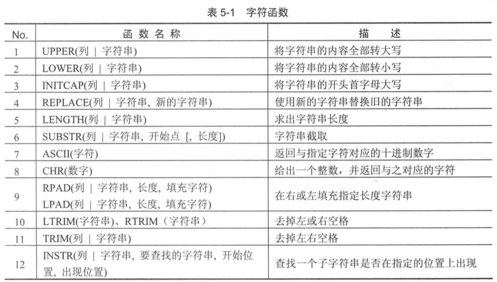
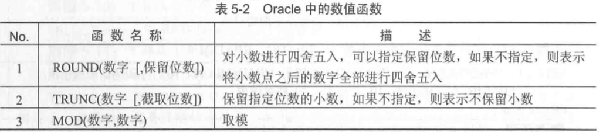
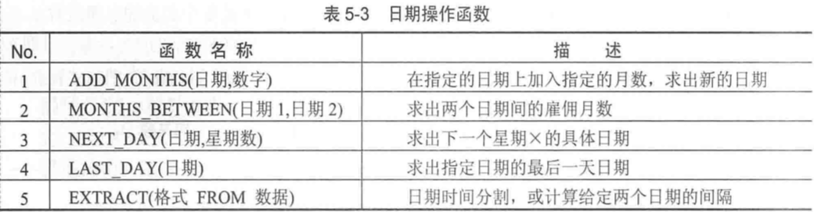
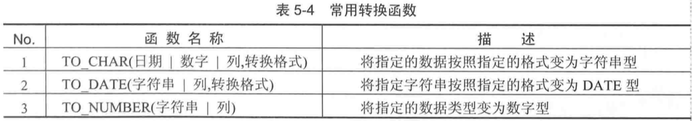
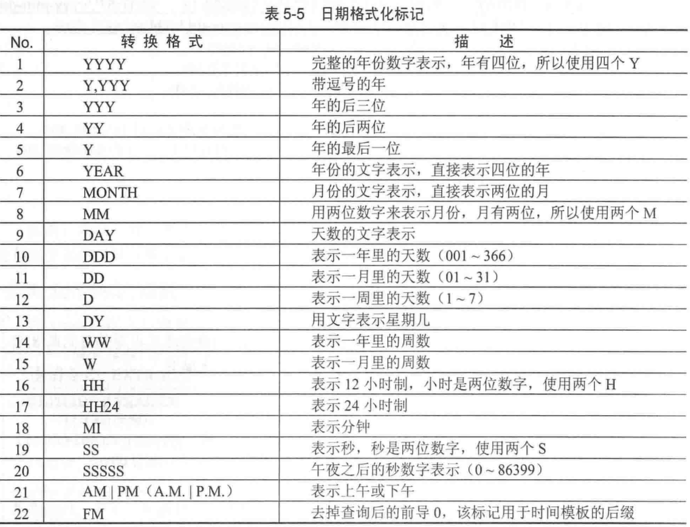
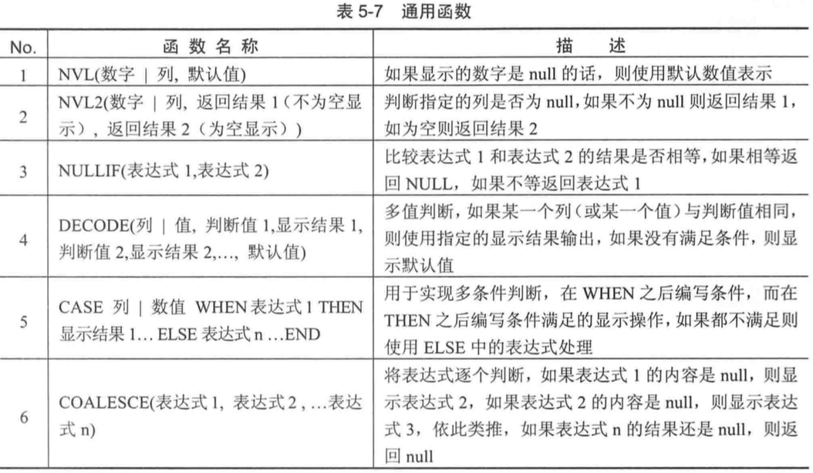
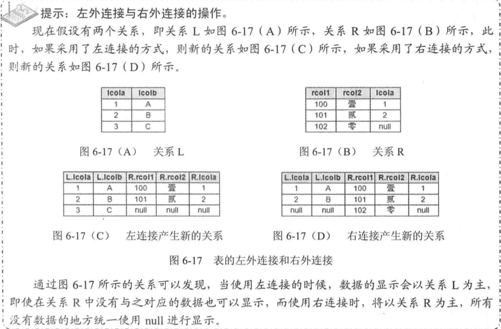
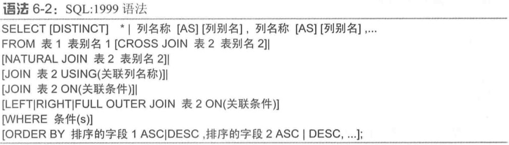
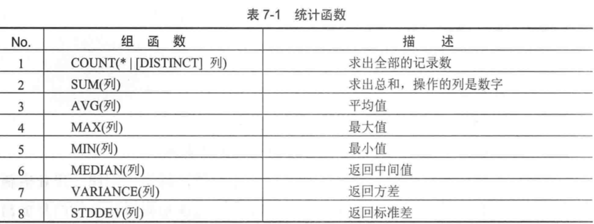

# Oracle

## Oracle 监听服务

​	oracle 监听文件的配置是 listener.ora  和  tnsname.ora

### lsnrctl 监听工具

```sh
C:\Users\huangyunning>lsnrctl     # oracle 携带的监听工具

LSNRCTL for 32-bit Windows: Version 10.2.0.1.0 - Production on 25-12月-2017 09:59:30

Copyright (c) 1991, 2005, Oracle.  All rights reserved.

欢迎来到LSNRCTL, 请键入"help"以获得信息。

LSNRCTL> help        # 帮助命令
以下操作可用
星号 (*) 表示修改符或扩展命令:

start               stop                status
services            version             reload
save_config         trace               change_password
quit                exit                set*
show*

LSNRCTL> status
正在连接到 (DESCRIPTION=(ADDRESS=(PROTOCOL=IPC)(KEY=EXTPROC_FOR_XE)))
LISTENER 的 STATUS
------------------------
别名                      LISTENER
版本                      TNSLSNR for 32-bit Windows: Version 10.2.0.1.0 - Production
启动日期                  23-12月-2017 18:25:42
正常运行时间              1 天 15 小时 34 分 5 秒
跟踪级别                  off
安全性                    ON: Local OS Authentication
SNMP                      OFF
默认服务           XE
监听程序参数文件          C:\oraclexe\app\oracle\product\10.2.0\server\network\admin\listener.ora
监听程序日志文件          C:\oraclexe\app\oracle\product\10.2.0\server\network\log\listener.log
监听端点概要...
  (DESCRIPTION=(ADDRESS=(PROTOCOL=ipc)(PIPENAME=\\.\pipe\EXTPROC_FOR_XEipc)))
  (DESCRIPTION=(ADDRESS=(PROTOCOL=tcp)(HOST=huangyunning-PC)(PORT=1521)))
  (DESCRIPTION=(ADDRESS=(PROTOCOL=tcp)(HOST=127.0.0.1)(PORT=7000))(Presentation=HTTP)(Session=RAW))
服务摘要..
服务 "CLRExtProc" 包含 1 个例程。
  例程 "CLRExtProc", 状态 UNKNOWN, 包含此服务的 1 个处理程序...
服务 "PLSExtProc" 包含 1 个例程。
  例程 "PLSExtProc", 状态 UNKNOWN, 包含此服务的 1 个处理程序...
服务 "XEXDB" 包含 1 个例程。
  例程 "xe", 状态 READY, 包含此服务的 1 个处理程序...
服务 "XE_XPT" 包含 1 个例程。
  例程 "xe", 状态 READY, 包含此服务的 1 个处理程序...
服务 "xe" 包含 1 个例程。
  例程 "xe", 状态 READY, 包含此服务的 1 个处理程序...
命令执行成功
```

## 表空间创建和帐号创建

```Sql
/*分为四步 */
/*第1步：创建临时表空间  */
create temporarytablespace user_temp  
tempfile 'D:\oracle\oradata\Oracle9i\user_temp.dbf' 
size 50m  
autoextend on  
next 50m maxsize 20480m  
extent management local;  
 
/*第2步：创建数据表空间  */
create tablespace user_data  
logging  
datafile 'D:\oracle\oradata\Oracle9i\user_data.dbf' 
size 50m  
autoextend on  
next 50m maxsize 20480m  
extent management local;  
 
/*第3步：创建用户并指定表空间  */
create user username identified by password  
default tablespace user_data  
temporary tablespace user_temp;  
 
/*第4步：给用户授予权限  */
grant connect,resource,dba to username;
```

### 创建帐号scott

```mysql
-- Create the user 
create user scott
  identified by tiger
  default tablespace USERS
  temporary tablespace TEMP
  profile DEFAULT;
-- Grant/Revoke role privileges 
grant dba to scott with admin option;
-- Grant/Revoke system privileges 
grant select any table to scott with admin option;
grant update any table to scott with admin option;
grant unlimited tablespace to scott with admin option;
```

> ```
> with admin option 只能在赋予 system privilege 的时使用
> with grant option 只能在赋予 object privilege 的时使用
> 另外的区别是 
> with admin option 通过连续授权时 , 比如 管理员给 a 赋予建表权限 , a 给 b 服务建表权限 , 此时如果管理员撤回 a 的权限 , b 的权限不会被撤回 ; 如果是 with grant option , 则 此时 b 的权限也会被撤回
> ```

### 表空间操作

- 建表且指定表空间

```Sql
create table scott.test (id number(5),name varchar2(10)) tablespace users;
```

- 将scott.test表从users表空间移动到 TEMP 表空间

```Sql
alter table scott.test move tablespace TEMP;
```

- 将用户user1 的 table1 表的查询和更新权限赋予 user2

```Sql
grant select,update on user1.table1 to user2

grant all on user1.table1 to user2; # 授予所有操作权限
```

## 常用操作和基础概念

​	当用户 a 要操作用户 b 的表时,sql 语句的表名需要加上用户名 b 名 , 如 `select * from b.table1`

1 创建表

```sql
create tables person(
	pid number(10),
  	pname varchar2(20)
);
```

2 修改表结构

添加列

```mysql
alter table 表名
add
	(gender number(1))
```

> 添加列 gender

修改列的类型

```mysql
alter table 表名
modify
	gender char(2);
```

修改列名

```mysql
alter table 表明
rename column  列名
to 新列名;
```

删除列

```mysql
alter table 表名
drop column	列名;
```

3 删除数据

删除表结构

```mysql
drop table 表名 ;  	--- 删除表结构
delete from 表名 ; 	--- 删除表数据
truncate table 表名 ;	--- 截断表(先删表再建表)
```

4 Oracle中的事务

事务保存点 savepoint

```mysql
update person set pname='c' where pid=1;
savepoint a1;
update person set pname='b' where pid=2;
rollback to al;  --- 回滚到 a1
commit;
```

5 Oracle事务级别

**Oracle支持的事务级别:**

- 序列化
- 可重复度     --- 默认级别
- 读已提交

6 约束

1 主键约束

​	主键约束,天然带非空,唯一特性!!!

- 建表时声明主键

```mysql
create table person(
	pid number(10) primary key,
	pname vachar2(10),
);
```

> Oracle数据库主键没有自增长特性,即不能使用 `auto_increment` !!!

- 建表时自定义主键约束名称

```mysql
create table person(
	pid number(10),
	pname varchar2(10),
	constraint pk_person primary key(pid)   --- 声明主键约束的名称为 pk_person ,作用于 pid 列
);
```

2 非空约束和唯一约束

​	`not  null`	非空约束

​	`unique`		唯一约束

```mysql
create table person(
	pid number(10),
	pname varchar(10) unique not null, 		--- 添加唯一约束和非空约束
	constraint pk_person primary key(pid)   --- 声明主键约束的名称为 pk_person ,作用于 pid 列
);
```

3 检查约束

​	语法  : `check(约束条件)`

```mysql
create table person(
	pid number(10),
	pname varchar(10) unique not null, 		
  	gender number(1) check(gender in(0,1))	--- 添加检查约束
	constraint pk_person primary key(pid)  
);
```

4 外键约束

```mysql
create table orders(
	orders_id number(10),
	orders_name varchar2(20),
	constraint pk_orders primary key(orders_id)
);

create table order_detail(
	order_detail_id number(10),
	order_detail_name varchar2(20),
	orders_id number(10),
	constraint pk_order_detail primary key(order_detail_id),
	constraint fk_order_detail_orders foreign key(orders_id) references orders(orders_id)  --- 添加外键约束 
);
```

7 创建视图

- 同义词

```mysql
create synonym s_emp for scott.emp;  
```

- 查询语句创建表

```mysql
create table emp as select * from scott.emp;
```

- 创建视图

```mysql
create view view_temp as select e.name,e.job from emp e ;
```

> 视图本身不存储数据,所有数据来源于原表,故修改视图数据会修改原表数据

​	**创建只读视图**

```mysql
create view view_temp2 as select e.name,e.job from emp e with read only; 
```

- 查询视图

```
select * from view_emp;
```

8 序列

​	Oracle中没有主键生成策略,用序列的自增特性,可以在oracle中完成自增长的功能.

​	语法:

```mysql
create sequence 序列名
	increment by N 		--- 每次增长的大小
	start with N		--- 起始值
	maxvalue  Max		--- 最大值
	minvalue  Min		--- 最小值
	cache	N;	
```

```mysql
create sequence seq_person;
select seq_person.nextval from dual;
```

9 索引

1 单列索引

​	索引是一个单独的、物理的数据库结构，它是某个表中一列或若干列值的集合和相应的指向表中物理标识这些值的数据页的逻辑指针清单。

**使用索引可以大幅度提高查询的效率,但是会影响增删改的效率**

​	语法:

## 查询

1. 查询语句要显示单引号时,需要用4个'(单引号)

   ```Sql
   SELECT '''' FROM dual;
   ```

2. not in 操作符时,列表中不能出现 null , 否则返回空集合

   ```Sql
   select * from emp where empno not (7369,7788,null);
   ```

   > 由 null 返回永远为空

3. Null 参与算术(+ -  * /)运算,结果为Null ; Null 参与比较运算结果都为 UNKOWN (非真非假)

4. 模糊查询中 , `%` 匹配任意字符和长度, `_` 匹配单个任意字符(用于限制字符长度的场景,如名字长度为6)


### 单行函数



### 数值函数



### 日期函数

```Sql
-- 获取当前时间
SELECT sysdate FROM dual;
-- 获取前一天的此刻时间
SELECT sysdate-1 FROM dual;
```

> 日期 -  数字 = 日期
>
> 日期 + 数字 = 日期
>
> 日期 - 日期  = 数字(天数)

```Sql
--查询员工入职天数
SELECT ename,trunc(sysdate-hiredate) 入职天数 FROM EMP;
```



```Sql

-- 查询下一个星期一
SELECT
  sysdate,
  next_day(sysdate, ' 星期一')
FROM dual;
---------------------------------
SELECT
  sysdate 当前日期,
  add_months(sysdate, 3) 三个月后,
  add_months(sysdate, -3) "三个月前"
FROM dual
```

### 转换函数





> oracle 中格式化标记是不区分大小写的 , 即 "YYYY" 和 "yyyy" 效果一样 , 所以表示分钟的格式化标记只能使用 "mi" 来表示 , 避免与月份 "mm" 冲突;这一点跟 mysql 由区别!!

```Sql
--- 格式化当前日期
SELECT
  sysdate,
  to_char(sysdate, 'yyyy-mm-dd')            格式化日期,
  to_char(sysdate, 'yyyy-mm-dd HH24:mi:ss') 格式化日期时间
FROM dual;
```

> 格式化标记 `yyyy-mm-dd`  需要使用单引号 !!! 双引号会报错...

```Sql
---- 查询二月份入职的员工
SELECT * FROM EMP WHERE to_char(HIREDATE,'mm')='02'

SELECT * FROM EMP WHERE to_char(HIREDATE,'mm')=2
```

> Oracle 数据库的隐式转换:
>
> 1. 字符型(varchar , varchar2) 如果只由数字组成,则可以直接转换为数字(NUMBER)
> 2. 字符型(varchar , varchar2) 如果按照指定的日期格式,如 'yyyy-mm-dd HH24:mi:ss'  则可以自动转换为 DATE 类型

### 通用函数



```Sql
--- 查询每个员工的编号,姓名,工作,年薪
SELECT EMPNO,ENAME,JOB,(SAL+COMM) * 12 FROM EMP
```

| EMPNO | ENAME | JOB      | (SAL+COMM)*12 |
| ----- | ----- | -------- | ------------- |
| 7369  | SMITH | CLERK    | NULL          |
| 7499  | ALLEN | SALESMAN | 22800         |

> 由于 NULL 参与算术运算的结果恒为 NULL , 所以结果有问题,此时需要使用 NVL 来处理 NULL 

```Sql
--- 查询每个员工的编号,姓名,工作,年薪
SELECT EMPNO,ENAME,JOB,(nvl(SAL,0)+nvl(COMM,0)) * 12 FROM EMP
```

> MySQL 中具有相同功能的函数是 IFNULL(),如 `ifnull(sal,0)` 

```Sql
SELECT
  EMPNO,
  ename,
  decode(job,
         'CLERK', '业务员',
         'SALESMAN', '销售员',
         'MANAGER', '管理员')
FROM EMP;
--------------------------------------------------
SELECT
  EMPNO,
  ename,
  CASE job
  WHEN 'CLERK'
    THEN '业务员'
  WHEN 'SALESMAN'
    THEN '销售员'
  WHEN 'MANAGER'
    THEN '管理员'
  ELSE NULL
  END
FROM EMP;
```

> 1. decode 执行过程是 , 取 job 的值, 然后分别与 CLERK  SALESMAN 做比较,如果值相等就显示后面的值,否则为 NULL , 可以用 case when 案例来辅助理解
> 2. case when 比 decode 更加灵活,而且 sql 语法也有,从通用性来说更适用

## 多表查询

​	笛卡尔积 

### 表的连接操作

#### 1 外连接

1 内连接

​	也叫等值连接 , 是最早的一种连接方式 , 内连接只会保留当前表和被连接表中符合关系的行,其他行不匹配行将不显示

2 外连接

​	内连接只能显示匹配关系的行的数据 , 如果希望显示特定的表中的所有数据,则要使用外连接 , 外连接的类型分为3种 : 左外连接 , 右外连接 , 全外连接

Oracle 在查询语句中通过 `(+)` 来表示连接关系

​	**左外连接 : ** 左关系属性=右关系属性(+) , 此时 "+" 号放在右边 , 表示左外连接 .

​	**右外连接 : ** 左关系属性(+)=右关系属性 , 此时 "+" 号放在左边 , 表示右外连接 .

```Sql
SELECT *
FROM EMP E, DEPT D
WHERE E.DEPTNO = D.DEPTNO (+);
```



> **一个直观的记法 : 不带(+)的列所在的表数据全部显示 !!! 另外的表可能没有数据所以需要 `+` 补上**

#### 2 自关联	

| 姓名    | 员工编号 | 职位       | 上司员工编号 |
| ----- | ---- | -------- | ------ |
| SMITH | 7369 | CLERK    | 7902   |
| ALLEN | 7499 | SALESMAN | 7698   |
| WARD  | 7521 | SALESMAN | 7698   |

​	如上表 , "上司员工编号" 引用的是 "员工编号" 的值 , 这种表引用自身数据的关系就是自关联

```Sql
-- 查询每个员工的编号,命名 和 其上司的编号和姓名
SELECT
  E.EMPNO,
  E.ENAME 员工,
  m.EMPNO,
  m.ENAME 上司
FROM EMP E, EMP m
WHERE E.MGR = m.EMPNO (+);
```

> 要查询所有的员工 , 所以员工表作为左表
>
> 这里查询时,其实要把 emp 表重复使用 , 即当两张表使用 , e 表示员工表 , m 表当上司表 !!!

#### 3 sql 1999 语法



## 聚合(分组统计)查询



```Sql
SELECT count(DISTINCT job) FROM EMP;

SELECT avg(sal),stddev(SAL) 标准差,variance(sal) 方差 FROM EMP;
```

