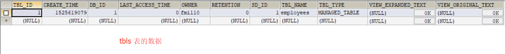
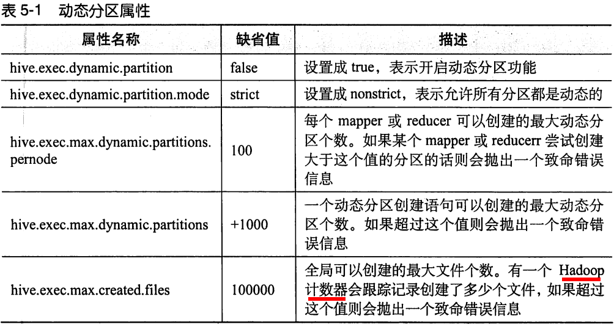

# Hive 学习笔记

## 1 基础知识


> Thrift Server : 

​	安装系统时,如果希望环境变量只对当前用户生效 , 则可将环境变量配置到当前用户目录下 , 即 `~/.bashrc` 文件中

## 2 Hive 安装和启动 

### 1 安装	

首先将安装包 `apache-hive-2.1.1-bin.tar.gz` 上传到目录 `/home/fmi110` 下(注意事先要先装好 jdk!!!)

```sh
su fmi110
mkdir -p /home/fmi110/hive/warehouse
# 解压并重命名
tar -zxf apache-hive-2.1.1-bin.tar.gz && mv apache-hive-2.1.1-bin apache-hive

# 配置环境变量
echo 'export HIVE_HOME=/home/fmi110/apache-hive' >> /home/fmi110/.bashrc
echo 'export PATH=$PATH:$HIVE_HOME/bin' >> /home/fmi110/.bashrc
source /home/fmi110/.bashrc
```

> 这里环境变量配置到 `/home/fmi110/.bashrc` 下 , 则只对 `fmi110` 生效

### 2 修改配置文件

​	因为这里使用mysql来存储Hive数据库的元信息文件 , 所以复制 mysql 驱动 `mysql-connector-java-5.1.39.jar`  到 `$HIVE_HOME/hive/lib` 目录下

​	复制 `$HIVE_HOME/hive/conf` 下的 hive-default.xml.template 文件为 hive-site.xml ,

并修改下列配置项

```
1. 驱动程序 DriverNamei --> mysql
2. ConnectionURL
3. 数据库 Username , Password
4. ${system ... 的变量 --> 改为具体的值 , 因为引用不到 
```

```xml
  <property>
    <name>javax.jdo.option.ConnectionDriverName</name>
    <value>com.mysql.jdbc.Driver</value>
    <description>数据库元数据存储的位置,这里修改为 mysql</description>
  </property>
  <property>
    <name>javax.jdo.option.ConnectionURL</name>
    <value>jdbc:mysql://192.168.204.129:3306/hive?createDatabaseIfNotExist=true</value>
    <description>
      数据库连接 url
      For example, jdbc:postgresql://myhost/db?ssl=true for postgres database.
    </description>
  </property>
  <property>
    <name>javax.jdo.option.ConnectionUserName</name>
    <value>root</value>
    <description>mysql 数据库用户名</description>
  </property>
  <property>
    <name>javax.jdo.option.ConnectionPassword</name>
    <value>123456</value>
    <description>myslq数据库密码</description>
  </property>
```

​	配置文件中还定义了引用系统环境变量的值 , 可能无法识别,这里全部手动修改为绝对路径 , 使用文本编辑器搜索替换即可

```sh
${system:java.io.tmpdir}/${system:user.name}  --> /home/fmi110/hive
${system:java.io.tmpdir}/${hive.session.id}  --> /home/fmi110/hive/downloaded
```

> 这里之所以替换为 `/home/fmi110`  目录是因为 hive 的安装是使用用户 fmi110 执行了 , 配置目录放在用户目录下能够保证有操作权限 , 放在其他目录下需要赋予 fmi110 用执行权限 !!!

### 3 初始化 hive 的元数据(表结构)到mysql中

```sh
$HIVE_HOME/bin/schematool -dbType mysql -initSchema
```

### 4 启动hdfs和yarn

```sh
$HADOOP_HOME/sbin/start-dfs.sh
$HADOOP_HOME/sbin/start-yarn.sh
```

### 5 连接Hive

```sh
$HIVE_HOME/bin/hive
```

​	此时在 mysql 数据库的 Hive 的数据库信息存放在  DBS 表中 , Hive 表的元信息存放在 tbls 表中 :




### 6 通过远程jdbc方式 命令连接Hive

1. 启动 hiveserver2 服务器 , 监听端口 10000

```sh
$HIVE_HOME/bin/hive --service hiveserver2 &
```

2. 通过 beeline 命令连接 Hive

```sh
$HIVE_HOME/bin/beeline
beeline> !connect jdbc:hive2://localhost:10000/default
beeline> show databases;
```


```xml
		<?xml version="1.0" encoding="UTF-8"?>
		<project xmlns="http://maven.apache.org/POM/4.0.0"
				 xmlns:xsi="http://www.w3.org/2001/XMLSchema-instance"
				 xsi:schemaLocation="http://maven.apache.org/POM/4.0.0 http://maven.apache.org/xsd/maven-4.0.0.xsd">
			<modelVersion>4.0.0</modelVersion>

			<groupId>com.it18zhang</groupId>
			<artifactId>HiveDemo</artifactId>
			<version>1.0-SNAPSHOT</version>

			<dependencies>
				<dependency>
					<groupId>org.apache.hive</groupId>
					<artifactId>hive-jdbc</artifactId>
					<version>2.1.0</version>
				</dependency>
			</dependencies>
		</project>
```


```java
//使用hive实现单词统计使用Hive-jdbc驱动程序采用jdbc方式访问远程数据仓库
----------------------------------------------------
		package com.it18zhang.hivedemo;

		import java.sql.Connection;
		import java.sql.DriverManager;
		import java.sql.ResultSet;
		import java.sql.Statement;

		/**
		 * 使用jdbc方式连接到hive数据仓库，数据仓库需要开启hiveserver2服务。
		 */
		public class App {
			public static void main(String[] args) throws  Exception {
				Class.forName("org.apache.hive.jdbc.HiveDriver");
				Connection conn = DriverManager.getConnection("jdbc:hive2://192.168.231.201:10000/mydb2");
				Statement st = conn.createStatement();
				ResultSet rs = st.executeQuery("select id , name ,age from t");
				while(rs.next()){
					System.out.println(rs.getInt(1) + "," + rs.getString(2)) ;
				}
				rs.close();
				st.close();
				conn.close();
			}
		}

```


## 3 数据类型和文件格式

### 1 数据格式


​	建表语句:

```sql
create table employees(
    name	 string,
    salary	 float,
    subordinates	array<string>,
    deductions		map<string,float>,
    address			struct<street:string,city:string,state:string,zip:int>;
)
```

```sql
row formate delimited						-- 关键字 , 必须在其他字句前
fields terminated by '\001',				-- 指定字段之间的分隔符
collection items terminated by '\002',		 -- 指定集合元素之间的分隔符
map keys terminated by '\003',				-- 指定 Map 的key后的分隔符
lines terminated by '\n',					-- 指定行数据键的分隔符
stored as textfile;
```


### 2 文本文件数据编码

 CSV : 以逗号分隔的文本文件

 TSV : 以制表符分隔的文本文件

​	以上两中文本文件有一个共同的缺点 , 就是用户必须很小心的处理不需要哦作为分隔符的逗号或制表符 . 也因此 Hive 默认使用 了几个控制字符 , 这些字符很少出现在字段值中 . Hive 使用术语 `field` 来表示默认分隔符的字符


### 3 读时模式和写时模式

​	读时模式( schema on read ) : 数据加载时不进行验证 , 而是查询时进行 . Hive

​	写时模式( schema on write): 数据在写入数据库时对模式进行检查 . 传统数据库

## 4 HiveSQL:数据定义

​	Hive 中数据库的概念本质上仅仅是表的一个目录或命名空间.通常会使用数据库来将生产表组织成逻辑组 .

​	用户没有显示指定数据库 , 那么默认使用数据库为 **default** 数据库

1. 创建数据库

```sql
create database financials;					-- 已存在时抛错误信息
create database if not exists financials;
----------------------------------
create database financials
	location '/home/fmi110/hive';			-- 指定数据库位置
----------------------------------
create database financials
	with dbproperties (
    	'creator'='fmi110',
        'date'='2018/05/03'
    );		-- 创建数据库并添加一些键-值属性信息
```

> 1. 每个数据库对应一个目录 , default 例外
> 2. 数据库中的表对应数据库的一个子目录
> 3. 数据名是以 .db 结尾的文件
> 4. 默认位置 : /user/hive/warehouse

2. 查看数据库信息

```sql
show databases;
show database like 'h.*';
describe database extented financials;  -- 查询数据库信息,并显示相关属性
```

3. 切换数据库

```
use database financials;
```


4. 删除数据库

```sql
drop database financials;
drop database if exists financials ;
drop database financials cascade;
```

> 默认情况下 , Hive 不允许删除有表存在的数据 , 要强制删除可加上  cascade 关键字

5. 修改数据库

   **数据库的元数据信息是不可修改的 , 包括数据库名和数据库所在的位置 !!!** 但是可以修改数据库设置的 dbproperties.

```sql
alter database financials set dbproperties('edited-by'='fengmi');
```

### 1 分区表


​	查看分区 :

```sql
show partitions employees;  -- 查看数据库 employees 的分区
show partitions employees partition(country='US');	-- 查看指定分区
```

​	`describe extended employees;`  可以查看分区的键


​	在管理表中 , 用户可以通过载入数据的方式创建分区 . 如下 :

```sql
load data local inpath '${env:HOME}/california-employees'
	into table employees
	partition(country='US',state='CA');
```

​	上面的语句从本地目录 `$HOME/california-employees` 载入数据到表中 , 并创建分区 , 目录下的文件会被拷贝到分区目录下.

### 2 外部分区表

​	ETL : 数据抽取 , 数据转换 , 数据装载

```sql
create external table if not exists log_messages(
	hms 		int,
	serverity	int,
	server		string,
	process_id	int,
	message		string
)
partition by (year int,month int ,day int)
row format delimited fields terminated by '\t';
```

​	新增一个 2018/05/04 的分区语句如下 :

```sql
alter table log_messages add partition(year=2018,month=05,day=04)
	location 'hdfs://master_server/data/log_messages/2018/05/04';
```

### 3 自定义表的存储格式

​	Hive 默认的存储格式是 textFile , 内置的格式还有 squenceFile 和 RCFile . 这两种格式都是使用二进制编码和压缩(可选)来优化磁盘空间使用和 I/O 性能 .

​	记录的编码是通过 inputFormat 对象控制的 . textFile 格式的控制对象对应的是 java 里的 TextInputFormat 类 . 

​	记录的解析是由序列化器/反序列化器(或缩写为 SerDe )来控制的 . 对于 textFile , Hive 使用的是 xxx.xxx.LazySimpleSerDe 的 java 类

​	为保持完整性 , Hive 还使用一个叫做 outFormat 的对象来将查询的输出写入到文件或输出到控制台 . 对于 textFile , 使用的是 HiveIgnoreKeyTextOutputFormat .

​	**用户还可以指定第三方的输入 , 输出格式 和 SerDe , 这个功能使 Hive 可以支持更广泛的格式 , 下面的例子使 Hive 可以使用 Avro 协议访问文件**

```sql
create table kst
partition by(ds string)
row format serde 'com.linkedin.harvvreo.AvroSerDe'
with serdeproperties('schema.url'='http://schema_provider/kst.avsc')
stored as
inputformat 'com.linkedin.harvvreo.AvroContainerInputFormat'
outputformat 'com.linkedin.harvvreo.AvroContainerOuputFormat';
```

### 4 删除表

```
drop table if exists employees;
```

​	对于内部表(管理表) , 表的元数据信息和表内数据都会被删除.

​	对于外部表 , 表的元数据信息会被删除 , 但是数据会被保留下来.

### 5 修改表

​	大多数的表属性可以通过 alter table 语句来修改 . 这些修改只会修改表的元数据信息 , 不会修改数据 !!!

1. **重命名表**

```sql
alter table log_messages rename to logmsgs;
```

2. **增加 , 修改 , 删除表分区**

```sql
alter table log_messages add if not exists
partition(year=2018,month=05,day=04) location '/logs/2018/05/04'
partition(year=2018,month=05,day=03) location '/logs/2018/05/03'
...;
```

```sql
alter table log_messages partition(year=2018,month=05,day=04)
set location 's3n://servername/logs/2018/05/04';
```

> 直接重新制定分区的路径 , 这个命令不会将旧数据移走,也不会删除旧数据

```sql
alter table log_messages drop if exists 		
	partition(year=2018,month=05,day=03);
```

3. **修改列信息**

   用户可以对某个字段进行重命名 , 并修改其位置 , 类型或者注释

```sql
alter table log_messages
change column hms hours_minuts_second int   -- 修改列名 hms 为 hours_..
comment '小时_分钟_秒'					 -- 修改注释
after severity;							-- 修改列的位置
```

> 1. `after ...`   用于将列移动到指定列后面 , 移动到前面用 before
> 2. 如果字段被移动 , 那么数据也应当和新的模式匹配或者通过其他方法修改数据以使其与新的模式匹配

4. **增加列**

```sql
alter table log_messages add columns(
	app_name string
);
```

> 如果增加的列需要调整位置需要使用 alter table ... change ... 来调整

5. **删除或者替换列**

```sql
alter table log_messages replace columns(
	hms 		int,
	serverity 	string,
	message		string
);
```

> 执行后 log_messages 将只剩下三列 , 注意 alter 只是修改了表的元数据信息

6. **修改表的属性**

```sql
alter table log_messages set tblproperties(
	'note'='xxxx'	
);
```

> 可以添加或修改属性 , 但是不能删除属性 !!!

7. **修改存储属性**

   下面语句将一个分区的存储格式修改为 sequence file

```sql
alter table log_messages
partition(year=2018,month=05,day=04)
set fileformat sequencefile;
```


## 5 HiveQL : 数据操作

```sql
--建表
hive> create table mydb(id int , name string ,age int);
--插入一条数据
hive> insert into mydb (id,name,age) values (1,'fmi110',29);
--查看hdfs上的文件
hive> dfs -lsr /
```

```sh
输出如下 :
drwxr-xr-x   - fmi110 supergroup          0 2018-04-29 00:09 /output
-rw-r--r--   3 fmi110 supergroup          0 2018-04-29 00:09 /output/_SUCCESS
-rw-r--r--   3 fmi110 supergroup         17 2018-04-29 00:09 /output/part-r-00000
-rw-r--r--   3 fmi110 supergroup        529 2018-04-28 23:32 /sample.txt
drwx-wx-wx   - fmi110 supergroup          0 2018-04-29 14:13 /tmp
drwx-wx-wx   - fmi110 supergroup          0 2018-04-29 14:13 /tmp/hive
drwx------   - fmi110 supergroup          0 2018-04-29 14:16 /tmp/hive/fmi110
drwx------   - fmi110 supergroup          0 2018-04-29 14:16 /tmp/hive/fmi110/e114ca64-1126-4152-adcf-2615eea3b8f5
drwx------   - fmi110 supergroup          0 2018-05-06 23:05 /tmp/hive/fmi110/e114ca64-1126-4152-adcf-2615eea3b8f5/_tmp_space.db
drwxr-xr-x   - fmi110 supergroup          0 2018-05-06 23:05 /tmp/hive/fmi110/e114ca64-1126-4152-adcf-2615eea3b8f5/_tmp_space.db/Values__Tmp__Table__1
-rw-r--r--   3 fmi110 supergroup         12 2018-05-06 23:05 /tmp/hive/fmi110/e114ca64-1126-4152-adcf-2615eea3b8f5/_tmp_space.db/Values__Tmp__Table__1/data_file
drwxr-xr-x   - fmi110 supergroup          0 2018-05-06 23:04 /user
drwxr-xr-x   - fmi110 supergroup          0 2018-05-06 23:04 /user/hive
drwxr-xr-x   - fmi110 supergroup          0 2018-05-06 23:04 /user/hive/warehouse
drwxr-xr-x   - fmi110 supergroup          0 2018-05-06 23:05 /user/hive/warehouse/employees
-rwxr-xr-x   3 fmi110 supergroup         12 2018-05-06 23:05 /user/hive/warehouse/employees/000000
```

​       插入数据时 , 作业进度可以`http://m01:8088`  查看

### 1 向内部表中加载数据

​	Hive 没有行级的数据插入 , 数据更新和删除操作 , 往表里装载数据的唯一途径就是使用一种"大量"的数据装载操作 , 将文件写入到正确的目录下 .

```
load data local inpath '${env:HOME}/california-employees'
	overwrite into table employees
	partition (country='US',state='CA');
```

> 1. `local` 关键字 , 说明输入路径是一个本地路径 , 数据会被 copy 到目标位置 ; 如果省略 `local` ,则输入路径是分布式文件系统的路径 , 此时数据将**转移**到目标位置 !!!
> 2. `inpath` 指定的目录下不能存在子目录 , 否则会报错

### 2 通过查询语句向表中插入数据

1. **静态分区插入**

```sql
insert overwrite table employees
	partition(country='US',state='OR')
	select * from staged_employees se where se.cnty='US' and se.st='OR';
```

> `overwrite`  关键字会覆盖已存在的内容 , `into`  关键字则是追加

​	如果希望同时向多个分区插入数据 , 则

```sql
from staged_employees se
insert overwrite table employees
	partition(country='US',state='OR')
    select * where se.cnty='US' and se.st='OR'
insert overwrite table employees
	partition(country='US',state='CA')
	select * where se.cnty='US' and se.st='CA';
```

2. **动态分区插入**

静态分区有一个问题 , 当分区非常多时 , HQL 将不会变的非常长 . 因此可以使用动态分区的方式插入 , 如下 :

```sql
insert overwrite table employees
	partition(country,state)
	select ...,se.cnty,se.st from staged_employees;
```

> 这样,假如 staged_employees 中共有100 个国家和州 , 则表 employees 也一样

​	也可以静态分区和动态分区结合

```sql
insert overwrite table employees
	partition(country='US',state)
	select ...,se.cnty,se.st from staged_employees se where se.cnty = 'US'
```

> 1. 静态分区必须在动态分区之前
> 2. 动态分区默认是关闭的 , 开启后 , 默认是"严格"模式 , 即必须要求至少有一列分区是静态




### 3 单个查询语句中创建并加载数据

​	**这个功能不能用于外部表**

```sql
create table ca_employees
as select
	name,salary,address
from employess se where se.state='CA';
```

### 4 导出数据

​	如果数据文件恰好是用户需要的格式 , 那么只需要简单的拷贝文件夹或文件即可:

```
hadoop fs -cp source_path  target_path
```

​	否则使用 `insert...directory...` :

```sql
insert overwrite local directory '/tmp/ca_employees'
select name,salary,address
from employees
where se.state='CA'
```

> 一个或多个文件将会被写入到 /tmp/ca_employees 目录下 , 具体的个数取决于调用的reducer 个数 !!!


​	Hive 中没有临时表的概念 , 用户需要手动删除任何创建了的但又不想长期保留的表

## 6 HiveQL : 查询


## X Hive 命令

