## Hbase

## 1 安装和启动

​	这里使用三台虚拟机实现完全分布式安装 , 注意安装前提是必须先装好 jdk , zookeeper , hadoop

​	安装包 `hbase-1.2.6-bin.tar.gz`  放置在 `/usr/local/src/` 目录下

```sh
echo export HBASE_HOME=/home/fmi110/hbase >> /etc/profile
echo 'export PATH=$PATH:$HBASE_HOME/bin' >> /etc/profile
source /etc/profile
echo done 

su fmi110
cd /usr/local/src/
tar -zxf hbase-1.2.6-bin.tar.gz -C /home/fmi110
cd /home/fmi110
mv hbase-1.2.6 hbase
echo done

# 设置 hbase-env.sh
cd /home/fmi110/hbase/conf
sed '/^# export JAVA_HOME/a\export JAVA_HOME=/soft/jdk' hbase-env.sh >> temp
sed '/^# export HBASE_MANAGES_ZK/a\export HBASE_MANAGES_ZK=false' temp >> temp2
cat temp2 > hbase-env.sh
rm -rf temp temp2
echo done

# 设置(从机) regionservers 文件
cd /home/fmi110/hbase/conf
echo m02 > regionservers
echo m03 >> regionservers
echo done
```

> `m01`  `m02` `m03`  是安装了 `zookeeper` 和 `hbase` 的主机的域名
>
> `sed '/^# export JAVA_HOME/a\export JAVA_HOME=/soft/jdk' hbase-env.sh` 作用是在 hbase-env.sh 文件中的以 `# export JAVA_HOME` 开头的行后面插入 `export JAVA_HOME=/soft/jdk`

​	设置 hbase-site.xml , 实现完全分布式

```sh
cd /home/fmi110/hbase/conf
vim hbase-site.xml
```

​	内容设置如下 :

```xml
<?xml version="1.0"?>
<?xml-stylesheet type="text/xsl" href="configuration.xsl"?>
<!--
/**
 *
 * Licensed to the Apache Software Foundation (ASF) under one
 * or more contributor license agreements.  See the NOTICE file
 * distributed with this work for additional information
 * regarding copyright ownership.  The ASF licenses this file
 * to you under the Apache License, Version 2.0 (the
 * "License"); you may not use this file except in compliance
 * with the License.  You may obtain a copy of the License at
 *
 *     http://www.apache.org/licenses/LICENSE-2.0
 *
 * Unless required by applicable law or agreed to in writing, software
 * distributed under the License is distributed on an "AS IS" BASIS,
 * WITHOUT WARRANTIES OR CONDITIONS OF ANY KIND, either express or implied.
 * See the License for the specific language governing permissions and
 * limitations under the License.
 */
-->
<configuration>
			<!-- 使用完全分布式 -->
			<property>
				<name>hbase.cluster.distributed</name>
				<value>true</value>
			</property>

			<!-- 指定hbase数据在hdfs上的存放路径 -->
			<property>
				<name>hbase.rootdir</name>
				<value>hdfs://m01:8020/hbase</value>
			</property>
			<!-- 配置zk地址 -->
			<property>
				<name>hbase.zookeeper.quorum</name>
				<value>m01:2181,m02:2181,m03:2181</value>
			</property>
			<!-- zk的本地目录 -->
			<property>
				<name>hbase.zookeeper.property.dataDir</name>
				<value>/home/fmi110/zookeeper</value>
			</property>
</configuration>

```

​	

2 启动 hbase

​	在主机 m01 上启动 hbase

```
cd /home/fmi110/hbase/bin
start-hbase.sh
echo done
```

​	登录hbase的webui 页面

```
http://m01:16010
```

## 2 HBase 结构

​	HBase 是一个分布式的,持久的,强一致的存储系统 , **具有近似最优的写性能(I/O利用率达到饱和)和出色的读性能** .

 	是 `数十亿行 * 数百万列 * 数千个版本 = TB级或PB级的存储`

### 1 表,行,列和单元格

​	列(column) : 最基本的单元.没列可能有多个版本 , 在每个单元格中存储了不同的值!!

​	行(row) : 一列或多列形成一行,并由行键(row key)来确定存储位置

​	表(table) : 表中有若干行

​	单元格(cell) : 数据存储在单元格中 ,

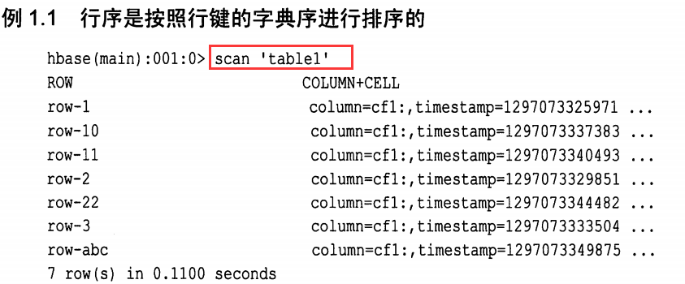

​	有几个需要了解的地方 :

1. *row key 在表中是排序的 , 并且唯一 . 排序按照字典序排序 , 即按照二进制逐字节从左到右一次对比每一个行键*

2. *若干列构成**列族( column family)**,一个列族的所有列存储在同一个底层的存储文件里 , 这个存储文件叫 HFile*

3. *列族需要在创建表时就定义好,并且不能修改的太频繁 , 数量也不能太多 , 名必须由可打印的字符组成*

4. *列的引用格式 : family:qualifier , qualifier 是任意字节数组.列的数量没有限制*

5. *每一列的值或单元格的值都有时间戳 , 默认由系统给定 , 也可由用户自己给定*

   Hbase数据的存储模型 :

```
(Table,RowKey,Family,Column,Timestamp) --> Value
```

​	用更像编程的语言风格表示 :

```java
SortedMap<
	RowKeyList<
		SortedMap<
			ColumnList<
				Value,Timestamp
			>	
		>
	>
>
```

### 2 自动分区

​	**region : **HBase 中扩展和负载均衡的基本单元 . region 本质上是以 row key 排序的连续存储区间 . 如果 region 太大,系统会把他们动态拆分 , 相反 , 则合并,以减少存储文件的数量.

​	region 相当于数据库分区中用的范围划分(range partition) , 他们可以被分配到若干台物理服务器上以均摊负载

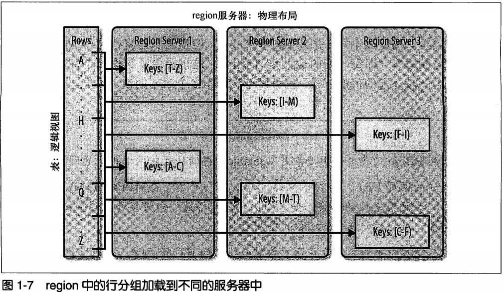

### 3 存储API

​	API 提供的功能 : 对表 ,列族 ,列族元数据的curd.

​	支持单行事务(read-modify-write) , 不支持跨行和跨表事务 , 但支持批量操作以获得更好的性能.

​	单元格可以当计数器使用 , 支持原子更新 , 因此尽管是分布系统架构 , 客户端依然可以利用此特性实现全局的,强一致的,连续的计数器.

​	**存储的实现 :** 数据存储在存储文件( store file) 中 , 成为 **HFile** . 文件内部由连续的块组成 , 块的索引信息存储在文件的尾部 .默认块的大小为 64 KB ,可以调整

​	**查找的实现 : ** 每个 HFile 都有一个块索引 , 通过一个磁盘查找就可以实现查询 , 首先 , 在内存的块索引中进行二分查找 , 确定可能包含给定的row key的块 , 然后读取磁盘块找到实际要找的键

​	**数据更新 : ** 每次更新数据时, hbase 都会将数据记录在提交日志(commit log)中 , 在HBase 中这个叫 **预写日志(write-ahead log , WAL)** , 然后才会将这些数据写入内存的 memstore 中.

当 memstore 中的数据达到阈值 , 系统会将这些数据作为 HFile 文件写到磁盘 , 并将对应的提交日志移除.

​	**数据的删除 : ** 因为存储文件是不可改变的 , 所以无法通过移除某个键/值对来简单的删除值.解决的办法是 , 做个 *删除标记* ,表明给定行已被删除的事实 , 在检索过程中 , 这些删除标记掩盖了实际值 , 客户端达不到实际值.

​	**HFile的合并方式 : **

1. minor合并 : 将多个小文件 HFile 重写为数量少的大文件 , 减少存储文件的数量 , 实际上是个多路归并的过程
2. major压缩合并 : major 合并将一个 region 中的列族的若干个HFile重写为一个新的HFile ,**它会扫描所有的键/值对,顺序重写全部的数据 , 重写时会略过做了删除标记的数据!!**

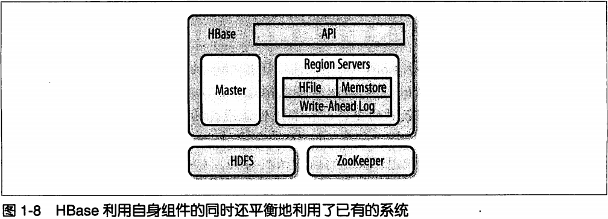

### 4 HBase 组件

​	三大件 : 客户端库 , 一台主服务器 , 多台region服务器 .

​	**主服务器 :** 主要负责利用 ZooKeeper 为 region 服务器分配region . 并负责全局 region 的负载均衡 , 将繁忙的服务器中的 region 移到负载较轻的服务器中 . 主服务器 **不是实际数据存储或数据检索路径的组成部分 , 它仅提供负载均衡和集群管理 , 不为 region 服务器或客户端提供任何的数据服务 , 因此是轻量级服务器**

## 3 客户端API : 基础知识

​	`org.apache.hadoop.hbase.client.HTable` 实现了向HBase增,删,改,查的功能 , 应该注意 :

1. HTable实例只创建一个 , 因为该实例创建需要扫描 .META 表等操作
2. 为执行的每一个线程(或者使用的HTablePool)创建独立的 HTable实例
3. 所有的修改操作只保证行级别的原子性

### 1 put 方法

#### 1 单行 put

​	存储方法的实现

```java
HTable :
	void put(Put put);
	void put<List<Put>> puts)
```

```java
Put的构造函数 :
	Put(byte[] row);
	Put(byte[] row,RowLock rowLock);
	Put(byte[] row,long ts);
	Put(byte[] row,long ts,RowLock rowLock);
	
添加值的方法 :
	Put add(byte[] family, byte[] qualifier, byte[] value);
	Put add(byte[] family, byte[] qualifier,long ts, byte[] value);
	Put add(KeyValue kv);

获取值的方法 :
	List<KeyValue> get(byte[] family, byte[] qualifier);
	Map<byte[],List<KeyValue>> getFamilyMap();
```

> 1. 创建 Put 对象时需要提供一个行键 row
> 2. HBase 里的数据大多数是 byte[]

```java
Bytes :
	static byte[] toBytes(ByteBuffer bb);
	static byte[] toBytes(String s);
	static byte[] toBytes(boolean b);
	static byte[] toBytes(long val);
	static byte[] toBytes(float f);
	....
```

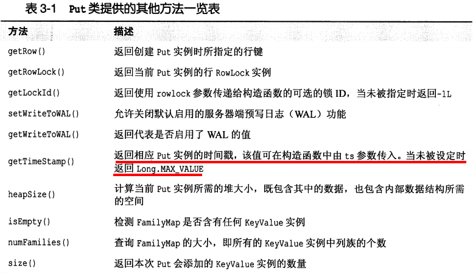

​	存储数据的步骤 :

*1. 创建配置*

*2. 实例化一个客户端 HTable*

*3. 指定一行来创建一个Put*

*4. 向 Put 中添加名为 "colfam1:qual1"的列*

*5. 向 Put 中添加名为 "colfam2:qual2"的列*

*6. 将这一行数据存到 HBase 表中*

```java
public class PutExample{
    public  static void main(String[] args){
        Configuration conf = HBaseConfiguration.create();
        HTable table = new HTable(conf,"testTable");
        Put put = new Put(Bytes.toBytes("row1"));
        put.add(Bytes.toBytes("colfam1"),
                Bytes.toBytes("qual1"),
                Bytes.toBytes("val1"));
        
        put.add(Bytes.toBytes("colfam1"),
                Bytes.toBytes("qual1"),
                Bytes.toBytes("val1"));
        table.put(put);
    }
}
```

> 1.HBase 客户端需要加载配置文件 , 默认会加载在 classpath 下的 hbase-site.xml 来获知如何访问集群 , 所以 **需要将 hbase-site.xml 配置文件放置在 classpath 下!!**

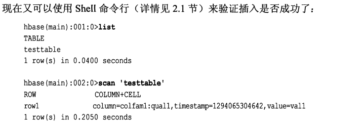

scan操作和get操作默认只会返回最新的版本 , 要获得所有版本数据可以

```
> scan 'test',{ VERSION = Integer.MAX_VALUE }
```

#### 2 写缓冲区

​	每一个 put 都是一个 rpc 过程 , 为了减少与服务器通信的次数,提升速度 , 可以通过禁用自动提交,通过手动提交来实现

```java
HTable :
	void setAutoFlush(boolean autoFlush);
	boolean isAutoFlush();
	
	void flushCommits();  // 手动提交,将缓存里的数据写到服务端
```

​	用户可以强制刷写缓冲区 , 不过通常不必要 , 因为 API 会自动追踪统计每个用户添加的实例的堆大小, 从而计算出缓存的数据 , 一旦超出缓冲指定的大小限制, 客户端会隐式的调用刷写命令 , 用户可以通过以下方法配置缓冲区大小 , 默认大小为 2MB :

```
HTable :
	long getWriteBufferSize();
	void setWriteBufferSize(long writeBufferSize)
```

或者在 hbase-site.xml 中配置

```xml
<property>
	<name>hbase.client.write.buffer</name>
    <value>20971520</value>  
</property>
```

> 设置为 20MB

#### 3 原子性操作 compare-and-set

```java
HTable :
	boolean checkAndPut(byte[] row, byte[] family byte[] qualifier,
									byte[] value, Put put);
```

> 检查当表中 row 行的 family:quailfier 列的值为 value 时 , 将值 put 更新进去

### 2 get 方法

```java
HTable :
	Result get(Get get);
	Result[] get(List<Get> gets);
```

```java
Get 构造函数 :
	Get(byte[] row);
	Get(byte[] row ,RowLock lock);
	
方法 :
	Get addFamily(byte[] family);
	Get addColumn(byte[] family,byte[] qualifier);
	Get setTimeRange(long minStamp , long matStamp);
	Get setTimeStamp(long timestamp);
	Get setMaxVersions();
	Get setMaxVersions(int maxVersion);
```

```java
Result :
	// 返回指定单元格的最新版本的值
	byte[] getValue(byte[] family, byte[] qualifier); 
	byte[] value();    // 返回第一个列对应的最新的单元格的值
	byte[] getRow();	// 返回 row key
	int size;
	boolean isEmpty();
	KeyValue raw();
	List<KeyValue> list();
```

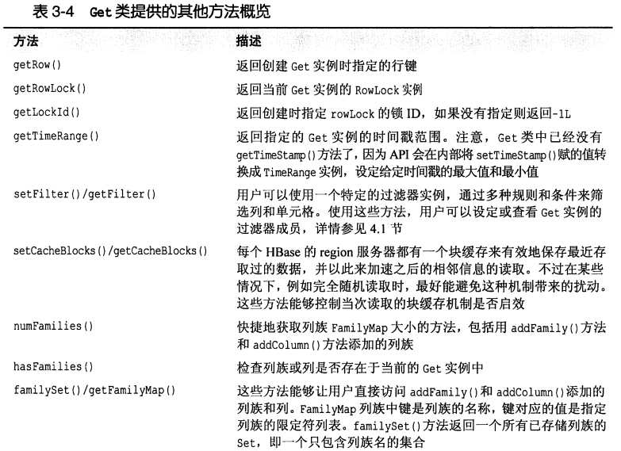

```java
Configuration conf = HBaseConfiguration.create();
HTable table = new HTable(conf,"testTable");
Get get = new Get(Bytes.toBytes("row1"));
get.addColumn(Bytes.toBytes("colfam1"),Bytes.toBytes("qual1"));
Result result = table.get(get);
byte[] val = result.getValue(Bytes.toBytes("colfam1"),Bytes.toBytes("qual1"));
System.out.println(Bytes.toString(val));
```

​	其他的API

```
HTable :
	boolean exists(Get get);
	Result getRowOrBefore(byte[] row, byte[] family);
```

### 3 delete 方法

```
HTable :
	void delete(Delete delete);
	void delete(List<Delete> deletes);
```

```java
Delete :
	Delete(byte[] row)
	Delete(byte[] row, long ts , RowLock lock);
	
	Delete deleteFamily(byte[] family);
	Delete deleteColumns(byte[] family,byte[] qualifier);
	...
```

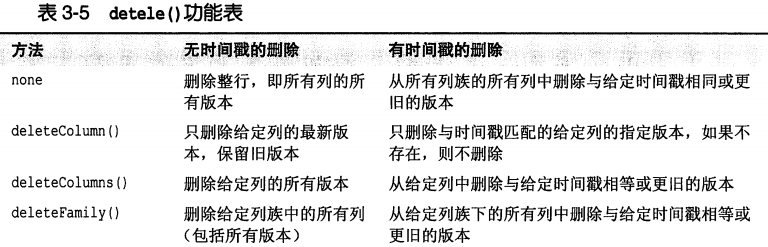

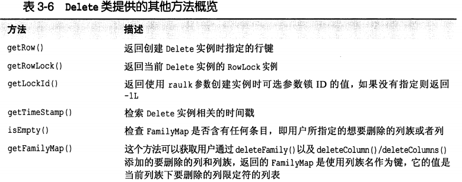

**原子性删除 compare-and-delete**

```java
HTable :
	boolean checkAndDelete(byte[] row, byte[] family byte[] qualifier,
									byte[] value, Delete del);
```

### 4 批处理操作

```java
HTable :
	void batch(List<Row> actions , Object[] Results);
	Object[] batch(List<Row> actions);
```

> 1. `void batch()` 如果抛异常,客户可访问部分结果
> 2. `Object[] batch()`  抛异常时,客户访问不到结果
> 3. `Row` 是 `Put` , `Delete` , `Get` 的父类

batch 可能返回的结果:

| 结果        | 描述                                                      |
| ----------- | --------------------------------------------------------- |
| null        | 操作与远程服务器通信失败                                  |
| EmptyResult | Put 和 Delete 操作成功后的返回结果                        |
| Result      | Get操作成功的返回结果,如果没匹配的行或列,会返回空的Result |
| Throwable   | 当服务器端返回一个异常时,这个异常返回客户端               |

### 5 行锁

```java
HTable :
	RowLock lockRow(byte[] row);
	void unLockRow(RowLock rl);
```

锁默认的超时时间是1分钟 , 可以在 hbase-site.xml 中设置 , 单位 ms

```xml
<property>
    <name>hbase.regionserver.lease.period</name>
    <value>120000</value>
</property>
```

### 6 扫描 SCAN

​	scan 技术类似数据库系统的中的游标(cursor),并利用了HBase提供的底层顺序存储的数据结构.

```java
Scan :
	Scan();
	Scan(byte[] startRow, Filter filter);
	Scan(byte[] startRow);
	Scan(byte[] startRow, byte[] stopRow);

	Scan addFamily(byte[] family);
	Scan addColumn(byte[] family, byte[] qualifier);
```

> 1. 区间表示为 左闭右开 [startRow , stopRow)
> 2. startRow , stopRow 不用精确匹配 , HBase 会自动匹配相等或大于的区间

```java
HTable :
	ResultScanner getScanner(Scan scan);
	ResultScanner getScanner(byte[] family);
	ResultScanner getScanner(byte[] family, byte[] qualifier);
```

​	**ResultScanner**  将扫描操作转换为类似 get 操作 , 将一行结果封装成 Result 对象

```java
ResultScanner :
	Result next();
	Result[] next(int rowCount);
```

> `rowCount`  指定一次查询返回的行数 

注意 : 扫描器占用的服务器资源很多 , 累积多了会占用大量的堆空间 , 最好在 try..finally 中调用close 方法,及时释放资源.扫描器也有自动超时机制 , 可以在 hbase-site.xml 中配置 ,单位ms

```xml
<property>
	<name>hbase.regionserver.lease.period</name>
    <value>120000</value>
</property>
```

​	**缓存与批处理** : 每次 next() 方法都会生成一个 rpc 请求 , 此时可以用扫描缓存( scanner caching) 优化 , 默认是关闭的

1. 表层级打开

```java
HTable :
	void setScannerCaching(int scannerCaching);
	int getScannerCaching();

hbase-site.xml 设置
<property>
	<name>hbase.client.scanner.caching</name>
	<value>10</value>
</property>
```

2. 扫描层级打开

```
Scan :
	void setCaching(int caching);
	int getCache();
```

​	当使用缓存来从远程 region 服务器获取数据时 , 如果行数据非常大 , 有可能导致 oom , 此时可以用批量来解决 

```java
Scanner :
	void setBatch(int batch);
	int getBatch();
```

​	示例 :

```java
Scan scan = new Scan();
scan.setCache(caching);
scan.setBatch(batch);
ResultScanner results = table.getScanner(scan);
for(Result result : results){
    ...
}
scanner.close();
```

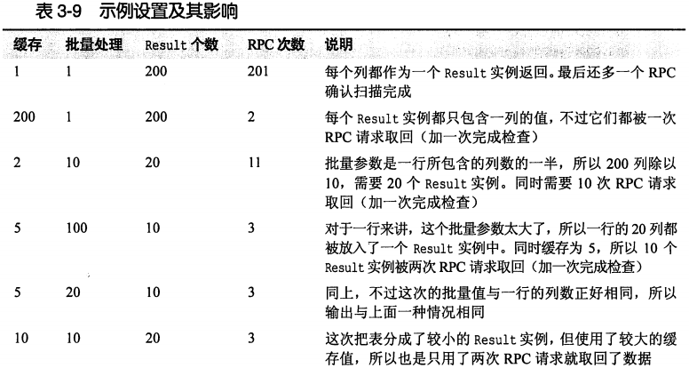

## 4 客户端API : 高级特性

### 1 过滤器

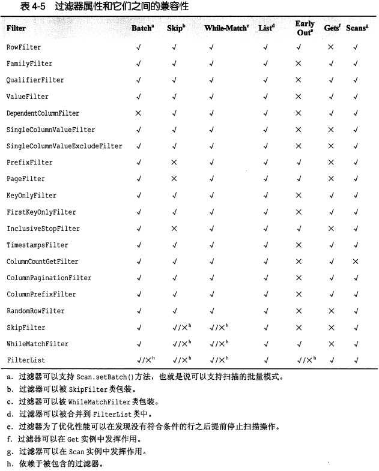

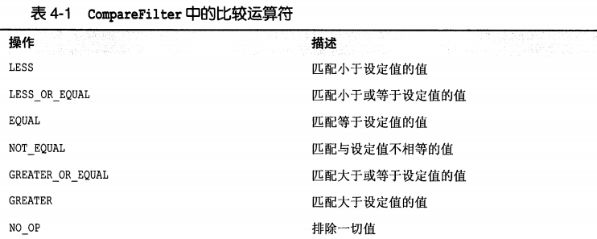

#### 1 比较过滤器 CompareFilter

```java
CompareFilter(CompareOp valueCompareOp,
				WritableByteArrayComparable valueComparator)
```

1. 行过滤器 RowFilter

```java
public class Demo{
    public static void main(String[] args){
        Scan scan = new Scan();
        scan.addColumn(Bytes.toBytes("colfam1",Bytes.toBytes("col-0")));
        
        // 精确匹配
        Filter filter1 = new RowFilter(CompareFilter.CompareOp.LESS_OR_EQUAL,
                             new BinaryComparator(Bytes.toBytes("row-22")));
        scan.setFilter(filter);
        ResultScanner rs1 = table.getScanner(scan);
        // 正则匹配
        Filter filter2 = new RowFilter(CompareFilter.CompareOp.EQUAL,
                              new RegexStringComparator(".*-.5"));
        scan.setFilter(filter2);
        // 子字符串匹配
        Filter filter3 = new RowFilter(CompareFilter.CompareOp.EQUAL,
                              new SubstringComparator(".*-.5"));
        scan.setFilter(filter3);
    }
}
```

输出如下:

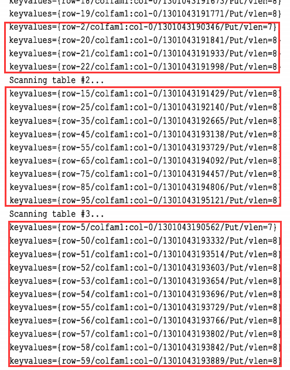

2. 列族过滤器 FamilyFilter

```java
Filter filter = new FamilFilter(CompareFilter.CompareOp.EQUAL,
		new BinaryComparator(Bytes.toBytes("colfam3")))
```

3. 列名过滤器 QualifierFilter

```java
Filter filter = new FamilFilter(CompareFilter.CompareOp.LESS_OR_EQUAL,
		new BinaryComparator(Bytes.toBytes("col2")))
```

4. 值过滤器 ValueFilter

#### 2 专用过滤器

1. 单列值过滤器 SingleColumnValueFilter

```java
SingleColumnValueFilter(byte[] family,byte[] qualifier,
						CompareOp compareOp,byte[] value);
						
SingleColumnValueFilter(byte[] family,byte[] qualifier,
				CompareOp compareOp,WritableByteArrayCompareable value);

// 行没有对应列时被过滤
boolean setFilterIfMissing(boolean b);
void setLatestVersionOnly(boolean b);
```

> 用一列的值决定是否一行数据被过滤 , 先设置待检查的列 , 然后设置列比较的值

2. 单列排除过滤器 SingleColumnValueExcludeFilter
3. 前缀过滤器 PrefixFilter

```
Filter filter = new PrefixFilter(Bytes.toByte("row-1"))
```

4. 分页过滤器 PageFilter

用户可以用 PageFilter 对结果按行进行分页 , 创建实例对象时,指定 pageSize 参数 , 这个参数可以控制每页返回的行数 .

​	客户端代码要记录每次扫描的最后一行 , 作为下一次扫描的起始行

```java
public Class Demo{
    public static void main(String[] args){
		Filter filter = new PageFilter(15);
        int totalRows = 0;
        byte[] lastRow = null;
        while(true){
		   Scan scan = new Scan();
           	scan.setFilter(filter);
            if(lastRow!=null){
                byte[] startRow = Bytes.add(lastRow,POSTFIX);
                Bytes.toStringBinary(startRow);
                scan.setStartRow(startRow);
            }
            ResultScanner scanner = table.getScanner(scan);
            int localRows = 0;
            Result result = null;
            while((result = scan.next() !=null)){
                totalRows++;
                lastRow = result.getRow();
            }
            scan.close();
            if(localRows==0) break;
        }
    }
}
```

... 等等 ...

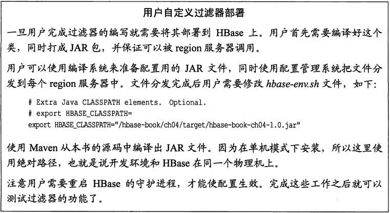

### 2 计数器

​	许多手机统计信息的应用有点击流或在线广告意见 , 这些应用需要被收集到日志文件中用于后续的分析,用户可以使用计数器( counter )实时统计,从而放弃延时较高的批处理操作.

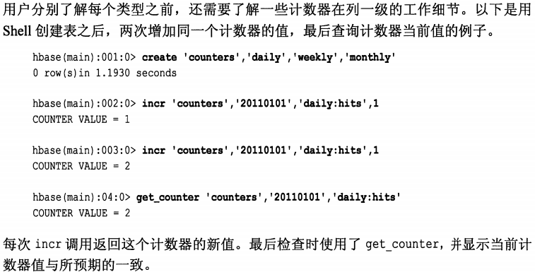

​	终端的 incr 命令格式如下 :

```sh
incr '<table>' , '<row>' , '<column>' , [<increment-value>] 
```

​	用户在第一次使用计数器时,计数器会自动设置为 0 . 注意不可以使用 put 操作初始化计数器

```sh
> put 'counters' ,'20180516','daily:clicks' ,'1'
```

​	因为 1 被当成字符串处理 , 导致最终结果错误!!!

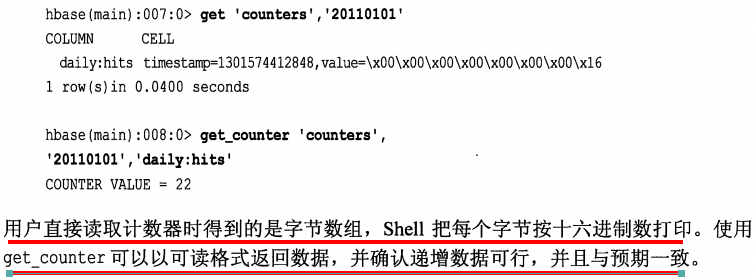

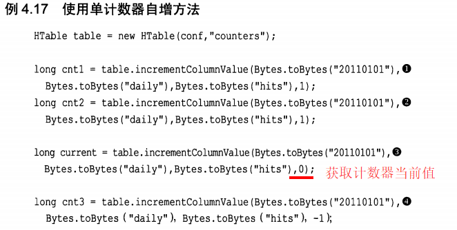

​	也可以在一行中添加多个计数器 , api 如下 :

```java
HTable :
	Result increment(Increment inrement);

Increment :
	Inrement(){}
	Increment(byte[] row);
	Increment(byte[] row , RowLock rowLock);

	Increment addColumn(byte[] family , byte[] qualifier , long count);
	Increment setTimeRange(long minStamp,long maxStamp);
```

> setTimeRange() 用来设置计数器的过期时间 , 过期后,计数器被重置为 1

```java
public Class MultiCounterDemo{
    public static void main(String[] args){
        Increment increment1 = new Increment(Bytes.toByte("20110101"));
        increment1.addColumn(Bytes.toBytes("daily"),Bytes.toBytes("clicks"),1);
        increment1.addColumn(Bytes.toBytes("daily"),Bytes.toBytes("hits"),1);
        increment1.addColumn(Bytes.toBytes("weekly"),Bytes.toBytes("clicks"),10);
        increment1.addColumn(Bytes.toBytes("weekly"),Bytes.toBytes("hits"),10);
        
        Result results = table.increment(increment1); // 计数器计数
        for(KeyValue kv : results){
            System.out.println("KV: "+kv+"Value: "+Bytes.toLong(kv.getValue()));
        }
    }
}
```

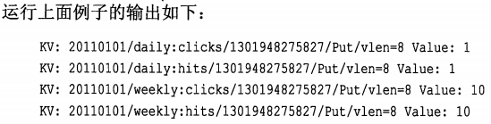

### 3 协处理器

​	协处理器允许用户在 region 服务器上运行自己的代码 , 更准确的说是允许用户执行 region 级操作 , 并且使用与 RDBMS 中触发器类似的功能.协处理器的使用场景有如下 : 行数据发生改变时触发索引更新 ; 或维护一些数据间的引用完整性.

​	协处理器提供了一些类, 可以分为两大类 : observer 和 endpoint.

​	**瘠薄这个内容真多啊...扫一眼算过吧...以后再细看..就是各种回调..监听器的使用**

### 4 HTablePool

​	目的 : 在客户端生命周期内复用HTable 实例

```java
HTablePool :
	HTablePool()
	HTablePool(Configuration config,int maxSize);
	HTablePool(Configuration config,int maxSize,HTableInterfaceFactory factory)
```

> 1. 不指定大小时 , 默认是无限的
> 2. HtableInterfaceFactory 接口让用户可以创建自定义的工厂类 ; 默认实现类是 HTableFactory

```java
public class HTablePoolDemo{
    public static void main(String[] args){
        Configuration conf = HBaseConfiguration.create();
        HTablePool pool = new HTablePool(conf,5);
        
        HTableInterface[] tables = new HTableInterface[10];
        for(int i =0;i<10;i++){
            table[n] = pool.getTable("testtable");
            System.out.println(Bytes.toString(tables[n].getTableName));
        }
        
        for(int n=0;n<5;n++){
            pool.putTable(table[n]);
        }
        
        pool.closeTablePool("testtable");
    }
}
```

**连接管理**

​	HBase 内部使用键值映射来存储连接, 使用 Configuration 实例作为键值映射的键 . 即 当你创建多个HTable 实例时 , 如果提供相同的 Configuration 引用 , 那么他们共享同一个底层的 HConnection 实例

## 5 客户端API : 管理功能

### 1 模式定义

​	主要涉及建表时表结构以及列族列族结构的定义

1. **表描述符**

```java
HTableDescriptor :
	HTableDescriptor();
	HTableDescriptor(String name);
	HTableDescriptor(byte[] name);
	HTableDescriptor(HTableDescriptor desc);
```

​	HBase的表由行和列组成的 , 但是从物理结构上看, 表存储在不同的分区 , 即不同的 region

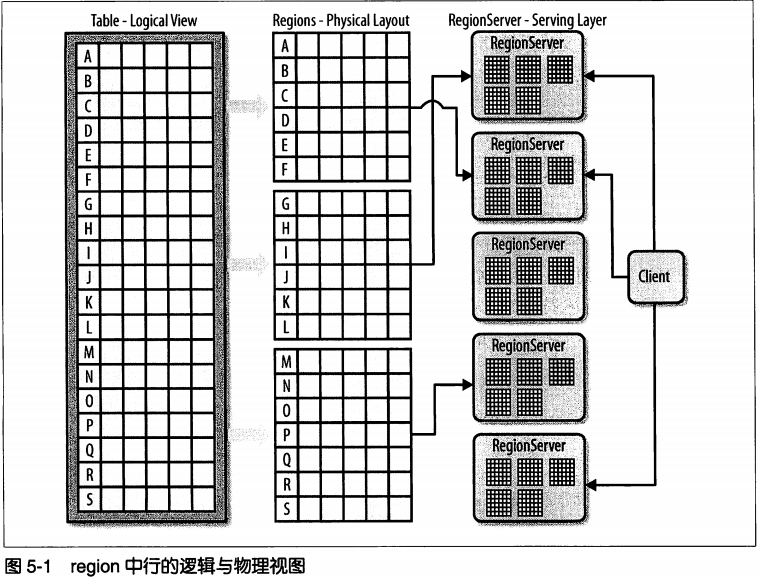

2. **表属性**

```java
HTableDescriptor :
// 表名
	byte[] getName();
	String getNameAsString();
	void setName(byte[] name);

// 列族
	void addFamily(HColumnDescriptor family);
	boolean hasFamily(byte[] c);
	HColumnDescriptor[] getColumnFamilies();
	HcolumnDescriptor removeFamily(byte[] column);

// region大小
	long getMaxFileSize();
	void setMaxFileSize(long maxFileSize);
```

> `maxFileSize`  是指当 region 的大小达到限制时 , HBase 会拆分 region ,而不是不能继续进行存储!!

```java
// memstore 刷写大小
	void setMemStoreFlushSize(long memstoreFlushSize);

```

3. **列族**

格式 : family:qualifier

```java
HColumnDescriptor :
	HColumnDescriptor();
	HColumnDescriptor();
	HColumnDescriptor(String familyName);
	HColumnDescriptor(byte[] familyName, int maxVersion , String compression,
					boolean inMemory , boolean blockCacheEnables, int timeToLive);
```

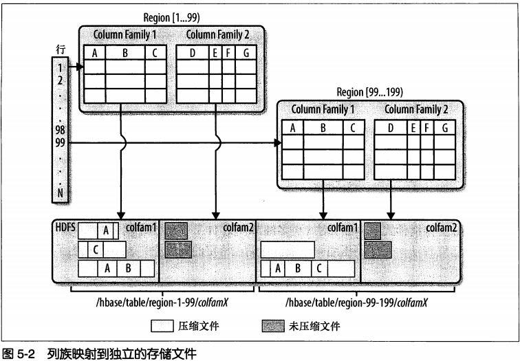

```java
HColumbDecriptor :
	String getNameAsString();
// 最大版本数,默认为 3
	void setMaxVersions(int maxVersions)
// 压缩算法
	Compression.Algorithm getCompression();
	Compression.Algorithm getCompressionType();
	Compression.Algorithm getCompactionCompressionType();
// 块大小
	void setBlockSize(int s);
// 块缓存
	boolean isBlockCacheEnable();
	void setBlockCacheEnable(boolean b);
// 生存期 TTL , major 合并时 TTL 过期的 数据被删除
	void setTimeToLive(int timeToLive);
// 在内存中(并在列族放在内存,而是高优先级处理标志)
	void setInMemory(boolean b);        
```

布隆过滤器 , 能减少特定访问模式下的查询时间 , 但是该模式增加了内存和存储的负担,默认是关闭的.

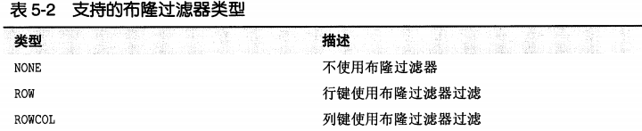

由于列的数量远远大于行,所以使用 ROWCOL 会占用大量的空间

```java
void setBloomFilterType(StoreFile.BloomType bt);
```

### 2 HBaseAdmin

​	HBaseAdmin 提供了建表,创建列族,检查表的存在,修改表结构和列族结构删除表等功能.

#### 1 使用客户端API建表

```java
public class CreateTableDemo{
    public static void main(String[] args){
        Configuration conf = new HBaseConfiguration.create();
        
        HBaseAdmin admin = new HBaseAdmin(conf); // 管理对象
        // 表描述
        HTableDescriptor desc = new HTableDescriptor(Bytes.toBytes("testtable"));
        // 列族描述
        HColumnDescriptor coldesc = new HColumnDescriptor(Bytes.toBytes("colfam1"));
            
        desc.addFamily(coldesc);
        
        admin.createTable(desc); // 建表
        
        boolean isAvail = admin.isTableAvailable(Bytes.toBytes("testable"));
    }
}
```

#### 2 通过预分区的方式建表

```java
public void createTable(HTableDescriptor desc,byte[] startKey,byte endKey,int numRegions);
```

> 以特定数量拆分特定其实行键和特定终止行键,并创建表.
>
> 1. startkey 必须小于 endkey
> 2. numRegions 必须大于或等于 3 , 这样才能确保 region 有最小集合
> 3. region 边界通过终止行键减去起始行键然后除以 numregion 得到
> 4. 第一个 region 和 最后一个 region 的终止行键是空字节 , 这是 HBase 的默认规则

```
pubilc void createTable(HTableDescriptor desc , byte[][] splitKeys);
```

> splitKeys 拆分好行键的集合 , 即 region 边界以拆分好

```java
public class CreateTableWithPartitionDemo{
    public static void main(String[] args){
        Configuration conf = HBaseConfiguration.create();
        HBaseAdmin admin = new HBaseAdmin(conf);
        HTableDescriptor desc = new HTableDescriptor(Bytes.toBytes("testtable1"));
        HColumnDescriptor coldef = new HColumnDescriptor(Bytes.toBytes("colfam1"));
        desc.addFamily(desc);
        
        // 建表指定分区   (100-1)/(10-2)=99/8=12 ;
        admin.createTable(desc,Bytes.toBytes(1L),Bytes.toByte(100L),10);
        printTableRegions("testtable1");
        
        byte[][] regions = new byte[][]{
            Bytes.toBytes("A");
            Bytes.toBytes("D");
            Bytes.toBytes("G");
            Bytes.toBytes("K");
            Bytes.toBytes("O");
            Bytes.toBytes("T");
        }
        desc.setName(Bytes.toBytes("testtable2"));
        // 建表 , region 边界给定
        admin.createTable(desc,regions);
        printTableRegions("testtable2");
    }
    
    public static void printTableRegion(String tableName){
        syso("Printing regions of table: "+tableName);
        
        HTable table = new HTable(Bytes.toBytes(tableName));
        Pair<byte[][],byte[][]> pair = table.getStartEndKeys();
        for(int n=0;n<pair.getFirst().length;n++){
            byte[] sk = pair.getFirst()[n];
            byte[] ek = pair.getSecond()[n];
            // ??? 为何判断 leng==8 ???
            syso("["+(n+1)+"]"+
                " start key : "+
                 (sk.length==8?Bytes.toLong(sk):Bytes.toStringBinary(sk))+
                 ",end key : "+
                 (ek.length==8?Bytes.toLong(ek):Bytes.toStringBinary(ek))
                );
        }
    }
}
```

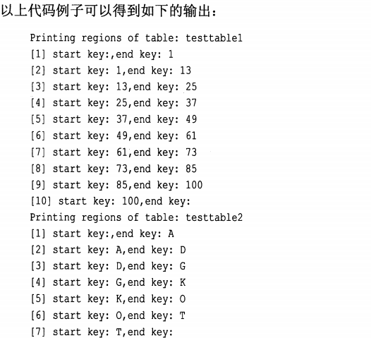

#### 3 获取所有已建表的表结构

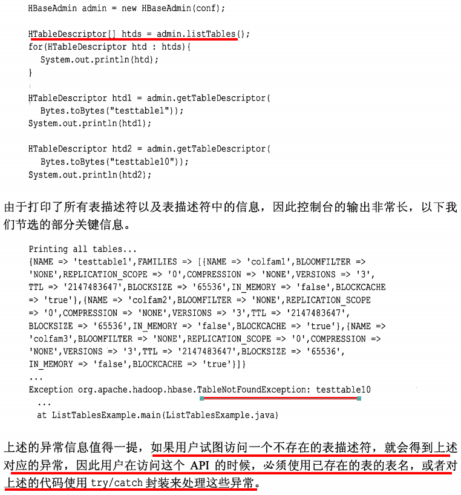

#### 4 禁用,启用和检查表状态

```java
public class Demo{
    public static void main(String[] args){
        Configuration conf = HBaseConfiguration.create();
        HBaseAdmin admin = new HBaseAdmin(conf);
        HtableDescriptor desc = new HTableDescriptor(Bytes.toBytes("testtable"));
        HColumnDescriptor coldef = new HBaseColumnDescriptor(Bytes.toBytes("colfam1"));
        
        desc.addFamily(coldef);
        admin.createTable(desc);
        
        try{
            // 删表 , 会失败
            admin.deleteTable(Bytes.toBytes("testtable"));
        }catch(IOException e){
           e.printstack();
        }
        
        admin.disableTable(Bytes.toBytes("testtable"));
        boolean isDisable = admin.isTableDisable(Bytes.toBytes("testtable"));
        boolean isAvail = admin.isTableAvailable(Bytes.toBytes("testtable"));
        
        admin.deleteTable(Bytes.toBytes("testtable"));
    }
}
```

> 1. 删除表之前必须禁用表  admin.disableTable()

#### 5 修改表结构

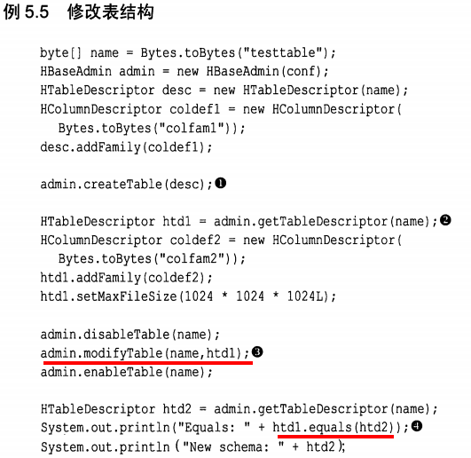

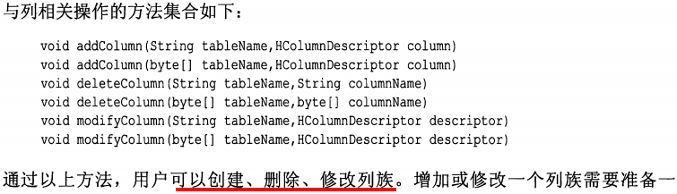

#### 6 集群管理

​	HBaseAdmin.getClusterStatus() 可以查询 ClusterStatus 实例

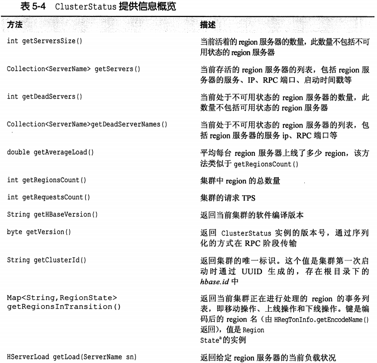

​	HBaseAdmin.getServers()

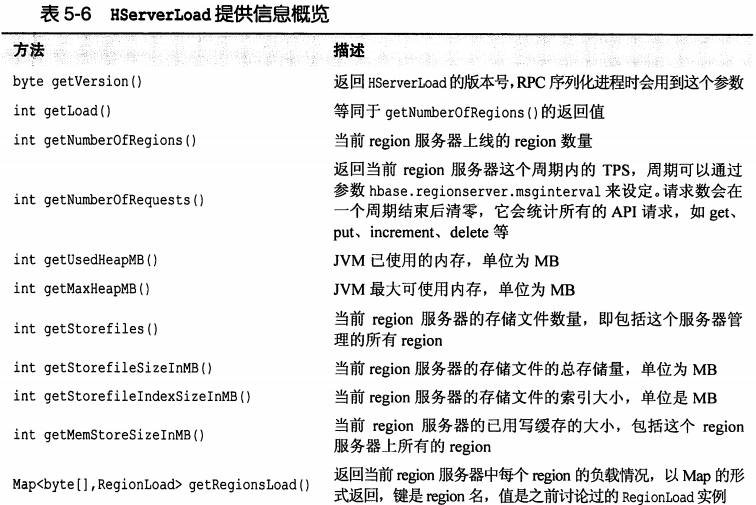

​	HBaseAdmin.getLoad() 可以查看每台 region 服务器的负载信息

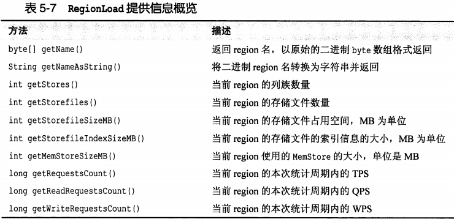

## 6 HBase 的WEB UI

​	HBase 提供了基于Web 的用户接口 , 可以查看集群状态以及数据表的服务状态

​	master 服务器web的默认端口是 60010

​	region 服务器web的默认端口是 60030

​	如果服务器名称是 master.fmi110.com , 则 web 的访问地址 : http://master.fmi110.com:60010

## 7 与 MapReduce 集成