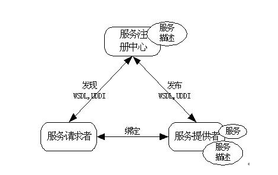
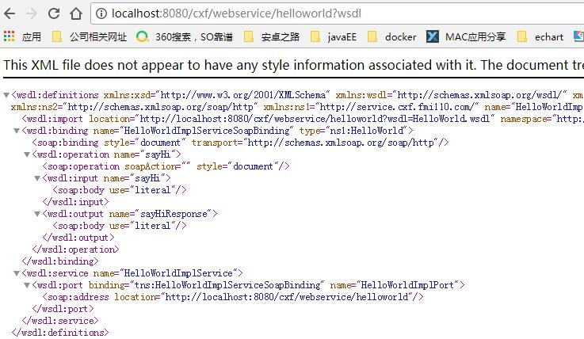
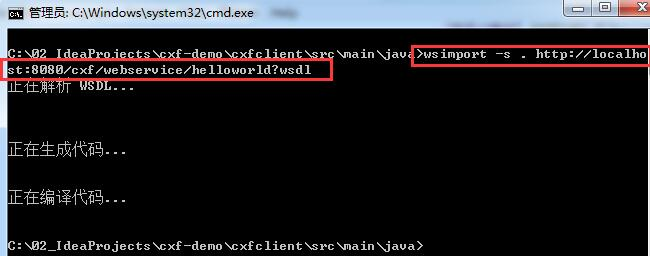
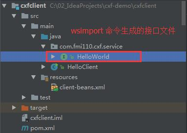

# cxf 入门

[官方指导文档](http://cxf.apache.org/docs/how-tos.html)

[cxf 系列文章](http://yufenfei.iteye.com/blog/1688133)

[cxf实战](http://blog.csdn.net/column/details/apachecxfinaction.html)

## 1 WebService 简单描述

​	一言以蔽之：**WebService是一种跨编程语言和跨操作系统平台的远程调用技术。**常用的webservice框架 : cfx、jwx、XFire与Axis2，jwx也就是jax-ws，是java6提供的对webservice的一种实现。cxf框架则简化了服务发布过程。Axis与XFire已随着技术不断的更替慢慢落幕，而目前也只有axis2和cxf官方有更新，Axis与XFire都已不再更新。

​		`XML+XSD` , `SOAP` 和 `WSDL` 就是构成WebService平台的三大技术。

### 1 XML+XSD

​	XML 封装数据 , 解决数据表示问题 , 因为与平台和厂商无关 , 保证了通用性 ; XSD 解决数据类型问题 , 定义了 webService 所使用的数据的类型 , 保证了不同系统下数据通用的问题

### 2 SOAP

​	soap协议 . WebService 是通过 http 协议发送请求和接收数据结果 , http 消息内容都有特定的消息头和消息内容 . 而 SOAP 协议限定了这些消息头和内容的格式. 简单理解就是 , SOAP 约束了 WebService 的请求信息和响应信息应该长什么样 .

### 3 WSDL

​	WSDL(Web Services Description Language) 服务描述语言 , WebService 作为一个服务 , 必须告诉调用者服务地址在哪?提供什么服务?调用服务需要传什么参数?等 这些信息 , 就是通过 WSDL文件来描述的 .

​	WSDL文件保存在Web服务器上，通过一个url地址就可以访问到它。客户端要调用一个WebService服务之前，要知道该服务的WSDL文件的地址。WebService服务提供商可以通过两种方式来暴露它的WSDL文件地址：**1.注册到UDDI服务器，以便被人查找；2.直接告诉给客户端调用者。**

### 4 UDDI

​	UDDI (Universal Description, Discovery, and Integration) 是一个主要针对Web服务供应商和使用者的新项目。在用户能够调用Web服务之前，必须确定这个服务内包含哪些商务方法，找到被调用的接口定义，还要在服务端来编制软件，UDDI是一种根据描述文档来引导系统查找相应服务的机制。UDDI利用SOAP消息机制（标准的XML/HTTP）来发布，编辑，浏览以及查找注册信息。它采用XML格式来封装各种不同类型的数据，并且发送到注册中心或者由注册中心来返回需要的数据。

## 2 WebService服务工作流程



​	**注册到 UUID服务器的 webservice** 工作流程大致如下 :

1. 服务提供者实现服务 , 并在服务注册中心(UDDI)进行注册
2. 服务请求者向服务注册中心请求特定服务(其实就是请求对应的 wsdl 文件)
3. 服务注册中心找到对应的服务后 , 将该服务的描述(wsdl)文件返回为请求者
4. 请求者根据返回的 wsdl 文件 , 生成相应的 soap消息 , 发送给服务提供者
5. 服务提供者根据 soap消息执行对应的服务 , 并将结果返回给请求者

## 3 使用 cxf 搭建一个 webService

​	CXF : Apache CXF 的前身叫 Apache CeltiXfire，现在已经正式更名为 Apache CXF 了，简称为 CXF。CXF 继承了 Celtix 和 XFire 两大开源项目的精华。

​	搭建 webService的步骤大致如下:

1. *创建一个接口声明提供的服务方法*
2. *实现接口*
3. *搭建web服务器,并注册 CXFServlet , 用于对外提供服务*
4. *注册服务*
5. *启动web服务器*

### 1 maven 坐标

```Xml
<!-- https://mvnrepository.com/artifact/org.apache.cxf/cxf-rt-frontend-jaxws -->
<dependency>
    <groupId>org.apache.cxf</groupId>
    <artifactId>cxf-rt-frontend-jaxws</artifactId>
    <version>3.0.1</version>
</dependency>
<!-- https://mvnrepository.com/artifact/org.apache.cxf/cxf-rt-transports-http -->
<dependency>
    <groupId>org.apache.cxf</groupId>
    <artifactId>cxf-rt-transports-http</artifactId>
    <version>3.0.1</version>
</dependency>

<!-- 服务以 war 包形式发布,并且和 spring 整合所以依赖了 springmvc-->
<dependency>
    <groupId>org.springframework</groupId>
    <artifactId>spring-webmvc</artifactId>
    <version>4.3.10.RELEASE</version>
</dependency>
```

### 2 配置web.xml

```xml
<?xml version="1.0" encoding="UTF-8"?>
<web-app xmlns="http://xmlns.jcp.org/xml/ns/javaee"
         xmlns:xsi="http://www.w3.org/2001/XMLSchema-instance"
         xsi:schemaLocation="http://xmlns.jcp.org/xml/ns/javaee http://xmlns.jcp.org/xml/ns/javaee/web-app_3_1.xsd"
         version="3.1">

    <context-param>
        <param-name>contextConfigLocation</param-name>
        <param-value>classpath*:applicationContext.xml</param-value>
    </context-param>

    <listener>
        <listener-class>
            org.springframework.web.context.ContextLoaderListener
        </listener-class>
    </listener>
    
    <!--cxf 服务的入口-->
    <servlet>
        <servlet-name>cxf</servlet-name>
        <servlet-class>org.apache.cxf.transport.servlet.CXFServlet</servlet-class>
    </servlet>
    <servlet-mapping>
        <servlet-name>cxf</servlet-name>
        <url-pattern>/webservice/*</url-pattern>
    </servlet-mapping>
</web-app>
```

### 3 创建服务接口和实现类

​	**HelloWorld.java**

```java
package com.fmi110.cxf.service;
import javax.jws.WebParam;
import javax.jws.WebService;
/**
 * 一定要添加 @WebService 注解 !!!
 */
@WebService
public interface HelloWorld {
    String sayHi(@WebParam(name="msg") String msg);

}
```

> ps:
>
> **`@WebService`   注解一定要有!!!否则报错**
>
> `@WebParam(name="msg")`  不是必须的 , 加了以后生成的wsdl文件中对参数 msg 的描述会用"msg" 表示 , 否则使用 "arg0" 表述

​	**HelloWorldImpl.java**

```java
package com.fmi110.cxf.service.impl;
import com.fmi110.cxf.service.HelloWorld;

public class HelloWorldImpl implements HelloWorld{
    @Override
    public String sayHi(String msg) {
        System.out.println("sayHi() 被调用...");
        return "sayHi : "+msg;
    }
}
```

### 4 spring配置文件  applicationContext.xml

​	因为在web.xml 中已经通过  `<param-value>classpath*:applicationContext.xml</param-value>` 指定配置文件位置 , 所以文件放在  `src/main/resource`  目录下(maven工程 , 非maven工程放在 src 目录下即可)

```xml
<?xml version="1.0" encoding="UTF-8"?>
<beans xmlns="http://www.springframework.org/schema/beans"
       xmlns:xsi="http://www.w3.org/2001/XMLSchema-instance"
       xmlns:context="http://www.springframework.org/schema/context"
       xmlns:jaxws="http://cxf.apache.org/jaxws"
       xsi:schemaLocation="
       http://www.springframework.org/schema/beans
       http://www.springframework.org/schema/beans/spring-beans-4.2.xsd
       http://www.springframework.org/schema/context
       http://www.springframework.org/schema/context/spring-context-4.2.xsd
       http://cxf.apache.org/jaxws
       http://cxf.apache.org/schemas/jaxws.xsd">


    <!--开启注解扫描声明-->
    <context:component-scan base-package="com.fmi110"/>

    <!--声明服务方式1-->
    <bean id="hello" class="com.fmi110.cxf.service.impl.HelloWorldImpl"/>
    <jaxws:server address="/helloworld">
        <jaxws:serviceBean>
            <ref bean="hello"/>
        </jaxws:serviceBean>
    </jaxws:server>

    <!--声明服务方式2-->
    <!--
        <jaxws:endpoint id="helloWorld" implementor="com.fmi110.cxf.service.impl.HelloWorldImpl" address="/helloworld"/>
    -->

</beans>
```

​	如上提供了两种注册服务的方式 ,   `<jaxws:server/>`  和 `<jaxws:endpoint/>`   实现效果是等价的 ,   `<jaxws:server/>` 来源于 JAXWS  的API , 而  `<jaxws:endpoint/>`   来自 Xfire 的API , 选用哪个都可以...

​	这里需要注意的是  `<jaxws:server address="/helloworld">`   中的 address 属性指定了服务的访问地址时 /helloworld  , 则在浏览器中输入的地址应该是   ${request.ContextPath}/helloworld  

​	**jaxws 标签的详细配置请参考 : [jax-ws-configuration](http://cxf.apache.org/docs/jax-ws-configuration.html)**

### 5 启动服务并访问

​	配置好后,启动tomcat并部署应用 , 此时在浏览器输入地址 : http://localhost:8080/cxf/webservice/helloworld?wsdl

可看到如下内容 :



​	这就说明我们的服务注册成功了...

## 4 创建一个客户端

​	webService 是用来实现远程调用的 , 所以这里我们重新建一个java工程 , 远程调用服务

### 1 使用 wsimport 命令生成接口文件

​	在一个空文件夹下 , 打开cmd 窗口 , 输入如下命令 :

```
wsimport  -s  .   http://localhost:8080/cxf/webservice/helloworld?wsdl
```



此时会生成一堆文件 , 这里我们只需要生成的 HelloWorld.java 这个接口文件就可以了 , 文件内容如下 :

```java
package com.fmi110.cxf.service;

import javax.jws.WebMethod;
import javax.jws.WebParam;
import javax.jws.WebResult;
import javax.jws.WebService;
import javax.xml.bind.annotation.XmlSeeAlso;
import javax.xml.ws.RequestWrapper;
import javax.xml.ws.ResponseWrapper;

 (name = "HelloWorld", targetNamespace = "http://service.cxf.fmi110.com/")
@XmlSeeAlso({
    // 这个类文件用不到,删掉了,所以这里也注释掉    
    // ObjectFactory.class
})
public interface HelloWorld {

    @WebMethod
    @WebResult(targetNamespace = "")
    @RequestWrapper(localName = "sayHi", targetNamespace = "http://service.cxf.fmi110.com/", className = "com.fmi110.cxf.service.SayHi")
    @ResponseWrapper(localName = "sayHiResponse", targetNamespace = "http://service.cxf.fmi110.com/", className = "com.fmi110.cxf.service.SayHiResponse")
    public String sayHi(
        @WebParam(name = "msg", targetNamespace = "")
        String msg);

}
```

> 注意 :
>
> 1. 接口上的注解 `@XmlSeeAlso`  可以删除,不影响
> 2. 接口上的注解 `@WebService`  , name 属性可以随便写不影响 ,  **targetNamespace 属性不能修改 , 否则服务找不到,程序报错**

### 2 新建一个 java 工程作为客户端

​	这里还是使用maven工具来构建工程,需要导入的依赖跟搭建服务端的一致,这里不在写了 , 项目结构如下图 :



​	这里接口文件 HelloWorld.java 放在了 `com.fmi110.cxf.service`  包下 , 只是为了与服务端接口的定义保持一致 , 事实上放在哪个包下都可以 , 因为 cxf 生成代理类对象时 是通过接口文件里的内容描述(class字节码) 生成 , 所在包不影响.

### 3 注册客户端

​	在spring配置文件 client-beans.xml 里注册客户端

```xml
<?xml version="1.0" encoding="UTF-8"?>
<beans xmlns="http://www.springframework.org/schema/beans"
       xmlns:xsi="http://www.w3.org/2001/XMLSchema-instance"
       xmlns:context="http://www.springframework.org/schema/context"
       xmlns:jaxws="http://cxf.apache.org/jaxws"
       xsi:schemaLocation="
       http://www.springframework.org/schema/beans
       http://www.springframework.org/schema/beans/spring-beans-4.2.xsd
       http://www.springframework.org/schema/context
       http://www.springframework.org/schema/context/spring-context-4.2.xsd
       http://cxf.apache.org/jaxws
       http://cxf.apache.org/schemas/jaxws.xsd">


    <!--声明客户端-->
    <jaxws:client id="client" serviceClass="com.fmi110.cxf.service.HelloWorld"
                  address="http://localhost:8080/cxf/webservice/helloworld"/>
</beans>
```

> 1. serviceClass 的值是项目中 HelloWorld 类的全限定名
> 2. address 地址必须写正确 , 否则调用不了服务 , 该地址时服务端暴露的服务的地址

### 4 编写测试代码

```java
import com.fmi110.cxf.service.HelloWorld;
import org.springframework.context.support.ClassPathXmlApplicationContext;

/**
 * Created by huangyunning on 2017/12/20.
 */
public class HelloClient {

    public static void main(String args[]) throws Exception {

        ApplicationContext context = new ClassPathXmlApplicationContext("client-beans.xml");

        HelloWorld client = (HelloWorld)context.getBean("client");

        String response = client.sayHi("Joe");
        System.out.println("Response: " + response);

        System.exit(0);
    }
}
```

## 5 cxf 支持的参数

​	cxf 定义的接口方法参数和返回值类型可以是基本数据类型 , java 对象 或这 List 集合 , 如果要使用 Map 集合或者 接口 , 则需要注册XmlAdapter 进行转换