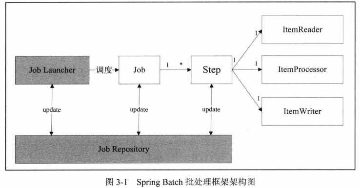

# 32 spring batch

## 1 架构图



主要对象:

```properties
Job 
Job Instance
Job parameters 作业参数,根据Job Name 和 Job parameters 来识别任务实例 instance
Job Execution  作业执行器
Job Reposity   仓库,存储作业过程中的状态和结果
Job Launcher    调度器,程序入口
Step
Step Execution
Tasklet		Step中的具体逻辑操作,可以重复执行,同步或一部执行
Execution Context
Item
Chunk
Item Reader
Item Processor
Item Writer
```

​	1 `Job Execution` 复制执行任务 , 只有 `job Execution`执行成功,对应的 ` job instance`才会被完成 , 执行失败的 `job instance` 可以通过传入同样的 `job parameters` 重新执行