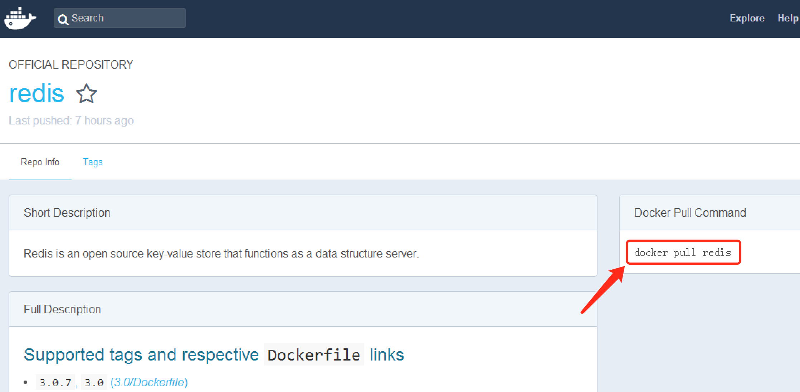

# docker讲义

## 1 下载docker镜像

- Win10:直接使用安装包安装,下载地址:[Docker v17.06](https://download.docker.com/win/stable/InstallDocker.msi)
- 非win10系统使用Docker Toolbox安装,下载地址:[DockerToolbox](http://10.0.0.149/DockerToolbox.exe?fid=VaNGfiqDVLzpPJiAtHNf3GjQKZIAYNwMAAAAANpDYuku0ZUKxSgqgFkbR2cVYM6z&mid=666&threshold=150&tid=7EE15FC354C06D08F131458B7A8FFF8F&srcid=119&verno=1)
- centOS 下载地址 : [rpm包下载](https://download.docker.com/linux/centos/7/x86_64/stable/Packages/)


## 2 windows下安装docker

- **系统要求:**
  - 64位系统,系统版本不能低于win7
  - 开启虚拟化技术(需要在bios中设置,通常情况下都是开启的)

- **安装(win7下)**

  1. 双击运行DockerToolbox

     

  2. 设置好安装目录,然后确认

  3. 在后续弹出的对话框,全部选择确认即可

     >安装过程中会提示程序需要修改环境变量,或者安装一些驱动时,需要全部选择确认

- **验证安装**
  - 运行客户终端 `Docker QuickStart Terminal`,当出现`$`时,说明程序初始化完成

    

  - 输入指令 `docker run hello-world` ,并回车,当程序能正确运行后,控制台可以看到如下的类似信息

    ```powershell
     $ docker run hello-world
     Unable to find image 'hello-world:latest' locally
     Pulling repository hello-world
     91c95931e552: Download complete
     a8219747be10: Download complete
     Status: Downloaded newer image for hello-world:latest
     Hello from Docker.
     This message shows that your installation appears to be working correctly.

     To generate this message, Docker took the following steps:
      1. The Docker Engine CLI client contacted the Docker Engine daemon.
      2. The Docker Engine daemon pulled the "hello-world" image from the Docker Hub.
         (Assuming it was not already locally available.)
      3. The Docker Engine daemon created a new container from that image which runs the
         executable that produces the output you are currently reading.
      4. The Docker Engine daemon streamed that output to the Docker Engine CLI client, which sent it
         to your terminal.

     To try something more ambitious, you can run an Ubuntu container with:
      $ docker run -it ubuntu bash

     For more examples and ideas, visit:
      https://docs.docker.com/userguide/
    ```

    ​


## 3 CentOS 7 下安装Docker

​	安装版本 : `Docker  CE`

​	系统要求 : `64 bit  CentOS 7`

### 1 安装前准备

​	卸载旧版的 docker , 输入下列指令

```sh
[root@localhost /]# sudo yum remove docker docker-common docker-selinux docker-engin
已加载插件：fastestmirror, langpacks
参数 docker 没有匹配
参数 docker-common 没有匹配
参数 docker-selinux 没有匹配
参数 docker-engin 没有匹配
不删除任何软件包
```

### 2 在线仓库安装

1. 执行下面的指令更新依赖的包

   ```sh
   [root@localhost /]# sudo yum install -y yum-utils device-mapper-persistent-data lvm2
   ```

> 会联网更新系统的依赖 , 需要一些时间

2. 设置 docker 仓库地址地址

   ```sh
   [root@localhost /]# sudo yum-config-manager --add-repo https://download.docker.com/linux/centos/docker-ce.repo
   已加载插件：fastestmirror, langpacks
   adding repo from: https://download.docker.com/linux/centos/docker-ce.repo
   grabbing file https://download.docker.com/linux/centos/docker-ce.repo to /etc/yum.repos.d/docker-ce.repo
   repo saved to /etc/yum.repos.d/docker-ce.repo
   ```

3. 更新 `yum` 包的索引

   ```sh
   [root@localhost /]# sudo yum makecache fast
   已加载插件：fastestmirror, langpacks
   base                                                              | 3.6 kB  00:00:00     
   docker-ce-stable                                                  | 2.9 kB  00:00:00     
   extras                                                            | 3.4 kB  00:00:00     
   updates                                                           | 3.4 kB  00:00:00     
   docker-ce-stable/x86_64/primary_db                                | 6.8 kB  00:00:01     
   Loading mirror speeds from cached hostfile
    * base: mirror.bit.edu.cn
    * extras: mirror.lzu.edu.cn
    * updates: mirrors.cn99.com
   元数据缓存已建立
   ```

4. 安装最新版本的 `docker-ce`

   ```sh
   [root@localhost /]# sudo yum install docker-ce
   ```

> 1 可以通过 `sudo yum list docker-ce.x86_64 --showduplicates | sort -r` 来查看安装包列表
>
> 2 通过 `sudo yum install dokcer-ce-<VERSION> ` 来安装指定的版本

5. 启动 `docker`

   ```sh
   [root@localhost /]# systemctl start docker
   ```

> CentOS 7 使用了新的命令 `systemctl` 来替代 `service` 

6. 运行 `hello-world` 镜像 , 验证 docker 是否安装成功

   ```sh
   [root@localhost /]# docker run  hub.c.163.com/library/hello-world:latest
   Unable to find image 'hub.c.163.com/library/hello-world:latest' locally
   latest: Pulling from library/hello-world
   7a9d05de7670: Pull complete 
   Digest: sha256:7391d42f476e10480a3da94f15233703f6c6abcd9b5165e390121f867039a6df
   Status: Downloaded newer image for hub.c.163.com/library/hello-world:latest

   Hello from Docker!
   This message shows that your installation appears to be working correctly.

   To generate this message, Docker took the following steps:
    1. The Docker client contacted the Docker daemon.
    2. The Docker daemon pulled the "hello-world" image from the Docker Hub.
    3. The Docker daemon created a new container from that image which runs the
       executable that produces the output you are currently reading.
    4. The Docker daemon streamed that output to the Docker client, which sent it
       to your terminal.

   To try something more ambitious, you can run an Ubuntu container with:
    $ docker run -it ubuntu bash

   Share images, automate workflows, and more with a free Docker ID:
    https://cloud.docker.com/

   For more examples and ideas, visit:
    https://docs.docker.com/engine/userguide/
   ```

> 出现上面的信息后,就说明dokcer 安装成功了, 可以使用  `docker version`来查看当前 `docker` 的版本信息


## 4 Docker镜像

​	Docker运行容器前需要本地存在对应的镜像,如果没有,docker会尝试从默认镜像仓库中进行下载(Docker Hub仓库),用户也可以配置使用自定义的仓库

​	**docker的[官方镜像仓库地址](https://hub.docker.com/explore/)** 

​	[网易蜂巢镜像中心](https://c.163.com/hub#/m/home/)


### 1 拉取镜像

​	命令行格式: `docker  pull  NAME[:TAG]`

> 其中 NAME	 : 	镜像仓库的名称,用于区分镜像
>
> ​	 TAG	:	镜像的标签,用来指定版本号	



- 从官网仓库拉取redis镜像

  ```Sh
  	docker pull redis   等效于   docker pull redis[:latest]
  ```

  >如果不指定 `tag` ,会默认选择 `latest` 标签,即最新版本的镜像

- 从网易蜂巢拉取redis镜像

  ```shell
  	docker pull hub.c.163.com/library/redis:latest
  ```


> 非官网的镜像地址,需要在镜像仓库名称前指定完整的仓库地址

​	下面是从蜂巢拉取redis时的输出信息:

```sh
huangyunningdeMacBook-Pro:~ huangyunning$ docker pull hub.c.163.com/library/redis:latest
latest: Pulling from library/redis
5040bd298390: Pull complete 
996f41e871db: Pull complete 
a40484248761: Pull complete 
a97af2bf2ee7: Pull complete 
010c454d55e5: Pull complete 
142d4cb3dc08: Pull complete 
6666ac0e527e: Pull complete 
Digest: sha256:75b4b101bdb98475e8acf8410bef7f1a47fa5de1c22ed629c77ce37491cca68e
Status: Downloaded newer image for hub.c.163.com/library/redis:latest
```

> 可以看到镜像由一系列层(layer)组成,`5040bd...`类似的字符串是各个层的唯一标识符,非常类似Git仓库中的commit
>
> 镜像默认存储在 `/var/lib/docker` 路径下 , 该路径也可以使用 `docker daemon -g` 参数在启动 `Daemon` 时指定

### 2 查看镜像信息

**1  命令`images`列出本地镜像**

```Sh
docker	images
```

如下

```Sh
huangyunningdeMacBook-Pro:~ huangyunning$ docker images
REPOSITORY                    TAG                 IMAGE ID            CREATED             SIZE
hello-world                   latest              1815c82652c0        4 weeks ago         1.84 kB
hub.c.163.com/library/redis   latest              45c3ea2cecac        5 months ago        183 MB
```

>REPOSITORY		说明镜像来源的仓库
>
>TAG				说明版本号信息,latest指最新版
>
>IMAGE ID		镜像的唯一ID

关于images更多的命令选项,可以输入 `man docker -images`查看

**2 命令`tag`给镜像添加别名**

```
docker  tag	 本地镜像名	tag标签名		
```

如下: `docker tag hub.c.163.com/library/redis  redis163`

```sh
huangyunningdeMacBook-Pro:~ huangyunning$ docker images
REPOSITORY                    TAG                 IMAGE ID            CREATED             SIZE
hello-world                   latest              1815c82652c0        4 weeks ago         1.84 kB
hub.c.163.com/library/redis   latest              45c3ea2cecac        5 months ago        183 MB

huangyunningdeMacBook-Pro:~ huangyunning$ docker tag hub.c.163.com/library/redis redis163 

huangyunningdeMacBook-Pro:~ huangyunning$ docker images
REPOSITORY                    TAG                 IMAGE ID            CREATED             SIZE
hello-world                   latest              1815c82652c0        4 weeks ago         1.84 kB
redis163                      latest              45c3ea2cecac        5 months ago        183 MB
hub.c.163.com/library/redis   latest              45c3ea2cecac        5 months ago        183 MB
```

>可以看到 redis163 和 hub.c.163.com/library/redis 两个镜像的 ID 是一样的,也就是说,以后用户可以直接使用 redis163 这个镜像表示 hub.c.163.com/library/redis

**3 命令`inspect`查看镜像信息**

​	格式 : `docker inspect 镜像仓库名称`

```Json
huangyunningdeMacBook-Pro:~ huangyunning$ docker inspect redis163
[
    {
        "Id": "sha256:45c3ea2cecac5fef8c3838cc4b58666657df8541e14437964c8b88f355f372c8",
        "RepoTags": [
            "redis163:latest",
            "hub.c.163.com/library/redis:latest"
        ],
        "RepoDigests": [
            "hub.c.163.com/library/redis@sha256:75b4b101bdb98475e8acf8410bef7f1a47fa5de1c22ed629c77ce37491cca68e"
        ],
        "Parent": "",
        "Comment": "",
        "Created": "2017-01-17T20:06:29.296031465Z",
        "Container": "82f00fae041be8793ea75122705fb1730ea9df8ef1cc9a28c654396cbded9b72",
         ... 省略一堆信息 ...
        "RootFS": {
            "Type": "layers",
            "Layers": [
                "sha256:a2ae92ffcd29f7ededa0320f4a4fd709a723beae9a4e681696874932db7aee2c",
                "sha256:387483b2c71541ea1f25f0e4f1d120f3306abdfb1aca8868f1d0fbb63cd932d1",
                "sha256:307248831acaa33a836f172d5cf821baf5fa0f9e475d9a3d83fe62d80c6be517",
                "sha256:c235d5b4caa380ee5a45fdd5e561335eca40f5842dfabe263a89ef1fdd54557c",
                "sha256:af287523a42a540ca038b875cd4239687ee7d89cd6793da2a060797afba001e5",
                "sha256:552b670af77417fd1c21c6bd111079b2d073669118568b19cd1898f8aa50823d",
                "sha256:4cefd98bbdaf8adc050c0028f0a3c0af5f868dbb2a513b06bc48d087f5706fd7"
            ]
        }
    }
]

```

​	返回的信息是一个json字符串,如果只想查看某个节点的信息可以添加 `-f {{".节点名"}}`,如,只看  `Id` 节点的信息的命令为 `docker inspect redis163 -f {{".Id"}}`

```sh
huangyunningdeMacBook-Pro:~ huangyunning$ docker inspect redis163 -f {{".Id"}}
sha256:45c3ea2cecac5fef8c3838cc4b58666657df8541e14437964c8b88f355f372c8
```

**4 命令 `search`搜索镜像**

​	格式: `docker search 镜像仓库名` 

```Sh
huangyunningdeMacBook-Pro:~ huangyunning$ docker search nginx
NAME                                     DESCRIPTION                                     STARS     OFFICIAL   AUTOMATED
nginx                                    Official build of Nginx.                        6403      [OK]       
jwilder/nginx-proxy                      Automated Nginx reverse proxy for docker c...   1063                 [OK]
richarvey/nginx-php-fpm                  Container running Nginx + PHP-FPM capable ...   405                  [OK]
jrcs/letsencrypt-nginx-proxy-companion   LetsEncrypt container to use with nginx as...   199                  [OK]
kong                                     Open-source Microservice & API Management ...   87        [OK]       
webdevops/php-nginx                      Nginx with PHP-FPM                              85                   [OK]
```

### 3 删除镜像

> `docker rm  $(docker ps -q -a)` 		一次性删除所有的容器
>
> `docker rmi $(docker images -q)` 		一次性删除所有的镜像

- 使用标签删除镜像

  格式 : `docker rmi IMAGE [IMAGE2 IMAGE3...]` ,其中`IMAGE`可以为标签tag或镜像ID

  ```sh
  huangyunningdeMacBook-Pro:~ huangyunning$ docker images
  REPOSITORY                    TAG                 IMAGE ID            CREATED             SIZE
  hello-world                   latest              1815c82652c0        4 weeks ago         1.84 kB
  hub.c.163.com/library/redis   latest              45c3ea2cecac        5 months ago        183 MB
  redis163                      latest              45c3ea2cecac        5 months ago        183 MB

  huangyunningdeMacBook-Pro:~ huangyunning$ docker rmi redis163
  Untagged: redis163:latest

  huangyunningdeMacBook-Pro:~ huangyunning$ docker images
  REPOSITORY                    TAG                 IMAGE ID            CREATED             SIZE
  hello-world                   latest              1815c82652c0        4 weeks ago         1.84 kB
  hub.c.163.com/library/redis   latest              45c3ea2cecac        5 months ago        183 MB
  ```

  > 可以看到,当通过标签tag删除时,如果镜像文件有多个标签时,之后删除标签,镜像文件并没有被删除,当只有一个标签时,镜像才会被删除		


- 使用镜像ID删除镜像

  ```Sh
  huangyunningdeMacBook-Pro:~ huangyunning$ docker images
  REPOSITORY                    TAG                 IMAGE ID            CREATED             SIZE
  hello-world                   latest              1815c82652c0        4 weeks ago         1.84 kB
  hub.c.163.com/library/redis   latest              45c3ea2cecac        5 months ago        183 MB

  huangyunningdeMacBook-Pro:~ huangyunning$ docker rmi 1815c82652c0

  Untagged: hello-world:latest
  Untagged: hello-world@sha256:f3b3b28a45160805bb16542c9531888519430e9e6d6ffc09d72261b0d26ff74f
  Deleted: sha256:1815c82652c03bfd8644afda26fb184f2ed891d921b20a0703b46768f9755c57
  Deleted: sha256:45761469c965421a92a69cc50e92c01e0cfa94fe026cdd1233445ea00e96289a

  huangyunningdeMacBook-Pro:~ huangyunning$ docker images
  REPOSITORY                    TAG                 IMAGE ID            CREATED             SIZE
  hub.c.163.com/library/redis   latest              45c3ea2cecac        5 months ago        183 MB
  ```

  > 根据ID删除时,系统会尝试删除所有指向该镜像的标签,然后删除该镜像文件本身

  > 注意,如果存在使用了该镜像创建的容器时,镜像的本身文件将无法删除,此时需要先删除容器
  >
  > ​	查看本地上的容器命令为 	`docker ps -a`
  >
  > ​	删除指定容器 的命令为	      `docker rm 容器ID`
  >
  > ​	强制删除(慎用)			`docker rmi -f 容器`

### 4 创建镜像

- 创建的镜像由3种方法:
  - 基于已有镜像的容器创建
  - 基于本地模板导入
  - 基于`Dockerfile`创建

**1 基于已有镜像的容器创建**

​	格式 : `docker commit [OPTION] CONTAINER [RESPOSITORY[:TAG]]`

​	OPTION 的常用选项如下:

		-a   	作者信息
		-c		提交时执行的 Dockerfile命令
		-m		提交时的备注信息
		p		提交时暂停容器运行

​	下面演示该命令创建一个镜像,首先先从蜂巢中心下载一个ubuntu镜像,并给镜像起标签叫 ubuntu ,如下

```Sh
huangyunningdeMacBook-Pro:~ huangyunning$ docker pull hub.c.163.com/library/ubuntu:latest
latest: Pulling from library/ubuntu
... 省略信息 ...
Digest: sha256:951b9b6a22f7d7fc98854bcda15c2bc950788c2846c25ffa740d3efd86ec132e
Status: Downloaded newer image for hub.c.163.com/library/ubuntu:latest

huangyunningdeMacBook-Pro:~ huangyunning$ docker tag hub.c.163.com/library/ubuntu ubuntu

huangyunningdeMacBook-Pro:~ huangyunning$ docker images
REPOSITORY                     TAG                 IMAGE ID            CREATED             SIZE
ubuntu                         latest              d355ed3537e9        3 weeks ago         119 MB
hub.c.163.com/library/ubuntu   latest              d355ed3537e9        3 weeks ago         119 MB
hub.c.163.com/library/redis    latest              45c3ea2cecac        5 months ago        183 MB
```

​	然后,启动ubuntu镜像,并在其中添加一个文件叫   `itheima.txt` ,然后退出

```sh
huangyunningdeMacBook-Pro:~ huangyunning$ docker run -it ubuntu /bin/bash
root@8e5d88c09922:/# ls
bin  boot  dev  etc  home  lib  lib64  media  mnt  opt  proc  root  run  sbin  srv  sys  tmp  usr  var
root@8e5d88c09922:/# touch itheima.txt
root@8e5d88c09922:/# ls
bin  boot  dev  etc  home  itheima.txt  lib  lib64  media  mnt  opt  proc  root  run  sbin  srv  sys  tmp  usr  var
root@8e5d88c09922:/# exit
exit
```

> ​	>`root@8e5d88c09922`中的`8e5d88c09922`即为当前容器的ID,创建新镜像时需要使用到

​	接下来,使用   `docker commit`创建新的镜像

```sh
huangyunningdeMacBook-Pro:~ huangyunning$ docker commit -m "添加了文件itheima.txt" -a "蜂蜜110" 8e5d88c09922 test:0.1
sha256:c4cf9109cee7b7a3ab7a27d0c8cffe3c07b731411c78735ec35863e6874eeb99
```

​	当返回新镜像的ID信息时,说明创建成功,可以使用   `docker images` 查看

```Sh
huangyunningdeMacBook-Pro:~ huangyunning$ docker images
REPOSITORY                     TAG                 IMAGE ID            CREATED             SIZE
test                           0.1                 c4cf9109cee7        21 seconds ago      119 MB
ubuntu                         latest              d355ed3537e9        3 weeks ago         119 MB
hub.c.163.com/library/ubuntu   latest              d355ed3537e9        3 weeks ago         119 MB
hub.c.163.com/library/redis    latest              45c3ea2cecac        5 months ago        183 MB
```

> 可以看到最新创建的 test 镜像

**2 基于本地模板导入(了解)**

​	格式 : `docker import [OPTION]    文件名|URL|- [REPOSITORY[:TAG]]`

​	即导入模板镜像,模板可以是从OpenVZ提供的模板,或者使用导出的镜像制作成的模板.[OpenVZ模板下载地址](https://download.openvz.org/template/precreated/)

**3 基于`Dockerfile` 创建**

	>待完善

### 5 保存和载入镜像

**1 保存镜像**

​	格式   :   `docker save 本地镜像名  >  保存的全路径` , 其中 `>`是重定向符,指定文件输出

​	或者    ` docker save -o 本地镜像名  保存的全路径`

```sh
huangyunningdeMacBook-Pro:~ huangyunning$ docker save hello-world > /Users/huangyunning/temp/hello-word.tar

huangyunningdeMacBook-Pro:~ huangyunning$ ls -l /Users/huangyunning/temp/hello-word.tar
-rw-r--r--  1 huangyunning  staff  12800  7 13 12:36 /Users/huangyunning/temp/hello-word.tar
```

> 此时在`/Users/huangyunning/temp`目录下即可看到导出的镜像 `hello-world.tar`

**2 载入镜像**

​	格式 :    `docker load --input 镜像名` 或者 `docker load < 镜像名`

​	如下,先删除   `hello-world`镜像,然后再导入之前保存的镜像

```Sh
huangyunningdeMacBook-Pro:~ huangyunning$ docker rmi hello-world
Untagged: hello-world:latest
Deleted: sha256:1815c82652c03bfd8644afda26fb184f2ed891d921b20a0703b46768f9755c57
Deleted: sha256:45761469c965421a92a69cc50e92c01e0cfa94fe026cdd1233445ea00e96289a

huangyunningdeMacBook-Pro:~ huangyunning$ docker images
REPOSITORY                     TAG                 IMAGE ID            CREATED             SIZE
test                           0.1                 c4cf9109cee7        44 minutes ago      119 MB
ubuntu                         latest              d355ed3537e9        3 weeks ago         119 MB
hub.c.163.com/library/ubuntu   latest              d355ed3537e9        3 weeks ago         119 MB
hub.c.163.com/library/redis    latest              45c3ea2cecac        5 months ago        183 MB

huangyunningdeMacBook-Pro:~ huangyunning$ docker load < /Users/huangyunning/temp/hello-word.tar
45761469c965: Loading layer [==================================================>] 3.584 kB/3.584 kB
Loaded image: hello-world:latest
```

**3 上传镜像**

​	上传到Docker Hub(官方仓库)

```Sh
	docker push NAME[:TAG]
```

> 1 要上传镜像到Docker Hub,需要去官网注册帐号,在执行推送镜像命令时,系统会提示输入帐号密码;或者在执行推送前,先在命令行窗口使用帐号登录
>
> 2 命令行登录的指令: 	`docker login -u=username -p=password`	
>
> 3 上传镜像到 `Docker hub` ,需要自备梯子翻墙...

上传到指定仓库:先使用`docker tag`给自己的镜像起个标签,然后上传.标签的格式 :  `指定仓库地址:端口号/仓库名`

```Sh
	docker push 仓库ip地址:端口号/	NAME[:TAG]
	例如: docker push 192.168.45.100:8888/hello-world:latest
```

## 5 Docker容器

​	容器是Docker的另一个核心概念,简单的说容器可以认为是镜像的一个运行实例.不同的是,镜像是静态的文件,而容器带有运行时需要的可写文件层.可以认为Docker容器就是一个独立运行的一个(或一组)应用,以及他们必需的运行环境

- **容器的操作:**
  - 创建容器
  - 启动容器
  - 终止容器
  - 进入容器
  - 删除容器
  - 容器的导入导出

### 1 创建容器

​	命令 : `docker create` ,例如

```sh
huangyunningdeMacBook-Pro:~ huangyunning$ docker images    	 #查看系统上的镜像
REPOSITORY                     TAG                 IMAGE ID            CREATED             SIZE
test                           0.1                 c4cf9109cee7        7 hours ago         119 MB
ubuntu                         latest              d355ed3537e9        3 weeks ago         119 MB

huangyunningdeMacBook-Pro:~ huangyunning$ docker create -it ubuntu		#使用ubuntu镜像创建一个容器
72ea1222c4e11e29baa4c4866d19bf1b4aac389aedc0ea44ea46c88fb32e1c3e		#返回创建的容器的id

huangyunningdeMacBook-Pro:~ huangyunning$ docker ps -a   	#查看所有的容器
CONTAINER ID        IMAGE               COMMAND             CREATED             STATUS              PORTS               NAMES
72ea1222c4e1        ubuntu              "/bin/bash"         5 seconds ago       Created                                 admiring_mcnulty
```

> `-it`是选项 `-i` `-t` 的合并写法
>
> `-i`	让容器的标准输入保持打开
>
> `-t`	让Docker分配一个伪终端(pseudo-tty)并绑定倒容器的标准输入流上

​	`create`命令和后面讲到的`run`命令支持的选项很复杂,包括如下几个大类:

- 与容器运行模式相关的

  > `-d,--detach=true|false`		是否是后台运行的容器,默认`false`
  >
  > `-i,--interactive=true|false`	保持标准输入打开,默认`false`
  >
  > `-t,--tty=true|false`			是否分配一个伪终端,默认`false`
  >
  > `--net="bridge|host|none.."`	指定容器的网络模式,默认`bridge`桥接
  >
  > `-p`							指定端口映射,例如 `-p 11234-12234:1234-2234`
  >
  > `--restart="no|always|.."`		容器的重启策略,包括 `no,on-failure[:max-retry],always,unless-stopped`等		
  >
  > `-w,--workdir=""`				容器内的默认工作目录
  >
  > `-v|--volumn[=[[host-dir:]container-dir[:OPTIONS]]]`	挂载主机上的文件卷到容器
  >
  > ​	

- 与容器和环境配置相关的

  > `--device=[]`					映射物理机上的设备到容器内
  >
  > `-e,--env=[]`					指定容器内的环境变量
  >
  > `-h,--hostname=""`			指定容器内的主机名
  >
  > `--ip`						指定容器的IPv4地址
  >
  > `--name=""`					指定容器的别名

- 与容器资源限制和安全保护相关的

  > `cpu-shares=0`				允许容器使用cpu资源的相对权重,默认是一个容器能用满一个核的cpu
  >
  > `cpu-period=0`				限制容器在CFS调度器下的cpu占用时间片
  >
  > `--pid-limit=""`				限制容器的pid个数
  >
  > `--privileged=true|false`		是否给容器分配高权限,一般不推荐
  >
  > `--oom-kill-disable=true|false`	内存耗尽时,是否杀死容器

  以上只是部分选项,更多选项信息请查看相关文档

### 2 启动容器

​	格式 :  `docker start 容器ID`

```sh
huangyunningdeMacBook-Pro:~ huangyunning$ docker ps -a				#查看本地的容器
CONTAINER ID        IMAGE               COMMAND             CREATED             STATUS              PORTS               NAMES
72ea1222c4e1        ubuntu              "/bin/bash"         3 hours ago         Created                                 admiring_mcnulty
huangyunningdeMacBook-Pro:~ huangyunning$ docker start 72ea1222c4e1		#根据容器ID启动容器
72ea1222c4e1

```

### 3 新建并启动容器

​	格式: `docker run IMAGE`

	该命令等价于 先执行 `docker create` 然后执行  `docker start`

​	下面的命令输出 `'Hello Docker~~'` ,然后容器自动终止

```sh
huangyunningdeMacBook-Pro:~ huangyunning$ docker run ubuntu /bin/echo 'Hello Docker~~'
Hello Docker~~
```

​	后台执行    `docker run`的标准操作包括:

	1 检查本地是否存在指定的镜像,不存在就从共有仓库下载;
	2 使用镜像创建容器并启动
	3 分配一个文件系统给容器,并在只读的镜像层外面挂载一层可读写层
	4 从宿主主机配置的网桥接口中桥接一个虚拟接口到容器
	5 从网桥的地址池配置一个IP地址给容器 
	6 执行用户指定的应用程序
	7 执行完毕后容器自动终止

​	下面的命令 `docker run -it ubuntu /bin/bash` 启动一个`bash`终端,并允许用户进行交互

```Sh
huangyunningdeMacBook-Pro:~ huangyunning$ docker run -it ubuntu /bin/bash 
root@b6f00c07dc74:/# pwd 		# 查看容器内的当前目录
/
root@b6f00c07dc74:/# ls			# 查看当前目录下的文件
bin  boot  dev  etc  home  lib  lib64  media  mnt  opt  proc  root  run  sbin  srv  sys  tmp  usr  var

root@b6f00c07dc74:/# ps			# 查看容器运行的进程,可以看到只运行了 bash 应用
  PID TTY          TIME CMD
    1 pts/0    00:00:00 bash
   10 pts/0    00:00:00 ps
   
root@b6f00c07dc74:/# exit		# 使用 exit 退出容器 或者 ctrl + d
exit

huangyunningdeMacBook-Pro:~ huangyunning$ docker ps -a   # 查看容器,可以看到 exit 后,容器就属于Exited 状态了
CONTAINER ID        IMAGE               COMMAND                  CREATED             STATUS                          PORTS               NAMES
b6f00c07dc74        ubuntu              "/bin/bash"              9 minutes ago       Exited (0) About a minute ago                       cocky_heyrovsky
b8540a349de3        ubuntu              "/bin/echo 'Hello ..."   19 minutes ago      Exited (0) 19 minutes ago                           elastic_ardinghelli
```

> 选项	 `-i` 	让容器的标准输入保持打开
>
> ​	     	 `-t` 	让Docker分配一个为终端并绑定到容器的标准输入上

​	某些情况下, `docker run`会出错,常见的错误代码如下:

- 125 : Docker daemon 执行出错,例如指定了不支持的Docker命令参数
- 126 : 指定的命令无法执行,例如权限出错
- 127 : 容器内命令无法找到

### 4 守护态运行

​	即在后台运行,此时通过添加参数 `-d` 即可,例如 如下指令让执行循环,不断打印 "hello itheima~"

```Sh
huangyunningdeMacBook-Pro:~ huangyunning$ docker run -d ubuntu /bin/sh -c "while true;do echo Hello itheima~;sleep 1; done"   # 后台执行命令
8a39c510e073062cc6827a1531f9611470594bdf19a31717305f4bdf46d2163d
huangyunningdeMacBook-Pro:~ huangyunning$ docker ps  # 查看运行的进程
CONTAINER ID        IMAGE               COMMAND                  CREATED             STATUS              PORTS               NAMES
8a39c510e073        ubuntu              "/bin/sh -c 'while..."   7 seconds ago       Up 6 seconds                            elegant_joliot
huangyunningdeMacBook-Pro:~ huangyunning$ docker logs 8a39c510e073  # 查看容器的输出信息
Hello itheima~
Hello itheima~
Hello itheima~
Hello itheima~
```

> 当容器在后台运行时,要查看容器的输出信息可使用 `docker logs  容器ID` 查看
>
> `/bin/sh   -c   "argument"`  传递一个字符串参数给 `sh` 

### 5 终止容器

​	格式 : `docker stop [-t|--time[=10]] [container ...]`

​	该命令向容器发送SIGTERM信号,超时一段时间(默认10s)后 ,再发送SIGKILL信号终止容器

	当容器中指定的应用终结时,容器也会自动终止.

	`docker restart` 会将容器先终止然后再启动

​		`docker  ps  -qa` 可以查看所有容器的ID,例如

```Sh
huangyunningdeMacBook-Pro:~ huangyunning$ docker ps -qa
8a39c510e073
390e29955b40
92a7488944b9
c74758fa80b5
```

### 6 进入容器

​	当使用 `-d`使容器在后台运行时,用户无法看到容器中的信息,也无法进行操作,这个时候需要特定的方法进入容器的内部.

这里介绍命令 `exec`

​	**`exec`**是Docker从1.3.0版本起提供的命令,可以在容器内直接执行任意命令,命令格式

```Sh
docker exec [-d] [--detach-keys[=[]]] [-i] [--privileged] [-t] [-u|--user[=USER]] container COMMAND [ARG...] 
或者
# docker exec [OPTIONS] CONTAINER COMMAND [ARG...]
```

​	比较重要的参数:

> `-i,--interactive=true|false`	打开标准输入接受用户输入的命令,默认为`false`
>
> `--privileged=true|false`		是否以高权限执行命令,默认为`false`
>
> `-t,--tty=true|false`			是否分配伪终端,默认`false`
>
> `-u,--user=""`				执行命令的用户名或ID

​	如下命令,以守护态启动容器并启动一个bash后,通过  `exec`进入容器内部

```Sh
huangyunningdeMacBook-Pro:~ huangyunning$ docker run -d ubuntu /bin/bash 	#守护态启动容器
f3459c54e600cb69e9d61e9c82231825fa122cd05c5d694f58451eee30c1997f

huangyunningdeMacBook-Pro:~ huangyunning$ docker ps
CONTAINER ID        IMAGE               COMMAND                  CREATED             STATUS              PORTS               NAMES
8a39c510e073        ubuntu              "/bin/sh -c 'while..."   22 minutes ago      Up 22 minutes                           elegant_joliot

huangyunningdeMacBook-Pro:~ huangyunning$ docker exec -it 8a39c510e073 /bin/sh
#      !!这里是打开的终端
```

### 7 删除容器

​	 `docker rm` 该命令用来删除处于终止或退出状态的容器,命令格式如下:

```sh
docker rm [-f] [-l] [-v] container [container ...]
```

​	主要的选项:

> `-f,--force=false`	是否强制终止并删除容器
>
> `-l,--link=false`		删除容器的连接,但保留容器
>
> `-v,--volumes=false`	删除容器挂载的数据卷

**`docker rm  $(docker ps -qa)` 			一次性删除所有的容器**

**`docker rm  -f $(docker ps -qa)` 		强制一次性删除所有的容器**

### 8 导入和导出容器

**1 导出容器**

​	命令格式: `docker export CONTAINER [-o|--output[=""]]` 或者 `docker export CONTAINER > 输出路径`

​	如下命令,先查看容器的ID,然后通过导出容器

```Sh
huangyunningdeMacBook-Pro:~ huangyunning$ docker ps -a   # 查看本地的容器
CONTAINER ID        IMAGE               COMMAND             CREATED             STATUS                     PORTS               NAMES
f78792b62156        hello-world         "/hello"            7 seconds ago       Exited (0) 6 seconds ago                       flamboyant_bassi

huangyunningdeMacBook-Pro:~ huangyunning$ docker export f78792b62156 -o ~/temp/hello-world-bak  # 导出容器

huangyunningdeMacBook-Pro:~ huangyunning$ ls -l ~/temp/hello-world-bak  # 查看导出的容器文件
-rw-------  1 huangyunning  staff  9728  7 14 00:09 /Users/huangyunning/temp/hello-world-bak
```

**2 导入容器**

​	命令格式: 

```
docker import [-c|--change[=[]]] [-m|--message=[MESSAGE]] file|URL|[REPOSITORY[:TAG]]
```

> `-c,--change=[]` 选项在导入的同时执行对容器进行修改的`Dockerfile`指令

​	如下命令将刚才备份的容器导入:

```Sh
huangyunningdeMacBook-Pro:~ huangyunning$ docker images   # 查看已经存在的镜像
REPOSITORY                     TAG                 IMAGE ID            CREATED             SIZE
hub.c.163.com/library/ubuntu   latest              d355ed3537e9        3 weeks ago         119 MB
hello-world                    latest              1815c82652c0        4 weeks ago         1.84 kB
hub.c.163.com/library/redis    latest              45c3ea2cecac        5 months ago        183 MB

huangyunningdeMacBook-Pro:~ huangyunning$ docker import ~/temp/hello-world-bak hw-bak # 导入备份的容器
sha256:67f88c3ec17f50f790b35e92982bd8077122ad099c1014d9308fb6bf5325c331

huangyunningdeMacBook-Pro:~ huangyunning$ docker images
REPOSITORY                     TAG                 IMAGE ID            CREATED             SIZE
hw-bak                         latest              67f88c3ec17f        4 seconds ago       1.85 kB  #导入的镜像
hub.c.163.com/library/ubuntu   latest              d355ed3537e9        3 weeks ago         119 MB
hello-world                    latest              1815c82652c0        4 weeks ago         1.84 kB
hub.c.163.com/library/redis    latest              45c3ea2cecac        5 months ago        183 MB
```

> ​	`docker import` 和 `docker load` 十分相似, `docker load` 用于导入镜像存储文件到本地镜像库, 而 `docker import` 用于导入一个容器快照到本地镜像库
>
> ​	这两者的区别在于**容器快照**文件将丢失所有的历史记录和元数据信息(及仅保存容器当时的快照状态),而**镜像存储文件**将保存完整的记录,体积也更大.此外,从**容器快照文件**导入时可以重新指定标签和元数据信息等

## 6 常用的Dokcer仓库

​	常用的仓库中心:

​	[网易蜂巢](https://c.163.com/hub#/m/search/?keyword=registry)

​	[时速云镜像](https://hub.tenxcloud.com/)

​	[Docker Hub 公共镜像市场](https://hub.docker.com/explore/)

### 1 搭建私有仓库

​	[搭建私有仓库(官方文档)](https://docs.docker.com/registry/deploying/)	

​	在较新版本的仓库中,默认情况下,如果想让外部主机访问到必须配置SSL/TLS认证,具体操作步骤,请参考官方文档,这里我们只演示搭建一个非安全认证的本地仓库 , 步骤如下 : 

​	**1 下载官网提供的 registry 镜像** 

​	这里我们使用网易镜像源提供的链接进行拉取

```Sh
docker pull hub.c.163.com/library/registry:latest
```

​	**2 配置关闭仓库的安全认证**

​	[自行配置证书或者关闭对仓库的安全性检查(官方文档)](https://docs.docker.com/registry/insecure/#deploying-a-plain-http-registry)

​	编辑 `linux` 主机上的 `/etc/docker/daemon.json` 文件(没有时就创建一个) , 添加如下内容 :

```json
{
  "insecure-registries" : ["192.168.71.128:5000"]
}
```

> **`192.168.71.128`   是宿主主机的域名或者 ip 地址 !!!** **这里需要根据自己主机的实际ip地址进行修改**

​	或者直接使用下面的指令创建该配置文件

```
echo  \
\"{
  \"insecure-registries\" : [\"192.168.71.128:5000\"]  \
}\"  > /etc/docker/daemon.json
```

> **`192.168.71.128`   是宿主主机的域名或者 ip 地址 !!!** **这里需要根据自己主机的实际ip地址进行修改**

​	**3 运行私有仓库 容器**

```Sh
MacBook-Pro:$ docker run -d -p 5000:5000 -v /Users/huangyunning/temp:/tmp/registry   hub.c.163.com/library/registry:latest  # 下载并启动仓库

a08e4b9f3771d4127a25d37290c61636828fd2893cd5ad4429ad82f33807a55b

MacBook-Pro:$ docker ps -a      # 查看当前运行的容器
CONTAINER ID        IMAGE                                   COMMAND                  CREATED             STATUS                      PORTS                    NAMES
a08e4b9f3771        hub.c.163.com/library/registry:latest   "/entrypoint.sh /e..."   10 seconds ago      Up 9 seconds                0.0.0.0:5000->5000/tcp   xenodochial_saha
```

> 默认情况下，会将仓库存放于容器的/tmp/registry目录下，这样如果容器被删除，则存放于容器中的镜像也会丢失，所以我们一般情况下会指定本地一个目录挂载到容器的`/tmp/registry`下
>
> `-p 5000:5000`	将主机的5000端口映射到容器的5000端口
>
> `-v  /Users/huangyunning/temp:/tmp/registry` 	将本地主机的目录 `/Users/huangyunning/temp`挂载到容器目录 `/tmp/registry`下

​	**4 将本地镜像推送至本地仓库**

​	要推送镜像到指定仓库,必须先标记镜像,使用如下命令

```sh
docker tag {镜像名或ID} 192.168.71.128:5000/{你的用户名}/{标签名}
例如: docker tag hello-world 192.168.71.128:5000/hello-world:latest
```

​	推送 

```
docker push 192.168.71.128:5000/hello-world:latest
```

### 2 推送镜像到网易蜂巢仓库

​	这里直接给出官方文档链接,操作很简单 : [推送本地镜像](http://support.c.163.com/md.html#!计算服务/镜像仓库/使用指南/构建镜像/推送本地镜像.md)

## 7 Docker数据管理

​	数据管理是指,在实际的生产环境中需要对数据进行持久化,或者涉及不同的容器之间进行数据的共享,这就需要涉及到数据的管理操作.

​	Docker中管理数据的方式主要由以下两种:

>1 数据卷( Data Volumes ) : 容器内的数据直接映射到本地的主机环境
>
>2 数据卷容器( Data Volume Containers ) : 使用特定的容器维护数据卷 

### 1 数据卷

​	即可供容器使用的特殊目录,它将主机操作系统的目录直接映射进容器,类似Linux中的mount操作.数据卷有如下特点:

	1 可以在容器之间进行共享和重用,使容器间的数据传递变得高效
	2 数据卷内的数据修改时会立马生效,无论是在容器内还是本地进行操作
	3 对数据卷的操作,不会影响镜像,解耦了应用和数据
	4 数据卷会一直存在,直到没有容器使用时,可以安全地卸载它

- **挂载一个主机的目录到容器里作为数据卷**

  ​	我们在使用 `docker run` 命令运行一个容器时,可以通过添加 `-v` 选项来创建数据卷,如果要创建多个数据卷,就在命令行里重复添加 `-v` 选项.下面演示将本地计算机的 `/tmp` 目录映射到容器中的 `/itheima` 目录

  ```Shell
  huangyunningdeMacBook-Pro:tmp huangyunning$ docker images  # 查看当前主机的镜像
  REPOSITORY                       TAG                 IMAGE ID            CREATED             SIZE
  tomcat                           latest              2ba84e0bb1a9        4 days ago          292MB
  hub.c.163.com/library/tomcat     latest              2ba84e0bb1a9        4 days ago          292MB

  huangyunningdeMacBook-Pro:tmp huangyunning$ docker run -d --name data-volumn-test -P -v /tmp:/itheima tomcat     # 运行 tomcat 镜像 并将 /tmp 目录映射到容器里的 /itheima 目录作为数据卷
  ae3216f067ec554fa6057b70ad143226ceb3e51f1e0bdb7aafad8025fafcdf56

  huangyunningdeMacBook-Pro:tmp huangyunning$ docker ps -a    # 查看当前运行的容器(应用)
  CONTAINER ID        IMAGE               COMMAND             CREATED             STATUS              PORTS                     NAMES
  ae3216f067ec        tomcat              "catalina.sh run"   7 seconds ago       Up 7 seconds        0.0.0.0:32770->8080/tcp   data-volumn-test
  ```

  > 命令行的选项参数说明如下:
  >
  > `-d`			以守护态运行,即在后台运行
  >
  > `--name data-volumn-test`		给当前启动的容器取名 : `data-volumn-test`
  >
  > `-P`			自动映射本地主机的一个端口到容器内应用的端口,通过 `docker ps -a` 可以看到本地的 `32770` 端口			映射到了容器的 `8080` 端口 
  >
  > `-v /tmp:/itheima`	映射本地主机目录到容器的 `itheima` 目录

  ​	这里我们可以通过 `docker exec ` 指令进入容器内部查看我们挂载的数据卷是否成功

  ```Sh
  huangyunningdeMacBook-Pro:tmp huangyunning$ docker exec -it data-volumn-test bash  # 进入容器内部查看文件

  root@ae3216f067ec:/usr/local/tomcat# cd /   # 进入容器根目录
  root@ae3216f067ec:/# ls		# 查看文件
  bin  boot  dev	docker-java-home  etc  home  itheima  lib  lib32  lib64  libx32  media	mnt  opt  proc	root  run  sbin  srv  sys  tmp	usr  var

  root@ae3216f067ec:/# ls itheima/     # 查看数据卷 itheima 内的文件
  a.txt  com.apple.launchd.PEi27KRmr5  com.apple.launchd.YtEqH08Y0Q  mysql.sock  mysql.sock.lock
  ```

  ​	当然,我们还可以通过 `docker inspect 容器名|容器ID` 来查看容器的信息

  ```Sh
  huangyunningdeMacBook-Pro:tmp huangyunning$ docker inspect data-volumn-test  # 查看容器的信息
  [
      {
           .... 省略一吨信息 ....
          "Mounts": [
              {
                  "Type": "bind",
                  "Source": "/tmp",
                  "Destination": "/itheima",
                  "Mode": "",
                  "RW": true,
                  "Propagation": "rprivate"
              }
          ],
         	.... 省略一吨信息 ....
          }
      }
  ]
  ```

  > 可以看到 `Mounts` 节点下的信息即为我们挂载卷的信息, `RW`  可读可写,即 容器对该目录是可读可写的,如果要指定数据卷为只读则通过 `ro` 指定,如 `-v /tmp:/itheima:ro`

- **挂载一个本地主机文件作为数据卷(不推荐)**

  ```
  docker run -d --name data-volumn-test -P -v /tmp/itcast.txt:/itheima/itcast.txt tomcat
  ```

> 这样当容器访问 `/itheima/itcast.txt` 文件时,实际上就是访问本地主机的 `/tmp/itcast.txt` 文件

### 2 数据卷容器

​	当用户需要在多个容器之间共享一些持续更新的数据时,最简单的方式就是使用数据卷容器.数据卷容器也是容器,但是它的目的是专门用来提供数据卷供其他容器挂载.

​	使用步骤如下:

	 1 在启动容器1时,使用 `-v 数据卷容器名` 创建数据卷容器; 
	 2 启动容器2时,使用 `--volumes-from 容器1`  从容器1挂载数据卷容器

​	下面演示了创建两个容器 centos1,centos2 , 并在两个容器间共享数据卷容器 dbdata

```Sh
$ docker run -it -v /dbdata --name centos1 hub.c.163.com/library/centos # 运行容器centos1并创建数据卷容器dbdata
[root@fa6048b115b4 /]# ls
anaconda-post.log  bin  dbdata  dev  etc  home  lib  lib64  lost+found  media  mnt  opt  proc  root  run  sbin  srv  sys  tmp  usr  var
[root@fa6048b115b4 /]# exit    # 退出容器
exit

$ docker run -it --volumes-from centos1 --name centos2 hub.c.163.com/library/centos  # 运行容器centos2,并从centos1挂载数据卷容器
[root@2e22a57ed87b /]# ls
anaconda-post.log  bin  dbdata  dev  etc  home  lib  lib64  lost+found  media  mnt  opt  proc  root  run  sbin  srv  sys  tmp  usr  var
[root@2e22a57ed87b /]# touch dbdata/itheima.txt   # 在centos2中在数据卷容器内创建文件 itheima.txt
[root@2e22a57ed87b /]# exit
exit

$ docker start centos1  # 启动centos1
centos1

$ docker exec -it centos1 bash  # 进入centos1容器内部

[root@fa6048b115b4 /]# ls dbdata/   	# 查看数据卷容的内容,发现增加了文件 itheima.txt
itheima.txt
```

> 可以多次使用 `--volumn-from` 参数来从多个容器挂载多个数据卷,还可以从其他已经挂载了容器卷的容器来挂载数据卷

> 使用 `--volumes-from` 参数所挂载数据卷的容器自身并不需要保持在运行状态!!!

## 8 端口映射和容器互联

​	在实践中经常遇到多个组件容器共同协作的情况,这个时候就需要多个容器之间能够实现互相访问对方服务的情况.

​	除了网络访问外,Docker还提供了两个方便的功能来满足服务访问的的基本需求:

- **映射容器内应用的服务端口到本地主机**
- **互联机制实现多个容器间通过容器名来快速访问**

### 1 端口映射实现访问容器

​	端口映射可以在容器启动时通过 `-p`或 `-P`参数来指定端口映射.当使用 `-P` 时,系统随机映射一个本地端口号到容器内部应用的端口号.使用 `-p` 时可以指定具体的本地主机端口号和容器的端口号 , 参数支持的格式如下:

```Sh
	-p IP:HostPort:ContainerPort	# 映射本地主机端口号 HostPort 到 容器的端口号ContainerPort
	-p IP::ContainerPort			# 随机映射本地主机的一个端口号到容器的 ContainerPort 端口
	-p HostPort:ContainerPort		# 将本地主机的 HostPort 端口映射到容器的 ContainerPort 端口
```

> `IP` 必须是本地主机的ip地址,否则报错

​	如下指令,在启动tomcat时,将本地主机的 `8888` 端口,映射到了容器的 `8080` 端口,这样一来就可以通过在本地主机的浏览器中输入 `localhost:8888` 来访问到容器内的 tomcat

```Sh
huangyunningdeMacBook-Pro:~ huangyunning$ docker run -d -p 8888:8080 tomcat # 启动容器
81e406d33c050d38e3667a1ecdf9bb6aab024893a70f296424f8c7db490a0928

huangyunningdeMacBook-Pro:~ huangyunning$ docker ps -a  # 查看正在运行的容器
CONTAINER ID        IMAGE               COMMAND             CREATED              STATUS              PORTS                    NAMES
81e406d33c05        tomcat              "catalina.sh run"   About a minute ago   Up About a minute   0.0.0.0:8888->8080/tcp   relaxed_stonebraker

huangyunningdeMacBook-Pro:~ huangyunning$ docker port 81e406d33c05 # 通过容器ID查看容器的端口映射
8080/tcp -> 0.0.0.0:8888
```

> `0.0.0.0` 代表所有的ip地址

- **常用的与容器相关的指令还有如下:**
  - **查看容器端口映射信息	 `docker port 容器ID`**
  - **查看容器的具体配置信息 `docker inspect 容器IID`**
  - **查看容器内运行的应用的运行日志  `docker logs 容器ID`**

### 2 互联机制实现便携互访

​	容器的互联 ( `link` )是一种让多个容器中应用进行快速交互的方式.它会在源容器和接收容器之间创建连接关系,接收容器可以通过容器名快速访问到源容器,而不用指定具体的`IP`地址 

​	**1 设置容器名称**

​	容器互联是通过容器的名称 (`NAME`) 来连接的,所以我们需要为容器设置一个名字(`NAME`) . 当启动一个容器时,可以通过参数 `--name 容器名` 来设置容器的名字.

> 1 事实上,创建容器时,系统会默认分配给容器一个名字,但实际中更倾向于自己去设置
>
> 2 容器的名称也是唯一

​	**2 容器互联**

​	容器互联通过 `--link ` 参数实现,格式为 `--link name:alias` , 其中 `name` 是要连接的容器的名称 , `alias` 是这个连接的别名 . 下面演示如何通过互联机制实现容器的互相访问

> 1 启动容器1 , 设置名称为 myTomcat
>
> 2 启动容器2 , 设置名称为 tomcat2 , 并设置互联至 myTomcat
>
> 3 验证两容器之间的互联情况

```Sh
huangyunningdeMacBook-Pro:~ huangyunning$ docker images
REPOSITORY                       TAG                 IMAGE ID            CREATED             SIZE
tomcat                           latest              2ba84e0bb1a9        8 days ago          292MB

huangyunningdeMacBook-Pro:~ huangyunning$ docker run -d -P --name myTomcat tomcat
023ee189c531f841009af66bb02c84660ca30a1665aa9e522a8b2131cdb12171

huangyunningdeMacBook-Pro:~ huangyunning$ docker run -d -P --name tomcat2 --link myTomcat:link_myTomcat tomcat
1b5a018b58cda519a82b87625807f7058ae7cd70087cd7601231ea31fca50879

huangyunningdeMacBook-Pro:~ huangyunning$ docker ps -a  # 查看容器的运行状态,确认都属于运行状态,否则无法通讯
CONTAINER ID        IMAGE               COMMAND             CREATED              STATUS                          PORTS                     NAMES
1b5a018b58cd        tomcat              "catalina.sh run"   1 second ago         Up 3 seconds                    0.0.0.0:32770->8080/tcp   tomcat2
023ee189c531        tomcat              "catalina.sh run"   2 minutes ago        Up 2 minutes                    0.0.0.0:32769->8080/tcp   myTomcat
```

​	可以看到当前正在运行两个容器,名称分别为 tomcat2 , myTomcat ,此时我们可以通过命令 `docker exec -it tomcat2 bash` 进入容器 `tomcat2` 内部 , 并使用 `cat /etc/hosts` 查看连接信息

```Sh
huangyunningdeMacBook-Pro:~ huangyunning$ docker exec -it tomcat2 bash

root@1b5a018b58cd:/usr/local/tomcat# cat /etc/hosts 
127.0.0.1	localhost
::1	localhost ip6-localhost ip6-loopback
fe00::0	ip6-localnet
ff00::0	ip6-mcastprefix
ff02::1	ip6-allnodes
ff02::2	ip6-allrouters
172.17.0.2	link_myTomcat 023ee189c531 myTomcat    # 互联的容器的IP地址
172.17.0.3	1b5a018b58cd	# 当前容器自身的IP地址 , 1b5a018b58cd 为容器自身的ID

root@1b5a018b58cd:/usr/local/tomcat# ping 172.17.0.2   # 通过 容器IP 地址通讯
PING 172.17.0.2 (172.17.0.2): 56 data bytes
64 bytes from 172.17.0.2: icmp_seq=0 ttl=64 time=0.119 ms
64 bytes from 172.17.0.2: icmp_seq=1 ttl=64 time=0.077 ms
64 bytes from 172.17.0.2: icmp_seq=2 ttl=64 time=0.074 ms
64 bytes from 172.17.0.2: icmp_seq=3 ttl=64 time=0.074 ms

root@1b5a018b58cd:/usr/local/tomcat# ping myTomcat    # 通过 容器名称 通讯
PING link_myTomcat (172.17.0.2): 56 data bytes
64 bytes from 172.17.0.2: icmp_seq=0 ttl=64 time=0.157 ms
64 bytes from 172.17.0.2: icmp_seq=1 ttl=64 time=0.077 ms
64 bytes from 172.17.0.2: icmp_seq=2 ttl=64 time=0.077 ms
^X64 bytes from 172.17.0.2: icmp_seq=3 ttl=64 time=0.080 ms
```

​	也可以使用 `env` 指令查看当前容器的环境变量信息

```Sh
root@1b5a018b58cd:/usr/local/tomcat# env
LD_LIBRARY_PATH=/usr/local/tomcat/native-jni-lib
LINK_MYTOMCAT_PORT_8080_TCP_PORT=8080
LINK_MYTOMCAT_ENV_no_proxy=*.local, 169.254/16
CATALINA_HOME=/usr/local/tomcat
LANG=C.UTF-8
HOSTNAME=1b5a018b58cd
OPENSSL_VERSION=1.1.0f-3
TOMCAT_VERSION=8.5.16
# ... 省略一吨信息 ...
JAVA_HOME=/docker-java-home/jre
LINK_MYTOMCAT_ENV_TOMCAT_NATIVE_LIBDIR=/usr/local/tomcat/native-jni-lib
LINK_MYTOMCAT_ENV_TOMCAT_ASC_URL=https://www.apache.org/dist/tomcat/tomcat-8/v8.5.16/bin/apache-tomcat-8.5.16.tar.gz.asc
JAVA_DEBIAN_VERSION=8u131-b11-2
no_proxy=*.local, 169.254/16
LINK_MYTOMCAT_ENV_TOMCAT_MAJOR=8
LINK_MYTOMCAT_PORT_8080_TCP_ADDR=172.17.0.2
# ... 省略一吨信息 ...
LINK_MYTOMCAT_PORT=tcp://172.17.0.2:8080
PATH=/usr/local/tomcat/bin:/usr/local/sbin:/usr/local/bin:/usr/sbin:/usr/bin:/sbin:/bin
LINK_MYTOMCAT_ENV_JAVA_DEBIAN_VERSION=8u131-b11-2
LINK_MYTOMCAT_PORT_8080_TCP=tcp://172.17.0.2:8080
_=/usr/bin/env
```

## 9 使用DockerFile创建镜像

​		`Dockerfile` 是一个文本格式的配置文件 , 用户可以使用`Dockerfile` 来定制自己的镜像 . 相比由 `docker save` 指令生成的镜像 , 通过使用 `Dockerfile` 文件生成镜像更容易被使用者接受 , 因为它明确的表名了镜像是怎么生成 . 当我们需要定制自己额外的需求时，只需在 `Dockerfile `上添加或者修改指令，重新生成image即可，省去了敲命令的麻烦.

### 1 基本结构

​		`Dockerfile` 由一行行命令语句组成 , 并且支持以 `#` 开头的注释行 , 并且忽略大小写. 一般来说 , Dockerfile 分为4个部分:

- 基础镜像信息  `FROM`
- 维护者信息    `MAINTAINER`
- 镜像操作指令
- 容器启动时执行的指令 `CMD`

### 2 指令说明

​	指令的一般格式为 : `INSTRUCTION  arguments`  `指令名  指令参数` , 常见指令如下表:

| 指令          | 说明                                       |
| :---------- | :--------------------------------------- |
| from        | 指定创建的镜像的基础镜像(即在哪个镜像的基础上进行构建)             |
| maintainer  | 指定维护者信息                                  |
| run         | 运行指令                                     |
| cmd         | 指定启动容器时默认执行的命令                           |
| label       | 指定生成镜像的元数据标签信息(版本号信息?)                   |
| expose      | 指定容器内应用监听的端口号                            |
| env         | 设置环境变量                                   |
| add         | 复制<src>路径下的文件到指定<dest>路径                 |
| copy        | 复制本地主机的<src>路径下的内容到镜像中的<dest>路径          |
| entrypoint  | 指定镜像的默认入口                                |
| volume      | 创建数据卷的挂载点                                |
| user        | 指定容器运行时的用户名或者UID                         |
| workdir     | 配置工作目录                                   |
| arg         | 指定镜像内使用的参数(例如版本号信息)                      |
| onbuild     | 配置当所创建的镜像作为其他镜像的基础镜像时,所执行的创建操作指令         |
| stopsignal  | 容器退出的信号值                                 |
| healthcheck | 如何进行健康检查                                 |
| shell       | 指定使用shell时的默认shell类型 , 如 sh , bash , ksh ... |

- `from` 指定基于哪个镜像构建

  ​	必须指定且需要在`Dockerfile`其他指令的前面。后续的指令都依赖于该指令指定的镜像。`FROM `指令指定的基础基础镜像如果本地不存在,会从远端仓库下载 . 格式 : `from 镜像名` 或者 `from 镜像名:版本标签`

- `maintainer ` 指定创建者信息

  ​	格式 : `maintainer 作者信息` , 如 `MAINTAINER fmi110@itcast.cn`

- `run` 安装软件用

  ​	格式 : `run  COMMAND` 或者 `run ["要执行的程序名","参数1","参数2" ...]`

  ​	前者默认是在 `shell` 终端运行命令 , 即 `/bash/sh -c` , 或者则使用 `exec` 执行,不启动 `shell` 环境 , 当命令较长时,可以使用 `\` 来换行

  > `Linux` 中 `exec` 命令用于调用并执行指令的命令。`exec`命令通常用在shell脚本程序中，可以调用其他的命令。如果在当前终端中使用命令，则当指定的命令执行完毕后会立即退出终端。
  >
  > 例如, `exec -c echo itheima.com`  跟在终端输入 `echo itheima.com` 输出效果相同 

- `cmd`  设置启动容器时执行的默认命令

  ​	每个 `Dockerfile` 中只能由一条 `CMD` 命令 , 如果存在多条 , 最后一条被执行 . 此外,如果用户在启动容器时,手动指定了运行的命令(作为 `run` 的参数) ,则会覆盖 `CMD` 指定的命令

  ​	该命令由3种格式:

  > ​	CMD  ["程序名","参数1","参数2"] 	使用 `exec` 执行
  >
  > ​	CMD  命令  参数1  参数2 			在 `/bin/sh` 中执行 ,提供给需要交互的应用
  >
  > ​	CMD ["参数1","参数2"]				提供给 `entrypoint` (镜像的默认入口命令)的默认参数


- `env` 指定环境变量

  ​	格式 : `env  环境变量名   变量的值`

  ​	使用该指令设置环境变量后 后续的`RUN`命令都可以使用该变量，container启动后，可以通过`docker inspect`查看这个环境变量，也可以在启动容器时指定环境变量 ,如 `docker run --env key=value` 来设置或修改环境变量。
  ​	假如你安装了JAVA程序，需要设置`JAVA_HOME`，那么可以在`Dockerfile`中这样写：

  ```Sh
  ENV JAVA_HOME /path/to/java/directory
  ```

- `add` 复制文件

  ​	格式 : `add  <src>  <dest>` 

  ​	`<src>` 可以是`Dockerfile` 所在目录的一个相对路径,也可以是一个 `url` , 还可以是一个 `tar` 文件 (`tar` 文件会自动解压到 `<dest>` 路径下)

  ​	`<dest>` 可以是镜像内的绝对路径,也可以是相对与工作目录( `workdir` ) 的相对路径

  ​	此外,路径支持正则表达式 , 例如 : ` add  *.c  /code/` 复制当前目录下以 `.c` 结尾的文件到 /code 目录下

  > 所有拷贝到 `<dest>` 中的文件和文件夹权限为0755，uid和gid为0；如果是一个目录，那么会将该目录下的所有文件添加到 `<dest>` 中，不包括源目录本身；

- `copy` 复制文件

  ​	格式 : `copy  <src>  <dest>` 

  ​	功能跟 `add` 基本一致,但是copy 复制 tar 文件时,文件不会自动解压 

- `entryponit`  镜像的默认入口命令

  ​	该入口命令会在启动容器时作为根命令执行,所有传入值作为该命令的参数 . 支持的格式如下:

  > ​	ENTRYPOINT  ["程序名","参数1","参数2"] 	使用 `exec` 执行
  >
  > ​	ENTRYPOINT  命令  参数1  参数2 			在 `/bin/sh` 中执行 ,提供给需要交互的应用
  >
  > ​	ENTRYPOINT  ["参数1","参数2"]				提供给 `entrypoint` (镜像的默认入口命令)的默认参数


- `USER` 

  ​	指定运行容器时的用户或UID , 默认为 `root` 用户

  ​	格式 : `user 用户名`


- `volume` 创建数据卷挂载点

  ​	格式 : `volume ["挂载路径"]` ,如 `VOLUME ["/data"]`

  ​	可以从本地主机或者其他容器挂载数据卷,一般用来存放数据库和需要保存的数据等.

  > 容器使用的是AUFS，这种文件系统不能持久化数据，当容器关闭后，所有的更改都会丢失。当容器中的应用有持久化数据的需求时可以在`Dockerfile`中使用该指令

- `workdir` 指定工作目录

  ​	为后续的 `RUN` `CMD` `ENTRYPOINT` 命令指定工作目录 , 格式 : `WORKDIR  /path/to/workdir`

  ​	例如,如下指令指定在 `/p1/p2` 目录下,执行 `vim a.txt` 命令

  ```Sh
  	WORKDIR /p1/p2 RUN vim a.txt
  ```

  ​	可以使用多个 `WORKDIR` 指令 ,或许指令如果参数是相对路径 ,则会基于之前的命令确定路径,例如

  ```Sh
  	WORKDIR  /a
  	WORKDIR  b
  	WORKDIR  c
  	RUN pwd
  ```

  ​	则最终输出的路径为 `/a/b/c`


- `expose` 指定容器内服务监听的端口

  ​	格式 : `EXPOSE  port1  port2  ...`

  ​	例如 : `expose 22 80 8443` 指定容器监听端口 `22` `80` `8443`

  > `expose` 指令只是声明作用 ,并不会自动完成端口映射. 若要实现本地主机到容器的端口映射 ,还需要在启动容器时 使用 `-P` 或 `-p` 参数来实现映射

### 3 构建镜像案例

​	下面提供几个镜像的 `Dockerfile `文件

- 网易蜂巢 centos6.7-tools

  ```sh
  FROM hub.c.163.com/public/centos:6.7
  RUN yum clean all
  RUN yum install -y yum-plugin-ovl || true
  RUN yum install -y vim tar wget curl rsync bzip2 iptables tcpdump less telnet net-tools lsof sysstat cronie python-setuptools
  RUN yum clean all
  RUN easy_install supervisor
  RUN cp -f /usr/share/zoneinfo/Asia/Shanghai /etc/localtime
  EXPOSE 22
  RUN mkdir -p /etc/supervisor/conf.d/
  RUN /usr/bin/echo_supervisord_conf > /etc/supervisord.conf
  RUN echo [include] >> /etc/supervisord.conf
  RUN echo 'files = /etc/supervisor/conf.d/*.conf' >> /etc/supervisord.conf
  COPY sshd.conf /etc/supervisor/conf.d/sshd.conf
  CMD ["/usr/bin/supervisord"]
  ```


- 网易蜂巢 centos6.7

  ```sh
  FROM centos:6.7-base
  MAINTAINER netease

  RUN cp -f /usr/share/zoneinfo/Asia/Shanghai /etc/localtime
  RUN yum install -y openssh-server && yum clean all
  RUN ssh-keygen -t rsa -f /etc/ssh/ssh_host_rsa_key
  RUN ssh-keygen -t dsa -f /etc/ssh/ssh_host_dsa_key
  RUN echo "RSAAuthentication yes" >> /etc/ssh/sshd_config
  RUN echo "PubkeyAuthentication yes" >> /etc/ssh/sshd_config    

  EXPOSE 22    

  CMD ["/usr/sbin/sshd", "-D"]
  ```


## 10 Web应用-Tomcat

### 1 使用官方镜像


### 2 使用 `dockerfile` 构建自己的 Tomcat 镜像

- [从oracle下载jdk](http://download.oracle.com/otn-pub/java/jdk/8u141-b15/336fa29ff2bb4ef291e347e091f7f4a7/jdk-8u141-linux-x64.tar.gz?AuthParam=1501057512_8761f191988c183c1b29f1e77da8a420)
- 从apache官网下载tomcat
- 创建文件夹 /dockerfile_test/ , 并将 jdk 和 tomcat 解压到路径下 (后续的操作全部在该目录下进行)
- 在 /dockerfile_test/ 下创建 Dockerfile , 文件内容如下
- 使用命令 `docker build -t tomcat:7.0.79-jdk8 .` 构建镜像 , `.` 表示使用当前目录中的 `Dockerfile` 
- 创建和测试镜像

```sh
from hub.c.163.com/public/centos:6.7-tools

# 设置创建者的信息
MAINTAINER fmi110(fmi110@itheima.com)

# 设置 tomcat 和 jdk 的环境变量
ENV  CATALINA_HOME  /tomcat
ENV  JAVA_HOME /jdk
ENV  PATH $CATALINA_HOME/bin:$JAVA_HOME:$PATH

# 复制tomcat 和 jdk 文件到镜像中
ADD apache-tomcat-7.0.79 /tomcat
ADD jdk1.8.0_141 /jdk

# 添加管理员账户
RUN echo  \<?xml version=\'1.0\' encoding=\'utf-8\'?\>  \
\<tomcat-users\>  \
\<role rolename=\"manager-gui\"/\>  \
\<user roles=\"manager-gui\" username=\"admin\" password=\"admin\" /\>  \
\</tomcat-users\>  > $CATALINA_HOME/conf/tomcat-users.xml

EXPOSE 8080
CMD ["catalina.sh", "run"]
```

## 11 数据库应用

### 1 MySQL

​	从网易蜂巢镜像库,可以找到 mysql 对应的官网镜像 : [mysql](https://c.163.com/hub#/m/repository/?repoId=2955)

​	下面以 `mysql 5.7.18` 版本为例,说明 mysql 的使用 , 演示案例时 ,本地主机的 ip 地址为 : `192.168.71.128`

**1 拉取镜像**

```sh
docker pull hub.c.163.com/library/mysql:5.7.18
```

**2 启动一个 MySQL Server 实例**

```sh
docker run --name hi-mysql -e MYSQL_ROOT_PASSWORD=root -d -p 3307:3306 hub.c.163.com/library/mysql:5.7.18
```

> `--name hi-mysql` 				指定容器的名称叫 `hi-mysql`
>
> `-e MYSQL_ROOT_PASSWORD=root`		设置 root 用户的密码为 `root`
>
> `-d`								设置服务在后台运行
>
> `-p 3307:3306`					将本地主机的 `3307` 端口映射到容器的 `3306` 端口 , **此时在本地主机可以使用下面的命令行可以访问容器内的mysql服	务 `mysql -h 192.168.71.128 -P3307 -uroot -proot`**

**3 访问容器shell终端(进入容器) , 查看容器的日志输出**

​	使用如下命令进入容器内部: `docker exec -it hi-mysql bash`  , 其中 `hi-mysql` 是启动容器时,给容器指定的名称

​	使用如下命令可以查看容器的日志输出 : `docker logs hi-mysql` , 其中 `hi-mysql` 是启动容器时,给容器指定的名称

**4 使用用户自定的配置文件**

​	MySQL启动时默认加载的是 `/etc/mysql/my.cnf` 文件 , 而该文件会自动引入( include )  `/etc/mysql/conf.d` 目录下的 `.cnf` 结尾的文件 . 这些文件中定义的变量的优先级高于 `/etc/mysql/my.cnf` 中定义的变量 . 因此如果用户想自定义配置时,可以创建对应的 .cnf 文件 , 然后放置到 `/etc/mysql/conf.d` 目录下 . 或者通过数据卷的方式将本地主机放有 .cnf 文件的目录挂载到容器的 `/etc/mysql/conf.d` 中 .

​	这里需要注意 , 当本地主机运行了 SELinux 时 , 通过数据卷挂载的方式可能会因为权限的问题,而导致失败 ,此时需要使用下面的命令修改本地主机的文件权限

```sh
chcon -Rt svirt_sandbox_file_t /my/custom
```

> chcon命令：修改对象（文件）的安全上下文。比如：用户：角色：类型：安全级别
>
> -R 		递归修改
>
> -t		修改安全上下文类型的配置
>
> `/my/custom`		本地主机上的目录

​	然后使用如下命令启动容器

```
docker run --name hi-mysql2 -v /my/custom:/etc/mysql/conf.d -e 	MYSQL_ROOT_PASSWORD=root -d -p 3308:3306 hub.c.163.com/library/mysql:5.7.18
```

> `-v /my/custom:/etc/mysql/conf.d`	将本地主机的 `/my/custom` 目录挂载到容器的 `/etc/mysql/conf.d` 目录下

​	如下是解决 mysql 中文乱码的配置文件 `encode.cnf` , 将其放在 `/my/custom` 目录下 ,然后重启 `hi-mysql2` 容器,即可解决中文乱码问题

```sh
[client]
default-character-set = utf8mb4
[mysql]
default-character-set = utf8mb4
[mysqld]
character-set-client-handshake = FALSE
character-set-server = utf8mb4
collation-server = utf8mb4_unicode_ci
init_connect='SET NAMES utf8mb4'
```

​	使用命令 `docker exec -it hi-mysql2 bash` 进入容器 , 然后 `mysql -uroot -proot` 登录 mysql , 使用如下命令查看数据库的字符集配置信息如下:

```sh
mysql> show variables like '%char%';
+--------------------------+----------------------------+
| Variable_name            | Value                      |
+--------------------------+----------------------------+
| character_set_client     | utf8mb4                    |
| character_set_connection | utf8mb4                    |
| character_set_database   | utf8mb4                    |
| character_set_filesystem | binary                     |
| character_set_results    | utf8mb4                    |
| character_set_server     | utf8mb4                    |
| character_set_system     | utf8                       |
| character_sets_dir       | /usr/share/mysql/charsets/ |
+--------------------------+----------------------------+
```

> 字符集 `utf8mb4`  是 `mysql 5.5.3` 版本以后引入的字符集 , 目的是为了支持 `emoji` 表情符号 . 

**5 脱离 cnf 文件进行配置**

​	很多的配置选项可以通过标签 (flags) 传递到 mysqld 进程 , 这样用户可以脱离 cnf 配置文件 , 对容器进行弹性的配置 . 比如,要修改默认的字符编码 ,将所有表格的编码集修改为 utf8mb4 时,可以使用如下命令 :

```sh
docker run --name hi-mysql3 -e MYSQL_ROOT_PASSWORD=root -d -P hub.c.163.com/library/mysql:5.7.18 --character-set-server=utf8mb4 --collation-server=utf8mb4_unicode_ci
```

​	如果要查看可用选项的完整列表 , 可执行如下命令

```sh
docker run -it --rm hub.c.163.com/library/mysql:5.7.18 --verbose --help
```

### 2 Redis

​	参考文档地址 : [redis](https://c.163.com/hub#/m/repository/?repoId=2973)

**1 拉取镜像**

```
docker pull hub.c.163.com/library/redis:4.0.1-alpine
```

**2 给镜像设置一个 tag**

```sh
docker tag hub.c.163.com/library/redis:4.0.1 redis:4.0.1
```

**3 运行一个redis实例**

```sh
docker run -d --name hi-redis -p 6379:6379 redis:4.0.1
```

> docker 官网的redis 镜像默认是暴露 6379 端口的

**4 运行redis实例 , 并开启持久化存储**

```
docker run --name hi-redis2 -d redis:4.0.1 redis-server --appendonly yes
```

> 开启持久化后,数据默认存储在容器的 `/data` 目录下 , 通常会结合数据卷或数据卷容器来使用 , 例如 `--volumes-from some-volume-container`  或 
>
> `-v /docker/host/dir:/data`

**5 互联机制连接 redis**

```
docker run --name some-app --link hi-redis:redis -d application-that-uses-redis
```

**6 通过 `redis-cli` 访问 redis**

```
docker run -it --rm  --link hi-redis:redisxx redis:4.0.1 redis-cli -h redisxx -p 6379
```

> `--rm` 							指定容器停止时,即删除容器
>
> `--link hi-redis:redisxx`			通过互联机制连接到 `hi-redis` 容器 , 并取别名为 `redisxx`
>
> `redis-cli -h redisxx -p 6379`	通过端口 `6379` 访问名为 `redisxx` 的主机的 `redis` 

**7 使用自定义的配置文件 `redis.conf`**

- 通过 Dockerfile 在构建镜像时,添加 `redis.conf`

  ```sh
  FROM redis
  COPY redis.conf /usr/local/etc/redis/redis.conf
  CMD [ \"redis-server\", \"/usr/local/etc/redis/redis.conf\" ]
  ```


- 使用数据卷挂载的方式添加 `redis.conf`

  ```
  docker run -v /myredis/conf/redis.conf:/usr/local/etc/redis/redis.conf --name hi-redis3 redis-server /usr/local/etc/redis/redis.conf
  ```

  > `/myredis/conf/` 	本地主机的目录,目录下放置了配置文件 `redis.conf`
>
> 通过挂载主机文件的方式就可以省去编写 Dockerfile 的时间了


## 12 Linux知识补充

### `yum` 指令

​	`yum`命令是在`Fedora`和`RedHat`以及`SUSE`中基于`rpm`的软件包管理器，它可以使系统管理人员交互和自动化地更细与管理RPM软件包，能够从指定的服务器自动下载`RPM`包并且安装，可以自动处理依赖性关系，并且一次安装所有依赖的软体包，无须繁琐地一次次下载、安装。 `yum` 提供了查找、安装、删除某一个、一组甚至全部软件包的命令，而且命令简洁而又好记.

​	语法 : `yum  [选项]  (参数)`

- 安装

  ```sh
  yum install				 #全部安装 
  yum install package1	 #安装指定的安装包package1 
  yum groupinsall group1 	 #安装程序组group1n
  ```

- 查找和显示

  ```sh
  yum info package1 		#显示安装包信息package1 
  yum list 				#显示所有已经安装和可以安装的程序包 
  yum list package1 		#显示指定程序包安装情况package1 
  yum groupinfo group1 	#显示程序组group1信息
  yum search string 		#根据关键字string查找安装包yu
  ```

- 更新和升级

  ```sh
  yum update 					#全部更新 
  yum update package1 		#更新指定程序包package1 
  yum check-update 			#检查可更新的程序 
  yum upgrade package1 		#升级指定程序包package1 
  yum groupupdate group1 		#升级程序组group1
  ```

- 删除程序

  ```sh
  yum remove|erase package1 	#删除程序包package1 
  yum groupremove group1 		#删除程序组group1 
  yum deplist package1 		#查看程序package1依赖情况
  ```

- 清楚缓存

  ```sh
  yum clean packages 			#清除缓存目录下的软件包 
  yum clean headers 			#清除缓存目录下的 headers 
  yum clean oldheaders 		#清除缓存目录下旧的 headers
  ```

### Linux下输出重定向 `>`  `>>` 的区别

1 `>`是定向输出到文件，如果文件不存在，就创建文件；如果文件存在，就将其清空；一般我们备份清理日志文件的时候，就是这种方法：先备份日志，再用`>`，将日志文件清空（文件大小变成0字节）；

​2 `>>` 这个是将输出内容追加到目标文件中。如果文件不存在，就创建文件；如果文件存在，则将新的内容追加到那个文件的末尾，该文件中的原有内容不受影响。

### `Linux` 命令控制符 `&&` 和 `||` 

`command1 && command2`	  	如果`command1` 执行成功,则执行 `command2` ,否则不执行

 ` command1 || command2`		如果`command1` 执行失败,则执行 `command2`

### `CentOS` 的 `rpm` 指令

​	RPM 的全称为Redhat Package Manager ，是由Redhat 公司提出的，用于管理Linux 下软件包的软件。Linux 安装时，除了几个核心模块以外，其余几乎所有的模块均通过RPM 完成安装。常用命令如下:

```Sh
rpm -ivh example.rpm  		#安装 example.rpm 包并在安装过程中显示正在安装的文件信息及安装进度；
rpm -qa 			   		#查询所有已经安装的包以下两个附加命令用于查询安装包的信息；
rpm -qa | grep tomcat 		#查看 tomcat 是否被安装；
rpm -qlf /bin/df 	    	#查看/bin/df 文件所在安装包中的各个文件分别被安装到哪个目录下
rpm -e tomcat 		    	#卸载 tomcat4 软件包
```
### CentOS7 的 systemctl

systemctl是RHEL 7 的服务管理工具中主要的工具，它融合之前service和chkconfig的功能于一体。可以使用它永久性或只在当前会话中启用/禁用服务

- 启动一个服务：`systemctl start postfix.service`
- 关闭一个服务：`systemctl stop postfix.service`
- 重启一个服务：`systemctl restart postfix.service`
- 显示一个服务的状态：`systemctl status postfix.service`
- 在开机时启用一个服务：`systemctl enable postfix.service`
- 在开机时禁用一个服务：`systemctl disable postfix.service`
- 查看服务是否开机启动：`systemctl is-enabled postfix.service`
- 查看已启动的服务列表：`systemctl list-unit-files|grep enabled`